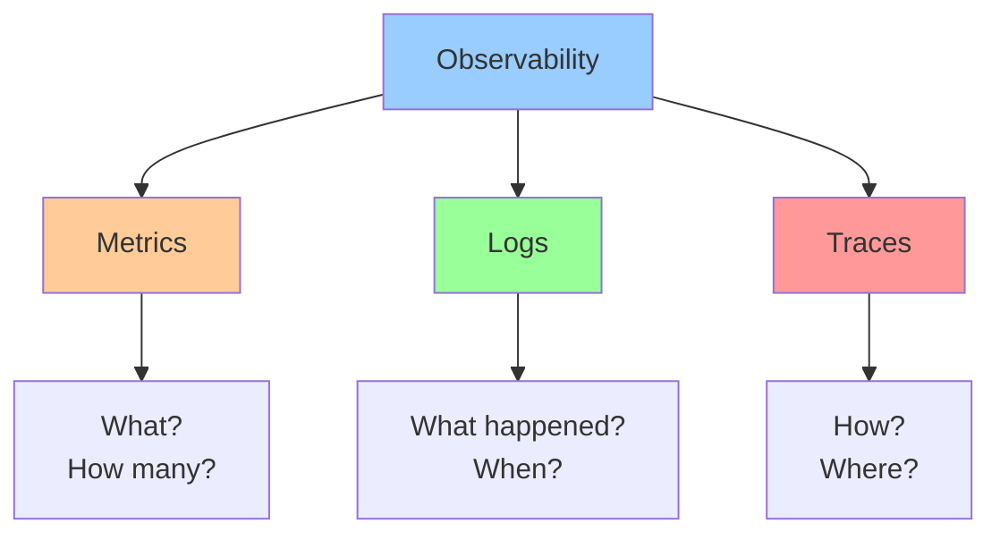
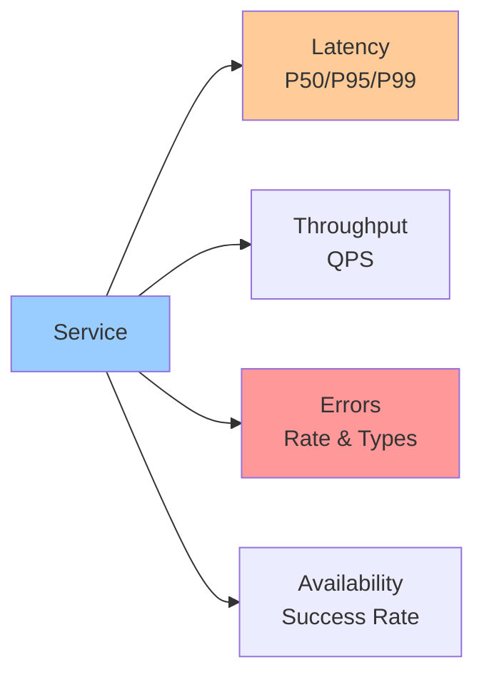
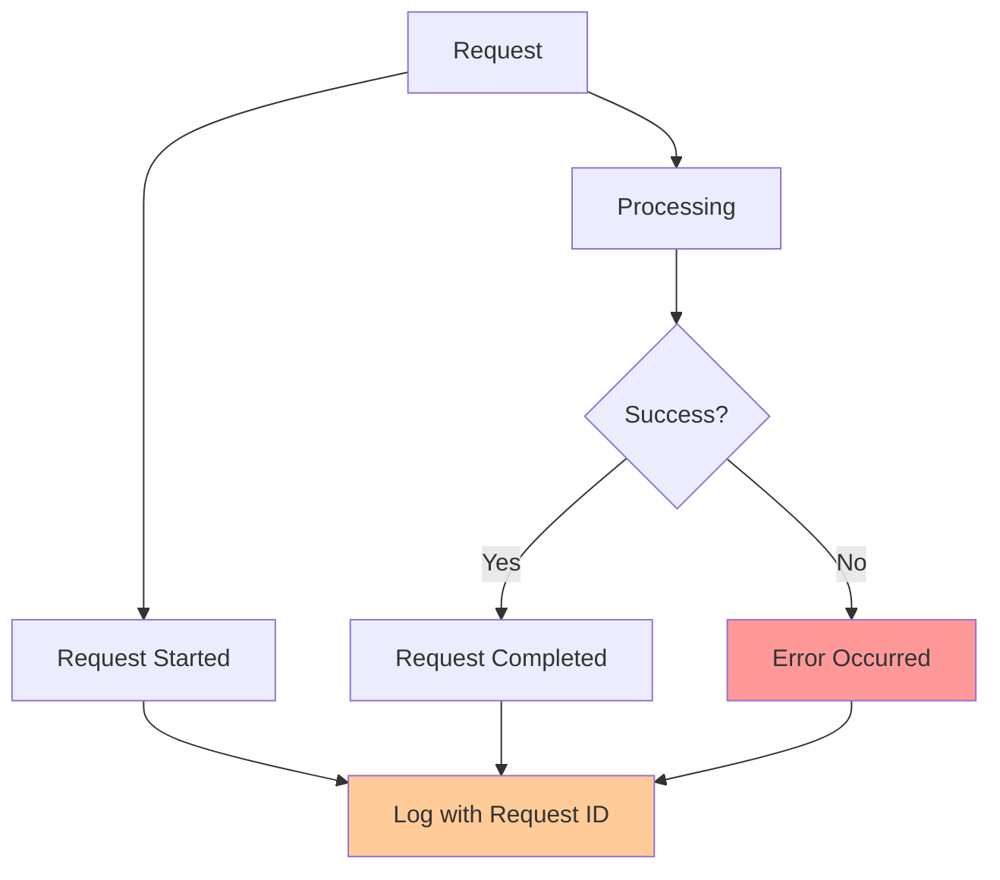
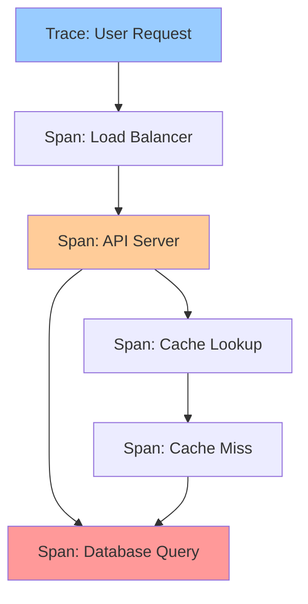
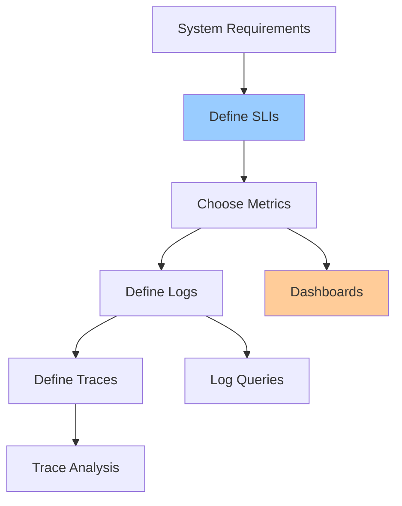

# Observability Basics

**One-line summary**: What to measure, why it matters, and how to build an observability contract for production systems.

**Prerequisites**: Basic understanding of monitoring and logging.

---

## Mental Model

### The Three Pillars of Observability



**Key insight**: Metrics tell you **what** is happening, logs tell you **what happened**, traces tell you **how** it happened.

### Observability vs Monitoring

**Monitoring**: Pre-defined metrics and alerts (you know what to look for)

**Observability**: Ability to ask new questions and explore (you don't know what to look for)

**Both are needed**: Monitoring for known issues, observability for unknown issues.

---

## Metrics

### What Are Metrics?

**Metrics**: Numerical measurements over time.

**Types**:
- **Counters**: Incrementing values (requests, errors)
- **Gauges**: Current values (queue depth, memory usage)
- **Histograms**: Distribution of values (latency, request size)

### What to Measure

#### Service Metrics



**Latency**:
- **P50 (median)**: Typical user experience
- **P95**: 95% of users experience this or better
- **P99**: 99% of users experience this or better
- **Why**: Tail latency matters more than average

**Throughput**:
- **QPS**: Queries per second
- **Requests/sec**: Requests per second
- **Why**: Understand system capacity

**Errors**:
- **Error rate**: Errors per second
- **Error types**: Breakdown by error type
- **Why**: Understand failure modes

**Availability**:
- **Success rate**: Successful requests / total requests
- **Uptime**: Fraction of time service is up
- **Why**: Measure reliability

#### Resource Metrics

**CPU**: Utilization, load average
**Memory**: Usage, available
**Disk**: Usage, I/O operations, latency
**Network**: Bandwidth, packets, errors

**Why**: Understand resource constraints and bottlenecks.

#### Business Metrics

**User-facing metrics**: Active users, feature usage, conversions

**Why**: Connect technical metrics to business outcomes.

### Metric Cardinality

**Cardinality**: Number of unique metric combinations.

**Low cardinality**: `http_requests_total{method="GET",status="200"}` (good)

**High cardinality**: `http_requests_total{method="GET",status="200",user_id="12345"}` (bad)

**Why**: High cardinality metrics explode storage and query costs.

**Best practice**: Use low-cardinality labels, use logs/traces for high-cardinality data.

---

## Logs

### What Are Logs?

**Logs**: Timestamped events with context.

**Structure**:
- **Timestamp**: When it happened
- **Level**: INFO, WARN, ERROR
- **Message**: What happened
- **Context**: Additional data (request ID, user ID, etc.)

### What to Log

#### Critical Events



**Request lifecycle**:
- Request started (with request ID)
- Request completed (with latency, status)
- Errors (with stack trace, context)

**Why**: Can trace request through system, debug issues.

#### Structured Logging

**Structured logs**: JSON format with fields.

**Example**:
```json
{
  "timestamp": "2024-01-01T12:00:00Z",
  "level": "INFO",
  "message": "Request completed",
  "request_id": "abc123",
  "method": "GET",
  "path": "/users/123",
  "status": 200,
  "latency_ms": 45
}
```

**Why**: Easy to query, filter, aggregate.

### Log Levels

**DEBUG**: Detailed information for debugging (not in production)

**INFO**: General information about normal operation

**WARN**: Warning messages (something unexpected but handled)

**ERROR**: Error messages (something failed but system continues)

**FATAL**: Critical errors (system may stop)

**Best practice**: Use appropriate levels, avoid log spam.

---

## Traces

### What Are Traces?

**Traces**: End-to-end request flow through distributed system.

**Components**:
- **Trace**: Entire request flow
- **Span**: Single operation in trace
- **Parent-child relationships**: Spans form a tree

### Trace Structure



**Spans contain**:
- **Name**: Operation name
- **Start time**: When operation started
- **Duration**: How long it took
- **Tags**: Key-value pairs (method, status, etc.)
- **Logs**: Events during span

### What to Trace

**Critical paths**: User-facing requests, important operations

**Why**: Understand latency breakdown, identify bottlenecks

**Sampling**: Don't trace everything (too expensive), sample intelligently.

---

## Observability Contract

### Definition

**Observability contract**: Agreement on what metrics, logs, and traces are provided.

**Components**:
1. **Metrics**: What metrics are exported, what they mean
2. **Logs**: What events are logged, log format
3. **Traces**: What operations are traced, trace format
4. **SLIs**: Service level indicators (what to measure for SLOs)

### Building the Contract



**Process**:
1. **Define SLIs**: What to measure for SLOs
2. **Choose metrics**: Metrics needed to measure SLIs
3. **Define logs**: Events needed for debugging
4. **Define traces**: Operations needed for performance analysis

### Example Contract

**Metrics**:
- `http_requests_total{method,status}`: Request count
- `http_request_duration_seconds{method,quantile}`: Request latency
- `http_errors_total{method,error_type}`: Error count

**Logs**:
- Request started: `{request_id, method, path}`
- Request completed: `{request_id, status, latency_ms}`
- Errors: `{request_id, error, stack_trace}`

**Traces**:
- Trace all HTTP requests
- Spans for: load balancer, API server, database, cache
- Sample rate: 1% (or 100% for errors)

---

## Failure Modes & Blast Radius

### Observability Failures

#### Scenario 1: Missing Metrics
- **Impact**: Can't detect problems, can't measure SLOs
- **Blast radius**: All monitoring and alerting
- **Detection**: Dashboards empty, alerts not firing
- **Recovery**: Add missing metrics, verify collection

#### Scenario 2: High Cardinality Metrics
- **Impact**: Metric storage explodes, queries slow
- **Blast radius**: Monitoring system performance
- **Detection**: High storage costs, slow queries
- **Recovery**: Reduce cardinality, use logs instead

#### Scenario 3: Log Spam
- **Impact**: Can't find important logs, high costs
- **Blast radius**: Logging system, debugging ability
- **Detection**: High log volume, high costs
- **Recovery**: Fix log levels, reduce verbosity

#### Scenario 4: No Traces
- **Impact**: Can't debug performance issues
- **Blast radius**: Performance debugging
- **Detection**: Can't identify bottlenecks
- **Recovery**: Add tracing, instrument critical paths

---

## Observability Best Practices

### Metrics Best Practices

1. **Measure SLIs**: Metrics should support SLO measurement
2. **Low cardinality**: Avoid high-cardinality labels
3. **Appropriate granularity**: Not too fine, not too coarse
4. **Documentation**: Document what metrics mean

### Logging Best Practices

1. **Structured logging**: Use JSON, include context
2. **Request IDs**: Include request IDs for correlation
3. **Appropriate levels**: Use correct log levels
4. **Don't log sensitive data**: No passwords, tokens, PII

### Tracing Best Practices

1. **Trace critical paths**: User-facing requests, important operations
2. **Sample intelligently**: Don't trace everything
3. **Include context**: Tags, logs in spans
4. **Keep traces short**: Don't trace long-running operations

---

## Further Reading

**Comprehensive Guide**: [Further Reading: Observability Basics](../further-reading/observability-basics.md)

**Quick Links**:
- "Observability Engineering" by Charity Majors et al.
- OpenTelemetry documentation
- Prometheus documentation
- [Queueing Theory & Tail Latency](queueing-tail-latency.md)
- [SLIs/SLOs](../04-reliability-sre/sli-slo-error-budget.md)
- [Back to Foundations](README.md)

---

## Exercises

1. **Define observability contract**: Define metrics, logs, and traces for an API service. What do you measure?

2. **Debug with observability**: A service has high latency. How do you use metrics, logs, and traces to debug?

3. **Reduce cardinality**: You have a metric with user_id as a label (high cardinality). How do you fix it?

**Answer Key**: [View Answers](../exercises/answers/observability-basics-answers.md)

