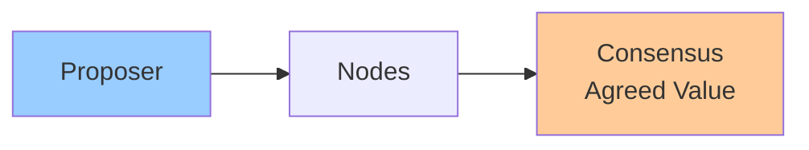

# Consensus & Leases

**One-line summary**: Understanding consensus algorithms (Paxos, Raft) and leases for coordination in distributed systems.

**Prerequisites**: [Time, Ordering, Causality](time-ordering-causality.md), understanding of distributed coordination.

---

## Mental Model

### Consensus Problem

**Consensus**: Multiple nodes agree on a single value.

**Requirements**:
- **Agreement**: All nodes agree on same value
- **Validity**: Value must be proposed by some node
- **Termination**: Algorithm eventually terminates
- **Integrity**: Value decided at most once

**Key insight**: Consensus enables coordination without a single leader, but is expensive.

### Leases

**Lease**: Time-limited exclusive access to a resource.

**Properties**:
- **Exclusive**: Only one holder at a time
- **Time-limited**: Expires after duration
- **Renewable**: Can be renewed before expiry

**Use case**: Lighter-weight than consensus for coordination.

---

## Internals & Architecture

### Paxos

**Paxos**: Classic consensus algorithm.

**Phases**:
1. **Prepare**: Proposer sends prepare request with proposal number
2. **Promise**: Acceptors promise not to accept lower-numbered proposals
3. **Accept**: Proposer sends accept request with value
4. **Accepted**: Acceptors accept value if no higher-numbered proposal

**Properties**:
- **Safety**: Only one value can be chosen
- **Liveness**: Eventually chooses a value (if majority available)

**Use case**: Foundation for many consensus implementations (e.g., Spanner).

### Raft

**Raft**: Understandable consensus algorithm.

**Components**:
- **Leader**: Single leader handles all client requests
- **Followers**: Replicate leader's log
- **Candidate**: Node seeking to become leader

**Phases**:
1. **Leader election**: Elect leader when no leader
2. **Log replication**: Leader replicates log to followers
3. **Safety**: Ensure consistency

**Properties**:
- **Easier to understand**: More understandable than Paxos
- **Same guarantees**: Safety and liveness

**Use case**: Used in etcd, Consul, and many systems.

### Leases

**Lease mechanism**:
1. **Acquire**: Request lease from lease server
2. **Hold**: Use resource while lease valid
3. **Renew**: Renew lease before expiry
4. **Release**: Release lease when done

**Lease server**: Manages leases and ensures exclusivity.

**Properties**:
- **Lighter-weight**: Less overhead than consensus
- **Time-based**: Relies on time, not consensus
- **Fault-tolerant**: Lease server can be replicated

**Use case**: Coordination when consensus is too expensive.

---

## Failure Modes & Blast Radius

### Consensus Failures

#### Scenario 1: Split-Brain
- **Impact**: Multiple leaders, inconsistent state
- **Blast radius**: Entire system
- **Detection**: Multiple leaders detected
- **Recovery**: Resolve split-brain, elect single leader
- **Mitigation**: Require majority, prevent split-brain

#### Scenario 2: Leader Failure
- **Impact**: No progress until new leader elected
- **Blast radius**: All operations
- **Detection**: Leader health checks fail
- **Recovery**: Elect new leader
- **Mitigation**: Fast leader election, automatic failover

### Lease Failures

#### Scenario 1: Lease Expiry
- **Impact**: Lease holder loses access, another can acquire
- **Blast radius**: Lease holder
- **Detection**: Lease expiry
- **Recovery**: Renew lease or release
- **Mitigation**: Renew leases proactively, monitor expiry

---

## Observability Contract

### Metrics

- **Consensus latency**: Time to reach consensus
- **Leader election time**: Time to elect new leader
- **Lease expiry rate**: Rate of lease expiries
- **Split-brain events**: Multiple leaders detected

### Alerts

- Leader election failures
- Split-brain detected
- High lease expiry rate

---

## Change Safety

### Consensus Configuration Changes

- **Process**: Update consensus configuration, verify consensus
- **Risk**: High (may cause split-brain)
- **Rollback**: Revert configuration

---

## Tradeoffs

### Consensus vs Leases

**Consensus**:
- **Pros**: Strong guarantees, no single point of failure
- **Cons**: Higher latency, more complex

**Leases**:
- **Pros**: Lower latency, simpler
- **Cons**: Weaker guarantees, relies on time

---

## Operational Considerations

### Best Practices

1. **Choose right mechanism**: Consensus for strong guarantees, leases for coordination
2. **Monitor consensus**: Track consensus health
3. **Handle failures**: Fast recovery from failures
4. **Prevent split-brain**: Require majority for consensus

---

## What Staff Engineers Ask in Reviews

- "What consensus algorithm is used?"
- "How is leader election handled?"
- "What happens if leader fails?"
- "How are leases managed?"

---

## Further Reading

**Comprehensive Guide**: [Further Reading: Consensus & Leases](../further-reading/consensus-leases.md)

**Quick Links**:
- "The Part-Time Parliament" (Lamport, 1998) - Paxos paper
- "In Search of an Understandable Consensus Algorithm" (Ongaro & Ousterhout, 2014) - Raft paper
- [Replication Strategies](replication.md)
- [Spanner: Consistency & Performance](../03-gcp-core-building-blocks/spanner.md)
- [Back to Distributed Systems](README.md)

---

## Exercises

1. **Choose consensus**: When do you use consensus vs leases? What are the tradeoffs?

2. **Handle leader failure**: Your consensus system loses its leader. How does it recover?

3. **Design leases**: Design a lease system for coordinating access to a shared resource.

**Answer Key**: [View Answers](../exercises/answers/consensus-leases-answers.md)

