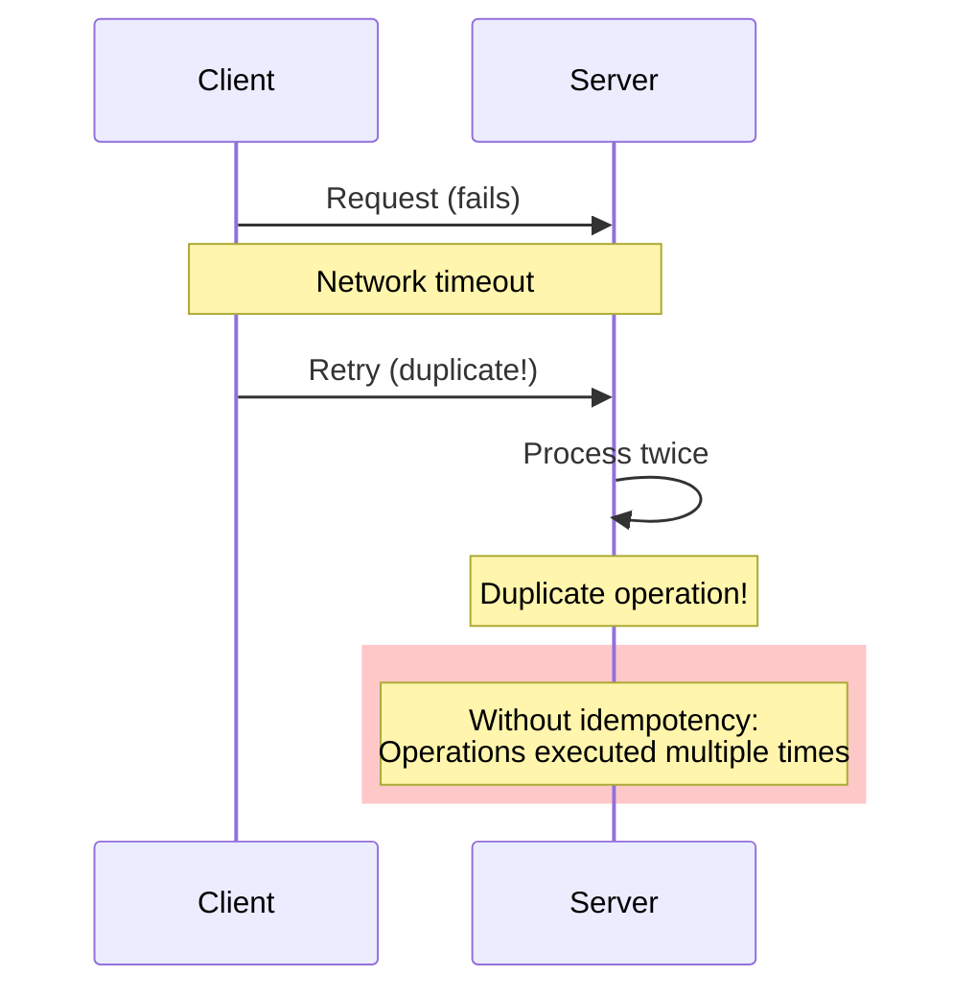
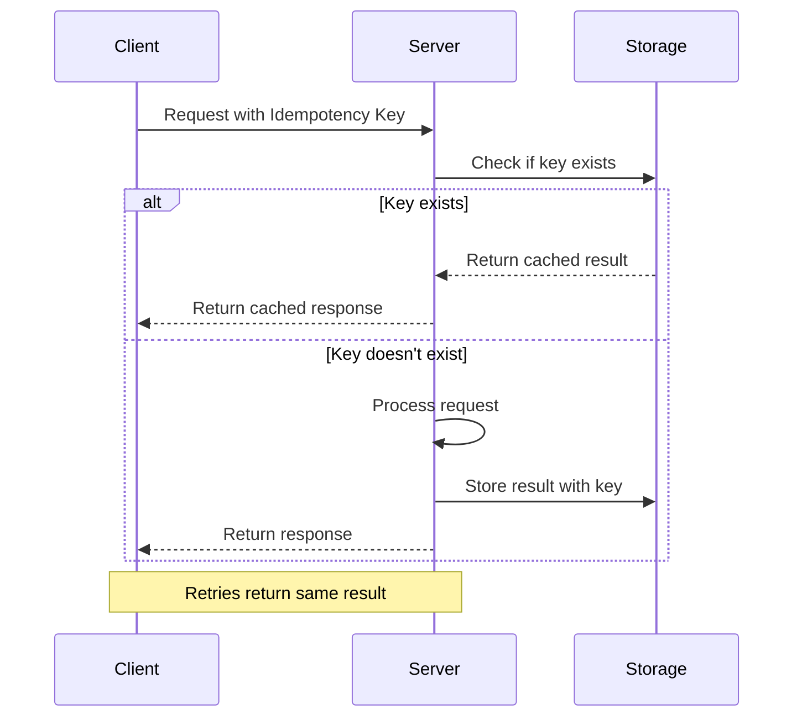

# Idempotency & Retry Semantics

**One-line summary**: Making operations safe to retry by ensuring idempotency, and designing retry strategies that don't make things worse.

**Prerequisites**: [Time, Ordering, Causality](time-ordering-causality.md), understanding of request/response model.

---

## Mental Model

### The Retry Problem

When a request fails (network error, timeout, server error), clients retry. Without idempotency, retries can cause:
- **Duplicate operations**: Payment charged twice, order created twice
- **Inconsistent state**: Partial updates applied multiple times
- **Data corruption**: Conflicting updates

### Idempotency

**Idempotency**: Performing an operation multiple times has the same effect as performing it once.

**Key insight**: Idempotent operations are safe to retry.

### Retry Semantics

**At-least-once**: Operation may be executed multiple times, but at least once.
- **Use case**: Reading data, idempotent writes
- **Requirement**: Operations must be idempotent

**At-most-once**: Operation is executed at most once, may not execute at all.
- **Use case**: Non-critical operations
- **Requirement**: Accept that operations may be lost

**Exactly-once**: Operation is executed exactly once.
- **Use case**: Critical operations (payments, orders)
- **Requirement**: Complex, often requires distributed transactions

---

## Internals & Architecture

### Making Operations Idempotent

#### 1. Natural Idempotency

Some operations are naturally idempotent:
- **GET**: Reading data doesn't change state
- **PUT**: Replacing entire resource is idempotent
- **DELETE**: Deleting already-deleted resource is idempotent

#### 2. Idempotency Keys

**Idempotency key**: Unique identifier for an operation.

**Process**:
1. Client generates unique idempotency key
2. Client includes key in request
3. Server checks if key was seen before
4. If seen: Return previous result
5. If not seen: Execute operation, store result

**Storage**: Store idempotency keys in:
- **In-memory cache**: Fast, but lost on restart
- **Database**: Persistent, but slower
- **Distributed cache**: Fast and persistent (Redis)

**TTL**: Idempotency keys should expire (e.g., 24 hours).

#### 3. Conditional Updates

**ETags**: Use ETags for conditional updates:
1. Client reads resource, gets ETag
2. Client updates resource with ETag
3. Server checks ETag matches
4. If matches: Update succeeds
5. If not: Update fails (conflict)

**Version numbers**: Similar to ETags, use version numbers.

#### 4. Deduplication

**Deduplication window**: Time window for detecting duplicates.

**Process**:
1. Hash request (content + client ID)
2. Check if hash seen in window
3. If seen: Return previous result
4. If not: Execute operation, store hash

### Retry Strategies

#### 1. Exponential Backoff

**Strategy**: Wait longer between each retry.

**Formula**: `Wait Time = Base Delay × 2^Attempt`

**Example**:
- Attempt 1: Wait 1s
- Attempt 2: Wait 2s
- Attempt 3: Wait 4s
- Attempt 4: Wait 8s

**Benefits**: Reduces load on server, allows recovery time.

#### 2. Jitter

**Problem**: Without jitter, all clients retry at the same time (thundering herd).

**Solution**: Add random jitter to backoff.

**Formula**: `Wait Time = Base Delay × 2^Attempt + Random(0, Jitter)`

**Benefits**: Spreads out retries, prevents thundering herd.

#### 3. Retry Limits

**Strategy**: Limit number of retries.

**Example**: Retry up to 3 times, then fail.

**Benefits**: Prevents infinite retries, fails fast.

#### 4. Circuit Breaker

**Strategy**: Stop retrying if service is failing.

**Process**:
1. Track failure rate
2. If failure rate > threshold: Open circuit
3. Stop retrying (fail fast)
4. After cooldown: Try again (half-open)
5. If succeeds: Close circuit

**Benefits**: Prevents cascading failures, fails fast.

---

## Failure Modes & Blast Radius

### Retry Failures

#### Scenario 1: Duplicate Operations
- **Cause**: Non-idempotent operation retried
- **Impact**: Payment charged twice, order created twice
- **Blast radius**: User data, financial transactions
- **Prevention**: Use idempotency keys

#### Scenario 2: Thundering Herd
- **Cause**: All clients retry at the same time
- **Impact**: Server overloaded, cascading failures
- **Blast radius**: Entire service
- **Prevention**: Use jitter in backoff

#### Scenario 3: Infinite Retries
- **Cause**: No retry limit, service permanently down
- **Impact**: Client stuck retrying, resource waste
- **Blast radius**: Client and server resources
- **Prevention**: Set retry limits, use circuit breakers

#### Scenario 4: Stale Idempotency Keys
- **Cause**: Idempotency key reused after TTL expired
- **Impact**: Duplicate operation executed
- **Blast radius**: User data
- **Prevention**: Use long TTLs, or never reuse keys

### Overload Scenarios

#### 10× Normal Load (with retries)
- **Impact**: Retries increase load significantly
- **Mitigation**: Exponential backoff, jitter, retry limits

#### 100× Normal Load (thundering herd)
- **Impact**: All retries hit at once, system overwhelmed
- **Mitigation**: Jitter, circuit breakers, load shedding

---

## Observability Contract

### Metrics to Track

#### Retry Metrics
- **Retry rate**: Retries per second
- **Retry success rate**: Percentage of retries that succeed
- **Retry attempts**: Average number of retries per request

#### Idempotency Metrics
- **Idempotency key hits**: Requests with duplicate keys
- **Idempotency key misses**: Requests with new keys
- **Idempotency storage size**: Number of keys stored

#### Error Metrics
- **Transient errors**: Errors that should be retried
- **Permanent errors**: Errors that shouldn't be retried
- **Timeout errors**: Errors due to timeouts

### Logs

Log events:
- Retry attempts (with attempt number)
- Idempotency key hits/misses
- Circuit breaker state changes
- Retry failures (after max attempts)

### Traces

Trace:
- Retry attempts
- Idempotency key lookups
- Circuit breaker state
- Total retry time

### Alerts

**Critical alerts**:
- Retry rate > threshold (may indicate problems)
- Retry success rate < threshold (retries not helping)
- Circuit breaker open (service failing)

**Warning alerts**:
- Retry rate trending up
- Idempotency key storage growing

---

## Change Safety

### Implementing Idempotency

#### 1. Add Idempotency Keys
- Generate unique keys on client
- Include keys in requests
- Check keys on server
- Store results keyed by idempotency key

#### 2. Implement Deduplication
- Hash requests
- Check hashes in deduplication window
- Return previous results for duplicates

#### 3. Use Conditional Updates
- Use ETags or version numbers
- Check conditions before updates
- Return conflicts when conditions don't match

### Implementing Retries

#### 1. Add Exponential Backoff
- Start with base delay (e.g., 100ms)
- Double delay for each attempt
- Add jitter to prevent thundering herd

#### 2. Set Retry Limits
- Limit retries (e.g., 3-5 attempts)
- Fail after max attempts
- Log failures

#### 3. Add Circuit Breakers
- Track failure rate
- Open circuit when failure rate high
- Close circuit after cooldown

### Testing Strategy

1. **Idempotency testing**: Verify operations are idempotent
2. **Retry testing**: Test retry behavior under failures
3. **Load testing**: Test retry behavior under load
4. **Chaos testing**: Inject failures and verify retries work

---

## Security Boundaries

Idempotency and retries aren't security issues, but:
- **Idempotency key generation**: Must be unpredictable (use UUIDs)
- **Idempotency key storage**: Must be secure (encrypted)
- **Rate limiting**: Retries can be used for DoS (rate limit retries)

---

## Tradeoffs

### What We Gain with Idempotency
- Safe retries
- Better reliability
- Consistent state
- Better user experience

### What We Lose
- More complex implementation
- Storage overhead (idempotency keys)
- Performance overhead (key lookups)

### When to Use Idempotency
- **Always**: For write operations
- **Critical**: For financial transactions
- **Important**: For operations that change state

### Alternatives

If idempotency is too complex:
- **Accept duplicates**: Handle duplicates in application logic
- **Use transactions**: Use distributed transactions (complex, slower)
- **Don't retry**: Accept failures (unreliable)

---

## Operational Considerations

### Capacity Planning

**Idempotency key storage**:
- Estimate: Requests per second × TTL
- Example: 10,000 req/s × 24 hours = 864M keys
- Storage: ~100 bytes per key = 86GB

**Retry load**:
- Estimate: Normal load × (1 + retry rate)
- Example: 10,000 req/s × 1.2 = 12,000 req/s (with 20% retry rate)

### Monitoring & Debugging

**Monitor**:
- Retry rate over time
- Idempotency key hit rate
- Circuit breaker state
- Retry success rate

**Debug retry issues**:
1. Check retry rate: Are retries too high?
2. Check retry success rate: Are retries helping?
3. Check idempotency keys: Are duplicates detected?
4. Check circuit breakers: Are they opening correctly?

### Incident Response

**Common incidents**:
- High retry rate
- Circuit breaker open
- Duplicate operations

**Response**:
1. Check downstream services: Are they failing?
2. Check retry configuration: Are limits appropriate?
3. Check idempotency: Are keys working correctly?
4. Scale up if needed

---

## What Staff Engineers Ask in Reviews

### Design Questions
- "Are operations idempotent?"
- "What's the retry strategy?"
- "How do we prevent duplicate operations?"
- "What happens if idempotency key storage fails?"

### Scale Questions
- "What's the retry rate at 10× load?"
- "How does idempotency key storage scale?"
- "What's the thundering herd risk?"

### Operational Questions
- "How do we monitor retries?"
- "What alerts do we have?"
- "How do we debug retry issues?"

---

## Further Reading

**Comprehensive Guide**: [Further Reading: Idempotency & Retry Semantics](../further-reading/idempotency-retries.md)

**Quick Links**:
- "Designing Data-Intensive Applications" (Kleppmann) - Chapter on reliability
- "Time, Clocks, and the Ordering of Events" (Lamport, 1978)
- PayPal and Stripe idempotency implementations
- [Idempotency Patterns](../05-llD-patterns/idempotency-patterns.md)
- [Circuit Breakers](../04-reliability-sre/load-shedding.md)
- [Back to Distributed Systems](README.md)

---

## Exercises

1. **Design idempotency**: Design an idempotent payment API. How do you ensure payments aren't charged twice?

2. **Retry strategy**: Design a retry strategy for an API that calls a downstream service. What backoff do you use? What limits?

3. **Handle duplicates**: A non-idempotent operation is retried and creates duplicates. How do you detect and handle duplicates?

**Answer Key**: [View Answers](../exercises/answers/idempotency-retries-answers.md)

