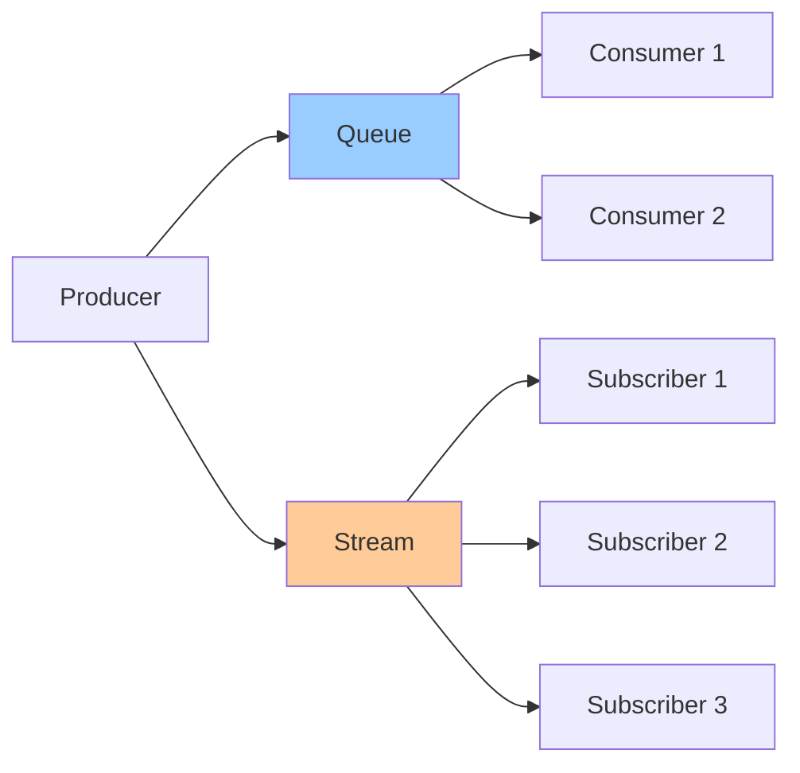

# Queues & Streams

**One-line summary**: Understanding message queues and stream processing, delivery guarantees, and when to use each.

**Prerequisites**: [Overload & Backpressure](overload-backpressure.md), understanding of messaging patterns.

---

## Mental Model

### Queue vs Stream

**Queue**: Point-to-point messaging (one producer, one consumer).

**Stream**: Publish-subscribe messaging (one producer, many consumers).

**Key insight**: Queues are for task distribution, streams are for event distribution.

---

## Internals & Architecture

### Message Queues

**Queue model**:
- **Producer**: Sends messages to queue
- **Queue**: Stores messages
- **Consumer**: Processes messages from queue

**Properties**:
- **At-least-once delivery**: Messages delivered at least once
- **Ordering**: May preserve ordering (FIFO queues)
- **Durability**: Messages persisted until consumed

**Use case**: Task queues, job processing.

### Stream Processing

**Stream model**:
- **Producer**: Publishes events to stream
- **Stream**: Stores events
- **Subscribers**: Subscribe to stream and process events

**Properties**:
- **At-least-once delivery**: Events delivered at least once
- **Ordering**: May preserve ordering per key
- **Durability**: Events persisted for retention period

**Use case**: Event-driven architectures, real-time processing.

---

## Failure Modes & Blast Radius

### Queue Failures

#### Scenario 1: Queue Overflow
- **Impact**: Messages dropped, system overloaded
- **Blast radius**: All messages
- **Detection**: Queue size exceeds limit
- **Recovery**: Scale consumers, increase queue capacity
- **Mitigation**: Monitor queue size, scale proactively

#### Scenario 2: Consumer Failure
- **Impact**: Messages not processed, queue backlog grows
- **Blast radius**: Affected messages
- **Detection**: Consumer health checks fail
- **Recovery**: Restart consumer, process backlog
- **Mitigation**: Multiple consumers, automatic restart

---

## Observability Contract

### Metrics

- **Queue depth**: Messages in queue
- **Processing rate**: Messages processed per second
- **Consumer lag**: Delay in processing
- **Error rate**: Failed message processing

### Alerts

- High queue depth
- Consumer failures
- High consumer lag
- Processing errors

---

## Change Safety

### Queue Configuration Changes

- **Process**: Update queue configuration, verify processing
- **Risk**: Medium (may affect message processing)
- **Rollback**: Revert configuration

---

## Tradeoffs

### Queue vs Stream

**Queue**:
- **Pros**: Simple, task distribution
- **Cons**: Single consumer per message

**Stream**:
- **Pros**: Multiple consumers, event distribution
- **Cons**: More complex, event ordering challenges

---

## Operational Considerations

### Best Practices

1. **Choose right model**: Queue for tasks, stream for events
2. **Monitor queues**: Track depth and processing rate
3. **Handle failures**: Retry logic, dead letter queues
4. **Scale consumers**: Scale based on queue depth

---

## What Staff Engineers Ask in Reviews

- "What messaging model is used?"
- "How is message delivery guaranteed?"
- "What happens if consumer fails?"
- "How is ordering handled?"

---

## Further Reading

**Comprehensive Guide**: [Further Reading: Queues & Streams](../further-reading/queues-streams.md)

**Quick Links**:
- [Pub/Sub: Delivery Guarantees](../03-gcp-core-building-blocks/pubsub.md)
- [Overload & Backpressure](overload-backpressure.md)
- [Idempotency & Retries](idempotency-retries.md)
- [Back to Distributed Systems](README.md)

---

## Exercises

1. **Choose messaging**: When do you use queues vs streams? What are the tradeoffs?

2. **Handle backlog**: Your queue has a large backlog. How do you handle it?

3. **Design stream**: Design a stream processing system for real-time events.

**Answer Key**: [View Answers](../exercises/answers/queues-streams-answers.md)

