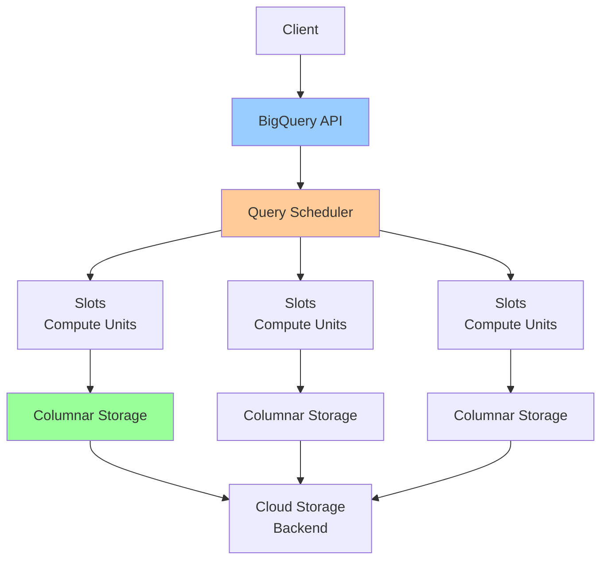

# BigQuery Architecture

**One-line summary**: Deep dive into BigQuery's columnar storage, Dremel query execution, slot allocation, and how to optimize queries for performance and cost.

**Prerequisites**: [Cloud Storage Deep Dive](cloud-storage.md), [Sharding & Partitioning](../02-distributed-systems/sharding-partitioning.md), Basic SQL concepts (queries, joins, aggregations).

---

## Mental Model

### BigQuery Architecture



**Key insight**: BigQuery uses columnar storage and Dremel query execution to achieve high performance on petabyte-scale data. Understanding slots and query optimization is critical for performance and cost.

### Columnar Storage

**Columnar storage**: Store data by column, not by row.

**Benefits**:
- **Compression**: Better compression (similar values in columns)
- **Scan efficiency**: Scan only needed columns
- **Vectorization**: Vectorized operations on columns

**Example**:
```
Row Storage:
  Row 1: [id=1, name="Alice", age=30]
  Row 2: [id=2, name="Bob", age=25]

Columnar Storage:
  id: [1, 2]
  name: ["Alice", "Bob"]
  age: [30, 25]
```

---

## Internals & Architecture

### Dremel Query Execution

**Dremel**: BigQuery's query execution engine.

**Architecture**:
- **Tree structure**: Query execution tree
- **Parallel execution**: Execute in parallel across slots
- **Columnar processing**: Process columns efficiently

**Query execution**:
1. **Parse**: Parse SQL query
2. **Plan**: Generate execution plan
3. **Schedule**: Schedule across slots
4. **Execute**: Execute in parallel
5. **Aggregate**: Aggregate results
6. **Return**: Return results

### Slots

**Slots**: Compute units for query execution.

**Allocation**:
- **On-demand**: Pay per query (slots allocated dynamically)
- **Reserved**: Reserve slots (flat-rate pricing)

**Slot usage**:
- **Query complexity**: More complex queries use more slots
- **Data scanned**: More data scanned uses more slots
- **Concurrency**: More concurrent queries use more slots

**Limits**:
- **On-demand**: 2000 slots per project (can request increase)
- **Reserved**: Based on reservation

### Columnar Storage Details

#### Columnar Format

**Format**: Columnar storage format (Capacitor).

**Features**:
- **Compression**: Advanced compression algorithms
- **Encoding**: Efficient encoding schemes
- **Indexing**: Column-level indexing

**Benefits**:
- **Storage efficiency**: Better compression than row storage
- **Scan efficiency**: Scan only needed columns
- **Query performance**: Faster queries on large datasets

#### Partitioning

**Partitioning**: Divide tables into partitions.

**Types**:
- **Time-based**: Partition by date/timestamp
- **Integer range**: Partition by integer range
- **Ingestion time**: Partition by ingestion time

**Benefits**:
- **Query performance**: Scan only relevant partitions
- **Cost**: Reduce data scanned (lower cost)
- **Management**: Easier to manage large tables

**Example**:
```sql
CREATE TABLE events (
  event_id INT64,
  event_time TIMESTAMP,
  event_data STRING
)
PARTITION BY DATE(event_time);
```

#### Clustering

**Clustering**: Sort data within partitions.

**Benefits**:
- **Query performance**: Faster queries on clustered columns
- **Cost**: Reduce data scanned (lower cost)
- **Filtering**: Efficient filtering on clustered columns

**Example**:
```sql
CREATE TABLE events (
  event_id INT64,
  user_id INT64,
  event_time TIMESTAMP
)
PARTITION BY DATE(event_time)
CLUSTER BY user_id;
```

### Query Optimization

#### Query Planning

**Query planner**: Optimizes query execution.

**Optimizations**:
- **Predicate pushdown**: Push filters to storage layer
- **Projection pushdown**: Push column selection to storage layer
- **Join optimization**: Optimize join strategies
- **Aggregation optimization**: Optimize aggregations

#### Execution Strategies

**Join strategies**:
- **Hash join**: Build hash table for one side
- **Broadcast join**: Broadcast small table to all slots
- **Sort-merge join**: Sort both sides, merge

**Aggregation strategies**:
- **Partial aggregation**: Aggregate per slot
- **Final aggregation**: Aggregate partial results

### Performance Characteristics

#### Latency

**Query latency**:
- **Small queries**: < 1 second
- **Medium queries**: 1-10 seconds
- **Large queries**: 10+ seconds (depends on data size)

**Factors**:
- **Data scanned**: More data = higher latency
- **Query complexity**: More complex = higher latency
- **Slot availability**: More slots = lower latency

#### Throughput

**Query throughput**:
- **Concurrent queries**: Handle hundreds of concurrent queries
- **Slot capacity**: Limited by slot capacity
- **Data scanned**: Limited by storage I/O

#### Scalability

**Limits**:
- **Table size**: Petabytes per table
- **Query size**: Unlimited query size
- **Concurrency**: Hundreds of concurrent queries

---

## Failure Modes & Blast Radius

### BigQuery Failures

#### Scenario 1: Service Outage
- **Impact**: Queries unavailable, cannot run queries
- **Blast radius**: All queries
- **Detection**: Query failures, API errors
- **Recovery**: Service automatically recovers
- **Mitigation**: GCP managed service (high availability)

#### Scenario 2: Slot Exhaustion
- **Impact**: Queries queued, increased latency
- **Blast radius**: New queries (existing queries continue)
- **Detection**: Queries queued, slot utilization high
- **Recovery**: 
  - Reduce concurrent queries
  - Increase slot reservation
  - Optimize queries (reduce slot usage)
- **Mitigation**: 
  - Monitor slot usage
  - Reserve slots if needed
  - Optimize queries

#### Scenario 3: Storage I/O Bottleneck
- **Impact**: Slow queries, increased latency
- **Blast radius**: All queries scanning data
- **Detection**: High storage I/O latency
- **Recovery**: 
  - Optimize queries (reduce data scanned)
  - Use partitioning/clustering
  - Increase slot capacity
- **Mitigation**: 
  - Optimize queries
  - Use partitioning/clustering
  - Monitor storage I/O

### Performance Failures

#### Scenario 1: Expensive Queries
- **Impact**: High cost, slow queries
- **Blast radius**: Affected queries
- **Detection**: High query cost, slow execution
- **Recovery**: 
  - Optimize queries (reduce data scanned)
  - Use partitioning/clustering
  - Limit query results
- **Mitigation**: 
  - Query optimization
  - Cost monitoring
  - Query limits

#### Scenario 2: Query Timeout
- **Impact**: Queries fail, no results
- **Blast radius**: Long-running queries
- **Detection**: Query timeout errors
- **Recovery**: 
  - Optimize queries
  - Increase timeout limit
  - Break query into smaller parts
- **Mitigation**: 
  - Query optimization
  - Query limits
  - Query monitoring

### Overload Scenarios

#### 10× Normal Load
- **Latency**: May increase, queries may queue
- **Throughput**: Handles load, may need more slots
- **Cost**: Cost increases linearly with data scanned

#### 100× Normal Load
- **Latency**: Significantly increased, queries queue
- **Throughput**: May need significant slot scaling
- **Cost**: Cost increases significantly

---

## Observability Contract

### Metrics to Track

#### Query Metrics
- **Query count**: Queries per second
- **Query latency**: P50/P95/P99 latency
- **Query cost**: Cost per query
- **Data scanned**: Data scanned per query
- **Slot usage**: Slot utilization

#### Table Metrics
- **Table size**: Size per table
- **Partition count**: Partitions per table
- **Storage cost**: Storage cost per table

#### Job Metrics
- **Job count**: Jobs per second
- **Job latency**: Job execution time
- **Job failures**: Failed jobs

### Logs

**BigQuery logs**:
- Query logs (if enabled)
- Job logs
- Error logs
- Admin activity logs

### Alerts

**Critical alerts**:
- Service unavailable
- High error rate (> 1%)
- Query timeout rate high
- Slot exhaustion

**Warning alerts**:
- High query latency
- High query cost
- High data scanned
- Storage I/O bottleneck

---

## Change Safety

### Schema Changes

#### Adding Columns
- **Process**: Add column, verify application compatibility
- **Risk**: Low (additive change, nullable columns)
- **Rollback**: Drop column (if not used)

#### Changing Partitioning
- **Process**: Cannot change partitioning (requires table recreation)
- **Risk**: High (requires data migration)
- **Rollback**: Recreate table with old partitioning

#### Adding Clustering
- **Process**: Add clustering, verify query performance
- **Risk**: Low (additive change, may improve performance)
- **Rollback**: Remove clustering

### Configuration Changes

#### Changing Slot Reservation
- **Process**: Update slot reservation, verify performance
- **Risk**: Medium (may affect query performance)
- **Rollback**: Revert slot reservation

#### Enabling Query Caching
- **Process**: Enable caching, verify cache hits
- **Risk**: Low (additive change)
- **Rollback**: Disable caching

---

## Security Boundaries

### Access Control

- **IAM**: Dataset and table-level IAM policies
- **Row-level security**: Filter rows based on identity
- **Column-level security**: Mask sensitive columns

### Encryption

**At rest**:
- **Google-managed keys**: Default encryption
- **Customer-managed keys**: Cloud KMS keys

**In transit**:
- **TLS**: All connections use TLS
- **Encryption**: Data encrypted in transit

### Data Protection

- **Backups**: Automatic backups (point-in-time recovery)
- **Audit logs**: Audit all query access
- **Data retention**: Configurable data retention

---

## Tradeoffs

### Storage: Columnar vs Row

**Columnar**:
- **Pros**: Better compression, scan efficiency, analytics performance
- **Cons**: Slower for point lookups, more complex updates

**Row**:
- **Pros**: Faster for point lookups, simpler updates
- **Cons**: Worse compression, scan efficiency, analytics performance

### Pricing: On-Demand vs Reserved

**On-demand**:
- **Pros**: Pay per query, flexible
- **Cons**: Higher cost for high usage

**Reserved**:
- **Pros**: Lower cost for high usage, predictable
- **Cons**: Fixed cost, less flexible

### Partitioning: Time vs Integer Range

**Time-based**:
- **Pros**: Natural for time-series data, easy to manage
- **Cons**: Limited to time-based queries

**Integer range**:
- **Pros**: Flexible, supports range queries
- **Cons**: More complex to manage

---

## Operational Considerations

### Capacity Planning

**Storage**:
- **Growth**: Plan for storage growth
- **Backups**: Plan for backup storage
- **Cost**: Plan for storage costs

**Compute**:
- **Slots**: Plan for slot capacity
- **Concurrency**: Plan for concurrent queries
- **Cost**: Plan for query costs

### Monitoring & Debugging

**Monitor**:
- Query performance
- Query cost
- Slot usage
- Storage usage

**Debug issues**:
1. Check query performance (slow queries)
2. Check query cost (expensive queries)
3. Check slot usage
4. Check storage I/O
5. Review logs

### Incident Response

**Common incidents**:
- Slow queries
- High query cost
- Slot exhaustion
- Query timeouts

**Response**:
1. Check query performance
2. Check query cost
3. Check slot usage
4. Optimize queries
5. Scale slots if needed
6. Contact support if persistent

---

## What Staff Engineers Ask in Reviews

### Design Questions
- "What's the schema design?"
- "How is data partitioned?"
- "What's the clustering strategy?"
- "How are queries optimized?"

### Scale Questions
- "What happens at 10× load?"
- "How does BigQuery scale?"
- "What are the slot limits?"
- "How do you handle concurrent queries?"

### Performance Questions
- "What's the query latency?"
- "How is query cost optimized?"
- "What's the data scan efficiency?"
- "How are joins optimized?"

### Operational Questions
- "How do you monitor BigQuery?"
- "What alerts do you have?"
- "How do you debug slow queries?"
- "What's the cost optimization strategy?"

---

## Further Reading

**Comprehensive Guide**: [Further Reading: BigQuery](../further-reading/bigquery.md)

**Quick Links**:
- [BigQuery Documentation](https://cloud.google.com/bigquery/docs)
- "Dremel: Interactive Analysis of Web-Scale Datasets" (Melnik et al., 2010)
- [Query Optimization](https://cloud.google.com/bigquery/docs/best-practices-performance-overview)
- [Partitioning and Clustering](https://cloud.google.com/bigquery/docs/partitioned-tables)
- [Back to GCP Core Building Blocks](README.md)

---

## Exercises

1. **Design schema**: Design a BigQuery schema for a time-series analytics application. How do you partition? How do you cluster?

2. **Optimize queries**: Your queries are slow and expensive. How do you optimize them? What partitioning/clustering do you use?

3. **Handle scaling**: Your application needs to handle 100× more queries. How do you scale BigQuery? What's the strategy?

**Answer Key**: [View Answers](../exercises/answers/bigquery-answers.md)

