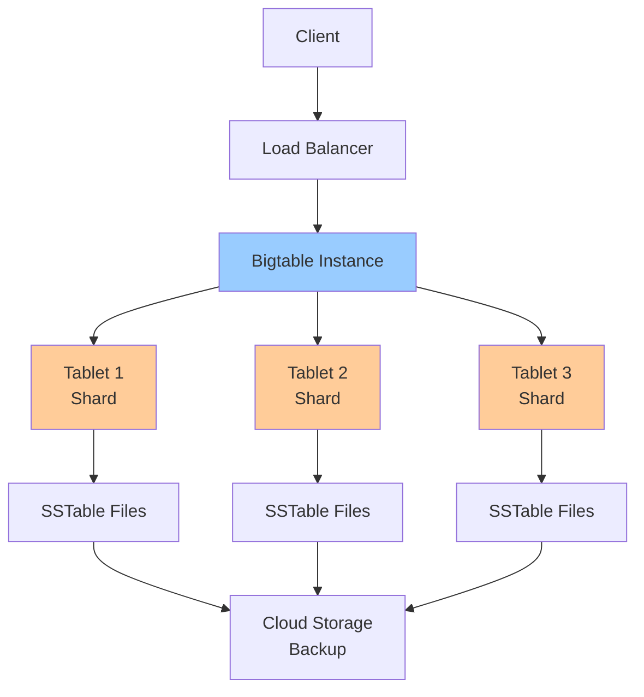

# Bigtable: Design & Tradeoffs

**One-line summary**: Understanding Bigtable's wide-column store design, key structure, performance characteristics, and how to avoid hot spots.

**Prerequisites**: [Sharding & Partitioning](../02-distributed-systems/sharding-partitioning.md), Basic NoSQL concepts (key-value stores, column families).

---

## Mental Model

### Bigtable Architecture



**Key insight**: Bigtable is a wide-column store optimized for high-throughput, low-latency reads and writes. Understanding key design is critical for avoiding hot spots and achieving good performance.

### Data Model

**Table**: Collection of rows.

**Row**: Identified by row key (string).

**Column Family**: Group of columns (logical grouping).

**Column**: Identified by column family:column qualifier.

**Cell**: Value at (row, column, timestamp).

**Example**:
```
Row Key: user:123
  Column Family: profile
    Column: name → "Alice"
    Column: email → "alice@example.com"
  Column Family: activity
    Column: last_login → 2024-01-01T10:00:00Z
```

---

## Internals & Architecture

### Key Design

#### Row Key Structure

**Row key**: Determines data distribution and access patterns.

**Design principles**:
- **Even distribution**: Distribute load evenly across tablets
- **Locality**: Related data should be co-located
- **Access patterns**: Optimize for common access patterns

**Good key design**:
```
user:{userId}:{timestamp}
  - Distributes users evenly
  - Co-locates user data
  - Supports time-range queries
```

**Bad key design**:
```
{timestamp}:user:{userId}
  - All recent data on one tablet (hot spot)
  - Poor distribution
```

#### Key Components

**Components**:
- **Prefix**: Common prefix for related data
- **Hash**: Hash component for distribution
- **Suffix**: Additional components for ordering

**Example**:
```
{prefix}:{hash}:{suffix}
  user:abc123:20240101
  - prefix: user (logical grouping)
  - hash: abc123 (distribution)
  - suffix: 20240101 (ordering)
```

### Tablet Distribution

**Tablets**: Shards that store data.

**Distribution**:
- **Automatic**: Bigtable automatically distributes tablets
- **Key-based**: Distribution based on row key ranges
- **Dynamic**: Tablets split and merge automatically

**Splitting**:
- **Trigger**: Tablet size exceeds threshold
- **Process**: Split tablet into two tablets
- **Result**: Better load distribution

**Merging**:
- **Trigger**: Tablet size below threshold
- **Process**: Merge tablets
- **Result**: Fewer tablets, simpler management

### Column Families

**Column families**: Logical grouping of columns.

**Design**:
- **Group related columns**: Columns accessed together
- **Separate access patterns**: Different access patterns in different families
- **Limit families**: Too many families hurt performance

**Example**:
```
Column Family: profile
  - name, email, phone (frequently accessed together)
Column Family: activity
  - last_login, page_views (less frequently accessed)
```

### Timestamps

**Timestamps**: Version data in cells.

**Use cases**:
- **Time-series data**: Store historical data
- **Versioning**: Track changes over time
- **TTL**: Automatic expiration of old data

**Example**:
```
Row: user:123
  Column: profile:name
    Timestamp: 2024-01-01T10:00:00Z → "Alice"
    Timestamp: 2024-01-02T10:00:00Z → "Alice Smith"
```

### SSTable Storage

**SSTable**: Sorted String Table (immutable data files).

**Structure**:
- **Sorted**: Rows sorted by key
- **Immutable**: Files never modified (only created/deleted)
- **Compressed**: Data compressed for storage efficiency

**Compaction**:
- **Minor compaction**: Merge small SSTables
- **Major compaction**: Merge all SSTables
- **Benefits**: Reduce file count, improve read performance

### Performance Characteristics

#### Latency

**Read latency**:
- **Single row**: P95 < 10ms
- **Range scan**: Depends on range size
- **Bottleneck**: Usually disk I/O

**Write latency**:
- **Single row**: P95 < 10ms
- **Batch writes**: Lower latency per row
- **Bottleneck**: Usually WAL (Write-Ahead Log)

#### Throughput

**Read throughput**:
- **Scales linearly**: With number of nodes
- **Bottleneck**: Usually disk I/O or network

**Write throughput**:
- **Scales linearly**: With number of nodes
- **Bottleneck**: Usually WAL or disk I/O

#### Scalability

**Limits**:
- **Table size**: Petabytes
- **Nodes**: Thousands of nodes
- **QPS**: Millions of queries per second
- **Regions**: Multi-region support

---

## Failure Modes & Blast Radius

### Bigtable Failures

#### Scenario 1: Regional Outage
- **Impact**: Nodes in affected region unavailable
- **Blast radius**: Affected region (other regions continue)
- **Detection**: Node health checks fail, increased latency
- **Recovery**: 
  - Automatic failover to other regions (if multi-region)
  - Nodes restored when region recovers
- **Mitigation**: 
  - Multi-region configuration
  - Sufficient replicas per region

#### Scenario 2: Tablet Server Failure
- **Impact**: Tablets on failed server unavailable
- **Blast radius**: Affected tablets
- **Detection**: Server health checks fail
- **Recovery**: 
  - Automatic failover to other servers
  - Tablets restored on healthy servers
- **Mitigation**: 
  - Multiple tablet servers
  - Automatic failover

#### Scenario 3: Hot Spot
- **Impact**: Single tablet overloaded, increased latency
- **Blast radius**: Affected tablet, may affect entire table
- **Detection**: High latency on specific keys, server CPU high
- **Recovery**: 
  - Redesign keys (better distribution)
  - Add more nodes (may not help if hot spot persists)
- **Mitigation**: 
  - Design keys for even distribution
  - Monitor hot spots
  - Use key prefixes for distribution

### Performance Failures

#### Scenario 1: Slow Compaction
- **Impact**: Many SSTables, slow reads
- **Blast radius**: Affected tablets
- **Detection**: High read latency, many SSTables
- **Recovery**: 
  - Trigger manual compaction
  - Wait for automatic compaction
- **Mitigation**: 
  - Monitor compaction lag
  - Tune compaction settings

#### Scenario 2: WAL Overload
- **Impact**: Write latency increases
- **Blast radius**: Write operations
- **Detection**: High write latency, WAL queue full
- **Recovery**: 
  - Reduce write rate
  - Add more nodes
- **Mitigation**: 
  - Monitor WAL queue
  - Scale nodes for write throughput

### Overload Scenarios

#### 10× Normal Load
- **Latency**: May increase, especially for hot spots
- **Throughput**: Handles load, may need to scale nodes
- **Hot spots**: Hot spots become more problematic

#### 100× Normal Load
- **Latency**: Significantly increased, hot spots critical
- **Throughput**: May need significant scaling
- **Hot spots**: Hot spots may cause failures

---

## Observability Contract

### Metrics to Track

#### Table Metrics
- **QPS**: Queries per second (read/write)
- **Latency**: P50/P95/P99 latency (read/write)
- **Error rate**: Error rate (4xx/5xx)
- **Hot spots**: Hot spot detection

#### Node Metrics
- **CPU**: CPU utilization per node
- **Memory**: Memory utilization per node
- **Disk**: Disk I/O per node
- **Network**: Network bandwidth per node

#### Tablet Metrics
- **Tablet count**: Number of tablets
- **Tablet size**: Size per tablet
- **SSTable count**: Number of SSTables per tablet
- **Compaction lag**: Compaction delay

### Logs

**Bigtable logs**:
- Query logs (if enabled)
- Error logs
- Admin activity logs
- Compaction logs

### Alerts

**Critical alerts**:
- Table unavailable
- High error rate (> 1%)
- High latency (> threshold)
- Hot spots detected

**Warning alerts**:
- High compaction lag
- WAL queue full
- Node resource exhaustion
- Tablet count increasing

---

## Change Safety

### Schema Changes

#### Adding Column Families
- **Process**: Add column family, verify application compatibility
- **Risk**: Low (additive change)
- **Rollback**: Remove column family (if empty)

#### Changing Row Key Structure
- **Process**: Cannot change row key structure (requires data migration)
- **Risk**: High (requires data migration)
- **Rollback**: Recreate table with old key structure

### Configuration Changes

#### Scaling Nodes
- **Process**: Add/remove nodes, verify performance
- **Risk**: Medium (may affect performance temporarily)
- **Rollback**: Revert node count

#### Changing Replication
- **Process**: Update replication configuration, verify availability
- **Risk**: High (affects availability, requires downtime)
- **Rollback**: Revert replication configuration

---

## Security Boundaries

### Access Control

- **IAM**: Table and column family-level IAM policies
- **Encryption**: Encryption at rest and in transit

### Encryption

**At rest**:
- **Google-managed keys**: Default encryption
- **Customer-managed keys**: Cloud KMS keys

**In transit**:
- **TLS**: All connections use TLS
- **Encryption**: Data encrypted in transit

### Data Protection

- **Backups**: Automatic backups (point-in-time recovery)
- **Audit logs**: Audit all table access
- **Data retention**: Configurable data retention (TTL)

---

## Tradeoffs

### Consistency: Strong vs Eventual

**Strong consistency**:
- **Pros**: Always see latest data
- **Cons**: Higher latency, lower throughput

**Eventual consistency**:
- **Pros**: Better performance, higher throughput
- **Cons**: May see stale data briefly

### Key Design: Sequential vs Hashed

**Sequential keys**:
- **Pros**: Supports range scans, ordered access
- **Cons**: May cause hot spots

**Hashed keys**:
- **Pros**: Even distribution, no hot spots
- **Cons**: No range scans, random access only

### Column Families: Many vs Few

**Many families**:
- **Pros**: Better organization, separate access patterns
- **Cons**: More overhead, worse performance

**Few families**:
- **Pros**: Better performance, simpler
- **Cons**: Less organization, mixed access patterns

---

## Operational Considerations

### Capacity Planning

**Storage**:
- **Growth**: Plan for storage growth
- **Backups**: Plan for backup storage
- **Compaction**: Plan for compaction overhead

**Compute**:
- **Nodes**: Plan for node capacity
- **QPS**: Plan for query throughput
- **Scaling**: Plan for auto-scaling

### Monitoring & Debugging

**Monitor**:
- Query performance
- Hot spots
- Node health
- Compaction lag

**Debug issues**:
1. Check query performance (slow queries)
2. Check hot spots
3. Check node health
4. Check compaction lag
5. Review logs

### Incident Response

**Common incidents**:
- High latency
- Hot spots
- Compaction lag
- Node failures

**Response**:
1. Check table health
2. Check query performance
3. Check hot spots
4. Check node health
5. Scale if needed
6. Contact support if persistent

---

## What Staff Engineers Ask in Reviews

### Design Questions
- "What's the key design?"
- "How are hot spots avoided?"
- "What column families are used?"
- "How is data distributed?"

### Scale Questions
- "What happens at 10× load?"
- "How does Bigtable scale?"
- "What are the hot spots?"
- "How do you handle key distribution?"

### Performance Questions
- "What's the read/write latency?"
- "How is compaction handled?"
- "What's the WAL configuration?"
- "How are SSTables managed?"

### Operational Questions
- "How do you monitor Bigtable?"
- "What alerts do you have?"
- "How do you debug performance issues?"
- "What's the backup strategy?"

---

## Further Reading

**Comprehensive Guide**: [Further Reading: Bigtable](../further-reading/bigtable.md)

**Quick Links**:
- [Bigtable Documentation](https://cloud.google.com/bigtable/docs)
- "Bigtable: A Distributed Storage System for Structured Data" (Chang et al., 2006)
- [Schema Design](https://cloud.google.com/bigtable/docs/schema-design)
- [Performance Best Practices](https://cloud.google.com/bigtable/docs/performance)
- [Back to GCP Core Building Blocks](README.md)

---

## Exercises

1. **Design keys**: Design row keys for a time-series application. How do you avoid hot spots?

2. **Handle hot spots**: Your table has hot spots. How do you fix them? What key changes do you make?

3. **Optimize performance**: Your queries are slow. How do you optimize them? What column families do you use?

**Answer Key**: [View Answers](../exercises/answers/bigtable-answers.md)

