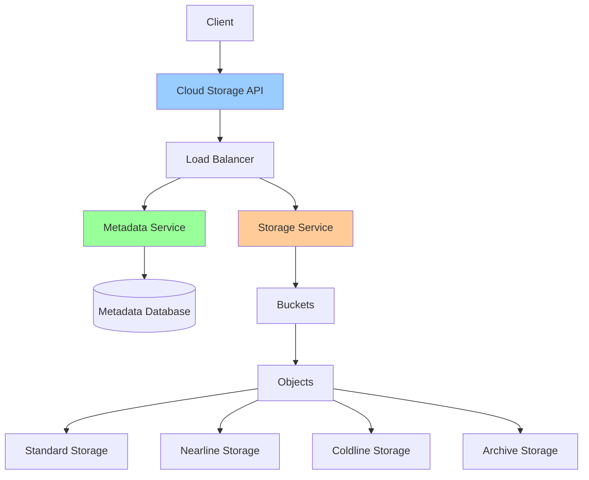

# Cloud Storage Deep Dive

**One-line summary**: Understanding Cloud Storage's consistency model, storage classes, performance characteristics, and how to design for scale and reliability.

**Prerequisites**: [VPC, Load Balancing & DNS](vpc-lb-dns.md), Basic storage concepts (object storage, consistency).

---

## Mental Model

### Cloud Storage Architecture



**Key insight**: Cloud Storage separates metadata (fast, consistent) from object data (distributed, eventually consistent). Understanding this separation is critical for performance and consistency.

### Storage Hierarchy

**Bucket**: Container for objects (globally unique name).
- **Location**: Multi-region, region, dual-region
- **Storage class**: Default storage class for objects
- **Lifecycle**: Automatic lifecycle management

**Object**: File stored in bucket.
- **Name**: Unique within bucket
- **Data**: Object content (bytes)
- **Metadata**: Name-value pairs (custom metadata)
- **Storage class**: Storage class for object

---

## Internals & Architecture

### Consistency Model

#### Strong Consistency (Metadata)

**Metadata operations**: Strongly consistent.
- **Create**: Immediately visible globally
- **Read**: Always sees latest version
- **Update**: Immediately visible globally
- **Delete**: Immediately visible globally

**Examples**:
- Creating an object → immediately visible
- Listing objects → always sees latest objects
- Updating metadata → immediately visible

#### Eventual Consistency (Object Data)

**Object data**: Eventually consistent for reads.
- **Write**: Strongly consistent (immediately readable)
- **Read**: Eventually consistent (may see stale data briefly)
- **Update**: Eventually consistent (may see old version briefly)

**Consistency timeline**:
- **Write**: Immediately consistent globally
- **Read**: Usually consistent within seconds, guaranteed within minutes

**Why eventual consistency?**
- **Performance**: Better performance for reads
- **Scale**: Handles high read throughput
- **Cost**: Lower cost for high-throughput scenarios

### Storage Classes

#### Standard Storage

**Use case**: Frequently accessed data.

**Characteristics**:
- **Availability**: 99.99% (multi-region), 99.9% (regional)
- **Durability**: 99.999999999% (11 nines)
- **Latency**: Low latency (< 100ms)
- **Cost**: Highest cost

**Best for**:
- Active data
- Frequently accessed files
- Low-latency requirements

#### Nearline Storage

**Use case**: Data accessed less than once per month.

**Characteristics**:
- **Availability**: 99.95% (multi-region), 99.9% (regional)
- **Durability**: 99.999999999% (11 nines)
- **Latency**: Low latency (< 100ms)
- **Cost**: ~50% cheaper than Standard

**Best for**:
- Backup data
- Data accessed monthly
- Cost optimization

#### Coldline Storage

**Use case**: Data accessed less than once per quarter.

**Characteristics**:
- **Availability**: 99.95% (multi-region), 99.9% (regional)
- **Durability**: 99.999999999% (11 nines)
- **Latency**: Low latency (< 100ms)
- **Cost**: ~70% cheaper than Standard

**Best for**:
- Archive data
- Data accessed quarterly
- Long-term storage

#### Archive Storage

**Use case**: Data accessed less than once per year.

**Characteristics**:
- **Availability**: 99.95% (multi-region), 99.9% (regional)
- **Durability**: 99.999999999% (11 nines)
- **Latency**: Higher latency (hours for retrieval)
- **Cost**: ~80% cheaper than Standard

**Best for**:
- Long-term archive
- Compliance data
- Rarely accessed data

### Lifecycle Management

**Lifecycle policies**: Automatically transition objects between storage classes.

**Rules**:
- **Age-based**: Transition after N days
- **Version-based**: Transition old versions
- **Delete**: Delete old objects

**Example**:
```
Standard → Nearline (after 30 days)
Nearline → Coldline (after 90 days)
Coldline → Archive (after 365 days)
Archive → Delete (after 2555 days)
```

### Performance Characteristics

#### Throughput

**Read throughput**:
- **Single object**: Up to 2.5 GB/s per object
- **Multiple objects**: Scales linearly with object count
- **Bottleneck**: Usually network bandwidth

**Write throughput**:
- **Single object**: Up to 2.5 GB/s per object
- **Multiple objects**: Scales linearly with object count
- **Bottleneck**: Usually network bandwidth

#### Latency

**Read latency**:
- **Standard/Nearline/Coldline**: < 100ms (P95)
- **Archive**: Hours (retrieval time)

**Write latency**:
- **All classes**: < 100ms (P95)

#### Scalability

**Limits**:
- **Buckets**: Unlimited per project
- **Objects**: Unlimited per bucket
- **Object size**: Up to 5 TB per object
- **Request rate**: Millions of requests per second

### Object Versioning

**Versioning**: Keep multiple versions of objects.

**Use cases**:
- **Recovery**: Recover deleted or overwritten objects
- **Audit**: Track object changes
- **Compliance**: Meet retention requirements

**How it works**:
- **Enabled**: Each update creates new version
- **Storage**: All versions stored (costs apply)
- **Access**: Access specific version via generation number

### Object Composition

**Compose**: Combine multiple objects into one.

**Use case**: Upload large files in parts, compose into single object.

**Process**:
1. Upload parts (parallel uploads)
2. Compose parts into final object
3. Delete parts

**Benefits**:
- **Performance**: Parallel uploads faster
- **Reliability**: Retry individual parts
- **Cost**: Same cost as single upload

---

## Failure Modes & Blast Radius

### Storage Failures

#### Scenario 1: Regional Outage
- **Impact**: Objects in affected region unavailable
- **Blast radius**: Objects in affected region
- **Detection**: Storage API errors, object access failures
- **Recovery**: 
  - Multi-region buckets: Automatic failover to other regions
  - Regional buckets: Wait for region recovery
- **Mitigation**: 
  - Use multi-region buckets for high availability
  - Use dual-region buckets for regional redundancy

#### Scenario 2: Object Corruption
- **Impact**: Object data corrupted, cannot read
- **Blast radius**: Affected object
- **Detection**: Checksum validation failures, read errors
- **Recovery**: 
  - Restore from backup
  - Use object versioning to restore previous version
- **Mitigation**: 
  - Enable object versioning
  - Regular backups
  - Checksum validation

#### Scenario 3: Metadata Service Failure
- **Impact**: Cannot list objects, create objects, update metadata
- **Blast radius**: All metadata operations
- **Detection**: Metadata API errors, listing failures
- **Recovery**: Metadata service automatically recovers
- **Mitigation**: GCP manages metadata service (high availability)

### Consistency Failures

#### Scenario 1: Stale Read
- **Impact**: Read returns old version of object
- **Blast radius**: Affected read operations
- **Detection**: Application detects stale data
- **Recovery**: Retry read, usually resolves within seconds
- **Mitigation**: 
  - Understand eventual consistency model
  - Use strong consistency reads when needed (if available)
  - Implement retry logic

#### Scenario 2: List Inconsistency
- **Impact**: List doesn't show recently created objects
- **Blast radius**: Listing operations
- **Detection**: Objects missing from list
- **Recovery**: Retry list, usually resolves within seconds
- **Mitigation**: 
  - Understand eventual consistency model
  - Use object existence checks if needed
  - Implement retry logic

### Performance Failures

#### Scenario 1: Throttling
- **Impact**: Requests throttled, increased latency
- **Blast radius**: High-throughput operations
- **Detection**: 429 errors (Too Many Requests), increased latency
- **Recovery**: Reduce request rate, implement exponential backoff
- **Mitigation**: 
  - Implement request rate limiting
  - Use exponential backoff
  - Distribute requests across time

#### Scenario 2: Slow Uploads
- **Impact**: Uploads take longer than expected
- **Blast radius**: Upload operations
- **Detection**: Upload latency increases
- **Recovery**: 
  - Check network connectivity
  - Use parallel uploads (compose)
  - Optimize object size
- **Mitigation**: 
  - Use parallel uploads for large files
  - Optimize network path
  - Use appropriate storage class

### Overload Scenarios

#### 10× Normal Load
- **Throughput**: Handles load, may see increased latency
- **Consistency**: Eventual consistency delays may increase
- **Cost**: Storage costs increase linearly

#### 100× Normal Load
- **Throughput**: May see throttling, need to distribute load
- **Consistency**: Eventual consistency delays may be longer
- **Cost**: Storage costs increase significantly

---

## Observability Contract

### Metrics to Track

#### Storage Metrics
- **Object count**: Objects per bucket, per storage class
- **Storage size**: Total storage per bucket, per storage class
- **Request rate**: Read/write requests per second
- **Request latency**: P50/P95/P99 latency
- **Error rate**: 4xx/5xx errors per second

#### Lifecycle Metrics
- **Transitions**: Objects transitioned between storage classes
- **Deletions**: Objects deleted by lifecycle policies
- **Cost**: Storage costs per storage class

#### Performance Metrics
- **Throughput**: Read/write throughput (MB/s)
- **Latency**: Read/write latency (ms)
- **Throttling**: Throttled requests per second

### Logs

**Storage logs**:
- Object access logs (if enabled)
- Admin activity logs (bucket creation, IAM changes)
- Data access logs (object reads/writes, if enabled)

### Alerts

**Critical alerts**:
- Storage unavailable
- High error rate (> 1%)
- Storage quota exceeded

**Warning alerts**:
- High latency (> threshold)
- Throttling detected
- Storage costs increasing

---

## Change Safety

### Bucket Changes

#### Creating Buckets
- **Process**: Create bucket, configure settings
- **Risk**: Low (additive change)
- **Rollback**: Delete bucket (if empty)

#### Changing Storage Class
- **Process**: Update bucket default storage class, update object storage classes
- **Risk**: Medium (may affect costs, performance)
- **Rollback**: Revert storage class

#### Enabling Versioning
- **Process**: Enable versioning on bucket
- **Risk**: Low (additive change, increases storage costs)
- **Rollback**: Disable versioning (doesn't delete versions)

### Object Changes

#### Uploading Objects
- **Process**: Upload object, verify upload
- **Risk**: Low (additive change)
- **Rollback**: Delete object

#### Updating Objects
- **Process**: Upload new version, verify update
- **Risk**: Medium (may break applications expecting old version)
- **Rollback**: Restore previous version (if versioning enabled)

#### Deleting Objects
- **Process**: Delete object, verify deletion
- **Risk**: High (data loss)
- **Rollback**: Restore from version (if versioning enabled) or backup

### Lifecycle Policy Changes

#### Adding Lifecycle Policies
- **Process**: Add lifecycle policy, verify transitions
- **Risk**: Medium (may transition objects unexpectedly)
- **Rollback**: Remove lifecycle policy

#### Updating Lifecycle Policies
- **Process**: Update policy, verify transitions
- **Risk**: Medium (may affect object transitions)
- **Rollback**: Revert lifecycle policy

---

## Security Boundaries

### Access Control

- **IAM**: Bucket and object-level IAM policies
- **ACLs**: Legacy access control lists (deprecated)
- **Signed URLs**: Time-limited access URLs
- **VPC**: VPC Service Controls for network isolation

### Encryption

**At rest**:
- **Google-managed keys**: Default encryption
- **Customer-managed keys**: Cloud KMS keys
- **Customer-supplied keys**: User-provided keys

**In transit**:
- **TLS**: All API calls use TLS
- **HTTPS**: Required for all operations

### Data Protection

- **Versioning**: Protect against accidental deletion
- **Object holds**: Prevent deletion (legal/compliance)
- **Retention policies**: Enforce retention periods

---

## Tradeoffs

### Storage Class: Standard vs Nearline/Coldline/Archive

**Standard**:
- **Pros**: Lowest latency, highest availability
- **Cons**: Highest cost

**Nearline/Coldline/Archive**:
- **Pros**: Lower cost
- **Cons**: Higher latency (Archive), lower availability

### Location: Multi-Region vs Regional

**Multi-Region**:
- **Pros**: Highest availability, automatic failover
- **Cons**: Higher cost, eventual consistency delays

**Regional**:
- **Pros**: Lower cost, lower latency
- **Cons**: Single region failure affects availability

### Consistency: Strong vs Eventual

**Strong consistency** (metadata):
- **Pros**: Always see latest data
- **Cons**: Higher latency, lower throughput

**Eventual consistency** (object data):
- **Pros**: Better performance, higher throughput
- **Cons**: May see stale data briefly

---

## Operational Considerations

### Capacity Planning

**Storage**:
- **Growth**: Plan for storage growth
- **Lifecycle**: Use lifecycle policies to manage costs
- **Quotas**: Monitor storage quotas

**Throughput**:
- **Request rate**: Plan for request rate limits
- **Bandwidth**: Plan for network bandwidth
- **Scaling**: Distribute load across buckets/objects

### Monitoring & Debugging

**Monitor**:
- Storage usage and costs
- Request rate and latency
- Error rate
- Lifecycle transitions

**Debug issues**:
1. Check bucket configuration
2. Check object metadata
3. Check IAM policies
4. Check network connectivity
5. Check storage quotas
6. Review logs

### Incident Response

**Common incidents**:
- Objects unavailable
- High latency
- Throttling
- Storage quota exceeded

**Response**:
1. Check storage status
2. Check bucket configuration
3. Check IAM policies
4. Check network connectivity
5. Scale if needed
6. Contact support if persistent

---

## What Staff Engineers Ask in Reviews

### Design Questions
- "What storage classes are used?"
- "What's the lifecycle policy?"
- "How is consistency handled?"
- "What's the backup strategy?"

### Scale Questions
- "What happens at 10× load?"
- "How does storage scale?"
- "What are the throughput limits?"
- "How do you handle consistency?"

### Security Questions
- "How is access controlled?"
- "How is encryption configured?"
- "Are versioning and backups enabled?"
- "What's the data retention policy?"

### Operational Questions
- "How do you monitor storage?"
- "What alerts do you have?"
- "How do you debug storage issues?"
- "What's the cost optimization strategy?"

---

## Further Reading

**Comprehensive Guide**: [Further Reading: Cloud Storage](../further-reading/cloud-storage.md)

**Quick Links**:
- [Cloud Storage Documentation](https://cloud.google.com/storage/docs)
- [Storage Classes](https://cloud.google.com/storage/docs/storage-classes)
- [Lifecycle Management](https://cloud.google.com/storage/docs/lifecycle)
- [Consistency Model](https://cloud.google.com/storage/docs/consistency)
- [Back to GCP Core Building Blocks](README.md)

---

## Exercises

1. **Design storage strategy**: Design storage strategy for a media application. What storage classes? What lifecycle policies?

2. **Handle consistency**: Your application needs strong consistency for reads. How do you achieve this with Cloud Storage?

3. **Optimize costs**: Your storage costs are high. How do you optimize costs while maintaining performance?

**Answer Key**: [View Answers](../exercises/answers/cloud-storage-answers.md)

