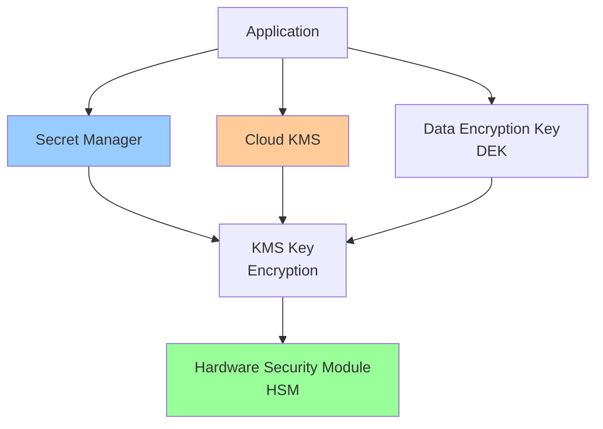

# Cloud KMS & Secret Management

**One-line summary**: Deep dive into Cloud KMS key management, Secret Manager, envelope encryption, and how to design secure key and secret management.

**Prerequisites**: [IAM Evaluation Model](iam-evaluation.md), Basic cryptography concepts (encryption, keys, secrets).

---

## Mental Model

### Key Management Architecture



**Key insight**: Cloud KMS manages encryption keys, while Secret Manager stores secrets encrypted with KMS keys. Understanding envelope encryption and key rotation is critical for security.

### Encryption Model

**Envelope Encryption**: Encrypt data with data encryption key (DEK), encrypt DEK with key encryption key (KEK).

**Components**:
- **KEK**: Key Encryption Key (managed by KMS)
- **DEK**: Data Encryption Key (used to encrypt data)
- **Ciphertext**: Encrypted data + encrypted DEK

**Benefits**:
- **Performance**: Encrypt/decrypt data with DEK (fast)
- **Security**: Protect DEK with KEK (secure)
- **Rotation**: Rotate KEK without re-encrypting data

---

## Internals & Architecture

### Cloud KMS

#### Key Hierarchy

**Key Ring**: Container for keys (regional).

**Key**: Encryption key (symmetric or asymmetric).

**Key Version**: Version of key (for rotation).

**Structure**:
```
Project
  └── Key Ring (us-central1)
      └── Key (my-key)
          ├── Version 1 (primary)
          ├── Version 2
          └── Version 3
```

#### Key Types

**Symmetric Keys**: Same key for encryption and decryption.
- **Use case**: Encrypt data, encrypt DEKs
- **Algorithm**: AES-256
- **Performance**: Fast encryption/decryption

**Asymmetric Keys**: Different keys for encryption and decryption.
- **Use case**: Signing, encryption
- **Algorithm**: RSA, EC
- **Performance**: Slower than symmetric

#### Key Versions

**Versions**: Multiple versions of same key.

**Primary version**: Active version for encryption.

**Use cases**:
- **Rotation**: Rotate keys without downtime
- **Rollback**: Rollback to previous version if needed
- **Audit**: Track key usage per version

#### Hardware Security Module (HSM)

**HSM**: Hardware security module for key storage.

**Types**:
- **Software**: Software-based HSM (default)
- **Hardware**: Hardware-based HSM (Cloud HSM)

**Benefits**:
- **Security**: Keys never leave HSM
- **Compliance**: Meet compliance requirements
- **Performance**: Hardware acceleration

### Secret Manager

#### Secret Storage

**Secrets**: Sensitive data (passwords, API keys, certificates).

**Storage**: Encrypted at rest with KMS keys.

**Access**: Access via IAM policies.

**Versioning**: Multiple versions of secrets.

#### Secret Access

**Access patterns**:
- **Application**: Applications access secrets via API
- **IAM**: IAM policies control access
- **Audit**: All access logged

**Best practices**:
- **Least privilege**: Grant minimum necessary access
- **Rotation**: Rotate secrets regularly
- **Monitoring**: Monitor secret access

### Envelope Encryption

#### Process

**Encryption**:
1. **Generate DEK**: Generate data encryption key
2. **Encrypt data**: Encrypt data with DEK
3. **Encrypt DEK**: Encrypt DEK with KEK (KMS)
4. **Store**: Store encrypted data + encrypted DEK

**Decryption**:
1. **Retrieve**: Retrieve encrypted data + encrypted DEK
2. **Decrypt DEK**: Decrypt DEK with KEK (KMS)
3. **Decrypt data**: Decrypt data with DEK
4. **Return**: Return decrypted data

#### Benefits

**Performance**: Encrypt/decrypt data with DEK (fast, local).

**Security**: Protect DEK with KEK (secure, KMS).

**Rotation**: Rotate KEK without re-encrypting data (only re-encrypt DEK).

### Key Rotation

#### Automatic Rotation

**Automatic rotation**: KMS automatically rotates keys.

**Configuration**:
- **Rotation period**: How often to rotate (e.g., 90 days)
- **Rotation schedule**: When to rotate

**Process**:
1. **Generate**: Generate new key version
2. **Promote**: Promote new version to primary
3. **Deprecate**: Deprecate old versions
4. **Destroy**: Destroy old versions after grace period

#### Manual Rotation

**Manual rotation**: Manually rotate keys.

**Process**:
1. **Create**: Create new key version
2. **Promote**: Promote new version to primary
3. **Re-encrypt**: Re-encrypt data with new key (if needed)
4. **Deprecate**: Deprecate old versions
5. **Destroy**: Destroy old versions

### Performance Characteristics

#### Latency

**KMS operations**:
- **Encrypt**: P95 < 100ms
- **Decrypt**: P95 < 100ms
- **Sign**: P95 < 100ms
- **Verify**: P95 < 100ms

**Secret Manager**:
- **Access**: P95 < 100ms
- **Factors**: Network latency, KMS latency

#### Throughput

**KMS throughput**:
- **Operations**: Thousands of operations per second
- **Scaling**: Scales with key usage

**Secret Manager throughput**:
- **Access**: Thousands of accesses per second
- **Scaling**: Scales with usage

---

## Failure Modes & Blast Radius

### KMS Failures

#### Scenario 1: Service Outage
- **Impact**: Cannot encrypt/decrypt, applications fail
- **Blast radius**: All applications using KMS
- **Detection**: KMS API errors, encryption failures
- **Recovery**: Service automatically recovers
- **Mitigation**: GCP managed service (high availability)

#### Scenario 2: Key Unavailable
- **Impact**: Cannot encrypt/decrypt with key, applications fail
- **Blast radius**: Applications using affected key
- **Detection**: Key access errors, encryption failures
- **Recovery**: 
  - Restore key from backup
  - Use key version (if available)
  - Recreate key (if needed)
- **Mitigation**: 
  - Key backups
  - Multiple key versions
  - Key replication

#### Scenario 3: Key Compromise
- **Impact**: Key compromised, data at risk
- **Blast radius**: All data encrypted with key
- **Detection**: Unusual access patterns, security alerts
- **Recovery**: 
  - Rotate key immediately
  - Re-encrypt data with new key
  - Investigate compromise
- **Mitigation**: 
  - Key rotation
  - Access monitoring
  - Security alerts

### Secret Manager Failures

#### Scenario 1: Secret Unavailable
- **Impact**: Cannot access secrets, applications fail
- **Blast radius**: Applications using affected secrets
- **Detection**: Secret access errors, application failures
- **Recovery**: 
  - Restore secret from backup
  - Use secret version (if available)
  - Recreate secret (if needed)
- **Mitigation**: 
  - Secret backups
  - Multiple secret versions
  - Secret replication

#### Scenario 2: Secret Leakage
- **Impact**: Secret leaked, security risk
- **Blast radius**: Affected secret and applications
- **Detection**: Unusual access patterns, security alerts
- **Recovery**: 
  - Rotate secret immediately
  - Update applications with new secret
  - Investigate leakage
- **Mitigation**: 
  - Secret rotation
  - Access monitoring
  - Security alerts

### Performance Failures

#### Scenario 1: High Latency
- **Impact**: Slow encryption/decryption, application latency
- **Blast radius**: Applications using KMS/Secret Manager
- **Detection**: High latency metrics
- **Recovery**: 
  - Check KMS/Secret Manager health
  - Optimize usage patterns
  - Scale if needed
- **Mitigation**: 
  - Monitor latency
  - Optimize usage
  - Use caching if appropriate

### Overload Scenarios

#### 10× Normal Load
- **Latency**: May increase, operations may queue
- **Throughput**: Handles load, may need scaling
- **Availability**: Maintains availability

#### 100× Normal Load
- **Latency**: Significantly increased, operations queue
- **Throughput**: May need significant scaling
- **Availability**: Maintains availability, but latency high

---

## Observability Contract

### Metrics to Track

#### KMS Metrics
- **Operation rate**: Encrypt/decrypt operations per second
- **Operation latency**: Operation latency (P50/P95/P99)
- **Error rate**: Error rate
- **Key usage**: Key usage per key

#### Secret Manager Metrics
- **Access rate**: Secret accesses per second
- **Access latency**: Access latency (P50/P95/P99)
- **Error rate**: Error rate
- **Secret usage**: Secret usage per secret

### Logs

**KMS logs**:
- Key operations (encrypt, decrypt, sign, verify)
- Key access
- Admin activity logs
- Error logs

**Secret Manager logs**:
- Secret access
- Admin activity logs
- Error logs

### Alerts

**Critical alerts**:
- Service unavailable
- Key unavailable
- Secret unavailable
- High error rate (> 1%)

**Warning alerts**:
- High latency
- Unusual access patterns
- Key rotation due
- Secret rotation due

---

## Change Safety

### Key Changes

#### Creating Keys
- **Process**: Create key, configure settings
- **Risk**: Low (additive change)
- **Rollback**: Delete key (if not used)

#### Rotating Keys
- **Process**: Create new version, promote to primary
- **Risk**: Medium (may affect applications)
- **Rollback**: Revert to previous version

#### Destroying Keys
- **Process**: Destroy key version
- **Risk**: High (irreversible, data loss)
- **Rollback**: Cannot rollback (irreversible)

### Secret Changes

#### Creating Secrets
- **Process**: Create secret, store value
- **Risk**: Low (additive change)
- **Rollback**: Delete secret

#### Updating Secrets
- **Process**: Create new version, update applications
- **Risk**: Medium (may break applications)
- **Rollback**: Revert to previous version

#### Rotating Secrets
- **Process**: Create new version, update applications, deprecate old
- **Risk**: Medium (may break applications)
- **Rollback**: Revert to previous version

---

## Security Boundaries

### Access Control

- **IAM**: Key and secret-level IAM policies
- **Service accounts**: Use service accounts for applications
- **VPC**: VPC Service Controls for network isolation

### Encryption

**At rest**:
- **KMS keys**: Stored in HSM (hardware security)
- **Secrets**: Encrypted with KMS keys

**In transit**:
- **TLS**: All connections use TLS
- **Encryption**: Data encrypted in transit

### Key Protection

- **HSM**: Keys stored in HSM (never leave HSM)
- **Access control**: IAM policies control key access
- **Audit**: All key operations logged

---

## Tradeoffs

### Key Storage: Software vs Hardware HSM

**Software HSM**:
- **Pros**: Lower cost, easier to use
- **Cons**: Less secure than hardware

**Hardware HSM**:
- **Pros**: More secure, compliance
- **Cons**: Higher cost, more complex

### Key Rotation: Automatic vs Manual

**Automatic**:
- **Pros**: No manual intervention, consistent
- **Cons**: Less control, may cause issues

**Manual**:
- **Pros**: More control, can plan
- **Cons**: Manual work, may forget

### Envelope Encryption: Performance vs Security

**Envelope encryption**:
- **Pros**: Better performance, secure
- **Cons**: More complex

**Direct encryption**:
- **Pros**: Simpler
- **Cons**: Slower, less secure

---

## Operational Considerations

### Capacity Planning

**KMS**:
- **Keys**: Plan for number of keys
- **Operations**: Plan for operation rate
- **Scaling**: Plan for scaling

**Secret Manager**:
- **Secrets**: Plan for number of secrets
- **Access**: Plan for access rate
- **Scaling**: Plan for scaling

### Monitoring & Debugging

**Monitor**:
- Key/secret usage
- Operation latency
- Error rates
- Access patterns

**Debug issues**:
1. Check KMS/Secret Manager health
2. Check key/secret access
3. Check IAM policies
4. Check error logs
5. Review access logs

### Incident Response

**Common incidents**:
- Key unavailable
- Secret unavailable
- High latency
- Security alerts

**Response**:
1. Check service health
2. Check key/secret access
3. Check IAM policies
4. Rotate keys/secrets if compromised
5. Contact support if persistent

---

## What Staff Engineers Ask in Reviews

### Design Questions
- "What's the key management strategy?"
- "How are secrets stored?"
- "What's the encryption model?"
- "How is key rotation handled?"

### Security Questions
- "How are keys protected?"
- "What's the access control?"
- "How are secrets rotated?"
- "What's the audit strategy?"

### Operational Questions
- "How do you monitor KMS/Secret Manager?"
- "What alerts do you have?"
- "How do you debug key/secret issues?"
- "What's the rotation strategy?"

---

## Further Reading

**Comprehensive Guide**: [Further Reading: KMS & Secrets](../further-reading/kms-secrets.md)

**Quick Links**:
- [Cloud KMS Documentation](https://cloud.google.com/kms/docs)
- [Secret Manager Documentation](https://cloud.google.com/secret-manager/docs)
- [Envelope Encryption](https://cloud.google.com/kms/docs/envelope-encryption)
- [Key Rotation](https://cloud.google.com/kms/docs/key-rotation)
- [Back to GCP Core Building Blocks](README.md)

---

## Exercises

1. **Design key management**: Design a key management strategy for a multi-tenant application. What keys? How is rotation handled?

2. **Handle key compromise**: A key is compromised. How do you respond? What's the recovery strategy?

3. **Optimize performance**: Your application has high KMS latency. How do you optimize it? What's the strategy?

**Answer Key**: [View Answers](../exercises/answers/kms-secrets-answers.md)

