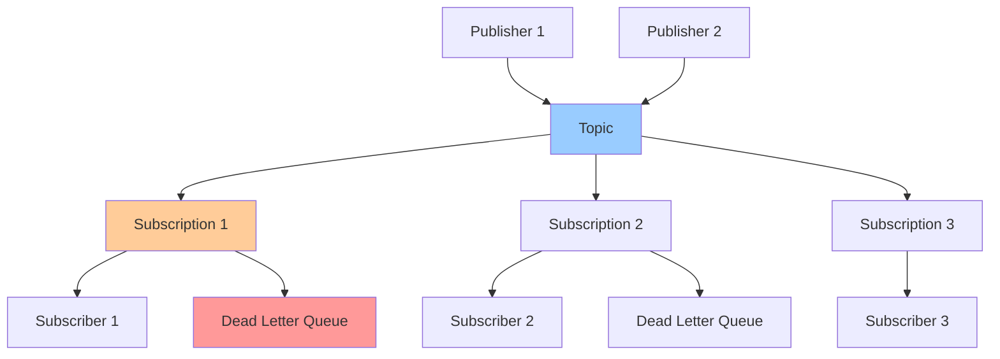

# Pub/Sub: Delivery Guarantees

**One-line summary**: Deep dive into Pub/Sub's at-least-once delivery, ordering guarantees, dead letter queues, and how to design for reliability and scale.

**Prerequisites**: [Queues & Streams](../02-distributed-systems/queues-streams.md), [Idempotency & Retries](../02-distributed-systems/idempotency-retries.md), Basic messaging concepts (publish-subscribe, message queues).

---

## Mental Model

### Pub/Sub Architecture

**Key insight**: Pub/Sub provides at-least-once delivery with ordering guarantees. Understanding delivery semantics and how to handle duplicates is critical for building reliable systems.

### Delivery Model

**Publish-Subscribe**: Decoupled messaging pattern.

**Components**:
- **Topic**: Channel for messages
- **Subscription**: Consumer group for messages
- **Publisher**: Sends messages to topic
- **Subscriber**: Receives messages from subscription

**Delivery guarantees**:
- **At-least-once**: Messages delivered at least once (may be duplicated)
- **Ordering**: Messages ordered within ordering key
- **Durability**: Messages persisted until acknowledged

---

## Internals & Architecture

### Message Delivery

#### At-Least-Once Delivery

**Guarantee**: Messages delivered at least once.

**How it works**:
1. **Publish**: Publisher sends message to topic
2. **Store**: Message stored in topic
3. **Deliver**: Message delivered to subscription
4. **Acknowledge**: Subscriber acknowledges message
5. **Retry**: If not acknowledged, message redelivered

**Duplicates**: Messages may be duplicated if:
- **Network failure**: Acknowledgment lost
- **Subscriber failure**: Subscriber crashes before acknowledging
- **Timeout**: Acknowledgment timeout

**Handling duplicates**:
- **Idempotency**: Make operations idempotent
- **Deduplication**: Track processed message IDs
- **Idempotency keys**: Use idempotency keys for deduplication

#### Ordering Guarantees

**Ordering**: Messages ordered within ordering key.

**How it works**:
1. **Ordering key**: Publisher specifies ordering key
2. **Partitioning**: Messages with same key go to same partition
3. **Delivery**: Messages delivered in order per key
4. **Guarantee**: Messages with same key delivered in order

**Limitations**:
- **Per-key ordering**: Ordering only within same key
- **No global ordering**: No global ordering across keys
- **Partition failures**: Ordering may be affected by partition failures

**Use cases**:
- **User events**: Order events per user
- **Entity updates**: Order updates per entity
- **Time-series**: Order events per time series

### Dead Letter Queues

**Dead Letter Queue (DLQ)**: Queue for messages that cannot be processed.

**Configuration**:
- **Max delivery attempts**: Maximum delivery attempts before DLQ
- **DLQ topic**: Topic for dead letter messages
- **Retry policy**: Retry policy for failed messages

**Use cases**:
- **Poison messages**: Messages that always fail
- **Invalid data**: Messages with invalid data
- **Processing errors**: Messages that cause processing errors

**Handling DLQ**:
- **Monitor**: Monitor DLQ for messages
- **Investigate**: Investigate why messages failed
- **Fix**: Fix processing logic or data
- **Reprocess**: Reprocess messages from DLQ

### Message Retention

**Retention**: How long messages are retained.

**Configuration**:
- **Retention duration**: How long messages retained (default: 7 days)
- **Acknowledgment deadline**: Time to acknowledge message (default: 10 seconds)

**Use cases**:
- **Replay**: Replay messages for reprocessing
- **Debugging**: Debug issues by replaying messages
- **Recovery**: Recover from processing failures

### Performance Characteristics

#### Throughput

**Publish throughput**:
- **Per topic**: Millions of messages per second
- **Per publisher**: Limited by network bandwidth
- **Scaling**: Scales linearly with publishers

**Subscribe throughput**:
- **Per subscription**: Millions of messages per second
- **Per subscriber**: Limited by processing capacity
- **Scaling**: Scales linearly with subscribers

#### Latency

**Publish latency**:
- **P95**: < 100ms
- **P99**: < 500ms
- **Factors**: Network latency, topic load

**Subscribe latency**:
- **P95**: < 100ms
- **P99**: < 500ms
- **Factors**: Network latency, subscription load

#### Scalability

**Limits**:
- **Topics**: Unlimited per project
- **Subscriptions**: Unlimited per topic
- **Messages**: Unlimited per topic
- **Throughput**: Millions of messages per second

---

## Failure Modes & Blast Radius

### Pub/Sub Failures

#### Scenario 1: Service Outage
- **Impact**: Cannot publish or subscribe, messages queued
- **Blast radius**: All topics and subscriptions
- **Detection**: Publish/subscribe failures, API errors
- **Recovery**: Service automatically recovers, messages delivered
- **Mitigation**: GCP managed service (high availability)

#### Scenario 2: Subscription Failure
- **Impact**: Messages not delivered to subscription
- **Blast radius**: Affected subscription
- **Detection**: Messages not acknowledged, subscription errors
- **Recovery**: 
  - Fix subscription configuration
  - Restart subscribers
  - Messages redelivered automatically
- **Mitigation**: 
  - Monitor subscription health
  - Automatic retries
  - Dead letter queues

#### Scenario 3: Message Loss
- **Impact**: Messages lost, not delivered
- **Blast radius**: Affected messages
- **Detection**: Messages missing, processing gaps
- **Recovery**: 
  - Replay messages from retention
  - Republish messages if needed
- **Mitigation**: 
  - Message retention
  - Acknowledgment tracking
  - Monitoring

### Delivery Failures

#### Scenario 1: Duplicate Messages
- **Impact**: Messages processed multiple times
- **Blast radius**: Affected messages
- **Detection**: Duplicate processing detected
- **Recovery**: 
  - Implement idempotency
  - Deduplicate messages
- **Mitigation**: 
  - Idempotent operations
  - Message deduplication
  - Idempotency keys

#### Scenario 2: Out-of-Order Messages
- **Impact**: Messages processed out of order
- **Blast radius**: Affected ordering keys
- **Detection**: Order violations detected
- **Recovery**: 
  - Use ordering keys correctly
  - Handle out-of-order messages
- **Mitigation**: 
  - Proper ordering key usage
  - Order-aware processing
  - Monitoring

#### Scenario 3: Poison Messages
- **Impact**: Messages cause processing failures
- **Blast radius**: Affected messages, may affect subscription
- **Detection**: Repeated processing failures
- **Recovery**: 
  - Move to dead letter queue
  - Fix processing logic
  - Reprocess messages
- **Mitigation**: 
  - Dead letter queues
  - Error handling
  - Monitoring

### Overload Scenarios

#### 10× Normal Load
- **Latency**: May increase, messages may queue
- **Throughput**: Handles load, may need scaling
- **Delivery**: Delivery guarantees maintained

#### 100× Normal Load
- **Latency**: Significantly increased, messages queue
- **Throughput**: May need significant scaling
- **Delivery**: Delivery guarantees maintained, but latency high

---

## Observability Contract

### Metrics to Track

#### Topic Metrics
- **Publish rate**: Messages published per second
- **Publish latency**: Publish latency (P50/P95/P99)
- **Message count**: Messages in topic
- **Message size**: Average message size

#### Subscription Metrics
- **Delivery rate**: Messages delivered per second
- **Acknowledgment rate**: Messages acknowledged per second
- **Backlog**: Unacknowledged messages
- **Delivery latency**: Delivery latency (P50/P95/P99)

#### Dead Letter Queue Metrics
- **DLQ message count**: Messages in DLQ
- **DLQ rate**: Messages sent to DLQ per second
- **DLQ age**: Age of messages in DLQ

### Logs

**Pub/Sub logs**:
- Publish logs (if enabled)
- Subscribe logs (if enabled)
- Error logs
- Admin activity logs

### Alerts

**Critical alerts**:
- Service unavailable
- High error rate (> 1%)
- High backlog (> threshold)
- DLQ message count high

**Warning alerts**:
- High latency
- Low acknowledgment rate
- High duplicate rate
- Subscription failures

---

## Change Safety

### Topic Changes

#### Creating Topics
- **Process**: Create topic, configure settings
- **Risk**: Low (additive change)
- **Rollback**: Delete topic (if empty)

#### Changing Retention
- **Process**: Update retention duration, verify messages retained
- **Risk**: Low (configuration change)
- **Rollback**: Revert retention duration

### Subscription Changes

#### Creating Subscriptions
- **Process**: Create subscription, configure settings
- **Risk**: Low (additive change)
- **Rollback**: Delete subscription

#### Changing Acknowledgment Deadline
- **Process**: Update deadline, verify message delivery
- **Risk**: Medium (may affect message delivery)
- **Rollback**: Revert deadline

#### Enabling Dead Letter Queue
- **Process**: Enable DLQ, configure DLQ topic
- **Risk**: Low (additive change)
- **Rollback**: Disable DLQ

---

## Security Boundaries

### Access Control

- **IAM**: Topic and subscription-level IAM policies
- **Service accounts**: Use service accounts for authentication
- **VPC**: VPC Service Controls for network isolation

### Encryption

**At rest**:
- **Google-managed keys**: Default encryption
- **Customer-managed keys**: Cloud KMS keys

**In transit**:
- **TLS**: All connections use TLS
- **Encryption**: Data encrypted in transit

### Data Protection

- **Message retention**: Configurable message retention
- **Audit logs**: Audit all publish/subscribe access
- **Data privacy**: Messages not accessible to Google

---

## Tradeoffs

### Delivery: At-Least-Once vs Exactly-Once

**At-least-once**:
- **Pros**: Simpler, better performance
- **Cons**: May have duplicates

**Exactly-once**:
- **Pros**: No duplicates
- **Cons**: More complex, lower performance

### Ordering: Per-Key vs Global

**Per-key ordering**:
- **Pros**: Simpler, better performance
- **Cons**: No global ordering

**Global ordering**:
- **Pros**: Global ordering
- **Cons**: More complex, lower performance

### Retention: Short vs Long

**Short retention**:
- **Pros**: Lower storage cost
- **Cons**: Less time for replay

**Long retention**:
- **Pros**: More time for replay
- **Cons**: Higher storage cost

---

## Operational Considerations

### Capacity Planning

**Throughput**:
- **Publish**: Plan for publish throughput
- **Subscribe**: Plan for subscribe throughput
- **Scaling**: Plan for scaling

**Storage**:
- **Retention**: Plan for message retention storage
- **Backlog**: Plan for message backlog storage
- **Cost**: Plan for storage costs

### Monitoring & Debugging

**Monitor**:
- Publish/subscribe rates
- Message backlog
- Delivery latency
- Error rates
- Dead letter queues

**Debug issues**:
1. Check topic/subscription health
2. Check message delivery
3. Check acknowledgment rate
4. Check dead letter queues
5. Review logs

### Incident Response

**Common incidents**:
- High backlog
- Message delivery failures
- Duplicate messages
- Poison messages

**Response**:
1. Check topic/subscription health
2. Check message delivery
3. Check acknowledgment rate
4. Check dead letter queues
5. Scale if needed
6. Contact support if persistent

---

## What Staff Engineers Ask in Reviews

### Design Questions
- "What's the delivery guarantee?"
- "How is ordering handled?"
- "What's the dead letter queue strategy?"
- "How are duplicates handled?"

### Scale Questions
- "What happens at 10× load?"
- "How does Pub/Sub scale?"
- "What are the throughput limits?"
- "How do you handle backpressure?"

### Reliability Questions
- "How is at-least-once delivery handled?"
- "What's the idempotency strategy?"
- "How are poison messages handled?"
- "What's the retry strategy?"

### Operational Questions
- "How do you monitor Pub/Sub?"
- "What alerts do you have?"
- "How do you debug delivery issues?"
- "What's the dead letter queue strategy?"

---

## Further Reading

**Comprehensive Guide**: [Further Reading: Pub/Sub](../further-reading/pubsub.md)

**Quick Links**:
- [Pub/Sub Documentation](https://cloud.google.com/pubsub/docs)
- [Delivery Guarantees](https://cloud.google.com/pubsub/docs/overview)
- [Ordering Guarantees](https://cloud.google.com/pubsub/docs/ordering)
- [Dead Letter Queues](https://cloud.google.com/pubsub/docs/dead-letter-topics)
- [Back to GCP Core Building Blocks](README.md)

---

## Exercises

1. **Design messaging**: Design a Pub/Sub architecture for an event-driven application. What topics? What subscriptions? How is ordering handled?

2. **Handle duplicates**: Your application receives duplicate messages. How do you handle them? What's the idempotency strategy?

3. **Handle failures**: Messages are failing to process. How do you handle failures? What's the dead letter queue strategy?

**Answer Key**: [View Answers](../exercises/answers/pubsub-answers.md)

