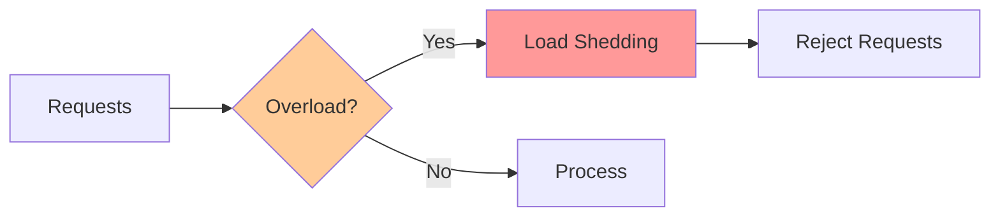

# Load Shedding & Circuit Breakers

**One-line summary**: How to handle overload gracefully using load shedding and circuit breakers to protect systems.

**Prerequisites**: [Overload & Backpressure](../02-distributed-systems/overload-backpressure.md), [SLIs, SLOs & Error Budgets](sli-slo-error-budget.md).

---

## Mental Model

### Overload Protection

**Key insight**: Load shedding and circuit breakers protect systems from overload and cascading failures.

### Load Shedding

**Load shedding**: Dropping requests when overloaded.

**Strategies**:
- **Random**: Randomly drop requests
- **Priority**: Drop low-priority requests
- **Rate limiting**: Limit request rate
- **Queue-based**: Drop when queue full

### Circuit Breakers

**Circuit breaker**: Stops calling downstream service when it's failing.

**States**:
- **Closed**: Normal operation, calls pass through
- **Open**: Service failing, calls rejected immediately
- **Half-open**: Testing if service recovered

---

## Internals & Architecture

### Load Shedding Implementation

#### Priority-Based Shedding

**How it works**:
1. **Classify requests**: Classify requests by priority
2. **Monitor load**: Monitor system load
3. **Shed low priority**: Drop low-priority requests when overloaded
4. **Protect high priority**: Continue processing high-priority requests

**Use case**: When some requests are more important than others.

#### Rate-Based Shedding

**How it works**:
1. **Set rate limit**: Set maximum request rate
2. **Track rate**: Track current request rate
3. **Drop excess**: Drop requests exceeding limit

**Use case**: When absolute rate limit is needed.

### Circuit Breaker Implementation

#### Three-State Circuit Breaker

**Closed state**:
- **Behavior**: Calls pass through
- **Transition**: Open on failure threshold

**Open state**:
- **Behavior**: Calls rejected immediately
- **Transition**: Half-open after timeout

**Half-open state**:
- **Behavior**: Test calls allowed
- **Transition**: Closed on success, open on failure

#### Failure Detection

**Failure criteria**:
- **Error rate**: Error rate exceeds threshold
- **Latency**: Latency exceeds threshold
- **Timeout**: Requests timing out

**Thresholds**:
- **Error rate**: > 50% errors
- **Latency**: P95 > threshold
- **Timeout**: > timeout duration

---

## Failure Modes & Blast Radius

### Load Shedding Failures

#### Scenario 1: Over-Shedding
- **Impact**: Legitimate requests dropped, user impact
- **Blast radius**: All requests
- **Detection**: High rejection rate, user complaints
- **Recovery**: Adjust shedding thresholds
- **Mitigation**: Tune thresholds, monitor rejection rate

#### Scenario 2: Under-Shedding
- **Impact**: System overloaded, cascading failures
- **Blast radius**: Entire system
- **Detection**: System overload, high latency
- **Recovery**: Increase shedding, enable circuit breakers
- **Mitigation**: Lower thresholds, proactive shedding

### Circuit Breaker Failures

#### Scenario 1: False Opens
- **Impact**: Service rejected unnecessarily
- **Blast radius**: Affected service
- **Detection**: Circuit opens frequently
- **Recovery**: Adjust thresholds
- **Mitigation**: Tune thresholds, reduce false positives

#### Scenario 2: Slow Recovery
- **Impact**: Service unavailable longer than needed
- **Blast radius**: Affected service
- **Detection**: Long time in open state
- **Recovery**: Reduce timeout, faster recovery
- **Mitigation**: Shorter timeouts, better recovery logic

---

## Observability Contract

### Metrics

- **Shedding rate**: Requests shed per second
- **Circuit breaker state**: State of circuit breakers
- **Rejection rate**: Requests rejected per second
- **Recovery time**: Time to recover from open state

### Alerts

- High shedding rate
- Circuit breaker opens
- High rejection rate
- Slow recovery

---

## Change Safety

### Load Shedding Changes

- **Process**: Update thresholds, verify behavior
- **Risk**: Medium (may affect request handling)
- **Rollback**: Revert thresholds

---

## Tradeoffs

### Aggressive vs Conservative Shedding

**Aggressive shedding**:
- **Pros**: Better protection, faster recovery
- **Cons**: More requests dropped, user impact

**Conservative shedding**:
- **Pros**: Fewer requests dropped, better UX
- **Cons**: Less protection, slower recovery

---

## Operational Considerations

### Best Practices

1. **Tune thresholds**: Balance protection and UX
2. **Monitor shedding**: Track shedding rate and impact
3. **Test circuit breakers**: Test circuit breaker behavior
4. **Document policies**: Document shedding and circuit breaker policies

---

## What Staff Engineers Ask in Reviews

- "What's the load shedding strategy?"
- "How are circuit breakers configured?"
- "What happens when overloaded?"
- "How is recovery handled?"

---

## Further Reading

**Comprehensive Guide**: [Further Reading: Load Shedding](../further-reading/load-shedding.md)

**Quick Links**:
- [Overload & Backpressure](../02-distributed-systems/overload-backpressure.md)
- [Circuit Breaker Pattern](../05-llD-patterns/circuit-breakers.md)
- [Rate Limiting](../05-llD-patterns/rate-limiting.md)
- [Back to Reliability & SRE](README.md)

---

## Exercises

1. **Design load shedding**: Design a load shedding strategy. What requests do you shed?

2. **Configure circuit breaker**: Configure a circuit breaker. What are the thresholds?

3. **Handle overload**: Your system is overloaded. How do you handle it?

**Answer Key**: [View Answers](../exercises/answers/load-shedding-answers.md)

