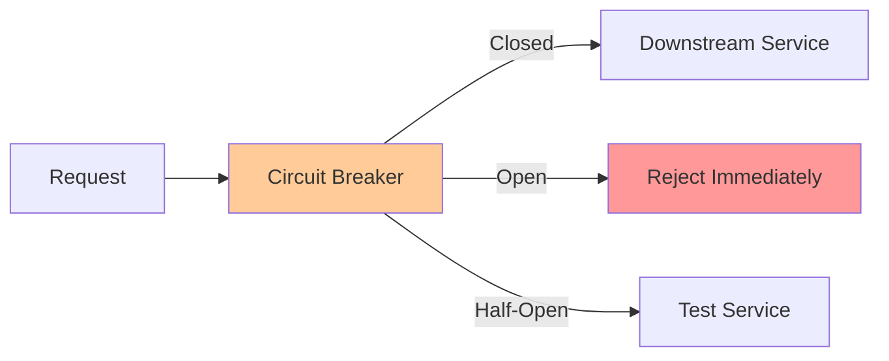

# Circuit Breaker Pattern

**One-line summary**: How to implement circuit breakers to prevent cascading failures and protect systems from downstream failures.

**Prerequisites**: [Load Shedding & Circuit Breakers](../04-reliability-sre/load-shedding.md), understanding of failure handling.

---

## Mental Model

### Circuit Breaker Purpose

**Key insight**: Circuit breakers prevent cascading failures by stopping calls to failing services.

### Circuit Breaker States

**Closed**: Normal operation, calls pass through.
**Open**: Service failing, calls rejected immediately.
**Half-open**: Testing if service recovered.

---

## Internals & Architecture

### Circuit Breaker Implementation

#### State Machine

**Closed → Open**: 
- **Trigger**: Failure threshold exceeded
- **Action**: Reject calls immediately
- **Timeout**: Wait before transitioning to half-open

**Open → Half-open**:
- **Trigger**: Timeout expired
- **Action**: Allow test calls
- **Success threshold**: Need N successes to close

**Half-open → Closed**:
- **Trigger**: Success threshold met
- **Action**: Resume normal operation

**Half-open → Open**:
- **Trigger**: Failure detected
- **Action**: Return to open state

### Failure Detection

**Failure criteria**:
- **Error rate**: Error rate > threshold (e.g., 50%)
- **Latency**: Latency > threshold (e.g., P95 > 1s)
- **Timeout**: Requests timing out

**Thresholds**:
- **Error threshold**: 50% errors
- **Latency threshold**: P95 latency
- **Timeout threshold**: Request timeout

### Recovery Logic

**Recovery process**:
1. **Wait**: Wait for timeout period
2. **Test**: Allow test requests (half-open)
3. **Evaluate**: Evaluate test results
4. **Decide**: Close if successful, open if failed

---

## Failure Modes & Blast Radius

### Circuit Breaker Failures

#### Scenario 1: False Opens
- **Impact**: Service rejected unnecessarily
- **Blast radius**: Affected service
- **Detection**: Circuit opens frequently
- **Recovery**: Adjust thresholds
- **Mitigation**: Tune thresholds, reduce false positives

#### Scenario 2: Slow Recovery
- **Impact**: Service unavailable longer than needed
- **Blast radius**: Affected service
- **Detection**: Long time in open state
- **Recovery**: Reduce timeout, faster recovery
- **Mitigation**: Shorter timeouts, better recovery logic

---

## Observability Contract

### Metrics

- **Circuit state**: Current state (closed/open/half-open)
- **Failure rate**: Failure rate triggering opens
- **Recovery time**: Time to recover from open
- **False open rate**: Rate of false opens

### Alerts

- Circuit breaker opens
- High false open rate
- Slow recovery
- Frequent state changes

---

## Change Safety

### Circuit Breaker Changes

- **Process**: Update thresholds, verify behavior
- **Risk**: Medium (may affect service availability)
- **Rollback**: Revert thresholds

---

## Tradeoffs

### Aggressive vs Conservative

**Aggressive**:
- **Pros**: Better protection, faster failure detection
- **Cons**: More false opens, service unavailable

**Conservative**:
- **Pros**: Fewer false opens, better availability
- **Cons**: Slower failure detection, less protection

---

## Operational Considerations

### Best Practices

1. **Tune thresholds**: Balance protection and availability
2. **Monitor state**: Track circuit breaker state changes
3. **Test recovery**: Test recovery logic
4. **Document policies**: Document circuit breaker policies

---

## What Staff Engineers Ask in Reviews

- "How are circuit breakers configured?"
- "What are the failure thresholds?"
- "How is recovery handled?"
- "What's the timeout policy?"

---

## Further Reading

**Comprehensive Guide**: [Further Reading: Circuit Breakers](../further-reading/circuit-breakers.md)

**Quick Links**:
- [Load Shedding & Circuit Breakers](../04-reliability-sre/load-shedding.md)
- "Release It!" by Michael Nygard
- [Back to LLD Patterns](README.md)

---

## Exercises

1. **Implement circuit breaker**: Implement a circuit breaker. What are the states?

2. **Configure thresholds**: Configure circuit breaker thresholds. What values?

3. **Handle recovery**: Your circuit breaker opens. How does it recover?

**Answer Key**: [View Answers](../exercises/answers/circuit-breakers-answers.md)

