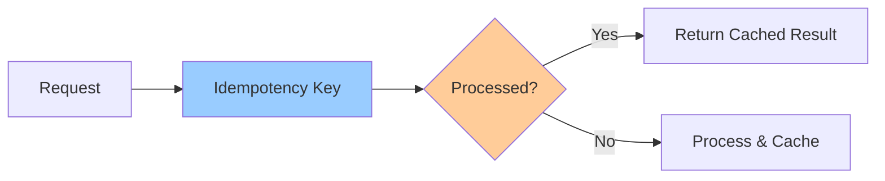

# Idempotency Patterns

**One-line summary**: How to implement idempotency patterns to make operations safe to retry.

**Prerequisites**: [Idempotency & Retries](../02-distributed-systems/idempotency-retries.md), understanding of distributed systems.

---

## Mental Model

### Idempotency Patterns

**Idempotency**: Performing operation multiple times has same effect as once.

**Patterns**:
- **Idempotency keys**: Unique keys for operations
- **Deduplication**: Track processed operations
- **Idempotent operations**: Design operations to be idempotent

**Key insight**: Idempotency patterns make operations safe to retry by ensuring same result.

---

## Internals & Architecture

### Idempotency Key Pattern

**How it works**:
1. **Generate key**: Client generates unique idempotency key
2. **Send request**: Include key in request
3. **Check key**: Server checks if key processed
4. **Process or return**: Process if new, return cached if duplicate

**Key generation**:
- **UUID**: Generate UUID for each operation
- **Hash**: Hash of operation + context
- **Client ID + sequence**: Client ID + sequence number

### Deduplication Pattern

**How it works**:
1. **Store keys**: Store processed idempotency keys
2. **Check before process**: Check key before processing
3. **Store after process**: Store key after processing
4. **TTL**: Expire keys after TTL

**Storage**:
- **In-memory**: Fast, but lost on restart
- **Database**: Persistent, but slower
- **Distributed cache**: Fast and distributed

### Idempotent Operations

**Design principles**:
- **Upsert**: Use upsert instead of insert
- **Set operations**: Use set instead of increment
- **Idempotent APIs**: Design APIs to be idempotent

**Examples**:
- **PUT**: Idempotent (replaces resource)
- **DELETE**: Idempotent (no-op if already deleted)
- **POST**: Not idempotent (creates new resource)

---

## Failure Modes & Blast Radius

### Idempotency Failures

#### Scenario 1: Key Collision
- **Impact**: Operations deduplicated incorrectly
- **Blast radius**: Affected operations
- **Detection**: Operations not processed
- **Recovery**: Use better key generation
- **Mitigation**: Use UUIDs, include context in keys

#### Scenario 2: Key Expiry
- **Impact**: Operations processed multiple times
- **Blast radius**: Operations after expiry
- **Detection**: Duplicate processing
- **Recovery**: Increase TTL, fix key storage
- **Mitigation**: Appropriate TTL, persistent storage

---

## Observability Contract

### Metrics

- **Idempotency key usage**: Keys generated per second
- **Deduplication rate**: Duplicate requests detected
- **Key storage size**: Size of key storage
- **Key expiry rate**: Keys expired per second

### Alerts

- High key collision rate
- Key storage full
- High key expiry rate
- Deduplication failures

---

## Change Safety

### Idempotency Changes

- **Process**: Update idempotency logic, verify behavior
- **Risk**: Medium (may affect operation processing)
- **Rollback**: Revert changes

---

## Tradeoffs

### In-Memory vs Persistent Storage

**In-memory**:
- **Pros**: Fast, low latency
- **Cons**: Lost on restart, not distributed

**Persistent storage**:
- **Pros**: Survives restarts, distributed
- **Cons**: Slower, higher latency

---

## Operational Considerations

### Best Practices

1. **Use UUIDs**: Generate unique keys
2. **Store keys**: Store processed keys
3. **Set TTL**: Expire keys appropriately
4. **Monitor**: Monitor key usage and collisions

---

## What Staff Engineers Ask in Reviews

- "How is idempotency implemented?"
- "What keys are used?"
- "How are duplicates detected?"
- "What's the TTL policy?"

---

## Further Reading

**Comprehensive Guide**: [Further Reading: Idempotency Patterns](../further-reading/idempotency-patterns.md)

**Quick Links**:
- [Idempotency & Retries](../02-distributed-systems/idempotency-retries.md)
- [Pub/Sub: Delivery Guarantees](../03-gcp-core-building-blocks/pubsub.md)
- [Back to LLD Patterns](README.md)

---

## Exercises

1. **Implement idempotency**: Implement idempotency for an API. What pattern?

2. **Handle duplicates**: Your system receives duplicate requests. How do you handle them?

3. **Design keys**: Design idempotency keys for a payment system. What's the format?

**Answer Key**: [View Answers](../exercises/answers/idempotency-patterns-answers.md)

