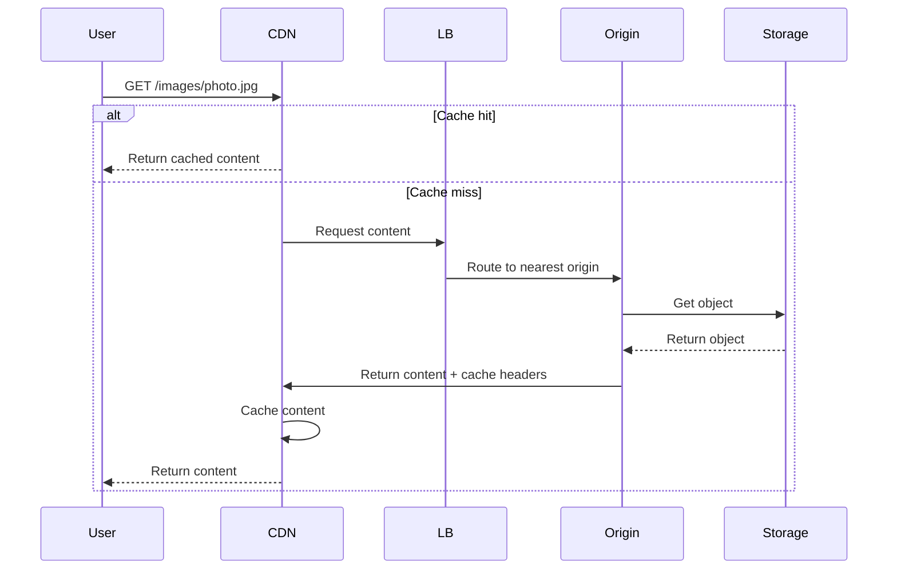
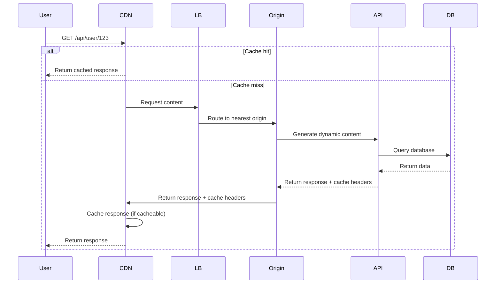
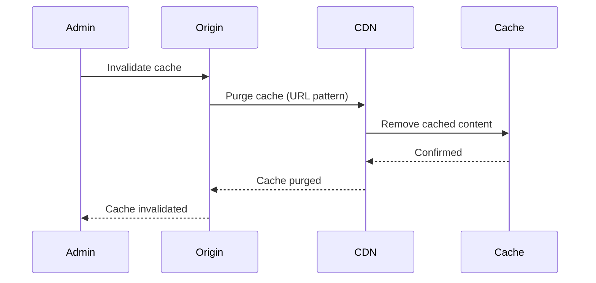

# Global Content Delivery System

**One-line summary**: End-to-end design of a global CDN system on GCP using Cloud CDN, load balancing, and cache invalidation with SLOs, edge caching strategies, and consistency guarantees.

**Prerequisites**: [VPC, Load Balancing & DNS](../03-gcp-core-building-blocks/vpc-lb-dns.md), [Cloud Storage Deep Dive](../03-gcp-core-building-blocks/cloud-storage.md), [Reliability & SRE](../04-reliability-sre/README.md).

---

## System Overview

### Requirements

**Functional Requirements**:
- Serve static content (images, videos, CSS, JS) globally
- Support dynamic content (API responses, personalized content)
- Handle 100M+ requests per day
- Support multiple content types (images, videos, documents)

**Non-Functional Requirements**:
- **Latency**: P95 < 100ms (edge to user)
- **Throughput**: Handle 10K+ requests/second peak
- **Availability**: 99.9% (SLO)
- **Cache hit rate**: > 80% (SLO)
- **Consistency**: Eventual consistency (acceptable for content)

**Constraints**:
- Must use GCP services
- Cost-effective at scale
- Support cache invalidation

---

## Architecture

### High-Level Architecture

```mermaid
graph TB
    Users[Users<br/>Global] --> CDN[Cloud CDN<br/>Edge Caches]
    
    CDN --> LB[Global Load Balancer<br/>HTTP(S)]
    
    LB --> Origin1[Origin Server 1<br/>us-central1]
    LB --> Origin2[Origin Server 2<br/>europe-west1]
    LB --> Origin3[Origin Server 3<br/>asia-east1]
    
    Origin1 --> Storage1[Cloud Storage<br/>us-central1]
    Origin2 --> Storage2[Cloud Storage<br/>europe-west1]
    Origin3 --> Storage3[Cloud Storage<br/>asia-east1]
    
    Origin1 --> API[API Server<br/>Dynamic Content]
    Origin2 --> API
    Origin3 --> API
    
    API --> DB[(Database<br/>Spanner)]
    
    style CDN fill:#99ccff
    style LB fill:#ffcc99
    style Storage1 fill:#99ff99
```

### Component Details

#### 1. Cloud CDN
- **Type**: Google's global CDN
- **Edge locations**: 100+ edge locations worldwide
- **Caching**: Cache static and dynamic content
- **Configuration**:
  - Cache TTL: Configurable per content type
  - Cache keys: URL + query parameters
  - Compression: Automatic compression

#### 2. Global Load Balancer
- **Type**: HTTP(S) Global Load Balancer
- **SSL**: Managed SSL certificates
- **Routing**: Geographic routing (closest origin)
- **Health checks**: HTTP health checks every 10s

#### 3. Origin Servers
- **Platform**: GKE (Google Kubernetes Engine)
- **Regions**: us-central1, europe-west1, asia-east1
- **Functions**:
  - Serve static content from Cloud Storage
  - Generate dynamic content via API
  - Handle cache invalidation

#### 4. Cloud Storage
- **Buckets**: Regional buckets (one per region)
- **Storage class**: Standard (frequently accessed)
- **CORS**: Configured for web access
- **Lifecycle**: Automatic lifecycle management

#### 5. API Server
- **Function**: Generate dynamic content
- **Database**: Cloud Spanner (multi-region)
- **Caching**: In-memory cache for API responses

---

## Data Flow

### Static Content Flow



### Dynamic Content Flow



### Cache Invalidation Flow



---

## SLIs, SLOs & Error Budgets

### SLIs (Service Level Indicators)

#### 1. Latency SLI
- **Definition**: Time from request to response (edge to user)
- **Measurement**: P95 latency
- **Current**: P95 = 80ms
- **Target**: P95 < 100ms (SLO)

#### 2. Cache Hit Rate SLI
- **Definition**: Fraction of requests served from cache
- **Measurement**: Cache hits / total requests
- **Current**: 85%
- **Target**: > 80% (SLO)

#### 3. Availability SLI
- **Definition**: Fraction of successful HTTP requests (2xx, 3xx)
- **Measurement**: Successful requests / total requests
- **Current**: 99.95%
- **Target**: 99.9% (SLO)

#### 4. Error Rate SLI
- **Definition**: Fraction of requests returning 5xx errors
- **Measurement**: 5xx errors / total requests
- **Current**: 0.05%
- **Target**: < 0.1% (SLO)

### SLOs (Service Level Objectives)

| SLI | SLO | Error Budget |
|-----|-----|--------------|
| Latency | P95 < 100ms | > 100ms for > 0.1% requests |
| Cache Hit Rate | > 80% | < 80% for > 0.1% requests |
| Availability | 99.9% | < 99.9% for > 0.1% time |
| Error Rate | < 0.1% | > 0.1% for > 0.1% requests |

### Error Budget Policy

**Policy**:
- **> 50% remaining**: Normal operations, can ship features
- **25-50% remaining**: Warning, reduce risky changes
- **< 25% remaining**: Critical, stop feature work, focus on reliability
- **0% remaining**: Emergency, only reliability work

---

## Capacity Planning

### Current Capacity

**CDN**:
- **Edge locations**: 100+ locations worldwide
- **Throughput**: Unlimited (scales automatically)
- **Cache capacity**: Petabytes

**Load Balancer**:
- **Throughput**: Millions of requests/second
- **Regions**: 3 regions (us, eu, asia)

**Origin Servers**:
- **Per region**: 10 pods (can scale to 50)
- **QPS capacity**: ~10K QPS per region (can scale to 50K)
- **Total**: ~30K QPS (can scale to 150K)

**Storage**:
- **Per region**: Petabytes
- **Throughput**: Millions of requests/second

### Scaling Strategy

**Auto-scaling**:
- **CDN**: Automatic (handles load)
- **Load Balancer**: Automatic (handles load)
- **Origin Servers**: Auto-scaling based on load
- **Storage**: Automatic (handles load)

**Manual scaling**:
- **Origin Servers**: Adjust min/max replicas if needed

### Capacity Forecasting

**Growth Projection**:
- **Current**: 50M requests/day average, 100M peak
- **Growth**: 25% per quarter
- **6 months**: ~78M requests/day average, ~156M peak
- **12 months**: ~122M requests/day average, ~244M peak

**Capacity Needs**:
- **6 months**: Need to handle ~200M requests/day peak
- **12 months**: Need to handle ~300M requests/day peak
- **Plan**: Optimize caching, scale origin servers

---

## Failure Modes & Blast Radius

### CDN Failures

#### Scenario 1: CDN Edge Failure
- **Impact**: Requests routed to other edges, may see increased latency
- **Blast radius**: Users near failed edge
- **Detection**: Edge health checks fail, latency increases
- **Recovery**: 
  - Automatic failover to other edges
  - Edge restored automatically
- **Mitigation**: 
  - Multiple edge locations
  - Automatic failover

#### Scenario 2: Origin Server Failure
- **Impact**: Cannot serve content, cache misses increase
- **Blast radius**: Affected region
- **Detection**: Origin health checks fail, error rate increases
- **Recovery**: 
  - Load balancer routes to other regions
  - Origin restored automatically
  - Cache helps during recovery
- **Mitigation**: 
  - Multi-region deployment
  - Health checks
  - Auto-scaling

#### Scenario 3: Storage Failure
- **Impact**: Cannot serve static content, cache misses increase
- **Blast radius**: Affected region
- **Detection**: Storage errors, cache misses increase
- **Recovery**: 
  - Storage automatically recovers
  - Cache helps during recovery
- **Mitigation**: 
  - Storage redundancy
  - Multi-region storage
  - Cache helps reduce impact

### Cache Failures

#### Scenario 1: Cache Miss Storm
- **Impact**: High origin load, increased latency
- **Blast radius**: All requests
- **Detection**: Cache hit rate drops, origin load increases
- **Recovery**: 
  - Cache warms up over time
  - Scale origin servers if needed
- **Mitigation**: 
  - Pre-warm cache
  - Optimize cache TTL
  - Monitor cache hit rate

#### Scenario 2: Stale Cache
- **Impact**: Users see stale content
- **Blast radius**: Cached content
- **Detection**: Users report stale content
- **Recovery**: 
  - Invalidate cache
  - Update cache TTL
- **Mitigation**: 
  - Proper cache invalidation
  - Monitor cache freshness
  - Use cache versioning

### Overload Scenarios

#### 10× Normal Load (1B requests/day)
- **Impact**: 
  - CDN: Handles load, may see increased latency
  - Origin: May need scaling, cache helps
  - Storage: Handles load
- **Mitigation**: 
  - Auto-scaling handles load
  - Cache reduces origin load
  - Monitor performance

#### 100× Normal Load (10B requests/day)
- **Impact**: 
  - CDN: Handles load, may see increased latency
  - Origin: Significant scaling needed
  - Storage: Handles load
- **Mitigation**: 
  - Significant scaling required
  - Optimize caching
  - May need more regions

---

## Observability

### Metrics

#### CDN Metrics
- **Request rate**: Requests per second
- **Cache hit rate**: Cache hits / total requests
- **Latency**: P50/P95/P99 latency
- **Error rate**: 4xx/5xx errors
- **Bandwidth**: Bandwidth usage

#### Origin Metrics
- **Request rate**: Requests per second
- **Latency**: P50/P95/P99 latency
- **Error rate**: 4xx/5xx errors
- **Cache miss rate**: Cache misses / total requests

#### Storage Metrics
- **Request rate**: Requests per second
- **Latency**: P50/P95/P99 latency
- **Error rate**: 4xx/5xx errors
- **Storage size**: Total storage size

### Dashboards

**CDN Dashboard**:
- Request rate, cache hit rate, latency
- Error rate, bandwidth
- SLO compliance, error budget

**Origin Dashboard**:
- Request rate, latency, error rate
- Cache miss rate, origin load

**Storage Dashboard**:
- Request rate, latency, error rate
- Storage size, storage costs

### Logs

**CDN Logs**:
- Access logs (if enabled)
- Error logs
- Cache hit/miss logs

**Origin Logs**:
- Access logs
- Error logs
- Cache invalidation logs

### Alerts

**Critical Alerts**:
- CDN unavailable
- High error rate (> 1%)
- Cache hit rate < 70%
- SLO violation

**Warning Alerts**:
- High latency
- Cache hit rate decreasing
- Origin load increasing
- Storage errors

---

## Deployment & Rollout Strategy

### Deployment Process

**Static Content**:
1. **Upload**: Upload to Cloud Storage
2. **Invalidate**: Invalidate CDN cache (if needed)
3. **Verify**: Verify content served correctly

**Dynamic Content**:
1. **Deploy**: Deploy API changes
2. **Canary**: Deploy to canary (5% traffic)
3. **Monitor**: Monitor for issues
4. **Rollout**: Gradual rollout (25%, 50%, 100%)

### Cache Invalidation Strategy

**Invalidation Methods**:
- **URL invalidation**: Invalidate specific URLs
- **Path invalidation**: Invalidate URL patterns
- **Full invalidation**: Invalidate all cache (rare)

**Best Practices**:
- **Versioned URLs**: Use versioned URLs (e.g., `/v1/image.jpg`)
- **Selective invalidation**: Invalidate only changed content
- **Scheduled invalidation**: Invalidate during low traffic

---

## Security

### Authentication & Authorization

**CDN**:
- **Signed URLs**: Use signed URLs for private content
- **Access control**: IAM policies for Cloud Storage

**Origin**:
- **IAM**: IAM policies for origin servers
- **Service accounts**: Use service accounts

### Data Protection

**Encryption**:
- **At rest**: All data encrypted (Cloud Storage)
- **In transit**: TLS for all connections
- **CDN**: TLS termination at CDN

**DDoS Protection**:
- **Cloud Armor**: WAF and DDoS protection
- **Rate limiting**: Rate limiting per IP/client

---

## Cost Optimization

### Cost Breakdown

**Monthly Costs** (estimated for 100M requests/day):
- **CDN**: $3,000 (egress, cache)
- **Load Balancer**: $500 (traffic)
- **Origin Servers**: $2,000 (compute)
- **Storage**: $1,000 (storage, egress)
- **Total**: ~$6,500/month

### Optimization Strategies

1. **CDN**: Optimize cache hit rate, reduce origin load
2. **Storage**: Use appropriate storage classes, lifecycle policies
3. **Origin**: Optimize origin performance, reduce compute
4. **Caching**: Optimize cache TTL, reduce cache misses

---

## Incident Response Playbook

### Common Incidents

#### Incident 1: Low Cache Hit Rate
**Symptoms**:
- Cache hit rate < 70%
- High origin load
- Increased latency

**Response**:
1. **Acknowledge**: Acknowledge incident
2. **Assess**: Check cache hit rate, origin load
3. **Mitigate**: 
   - Optimize cache TTL
   - Pre-warm cache
   - Scale origin servers
4. **Investigate**: Root cause analysis
5. **Resolve**: Fix root cause
6. **Postmortem**: Write postmortem

#### Incident 2: Stale Content
**Symptoms**:
- Users report stale content
- Cache not invalidated

**Response**:
1. **Acknowledge**: Acknowledge incident
2. **Assess**: Check cache invalidation logs
3. **Mitigate**: 
   - Invalidate cache immediately
   - Fix cache invalidation process
4. **Investigate**: Root cause analysis
5. **Resolve**: Fix root cause
6. **Postmortem**: Write postmortem

---

## Further Reading

**Comprehensive Guide**: [Further Reading: CDN System](../further-reading/cdn-system.md)

**Quick Links**:
- [Cloud CDN Documentation](https://cloud.google.com/cdn/docs)
- [Load Balancing Documentation](https://cloud.google.com/load-balancing/docs)
- [Cloud Storage Documentation](https://cloud.google.com/storage/docs)
- [VPC, LB & DNS](../03-gcp-core-building-blocks/vpc-lb-dns.md)
- [Back to Case Studies](README.md)

---

## Exercises

1. **Design improvements**: How would you improve this design? What tradeoffs?

2. **Handle cache invalidation**: How do you handle cache invalidation for frequently updated content?

3. **Optimize costs**: How would you reduce costs by 30%? What tradeoffs?

**Answer Key**: [View Answers](../exercises/answers/cdn-system-answers.md)

