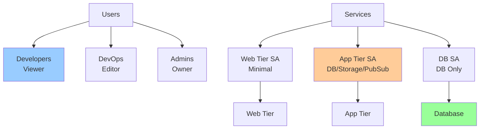
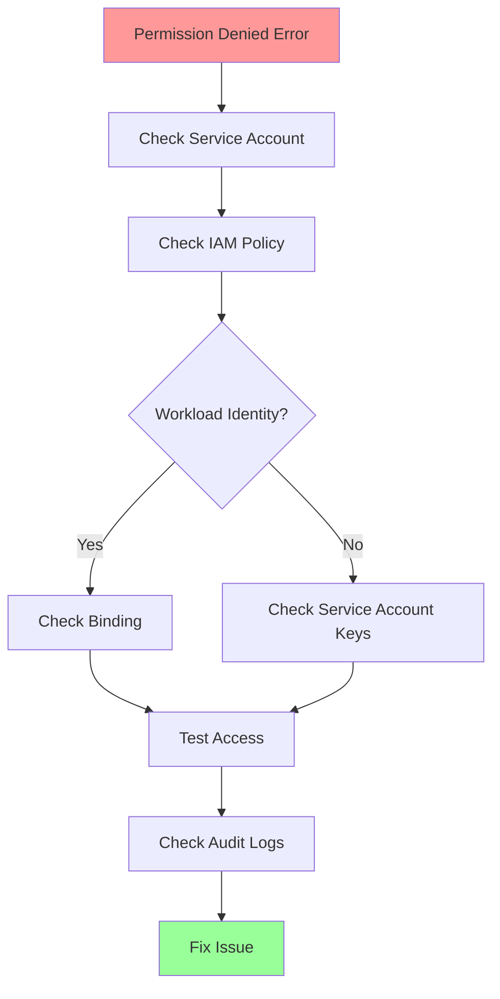

# Answer Key: IAM Evaluation Model

[Back to Exercises](../../03-gcp-core-building-blocks/iam-evaluation.md#exercises)

---

## Exercise 1: Design IAM Policies

**Question**: Design IAM policies for a multi-tier application. Who can access what? What roles do you use?

### Answer

**Architecture**: Web tier → App tier → Database tier

### IAM Policy Design

**1. Service Accounts**

**Web Tier Service Account** (`web-tier-sa@project.iam.gserviceaccount.com`):
- **Purpose**: Identity for web tier (load balancers, web servers)
- **Permissions**: Minimal (only what's needed)

**App Tier Service Account** (`app-tier-sa@project.iam.gserviceaccount.com`):
- **Purpose**: Identity for app tier (application servers)
- **Permissions**: Access to databases, storage, Pub/Sub

**Database Service Account** (`db-sa@project.iam.gserviceaccount.com`):
- **Purpose**: Identity for database operations
- **Permissions**: Database access only

**2. IAM Roles**

**Web Tier**:
- **Role**: `roles/compute.instanceAdmin` (if managing instances)
- **Or**: Custom role with minimal permissions
- **Principle**: Least privilege

**App Tier**:
- **Role**: `roles/cloudsql.client` (access Cloud SQL)
- **Role**: `roles/storage.objectViewer` (read from Cloud Storage)
- **Role**: `roles/pubsub.publisher` (publish to Pub/Sub)
- **Custom role**: Combine permissions into custom role

**Database**:
- **Role**: `roles/cloudsql.instanceUser` (if using Cloud SQL)
- **Or**: Database-specific roles (not IAM)

**3. User Access**

**Developers**:
- **Role**: `roles/viewer` (read-only access)
- **Scope**: Project-level
- **Purpose**: View resources, read logs

**DevOps Engineers**:
- **Role**: `roles/editor` (read and write)
- **Scope**: Project-level
- **Purpose**: Deploy, manage infrastructure

**Admins**:
- **Role**: `roles/owner` (full access)
- **Scope**: Project-level
- **Purpose**: Full control (use sparingly)

**4. Resource-Level Policies**

**Cloud Storage Bucket**:
- **App tier service account**: `roles/storage.objectViewer` (read)
- **DevOps**: `roles/storage.objectAdmin` (read/write)
- **Developers**: `roles/storage.objectViewer` (read)

**Pub/Sub Topics**:
- **App tier service account**: `roles/pubsub.publisher` (publish)
- **Consumers**: `roles/pubsub.subscriber` (subscribe)

**Cloud SQL**:
- **App tier service account**: `roles/cloudsql.client` (connect)
- **DevOps**: `roles/cloudsql.admin` (manage)

### Complete IAM Policy Structure



### Policy Bindings

**Project-level**:
```yaml
bindings:
  - role: roles/viewer
    members:
      - group:developers@company.com
  - role: roles/editor
    members:
      - group:devops@company.com
  - role: roles/owner
    members:
      - user:admin@company.com
```

**Service Account-level**:
```yaml
# App tier service account
bindings:
  - role: roles/cloudsql.client
    members:
      - serviceAccount:app-tier-sa@project.iam.gserviceaccount.com
  - role: roles/storage.objectViewer
    members:
      - serviceAccount:app-tier-sa@project.iam.gserviceaccount.com
  - role: roles/pubsub.publisher
    members:
      - serviceAccount:app-tier-sa@project.iam.gserviceaccount.com
```

**Resource-level** (Cloud Storage bucket):
```yaml
bindings:
  - role: roles/storage.objectViewer
    members:
      - serviceAccount:app-tier-sa@project.iam.gserviceaccount.com
      - group:developers@company.com
  - role: roles/storage.objectAdmin
    members:
      - group:devops@company.com
```

### Answer

**IAM Policy Design**:

**Service Accounts**:
1. **Web tier SA**: Minimal permissions (only what's needed)
2. **App tier SA**: `roles/cloudsql.client`, `roles/storage.objectViewer`, `roles/pubsub.publisher`
3. **Database SA**: Database access only

**User Roles**:
1. **Developers**: `roles/viewer` (read-only)
2. **DevOps**: `roles/editor` (read/write)
3. **Admins**: `roles/owner` (full access, use sparingly)

**Resource-Level Policies**:
- **Cloud Storage**: App tier SA can read, DevOps can read/write
- **Pub/Sub**: App tier SA can publish, consumers can subscribe
- **Cloud SQL**: App tier SA can connect, DevOps can manage

**Key principles**:
- **Least privilege**: Grant minimum necessary permissions
- **Service accounts**: Use service accounts for applications
- **Resource-level**: Use resource-level policies for fine-grained control
- **Separation of concerns**: Different roles for different tiers

---

## Exercise 2: Service Account Strategy

**Question**: You're deploying a GKE application that needs to access Cloud Storage. Do you use service account keys or workload identity? Why?

### Answer

**Goal**: Securely allow GKE pods to access Cloud Storage.

### Comparison

**Service Account Keys**:
- **How**: Store service account key file in pod (secret)
- **Pros**: Works everywhere, simple
- **Cons**: Key management, security risk, rotation complexity
- **Use case**: Non-GKE environments, legacy systems

**Workload Identity**:
- **How**: Map Kubernetes service account to GCP service account
- **Pros**: No keys, more secure, automatic rotation, better audit
- **Cons**: GKE only, more complex setup
- **Use case**: GKE applications (recommended)

### Analysis

**For GKE application**: **Use Workload Identity**

**Why**:
1. **No keys**: No service account keys to manage
2. **More secure**: Keys can't be leaked or stolen
3. **Automatic**: GKE handles authentication automatically
4. **Better audit**: Better audit trail in Cloud Audit Logs
5. **Easier rotation**: No manual key rotation needed

**Service Account Keys Issues**:
- **Key storage**: Keys stored in Kubernetes secrets (can be leaked)
- **Key rotation**: Manual rotation required (complex)
- **Security risk**: Keys can be stolen or misused
- **Audit**: Harder to track key usage

### Implementation

**Workload Identity Setup**:

1. **Enable Workload Identity**:
```bash
gcloud container clusters update CLUSTER_NAME \
    --workload-pool=PROJECT_ID.svc.id.goog
```

2. **Create GCP Service Account**:
```bash
gcloud iam service-accounts create app-sa \
    --display-name="App Service Account"
```

3. **Grant Permissions**:
```bash
gcloud projects add-iam-policy-binding PROJECT_ID \
    --member="serviceAccount:app-sa@PROJECT_ID.iam.gserviceaccount.com" \
    --role="roles/storage.objectViewer"
```

4. **Create Kubernetes Service Account**:
```yaml
apiVersion: v1
kind: ServiceAccount
metadata:
  name: app-ksa
  namespace: default
  annotations:
    iam.gke.io/gcp-service-account: app-sa@PROJECT_ID.iam.gserviceaccount.com
```

5. **Bind Kubernetes SA to GCP SA**:
```bash
gcloud iam service-accounts add-iam-policy-binding \
    app-sa@PROJECT_ID.iam.gserviceaccount.com \
    --role roles/iam.workloadIdentityUser \
    --member "serviceAccount:PROJECT_ID.svc.id.goog[default/app-ksa]"
```

6. **Use in Pod**:
```yaml
apiVersion: v1
kind: Pod
metadata:
  name: app-pod
spec:
  serviceAccountName: app-ksa
  containers:
  - name: app
    image: app-image
```

### Answer

**Use Workload Identity** for GKE applications.

**Why**:
1. **No keys**: No service account keys to manage or store
2. **More secure**: Keys can't be leaked or stolen
3. **Automatic**: GKE handles authentication automatically
4. **Better audit**: Better audit trail in Cloud Audit Logs
5. **Easier rotation**: No manual key rotation needed

**Service Account Keys Issues**:
- Keys stored in Kubernetes secrets (security risk)
- Manual rotation required (complex)
- Keys can be stolen or misused
- Harder to audit

**Implementation**:
1. Enable Workload Identity on GKE cluster
2. Create GCP service account with Cloud Storage permissions
3. Create Kubernetes service account with annotation
4. Bind Kubernetes SA to GCP SA
5. Use Kubernetes SA in pods

**Best practice**: Always use Workload Identity for GKE applications. Only use service account keys for non-GKE environments or legacy systems.

---

## Exercise 3: Debug Access Issue

**Question**: A service is getting "permission denied" errors accessing a bucket. How do you debug this?

### Answer

**Problem**: Service getting "permission denied" errors accessing Cloud Storage bucket.

### Debugging Steps

**1. Verify Service Account**

**Check service account identity**:
```bash
# In pod/container
curl -H "Metadata-Flavor: Google" \
  http://metadata.google.internal/computeMetadata/v1/instance/service-accounts/default/email
```

**Expected**: Should return service account email (e.g., `app-sa@project.iam.gserviceaccount.com`)

**If wrong**: Service account not configured correctly

**2. Check IAM Policy**

**Check service account permissions**:
```bash
gcloud projects get-iam-policy PROJECT_ID \
    --flatten="bindings[].members" \
    --filter="bindings.members:serviceAccount:app-sa@PROJECT_ID.iam.gserviceaccount.com"
```

**Check bucket-level permissions**:
```bash
gsutil iam get gs://BUCKET_NAME
```

**Expected**: Service account should have `roles/storage.objectViewer` or `roles/storage.objectAdmin`

**If missing**: Grant permissions

**3. Check Workload Identity (if GKE)**

**Verify Kubernetes service account**:
```bash
kubectl get serviceaccount app-ksa -o yaml
```

**Check annotation**:
```yaml
annotations:
  iam.gke.io/gcp-service-account: app-sa@PROJECT_ID.iam.gserviceaccount.com
```

**Verify binding**:
```bash
gcloud iam service-accounts get-iam-policy \
    app-sa@PROJECT_ID.iam.gserviceaccount.com
```

**Expected**: Should see binding to Kubernetes service account

**If missing**: Create binding

**4. Test Access**

**Test from pod**:
```bash
# In pod
gsutil ls gs://BUCKET_NAME
```

**Check error message**:
- "Permission denied": IAM issue
- "Bucket not found": Wrong bucket name or doesn't exist
- "Access denied": Bucket-level permissions issue

**5. Check Audit Logs**

**View Cloud Audit Logs**:
```bash
gcloud logging read "resource.type=cloud_storage_bucket AND \
  protoPayload.authenticationInfo.principalEmail=app-sa@PROJECT_ID.iam.gserviceaccount.com" \
  --limit 10
```

**Look for**:
- Permission denied errors
- Successful access (if working)
- Authentication failures

**6. Common Issues**

**Issue 1: Wrong Service Account**
- **Symptom**: Service using default compute service account
- **Fix**: Configure correct service account

**Issue 2: Missing Permissions**
- **Symptom**: Service account doesn't have bucket permissions
- **Fix**: Grant `roles/storage.objectViewer` or `roles/storage.objectAdmin`

**Issue 3: Workload Identity Not Configured**
- **Symptom**: GKE pod can't authenticate
- **Fix**: Enable Workload Identity and create binding

**Issue 4: Wrong Bucket**
- **Symptom**: Bucket doesn't exist or wrong name
- **Fix**: Verify bucket name and existence

**Issue 5: Bucket-Level Permissions**
- **Symptom**: Bucket has restrictive ACLs
- **Fix**: Check bucket IAM policy, grant access

### Debugging Checklist



### Answer

**Debugging steps**:

1. **Verify service account**: Check which service account is being used
2. **Check IAM policy**: Verify service account has bucket permissions
3. **Check Workload Identity** (if GKE): Verify Kubernetes SA → GCP SA binding
4. **Test access**: Try accessing bucket from pod/container
5. **Check audit logs**: Review Cloud Audit Logs for errors
6. **Common issues**: Wrong SA, missing permissions, Workload Identity not configured

**Commands**:
```bash
# Check service account
curl -H "Metadata-Flavor: Google" \
  http://metadata.google.internal/computeMetadata/v1/instance/service-accounts/default/email

# Check IAM policy
gcloud projects get-iam-policy PROJECT_ID \
    --flatten="bindings[].members" \
    --filter="bindings.members:serviceAccount:app-sa@PROJECT_ID.iam.gserviceaccount.com"

# Check bucket permissions
gsutil iam get gs://BUCKET_NAME

# Test access
gsutil ls gs://BUCKET_NAME

# Check audit logs
gcloud logging read "resource.type=cloud_storage_bucket AND \
  protoPayload.authenticationInfo.principalEmail=app-sa@PROJECT_ID.iam.gserviceaccount.com"
```

**Common fixes**:
- Grant `roles/storage.objectViewer` to service account
- Enable Workload Identity and create binding
- Verify bucket name and existence
- Check bucket-level IAM policy

