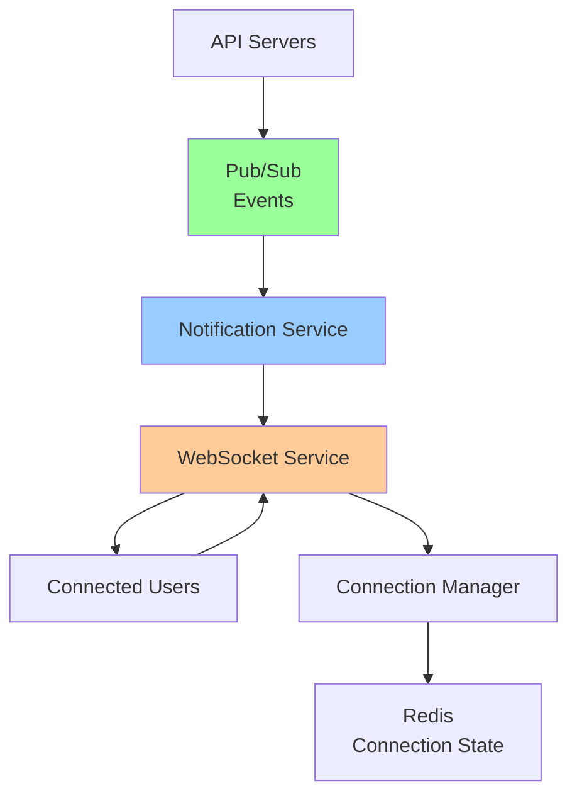

# Answer Key: Multi-Region API on GCP

[Back to Exercises](../../06-case-studies/multi-region-api.md#exercises)

---

## Exercise 1: Design Improvements

**Question**: How would you improve this design? What tradeoffs?

### Answer

**Current Design**: Multi-region API with Global Load Balancer, GKE, Spanner, Redis cache

### Potential Improvements

**1. Add CDN for Static Content**

**Improvement**: Use Cloud CDN for static assets (images, CSS, JS)

**Benefits**:
- Lower latency for static content
- Reduced origin load
- Lower bandwidth costs

**Tradeoffs**:
- Additional complexity
- Cache invalidation needed
- Additional cost

**2. Add Read Replicas**

**Improvement**: Use Spanner read replicas for read-heavy workloads

**Benefits**:
- Lower read latency (closer to users)
- Reduced load on primary database
- Better read scalability

**Tradeoffs**:
- Eventual consistency (reads may be stale)
- Additional cost
- More complex architecture

**3. Add Message Queue**

**Improvement**: Use Pub/Sub for async processing (already mentioned, but expand)

**Benefits**:
- Decouple components
- Better resilience
- Scalable processing

**Tradeoffs**:
- Eventual consistency
- More complex error handling
- Additional cost

**4. Add Circuit Breakers**

**Improvement**: Add circuit breakers for downstream services

**Benefits**:
- Prevent cascading failures
- Fail fast
- Better resilience

**Tradeoffs**:
- Additional complexity
- Need to handle circuit states
- May delay recovery

**5. Add Rate Limiting**

**Improvement**: Add rate limiting at load balancer or API gateway

**Benefits**:
- Prevent abuse
- Fair resource usage
- DDoS protection

**Tradeoffs**:
- May reject legitimate requests
- Additional complexity
- Need to tune limits

**6. Add Caching Layer**

**Improvement**: Expand caching strategy (already has Redis, but optimize)

**Benefits**:
- Lower latency
- Reduced database load
- Better scalability

**Tradeoffs**:
- Cache invalidation complexity
- Memory costs
- Stale data risk

**7. Add Monitoring and Observability**

**Improvement**: Enhanced monitoring (already mentioned, but expand)

**Benefits**:
- Better visibility
- Faster debugging
- Proactive issue detection

**Tradeoffs**:
- Additional cost
- More data to manage
- Alert fatigue risk

### Top 3 Improvements

**1. Add CDN** (High Impact, Low Complexity)
- Significant latency improvement for static content
- Relatively simple to implement
- Clear cost/benefit

**2. Add Read Replicas** (High Impact, Medium Complexity)
- Significant read performance improvement
- Moderate complexity
- Good for read-heavy workloads

**3. Add Circuit Breakers** (Medium Impact, Low Complexity)
- Better resilience
- Relatively simple to implement
- Prevents cascading failures

### Answer

**Design Improvements**:

**1. Add CDN**: Lower latency for static content, reduced origin load
**2. Add Read Replicas**: Better read performance, reduced database load
**3. Add Circuit Breakers**: Better resilience, prevent cascading failures
**4. Enhance Rate Limiting**: Better abuse prevention, DDoS protection
**5. Optimize Caching**: Better cache hit rates, reduced latency

**Top 3**:
1. **CDN** (high impact, low complexity)
2. **Read Replicas** (high impact, medium complexity)
3. **Circuit Breakers** (medium impact, low complexity)

**Tradeoffs**:
- **CDN**: Additional complexity, cache invalidation
- **Read Replicas**: Eventual consistency, additional cost
- **Circuit Breakers**: Additional complexity, circuit state management

---

## Exercise 2: Handle New Requirement

**Question**: Add support for real-time notifications. How does this change the architecture?

### Answer

**Requirement**: Real-time notifications to users

### Architecture Changes

**1. Add WebSocket Support**

**New Component**: WebSocket server for real-time connections

**Options**:
- **Option A**: Separate WebSocket service
- **Option B**: Add WebSocket support to existing API

**Recommendation**: Separate WebSocket service (better separation of concerns)

**2. Add Message Queue**

**New Component**: Pub/Sub for notification delivery

**Flow**:
1. Event occurs → Publish to Pub/Sub
2. WebSocket service subscribes to Pub/Sub
3. WebSocket service sends to connected clients

**3. Add Connection Management**

**New Component**: Connection manager for WebSocket connections

**Requirements**:
- Track connected users
- Handle reconnections
- Manage connection lifecycle

**4. Add Notification Service**

**New Component**: Notification service for sending notifications

**Responsibilities**:
- Receive events from Pub/Sub
- Look up connected users
- Send notifications via WebSocket

### Updated Architecture

### Implementation Details

**1. WebSocket Service**

**Deployment**: Separate GKE service

**Scaling**: Horizontal scaling based on connections

**Load Balancing**: Use Network Load Balancer (WebSocket support)

**2. Connection Manager**

**Storage**: Redis for connection state

**Data Structure**:
- `user:{user_id}` → `{connection_id, region, timestamp}`
- `connection:{connection_id}` → `{user_id, region, timestamp}`

**3. Notification Flow**

**Process**:
1. Event occurs in API
2. API publishes to Pub/Sub topic `user-notifications`
3. Notification service subscribes to topic
4. Notification service looks up user connections in Redis
5. Notification service sends to WebSocket service
6. WebSocket service delivers to user

**4. Multi-Region Considerations**

**Challenge**: User connected in one region, event in another

**Solution**:
- **Option A**: Global Pub/Sub, regional WebSocket services
- **Option B**: Regional Pub/Sub, cross-region notification routing

**Recommendation**: Global Pub/Sub, regional WebSocket services

### Answer

**Architecture Changes**:

**New Components**:
1. **WebSocket Service**: Handles real-time connections
2. **Notification Service**: Processes notifications from Pub/Sub
3. **Connection Manager**: Tracks user connections (Redis)
4. **Pub/Sub Topic**: `user-notifications` for event delivery

**Flow**:
1. Event → Pub/Sub → Notification Service → WebSocket Service → User
2. Connection state stored in Redis
3. Multi-region: Global Pub/Sub, regional WebSocket services

**Changes to Existing**:
- **API**: Publish events to Pub/Sub
- **Load Balancer**: Add WebSocket support (Network LB)
- **Redis**: Store connection state

**Key Considerations**:
- **Scaling**: WebSocket service scales with connections
- **Multi-region**: Handle cross-region notifications
- **Reconnection**: Handle connection failures gracefully
- **Delivery guarantees**: At-least-once delivery

---

## Exercise 3: Cost Optimization

**Question**: How would you reduce costs by 30%? What tradeoffs?

### Answer

**Current Cost**: ~$18,000/month
**Target**: ~$12,600/month (30% reduction)

### Cost Optimization Strategies

**1. Right-Size Instances** (Savings: ~20%)

**Current**: May be over-provisioned

**Optimization**:
- Analyze actual resource usage
- Use smaller instance types where possible
- Use committed use discounts (1-year or 3-year)

**Savings**: ~$3,600/month

**Tradeoffs**:
- Less headroom for spikes
- Need to monitor capacity closely
- May need to scale more frequently

**2. Optimize Spanner** (Savings: ~15%)

**Current**: Multi-region Spanner (expensive)

**Optimization**:
- Use regional Spanner (if multi-region not needed)
- Optimize queries (reduce reads)
- Use read replicas instead of multi-region
- Archive old data to cheaper storage

**Savings**: ~$1,500/month

**Tradeoffs**:
- Regional Spanner: Less resilience
- Read replicas: Eventual consistency
- Archive: Slower access to old data

**3. Optimize Caching** (Savings: ~10%)

**Current**: Redis cache per region

**Optimization**:
- Increase cache hit rate (reduce cache misses)
- Use smaller cache instances
- Use Cloud Memorystore standard tier (not premium)

**Savings**: ~$200/month

**Tradeoffs**:
- Lower cache hit rate: More database load
- Smaller cache: More evictions
- Standard tier: Lower performance

**4. Optimize Load Balancer** (Savings: ~5%)

**Current**: Global HTTP(S) Load Balancer

**Optimization**:
- Use regional load balancer (if global not needed)
- Optimize SSL certificate management
- Reduce unnecessary routing rules

**Savings**: ~$100/month

**Tradeoffs**:
- Regional LB: Less global distribution
- May increase latency for some users

**5. Optimize GKE** (Savings: ~10%)

**Current**: GKE with auto-scaling

**Optimization**:
- Use preemptible instances (for non-critical workloads)
- Optimize pod resource requests
- Use node auto-provisioning
- Right-size node pools

**Savings**: ~$500/month

**Tradeoffs**:
- Preemptible: Less reliable (may be terminated)
- Need to handle interruptions gracefully

**6. Optimize Storage** (Savings: ~5%)

**Current**: Standard storage classes

**Optimization**:
- Use Nearline/Coldline for less accessed data
- Lifecycle policies to move old data
- Compress data

**Savings**: ~$100/month

**Tradeoffs**:
- Nearline/Coldline: Higher access costs
- Slower access to archived data

### Combined Savings

**Total**: ~$6,000/month (33% reduction)

**Breakdown**:
- Right-sizing: $3,600
- Spanner optimization: $1,500
- GKE optimization: $500
- Caching optimization: $200
- Load balancer: $100
- Storage: $100

### Answer

**Cost Optimization Strategies** (30% reduction):

**1. Right-Size Instances** (20% savings):
- Analyze usage, use smaller instances, committed use discounts
- Tradeoff: Less headroom, need closer monitoring

**2. Optimize Spanner** (15% savings):
- Use regional Spanner, optimize queries, archive old data
- Tradeoff: Less resilience, eventual consistency

**3. Optimize GKE** (10% savings):
- Use preemptible instances, optimize resource requests
- Tradeoff: Less reliable, need interruption handling

**4. Optimize Caching** (10% savings):
- Increase hit rate, use smaller instances
- Tradeoff: More database load

**5. Optimize Load Balancer** (5% savings):
- Use regional LB if global not needed
- Tradeoff: Less global distribution

**Total Savings**: ~33% ($6,000/month)

**Key Tradeoffs**:
- **Reliability**: Some optimizations reduce resilience
- **Performance**: Some optimizations reduce performance
- **Complexity**: Some optimizations add complexity

**Recommendation**: Focus on right-sizing and Spanner optimization first (biggest savings, manageable tradeoffs).

---

## Exercise 4: Disaster Recovery

**Question**: Design a disaster recovery plan. What's the RTO? RPO?

### Answer

**Goal**: Recover from disasters with minimal data loss and downtime

### Disaster Scenarios

**1. Single Region Failure**

**Scenario**: One region (e.g., us-central1) completely fails

**Impact**: 33% of users affected

**Recovery**: 
- Load balancer routes to other regions
- Auto-scaling scales up other regions
- **RTO**: < 5 minutes (automatic)
- **RPO**: 0 (no data loss, Spanner multi-region)

**2. Database Failure**

**Scenario**: Spanner becomes unavailable

**Impact**: All regions, all users

**Recovery**:
- Spanner has automatic failover (multi-region)
- Failover takes ~30 seconds
- **RTO**: < 1 minute (automatic)
- **RPO**: 0 (no data loss, synchronous replication)

**3. Complete GCP Failure**

**Scenario**: Entire GCP region fails (unlikely but possible)

**Impact**: All services in region

**Recovery**:
- Failover to other regions
- Restore from backups if needed
- **RTO**: < 15 minutes (manual intervention)
- **RPO**: < 5 minutes (depends on backup frequency)

**4. Data Corruption**

**Scenario**: Data corrupted (bug, malicious attack)

**Impact**: Data integrity compromised

**Recovery**:
- Restore from backups
- Point-in-time recovery
- **RTO**: < 1 hour (restore time)
- **RPO**: < 15 minutes (backup frequency)

### Disaster Recovery Plan

**1. Backup Strategy**

**Spanner Backups**:
- **Frequency**: Every 6 hours
- **Retention**: 30 days
- **Location**: Multi-region (backup in different region)
- **Type**: Point-in-time recovery

**Application Backups**:
- **Configuration**: Version controlled (Git)
- **Secrets**: Stored in Secret Manager
- **Infrastructure**: Infrastructure as Code (Terraform)

**2. Failover Procedures**

**Automatic Failover**:
- **Load Balancer**: Automatic (health checks)
- **Spanner**: Automatic (multi-region)
- **GKE**: Automatic (multi-region deployment)

**Manual Failover**:
- **Complete region failure**: Manual DNS update, scale other regions
- **Data corruption**: Manual restore from backups

**3. Recovery Procedures**

**Single Region Failure**:
1. Load balancer automatically routes away
2. Scale up other regions
3. Monitor recovery
4. Investigate root cause

**Database Failure**:
1. Spanner automatically fails over
2. Verify data consistency
3. Monitor performance
4. Investigate root cause

**Complete Failure**:
1. Activate disaster recovery runbook
2. Failover DNS to backup region
3. Scale up backup region
4. Restore from backups if needed
5. Verify functionality
6. Postmortem

**4. Testing**

**Disaster Recovery Testing**:
- **Frequency**: Quarterly
- **Scenarios**: Single region failure, database failure
- **Process**: Simulate failures, verify recovery
- **Documentation**: Update runbooks based on tests

### RTO and RPO

**RTO (Recovery Time Objective)**:

| Scenario | RTO | Method |
|----------|-----|--------|
| Single region failure | < 5 minutes | Automatic (load balancer) |
| Database failure | < 1 minute | Automatic (Spanner failover) |
| Complete failure | < 15 minutes | Manual (DNS, scaling) |
| Data corruption | < 1 hour | Manual (restore from backup) |

**RPO (Recovery Point Objective)**:

| Scenario | RPO | Method |
|----------|-----|--------|
| Single region failure | 0 | Multi-region Spanner |
| Database failure | 0 | Synchronous replication |
| Complete failure | < 5 minutes | Backup frequency |
| Data corruption | < 15 minutes | Point-in-time recovery |

### Answer

**Disaster Recovery Plan**:

**Backup Strategy**:
- Spanner: Every 6 hours, 30-day retention, multi-region
- Application: Version controlled, Infrastructure as Code

**Failover Procedures**:
- **Automatic**: Load balancer, Spanner, GKE
- **Manual**: Complete region failure, data corruption

**Recovery Procedures**:
- Single region: Automatic failover, scale other regions
- Database: Automatic Spanner failover
- Complete failure: Manual DNS update, restore from backups

**RTO (Recovery Time Objective)**:
- Single region: < 5 minutes (automatic)
- Database: < 1 minute (automatic)
- Complete failure: < 15 minutes (manual)
- Data corruption: < 1 hour (manual restore)

**RPO (Recovery Point Objective)**:
- Single region: 0 (multi-region Spanner)
- Database: 0 (synchronous replication)
- Complete failure: < 5 minutes (backup frequency)
- Data corruption: < 15 minutes (point-in-time recovery)

**Testing**: Quarterly disaster recovery tests

**Key Principles**:
- **Automate where possible**: Automatic failover for common scenarios
- **Test regularly**: Quarterly DR tests
- **Document procedures**: Clear runbooks for manual procedures
- **Monitor recovery**: Track RTO and RPO metrics

