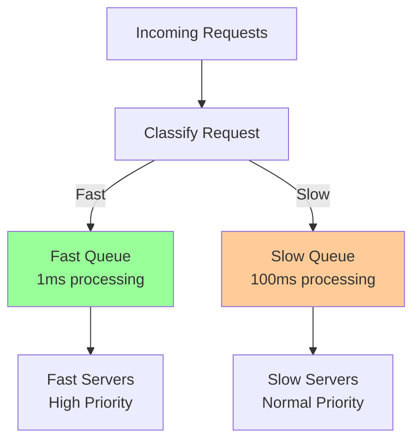

# Answer Key: Queueing Theory & Tail Latency

[Back to Exercises](../../01-foundations/queueing-tail-latency.md#exercises)

---

## Exercise 1: Calculate Capacity

**Question**: Given arrival rate of 1000 req/s, processing time of 20ms, target P99 of 200ms, how many servers do you need?

### Answer

**Given**:
- Arrival rate (λ) = 1000 requests/second
- Processing time = 20ms = 0.02 seconds
- Target P99 latency = 200ms = 0.2 seconds

**Approach**:
1. Calculate service rate per server: μ = 1 / processing_time = 1 / 0.02 = 50 requests/second
2. For P99 latency, we need to account for queueing delay
3. Target total time = 200ms = processing_time + queue_wait_time
4. Max queue wait time = 200ms - 20ms = 180ms = 0.18 seconds

**Using queueing theory**:
- For M/M/k queue, we need to find k (number of servers) such that P99 wait time ≤ 0.18s
- Utilization per server: ρ = λ/(k×μ) = 1000/(k×50) = 20/k
- We need ρ < 1, so k > 20

**Approximation**:
- For low queueing delay, we want utilization around 70-80%
- At 70% utilization: k = 20/0.7 ≈ 29 servers
- At 80% utilization: k = 20/0.8 = 25 servers

**More precise calculation**:
- Using Erlang C formula or simulation, for P99 wait time < 180ms:
- Need approximately **30-35 servers** to meet P99 < 200ms target

**Answer**: **30-35 servers** (with 30% headroom for safety)

**Key insights**:
- Queueing delay dominates tail latency
- Need significant headroom to meet P99 targets
- Utilization must be kept low (70-80%) for good tail latency

---

## Exercise 2: Analyze Latency Distribution

**Question**: Given P50=10ms, P95=50ms, P99=200ms, what can you infer about the system?

### Answer

**Given**:
- P50 (median) = 10ms
- P95 = 50ms
- P99 = 200ms

### Analysis

**1. Tail Latency Ratio**:
- P99/P50 = 200/10 = 20×
- P95/P50 = 50/10 = 5×

**Inference**: Very high tail latency ratio indicates:
- Significant queueing delay
- High variability in request processing
- Possible head-of-line blocking
- Resource contention issues

**2. Latency Distribution**:
- **P50 = 10ms**: Typical requests are fast (likely cache hits or simple operations)
- **P95 = 50ms**: 5% of requests take 5× longer (likely cache misses, database queries)
- **P99 = 200ms**: 1% of requests take 20× longer (likely complex operations, queueing, or failures)

**3. System Characteristics**:
- **Fast path exists**: P50 is low, suggesting many requests are optimized
- **Slow path exists**: P99 is very high, suggesting some requests are expensive
- **High variability**: Large gap between P50 and P99 suggests inconsistent performance

**4. Likely Causes**:
- **Head-of-line blocking**: Slow requests blocking fast ones
- **Cache misses**: Some requests miss cache and hit database
- **Queueing**: Requests waiting in queue during bursts
- **Resource contention**: CPU, memory, or I/O contention
- **Long-tail operations**: Some requests inherently slow (complex queries, large payloads)

**5. Recommendations**:
- **Separate fast and slow paths**: Use different queues or priorities
- **Improve cache hit rate**: Reduce cache misses
- **Optimize slow operations**: Identify and optimize P99 operations
- **Add capacity**: Reduce queueing delay
- **Implement request prioritization**: Prioritize fast requests

**Answer**: The system has **high tail latency variability** with a **20× ratio** between P50 and P99, indicating:
- Fast path exists (P50 = 10ms)
- Slow path exists (P99 = 200ms)
- Likely causes: head-of-line blocking, cache misses, queueing, resource contention
- Recommendations: separate fast/slow paths, improve caching, optimize slow operations

---

## Exercise 3: Design Queueing Strategy

**Question**: Design a system that handles both fast (1ms) and slow (100ms) requests without head-of-line blocking.

### Answer

**Problem**: Head-of-line blocking occurs when slow requests block fast ones in a single queue.

**Solution**: Separate queues for fast and slow requests.

### Design

**1. Request Classification**:
- **Fast requests**: Simple operations, cache hits, reads (1ms)
- **Slow requests**: Complex operations, cache misses, writes (100ms)

**Classification methods**:
- **Endpoint-based**: Different endpoints for fast/slow operations
- **Request type**: Read vs write, simple vs complex
- **Estimated time**: Classify based on operation type
- **Dynamic**: Measure request time, route to appropriate queue

**2. Queue Architecture**:

**3. Server Allocation**:
- **Fast servers**: Dedicated servers for fast requests (high priority)
- **Slow servers**: Dedicated servers for slow requests (normal priority)
- **Ratio**: Allocate more servers to fast queue (since fast requests are more common)

**4. Priority Scheduling**:
- **Fast queue**: Higher priority, processed first
- **Slow queue**: Lower priority, processed when fast queue is empty
- **Preemption**: Fast requests can preempt slow ones (if possible)

**5. Implementation Strategies**:

**Option A: Separate Queues + Servers**
- Two separate queues
- Dedicated server pools
- **Pros**: Complete isolation, no blocking
- **Cons**: Resource overhead, complex routing

**Option B: Priority Queue**
- Single queue with priorities
- Fast requests have higher priority
- **Pros**: Simpler, efficient resource use
- **Cons**: May still have some blocking

**Option C: Work Stealing**
- Servers process from fast queue first
- Steal from slow queue when fast queue empty
- **Pros**: Efficient resource utilization
- **Cons**: More complex implementation

**6. Monitoring**:
- Track queue depth for each queue
- Monitor latency separately for fast/slow requests
- Alert on queue depth or latency thresholds

**Answer**: **Separate queues with priority scheduling**:
1. **Classify requests** into fast (1ms) and slow (100ms)
2. **Separate queues**: Fast queue (high priority) and slow queue (normal priority)
3. **Dedicated servers**: More servers for fast queue
4. **Priority scheduling**: Process fast queue first, then slow queue
5. **Monitor separately**: Track metrics for each queue independently

**Benefits**:
- No head-of-line blocking
- Fast requests get low latency
- Slow requests don't block fast ones
- Better resource utilization

**Tradeoffs**:
- More complex architecture
- Need request classification
- Resource allocation decisions

