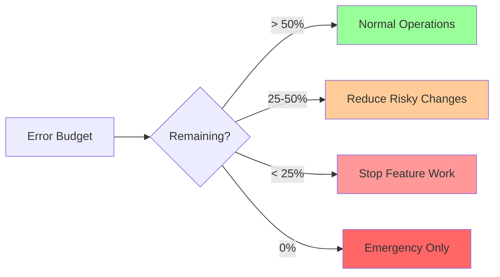
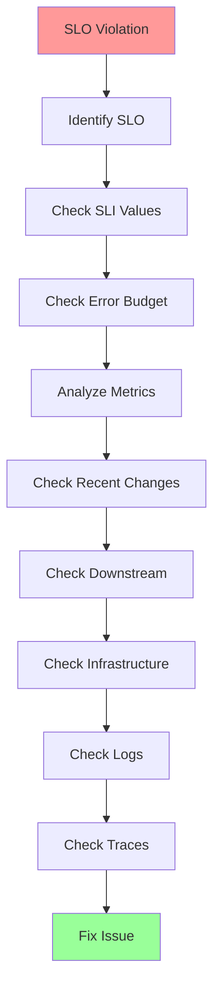

# Answer Key: SLIs, SLOs & Error Budgets

[Back to Exercises](../../04-reliability-sre/sli-slo-error-budget.md#exercises)

---

## Exercise 1: Define SLIs/SLOs

**Question**: Define SLIs and SLOs for an API service. What metrics do you use? What targets?

### Answer

**Service**: REST API for user data management

### SLIs (Service Level Indicators)

**1. Availability SLI**

**Definition**: Fraction of successful HTTP requests (2xx, 3xx status codes)

**Measurement**:
- Count successful requests / total requests
- Measured over 1-minute windows
- Aggregated over 30-day period

**Formula**: `availability = successful_requests / total_requests`

**2. Latency SLI**

**Definition**: Request latency percentiles (P50, P95, P99)

**Measurement**:
- Time from request received to response sent
- Measured in milliseconds
- Tracked as percentiles

**Percentiles**:
- P50 (median): Typical user experience
- P95: 95% of users experience this or better
- P99: 99% of users experience this or better

**3. Error Rate SLI**

**Definition**: Fraction of requests returning 5xx errors

**Measurement**:
- Count of 5xx errors / total requests
- Measured over 1-minute windows
- Aggregated over 30-day period

**Formula**: `error_rate = 5xx_errors / total_requests`

**4. Throughput SLI** (Optional)

**Definition**: Requests processed per second

**Measurement**:
- Count requests per second
- Tracked as average and peak

### SLOs (Service Level Objectives)

**1. Availability SLO**

**Target**: 99.9% availability

**Meaning**: 99.9% of requests succeed

**Error budget**: 0.1% = 43.2 minutes/month

**2. Latency SLO**

**Targets**:
- P50 latency < 50ms
- P95 latency < 100ms
- P99 latency < 200ms

**Meaning**: 
- 50% of requests complete in < 50ms
- 95% of requests complete in < 100ms
- 99% of requests complete in < 200ms

**Error budget**: > threshold for > 0.1% of requests

**3. Error Rate SLO**

**Target**: < 0.1% error rate

**Meaning**: < 0.1% of requests return 5xx errors

**Error budget**: > 0.1% for > 0.1% of requests

### Complete SLI/SLO Definition

| SLI | Definition | SLO Target | Error Budget |
|-----|------------|------------|--------------|
| Availability | Fraction of successful requests | 99.9% | 0.1% = 43.2 min/month |
| P50 Latency | Median request latency | < 50ms | > 50ms for > 0.1% requests |
| P95 Latency | 95th percentile latency | < 100ms | > 100ms for > 0.1% requests |
| P99 Latency | 99th percentile latency | < 200ms | > 200ms for > 0.1% requests |
| Error Rate | Fraction of 5xx errors | < 0.1% | > 0.1% for > 0.1% requests |

### Answer

**SLIs**:
1. **Availability**: Fraction of successful requests (2xx, 3xx)
2. **Latency**: P50, P95, P99 request latency
3. **Error Rate**: Fraction of 5xx errors
4. **Throughput**: Requests per second (optional)

**SLOs**:
1. **Availability**: 99.9% (0.1% error budget = 43.2 min/month)
2. **P50 Latency**: < 50ms
3. **P95 Latency**: < 100ms
4. **P99 Latency**: < 200ms
5. **Error Rate**: < 0.1%

**Key principles**:
- **User-facing**: SLIs measure what users experience
- **Measurable**: Can be measured accurately
- **Actionable**: Changes when system behavior changes
- **Realistic**: SLOs are achievable based on baseline

---

## Exercise 2: Error Budget Policy

**Question**: Design an error budget policy. What happens at 50%? 25%? 0%?

### Answer

**Goal**: Define actions when error budget is consumed.

### Error Budget Policy

**Error Budget**: 0.1% = 43.2 minutes/month (for 99.9% availability SLO)

**Policy Tiers**:

**1. > 50% Remaining (Normal Operations)**

**Status**: Green

**Actions**:
- Normal operations
- Can ship new features
- Can make risky changes
- Monitor error budget consumption

**Threshold**: > 50% remaining (> 21.6 minutes)

**2. 25-50% Remaining (Warning)**

**Status**: Yellow

**Actions**:
- **Reduce risky changes**: Avoid risky deployments
- **Increase monitoring**: Monitor more closely
- **Review changes**: Review all changes before deployment
- **Focus on reliability**: Start focusing on reliability improvements
- **Can ship features**: Can still ship low-risk features

**Threshold**: 25-50% remaining (10.8-21.6 minutes)

**3. < 25% Remaining (Critical)**

**Status**: Orange

**Actions**:
- **Stop feature work**: No new features, only bug fixes
- **Focus on reliability**: All work focused on reliability
- **Freeze changes**: Freeze non-critical changes
- **Emergency fixes only**: Only critical bug fixes
- **Daily reviews**: Daily error budget reviews

**Threshold**: < 25% remaining (< 10.8 minutes)

**4. 0% Remaining (Emergency)**

**Status**: Red

**Actions**:
- **Emergency reliability only**: Only reliability work, no features
- **Stop all changes**: Freeze all changes except emergency fixes
- **Incident response**: Treat as incident, full incident response
- **Daily standups**: Daily standups on error budget recovery
- **Escalation**: Escalate to management

**Threshold**: 0% remaining (0 minutes)

**5. Budget Exhausted (Negative)**

**Status**: Critical

**Actions**:
- **Emergency mode**: Full emergency response
- **All hands**: All engineers focused on reliability
- **No changes**: No changes except emergency fixes
- **Postmortem**: Postmortem on budget exhaustion
- **Recovery plan**: Create recovery plan

**Threshold**: < 0% (negative budget)

### Policy Implementation

### Monitoring & Alerts

**Alerts**:
- **Warning**: Error budget < 50% (alert team)
- **Critical**: Error budget < 25% (page on-call)
- **Emergency**: Error budget < 0% (page on-call + escalation)

**Dashboards**:
- Error budget remaining
- Error budget burn rate
- Projected exhaustion date
- Policy status

### Answer

**Error Budget Policy**:

**> 50% Remaining (Green)**:
- Normal operations
- Can ship features
- Monitor consumption

**25-50% Remaining (Yellow)**:
- Reduce risky changes
- Increase monitoring
- Review changes before deployment
- Can ship low-risk features

**< 25% Remaining (Orange)**:
- Stop feature work
- Focus on reliability
- Freeze non-critical changes
- Emergency fixes only
- Daily reviews

**0% Remaining (Red)**:
- Emergency reliability only
- Stop all changes
- Incident response
- Daily standups
- Escalation

**< 0% (Critical)**:
- Emergency mode
- All hands on reliability
- No changes except emergency fixes
- Postmortem required
- Recovery plan

**Key principles**:
- **Gradual escalation**: More restrictions as budget decreases
- **Clear thresholds**: Well-defined thresholds for each tier
- **Actionable**: Clear actions for each tier
- **Monitoring**: Alerts and dashboards for visibility

---

## Exercise 3: Debug SLO Violation

**Question**: An SLO is being violated. How do you debug? What do you check?

### Answer

**Problem**: SLO violation detected (e.g., availability < 99.9%)

### Debugging Steps

**1. Identify Which SLO is Violated**

**Check SLO dashboard**:
- Which SLO? (Availability, Latency, Error Rate)
- When did violation start?
- How severe is violation?

**2. Check SLI Values**

**Verify SLI measurement**:
- Are SLIs being measured correctly?
- Are metrics accurate?
- Are there measurement issues?

**3. Check Error Budget**

**Error budget status**:
- How much budget consumed?
- What's the burn rate?
- When will budget be exhausted?

**4. Analyze Metrics**

**Availability violation**:
- Check error rate: Are errors increasing?
- Check error types: What types of errors?
- Check endpoints: Which endpoints failing?
- Check regions: Which regions affected?

**Latency violation**:
- Check P50, P95, P99: Which percentile violated?
- Check endpoints: Which endpoints slow?
- Check regions: Which regions slow?
- Check database: Is database slow?
- Check cache: Is cache hit rate low?

**Error rate violation**:
- Check error types: What errors?
- Check endpoints: Which endpoints erroring?
- Check regions: Which regions erroring?
- Check downstream: Are downstream services failing?

**5. Check Recent Changes**

**Deployment history**:
- Recent deployments?
- Recent configuration changes?
- Recent feature flags?
- Recent infrastructure changes?

**6. Check Downstream Services**

**Dependencies**:
- Are downstream services healthy?
- Are databases healthy?
- Are caches healthy?
- Are external APIs healthy?

**7. Check Infrastructure**

**Infrastructure health**:
- Are servers healthy?
- Are load balancers healthy?
- Is network healthy?
- Are there capacity issues?

**8. Check Logs**

**Application logs**:
- Error logs: What errors?
- Performance logs: Slow requests?
- Access logs: Unusual patterns?

**9. Check Traces**

**Distributed traces**:
- Slow spans: Which operations slow?
- Error spans: Which operations erroring?
- Bottlenecks: Where are bottlenecks?

**10. Check Alerts**

**Related alerts**:
- Other alerts firing?
- Related incidents?
- Known issues?

### Debugging Checklist

### Common Root Causes

**Availability violations**:
- Downstream service failures
- Database failures
- Infrastructure failures
- Buggy deployments
- Configuration errors

**Latency violations**:
- Database slow queries
- Cache misses
- Downstream service latency
- Resource contention
- Network issues

**Error rate violations**:
- Buggy code
- Downstream service errors
- Database errors
- Configuration errors
- Resource exhaustion

### Answer

**Debugging steps**:

1. **Identify SLO**: Which SLO violated? When? How severe?
2. **Check SLI values**: Verify SLI measurement accuracy
3. **Check error budget**: How much consumed? Burn rate?
4. **Analyze metrics**: Error rate, latency, endpoints, regions
5. **Check recent changes**: Deployments, configs, features
6. **Check downstream**: Database, cache, external APIs
7. **Check infrastructure**: Servers, load balancers, network
8. **Check logs**: Error logs, performance logs, access logs
9. **Check traces**: Slow spans, error spans, bottlenecks
10. **Check alerts**: Related alerts, incidents, known issues

**Key checks**:
- **Metrics**: Error rate, latency, endpoints, regions
- **Changes**: Recent deployments, configs, features
- **Dependencies**: Downstream services, databases, caches
- **Infrastructure**: Servers, load balancers, network
- **Observability**: Logs, traces, alerts

**Common causes**:
- Downstream failures
- Database issues
- Buggy deployments
- Resource exhaustion
- Configuration errors

