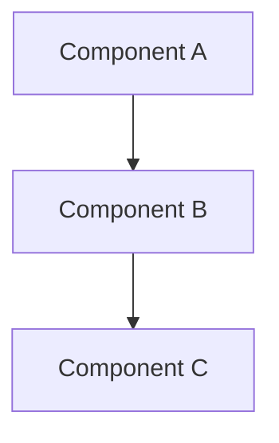

# Deep Dive Template

Use this template for creating staff-level deep dives on any topic.

## Title: [Topic Name]

**One-line summary**: [What is this and why does it matter?]

**Prerequisites**: [What should readers know before diving in?]

---

## Mental Model

**How to think about this system/concept**

- Core abstraction
- Key invariants
- Critical paths
- Data flow (if applicable)

**Diagram** (optional but recommended):

---

## Internals & Architecture

### High-Level Architecture
- Components and their responsibilities
- How components interact
- Critical paths and dependencies

### Implementation Details
- Key algorithms or protocols
- Data structures
- Consistency model (if applicable)
- Performance characteristics

### Design Decisions
- Why was it designed this way?
- What alternatives were considered?
- What constraints drove the design?

---

## Failure Modes & Blast Radius

### Failure Domains
- What can fail independently?
- How are failures isolated?
- What's the blast radius of each failure?

### Common Failure Scenarios
1. **Scenario**: [What fails]
   - **Impact**: [What breaks]
   - **Detection**: [How do we know?]
   - **Recovery**: [How do we fix it?]

2. **Scenario**: [Another failure]
   - ...

### Overload Behavior
- **10× normal load**: [What happens?]
- **100× normal load**: [What breaks?]
- **1000× normal load**: [Catastrophic failure?]

### Cascading Failures
- How can failures propagate?
- What prevents cascades?
- What makes cascades worse?

---

## Observability Contract

### Metrics to Track
- **Latency**: [What latency metrics? P50/P95/P99?]
- **Throughput**: [QPS? Bandwidth?]
- **Errors**: [Error rates? Error types?]
- **Resource usage**: [CPU? Memory? IOPS?]

### Logs
- What events should be logged?
- What log levels?
- What information is needed for debugging?

### Traces
- What operations should be traced?
- What spans are critical?
- How to correlate across services?

### Alerts
- What conditions require alerts?
- What's the alerting strategy?
- How to avoid alert fatigue?

---

## Change Safety

### Rollout Strategy
- How to deploy changes safely?
- Canary vs blue-green vs rolling?
- What's the rollout cadence?

### Rollback Plan
- How to detect bad changes?
- How to roll back quickly?
- What's the rollback procedure?

### Feature Flags
- What should be feature-flagged?
- How to control rollouts?
- How to kill switches work?

### Testing Strategy
- Unit tests?
- Integration tests?
- Chaos testing?
- Load testing?

---

## Security Boundaries

### Identity & Authentication
- Who can access this?
- How is identity verified?
- What authentication mechanisms?

### Authorization
- What permissions are needed?
- How is authorization checked?
- What's the principle of least privilege?

### Data Protection
- How is data encrypted (at rest? in transit?)?
- What's the key management strategy?
- How to prevent data exfiltration?

### Attack Surfaces
- What are the attack vectors?
- How are attacks mitigated?
- What's the security monitoring?

---

## Tradeoffs

### What We Gain
- [Benefit 1]
- [Benefit 2]

### What We Lose
- [Cost 1]
- [Cost 2]

### When to Use
- [Use case 1]
- [Use case 2]

### When NOT to Use
- [Anti-pattern 1]
- [Anti-pattern 2]

### Alternatives
- [Alternative 1]: [When to use instead]
- [Alternative 2]: [When to use instead]

---

## Operational Considerations

### Capacity Planning
- How to size the system?
- What are the scaling limits?
- How to forecast capacity needs?

### Monitoring & Debugging
- How to monitor health?
- How to debug issues?
- What tools are needed?

### Incident Response
- What are common incidents?
- What's the runbook?
- Who responds?

### Cost
- What are the cost drivers?
- How to optimize costs?
- What's the cost model?

---

## What Staff Engineers Ask in Reviews

### Design Questions
- "What's the failure domain?"
- "How do we detect failures?"
- "What's the blast radius?"
- "How do we roll back?"
- "What's the observability contract?"

### Scale Questions
- "What happens at 10× load?"
- "What are the bottlenecks?"
- "How does it degrade?"

### Security Questions
- "Who can access this?"
- "How is data protected?"
- "What's the attack surface?"

### Operational Questions
- "How do we monitor this?"
- "What's the runbook?"
- "How do we debug issues?"

---

## Further Reading

- [Related deep dives]
- [Papers]
- [Documentation]
- [Blog posts]

---

## Exercises

1. [Exercise 1: Apply concept to scenario]
2. [Exercise 2: Design a system using this]
3. [Exercise 3: Debug a failure scenario]

