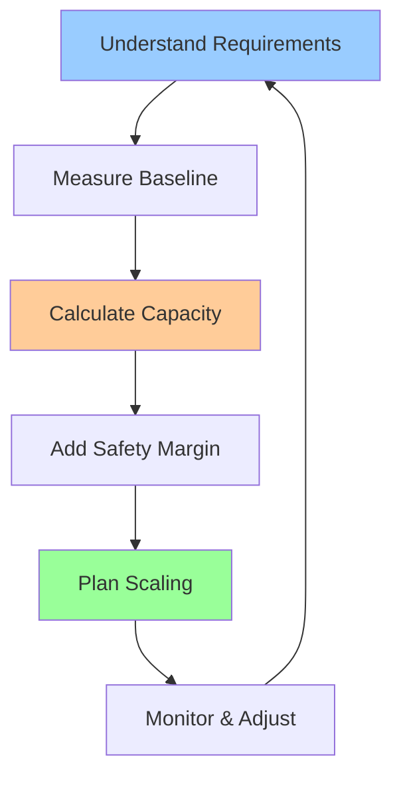
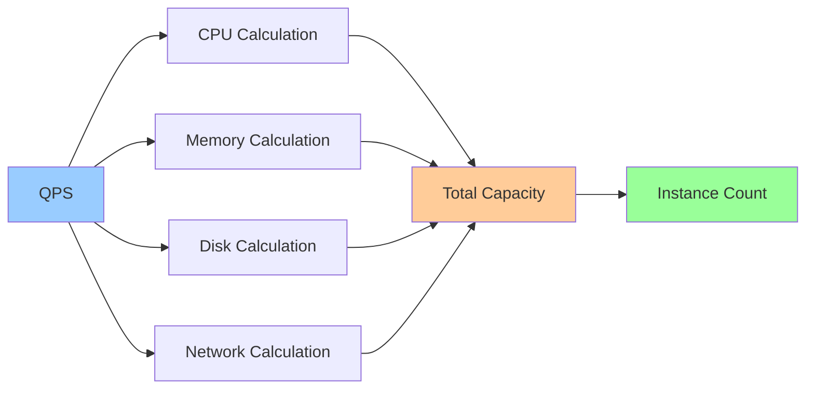

# Capacity Math Cheat Sheet

**One-line summary**: How to calculate CPU, memory, disk, and network capacity needs from requirements.

**Prerequisites**: Basic arithmetic, understanding of system resources.

---

## Mental Model

### Capacity Planning Process

1. **Understand requirements**: Latency, throughput, data volume
2. **Measure baseline**: Current resource usage per request
3. **Calculate capacity**: Resources needed for target load
4. **Add safety margin**: Buffer for spikes and growth
5. **Plan scaling**: How to scale as load grows

### Key Formula

**Total Capacity = (Requests/Second × Resources Per Request) × Safety Margin**

### Resource Calculation Flow

---

## CPU Capacity

### Calculating CPU Needs

**Formula**: `CPU Cores = (QPS × CPU Time Per Request) / Target Utilization`

**Example**:
- QPS: 1000 requests/second
- CPU time per request: 10ms = 0.01 seconds
- Target utilization: 70% (leave 30% headroom)
- CPU cores = (1000 × 0.01) / 0.7 = 14.3 cores → **15 cores**

### CPU Considerations

- **Single-threaded vs multi-threaded**: Multi-threaded can use more cores
- **CPU-bound vs I/O-bound**: I/O-bound may need more cores for concurrency
- **Context switching overhead**: Too many threads can hurt performance
- **NUMA**: Non-uniform memory access affects performance

### CPU Scaling

- **Vertical scaling**: Larger instances (more CPU per instance)
- **Horizontal scaling**: More instances (more total CPU)
- **Auto-scaling**: Scale based on CPU utilization

---

## Memory Capacity

### Calculating Memory Needs

**Formula**: `Memory = (QPS × Memory Per Request) + Base Memory + Cache`

**Components**:
1. **Per-request memory**: Memory used processing each request
2. **Base memory**: OS, runtime, application base
3. **Cache memory**: Data structures, caches

**Example**:
- QPS: 1000 requests/second
- Memory per request: 1MB (peak, not average)
- Base memory: 2GB
- Cache: 10GB
- **Total memory = (1000 × 1MB) + 2GB + 10GB = 13GB**

**Wait**: Per-request memory is peak, not cumulative. Need to account for concurrency.

**Better formula**: `Memory = (Concurrent Requests × Memory Per Request) + Base Memory + Cache`

**Example**:
- Concurrent requests: 100 (requests in flight)
- Memory per request: 1MB
- Base memory: 2GB
- Cache: 10GB
- **Total memory = (100 × 1MB) + 2GB + 10GB = 12.1GB**

### Memory Considerations

- **Peak vs average**: Use peak memory for capacity planning
- **Garbage collection**: GC overhead in managed languages
- **Memory leaks**: Monitor for gradual memory growth
- **Swap**: Avoid swap for performance-critical systems

### Memory Scaling

- **Vertical scaling**: Larger instances (more RAM)
- **Horizontal scaling**: More instances (distribute memory)
- **Cache scaling**: Separate cache layer (Redis, Memcached)

---

## Disk Capacity

### Calculating Disk Needs

**Formula**: `Disk = Data Volume + Logs + Temporary Files + Safety Margin`

**Components**:
1. **Data volume**: Persistent data storage
2. **Logs**: Application and system logs
3. **Temporary files**: Temp files, caches
4. **Safety margin**: Buffer for growth

**Example**:
- Data volume: 100GB
- Logs (30 days retention): 50GB
- Temporary files: 10GB
- Safety margin (20%): 32GB
- **Total disk = 192GB → 200GB**

### Disk I/O Capacity

**Formula**: `IOPS Needed = QPS × I/O Operations Per Request`

**Example**:
- QPS: 1000 requests/second
- I/O operations per request: 2 (read + write)
- **IOPS needed = 1000 × 2 = 2000 IOPS**

**Considerations**:
- **SSD vs HDD**: SSD has much higher IOPS
- **Random vs sequential**: Random I/O is slower
- **Read vs write**: Writes are often slower

### Disk Scaling

- **Vertical scaling**: Larger disks, faster disks (SSD)
- **Horizontal scaling**: Shard data across instances
- **Separate storage**: Use managed storage (Cloud Storage, databases)

---

## Network Capacity

### Calculating Network Needs

**Formula**: `Bandwidth = QPS × (Request Size + Response Size)`

**Example**:
- QPS: 1000 requests/second
- Request size: 1KB
- Response size: 10KB
- **Bandwidth = 1000 × (1KB + 10KB) = 11MB/s = 88Mbps**

### Network Considerations

- **Bidirectional**: Both ingress and egress matter
- **Peak vs average**: Plan for peak traffic
- **Compression**: Can reduce bandwidth needs
- **CDN**: Reduces egress bandwidth

### Network Scaling

- **Vertical scaling**: Larger network capacity per instance
- **Horizontal scaling**: More instances (distribute load)
- **CDN**: Offload static content

---

## Capacity Forecasting

### Growth Projections

**Linear growth**: `Future Capacity = Current Capacity × (1 + Growth Rate × Time)`

**Example**:
- Current capacity: 1000 QPS
- Growth rate: 10% per month
- Time: 6 months
- **Future capacity = 1000 × (1 + 0.10 × 6) = 1600 QPS**

**Exponential growth**: `Future Capacity = Current Capacity × (1 + Growth Rate)^Time`

**Example**:
- Current capacity: 1000 QPS
- Growth rate: 10% per month
- Time: 6 months
- **Future capacity = 1000 × (1.10)^6 = 1771 QPS**

### Safety Margins

**Recommended margins**:
- **CPU**: 20-30% headroom (70-80% utilization)
- **Memory**: 20% headroom
- **Disk**: 20-30% headroom
- **Network**: 30-50% headroom (for bursts)

**Why margins?**
- Traffic spikes
- Growth uncertainty
- Failure scenarios (fewer instances)
- Maintenance windows

---

## Capacity Planning Example

### Scenario: API Service

**Requirements**:
- QPS: 10,000 requests/second
- P95 latency: < 100ms
- Availability: 99.9%

**Baseline measurements** (per request):
- CPU time: 5ms
- Memory: 2MB (peak)
- Disk I/O: 1 operation (read)
- Network: 5KB request + 20KB response

**Calculations**:

**CPU**:
- CPU cores = (10,000 × 0.005) / 0.7 = 71.4 cores
- With 8-core instances: 71.4 / 8 = 9 instances
- **Recommendation: 10 instances (80 cores)**

**Memory**:
- Concurrent requests ≈ QPS × latency = 10,000 × 0.1 = 1,000
- Memory = (1,000 × 2MB) + 2GB base + 10GB cache = 14GB
- With 16GB instances: 14GB / 16GB = 1 instance
- **Recommendation: 2 instances (for redundancy)**

**Disk I/O**:
- IOPS = 10,000 × 1 = 10,000 IOPS
- Per instance: 10,000 / 10 instances = 1,000 IOPS per instance
- **Recommendation: SSD with > 1,000 IOPS**

**Network**:
- Bandwidth = 10,000 × (5KB + 20KB) = 250MB/s = 2Gbps
- Per instance: 2Gbps / 10 instances = 200Mbps per instance
- **Recommendation: Instances with > 200Mbps capacity**

**Final recommendation**: 10 instances, 8 cores, 16GB RAM, SSD, > 200Mbps network each.

---

## What Staff Engineers Ask

### Design Questions
- "What's the capacity per instance?"
- "How do we scale horizontally?"
- "What's the bottleneck resource?"

### Scale Questions
- "What happens at 2× load?"
- "How do we scale to 10× load?"
- "What's the maximum capacity?"

### Operational Questions
- "How do we monitor capacity?"
- "What alerts do we have?"
- "How do we forecast capacity needs?"

---

## Further Reading

**Comprehensive Guide**: [Further Reading: Capacity Math](../further-reading/capacity-math.md)

**Quick Links**:
- "Systems Performance" by Brendan Gregg
- "The Datacenter as a Computer" (Barroso & Hölzle, 2018)
- [Queueing Theory & Tail Latency](queueing-tail-latency.md)
- [Back to Foundations](README.md)

---

## Exercises

1. **Calculate capacity**: API with 5,000 QPS, 20ms CPU time per request, 5MB memory per request. How many 8-core, 32GB instances do you need?

2. **Forecast growth**: Current capacity handles 1,000 QPS. Traffic grows 15% per month. What capacity do you need in 12 months?

3. **Identify bottleneck**: System with 1,000 QPS, CPU at 50%, memory at 90%, disk I/O at 80%. What's the bottleneck?

**Answer Key**: [View Answers](../exercises/answers/capacity-math-answers.md)

