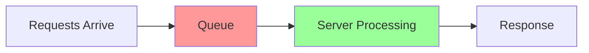

# Queueing Theory & Tail Latency

**One-line summary**: Understanding why P99 latency is much higher than P50, and how to reduce tail latency.

**Prerequisites**: Basic statistics (mean, median, percentiles), understanding of request/response model.

---

## Mental Model

### The Queueing Model

When requests arrive at a server faster than it can process them, a queue forms. Even if average load is low, occasional bursts create queues, leading to high tail latency.

**Key insight**: Tail latency (P95, P99) is dominated by queueing delay, not processing time.

### Little's Law

**L = λW**

Where:
- **L** = Average number of requests in system (queue + processing)
- **λ** = Arrival rate (requests per second)
- **W** = Average time in system (wait time + processing time)

**Implication**: If arrival rate increases or processing time increases, queue length grows.

### Why Tail Latency Matters

- **User experience**: P99 latency determines worst-case experience
- **Cascading failures**: High tail latency can cause timeouts and retries, increasing load
- **SLOs**: Most SLOs are based on tail latency (P95 or P99)

---

## Internals & Architecture

### Queueing Models

#### M/M/1 Queue (Single Server)

Simplest model: Poisson arrivals, exponential service time, single server.

**Key formulas**:
- **Utilization**: ρ = λ/μ (arrival rate / service rate)
- **Average queue length**: L = ρ/(1-ρ) when ρ < 1
- **Average wait time**: W = L/λ = ρ/(μ(1-ρ))

**Critical insight**: As utilization approaches 100%, queue length and wait time approach infinity.

#### M/M/k Queue (Multiple Servers)

k servers processing requests from a single queue.

**Key insight**: More servers reduce queue length, but coordination overhead increases.

#### Real-World Queueing

Real systems don't follow M/M/1 exactly:
- **Bursty arrivals**: Requests arrive in bursts, not uniformly
- **Variable service time**: Some requests take much longer than others
- **Multiple stages**: Requests go through multiple queues (load balancer → app → database)

### Sources of Tail Latency

1. **Queueing delay**: Waiting in queue
2. **Head-of-line blocking**: One slow request blocks others
3. **Resource contention**: CPU, memory, I/O contention
4. **Garbage collection**: GC pauses (in managed languages)
5. **Network variability**: Network latency jitter
6. **Cascading effects**: Retries and timeouts increase load

---

## Failure Modes & Blast Radius

### Overload Scenarios

#### 10× Normal Load
- Queue length grows significantly
- P99 latency increases dramatically
- Some requests may timeout
- **Mitigation**: Auto-scaling should kick in

#### 100× Normal Load
- Queue length explodes
- P99 latency becomes seconds or minutes
- Most requests timeout
- System may become unresponsive
- **Mitigation**: Load shedding, circuit breakers

#### 1000× Normal Load (DDoS)
- System completely overwhelmed
- All requests fail or timeout
- **Mitigation**: Rate limiting, DDoS protection, failover

### Cascading Failures

**Scenario**: High tail latency causes timeouts
- **Impact**: Clients retry, increasing load
- **Detection**: Error rate spikes, latency increases further
- **Recovery**: Load shedding, circuit breakers, scale up

**Prevention**:
- Set appropriate timeouts
- Implement exponential backoff
- Use circuit breakers
- Monitor queue depth

---

## Observability Contract

### Metrics to Track

#### Latency Metrics
- **P50 (median)**: Typical user experience
- **P95**: 95% of users experience this or better
- **P99**: 99% of users experience this or better
- **P99.9**: Worst-case experience

**Why track all percentiles?**
- P50 shows typical behavior
- P95/P99 show tail behavior
- P99.9 shows outliers

#### Queue Metrics
- **Queue depth**: Current number of requests waiting
- **Queue wait time**: Time spent in queue
- **Queue length over time**: How queue grows/shrinks

#### Throughput Metrics
- **Request rate**: Requests per second
- **Processing rate**: Requests processed per second
- **Utilization**: Processing rate / capacity

### Logs

Log events:
- Requests that exceed P99 threshold
- Queue depth spikes
- Timeout events
- GC pauses (if applicable)

### Traces

Trace:
- End-to-end request latency
- Time spent in each queue
- Time spent processing
- Network latency

### Alerts

**Critical alerts**:
- P99 latency > threshold (e.g., > 1s)
- Queue depth > threshold (e.g., > 1000)
- Utilization > 80% (approaching saturation)

**Warning alerts**:
- P95 latency > threshold
- Queue depth trending up

---

## Change Safety

### Reducing Tail Latency

#### Short-Term Fixes
1. **Increase capacity**: More servers, faster CPUs
2. **Reduce processing time**: Optimize code, cache results
3. **Reduce queueing**: Process requests faster

#### Long-Term Fixes
1. **Eliminate head-of-line blocking**: 
   - Use separate queues for different request types
   - Prioritize fast requests
2. **Reduce variability**:
   - Optimize slow paths
   - Pre-warm caches
   - Use connection pooling
3. **Better queueing**:
   - Use fair queueing (round-robin)
   - Implement priority queues
   - Use work stealing

### Testing Strategy

1. **Load testing**: Measure latency at various load levels
2. **Stress testing**: Push system beyond capacity
3. **Chaos testing**: Inject delays to test tail latency

---

## Security Boundaries

Tail latency itself isn't a security issue, but:
- **DDoS attacks**: Can cause high tail latency
- **Resource exhaustion**: Attackers can fill queues
- **Mitigation**: Rate limiting, DDoS protection

---

## Tradeoffs

### What We Gain by Reducing Tail Latency
- Better user experience
- More predictable performance
- Easier to meet SLOs
- Reduced cascading failures

### What We Lose
- May require more resources (cost)
- May require more complex architecture
- Optimization effort

### When to Optimize Tail Latency
- **High priority**: User-facing APIs, critical paths
- **Medium priority**: Internal services with SLOs
- **Low priority**: Batch jobs, background processing

### Alternatives

If reducing tail latency is too expensive:
- **Accept higher tail latency**: Set appropriate SLOs
- **Load shed**: Drop requests when overloaded
- **Timeout aggressively**: Fail fast instead of queueing

---

## Operational Considerations

### Capacity Planning

**Calculate capacity needed**:
1. Determine target P99 latency (e.g., 100ms)
2. Measure processing time per request (e.g., 10ms)
3. Calculate maximum queue wait time (e.g., 90ms)
4. Use queueing formulas to determine capacity needed

**Example**:
- Target P99: 100ms
- Processing time: 10ms
- Max queue wait: 90ms
- If arrival rate = 1000 req/s, need ~10 servers (with safety margin)

### Monitoring & Debugging

**Monitor**:
- Latency percentiles over time
- Queue depth over time
- Utilization over time
- Correlation between load and latency

**Debug high tail latency**:
1. Check queue depth: Is queue growing?
2. Check utilization: Are servers saturated?
3. Check processing time: Are some requests slow?
4. Check for head-of-line blocking
5. Check for resource contention

### Incident Response

**Common incidents**:
- P99 latency spike
- Queue depth explosion
- Timeout storms

**Response**:
1. Scale up (if possible)
2. Load shed (drop low-priority requests)
3. Circuit break (stop calling downstream services)
4. Investigate root cause

---

## What Staff Engineers Ask in Reviews

### Design Questions
- "What's the expected P99 latency?"
- "What happens when load doubles?"
- "How do we prevent head-of-line blocking?"
- "What's our queueing strategy?"

### Scale Questions
- "What's the queue depth at 10× load?"
- "How does latency degrade under load?"
- "What are the bottlenecks?"

### Operational Questions
- "How do we monitor queue depth?"
- "What alerts do we have?"
- "How do we debug high tail latency?"

---

## Further Reading

**Comprehensive Guide**: [Further Reading: Queueing Theory & Tail Latency](../further-reading/queueing-tail-latency.md)

**Quick Links**:
- "The Tail at Scale" (Dean & Barroso, 2013)
- "Systems Performance" by Brendan Gregg (Chapter on Queueing)
- [Back to Foundations](README.md)

---

## Exercises

1. **Calculate capacity**: Given arrival rate of 1000 req/s, processing time of 20ms, target P99 of 200ms, how many servers do you need?

2. **Analyze latency distribution**: Given P50=10ms, P95=50ms, P99=200ms, what can you infer about the system?

3. **Design queueing strategy**: Design a system that handles both fast (1ms) and slow (100ms) requests without head-of-line blocking.

**Answer Key**: [View Answers](../exercises/answers/queueing-tail-latency-answers.md)

