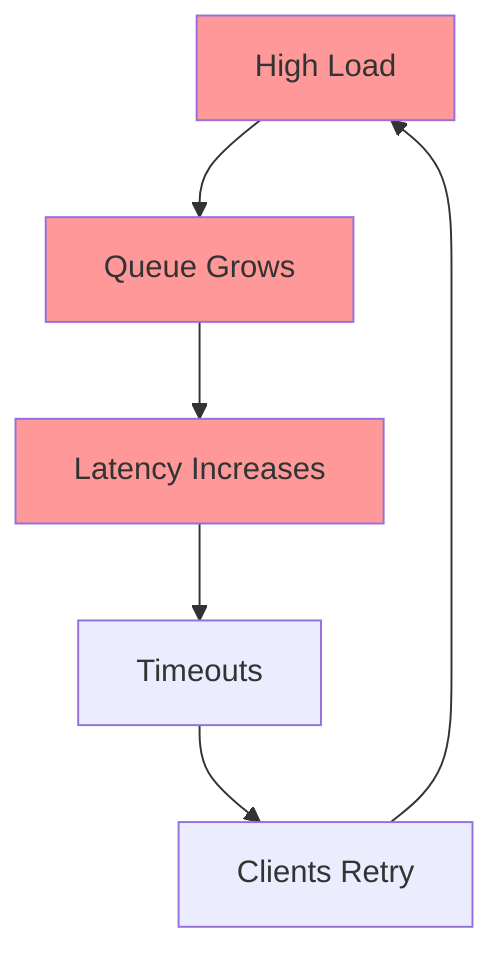

# Overload & Backpressure

**One-line summary**: How systems handle more load than capacity, and mechanisms to prevent cascading failures.

**Prerequisites**: [Queueing Theory](../01-foundations/queueing-tail-latency.md), understanding of request/response model.

---

## Mental Model

### What is Overload?

**Overload** occurs when a system receives more requests than it can process. Without proper handling, overload leads to:
- Increased latency
- Timeouts
- Cascading failures
- Complete system failure

### The Cascade

**Key insight**: Without backpressure, overload creates a positive feedback loop that makes things worse.

### Backpressure

**Backpressure** is a mechanism where a system signals upstream components to slow down when it's overloaded.

**Principle**: It's better to reject some requests gracefully than to accept all requests and fail catastrophically.

---

## Internals & Architecture

### Overload Detection

#### Queue Depth
- Monitor queue length
- Alert when queue exceeds threshold
- **Threshold**: Typically 2-3× normal queue depth

#### Latency
- Monitor P95/P99 latency
- Alert when latency exceeds threshold
- **Threshold**: Typically 2× normal latency

#### Error Rate
- Monitor error rate
- Alert when errors spike
- **Threshold**: Typically 2× normal error rate

#### Resource Utilization
- Monitor CPU, memory, I/O
- Alert when utilization exceeds threshold
- **Threshold**: Typically 80% utilization

### Backpressure Mechanisms

#### 1. Explicit Backpressure

**TCP Flow Control**:
- Receiver advertises window size
- Sender limits data sent
- **Use case**: Network-level backpressure

**HTTP 429 (Too Many Requests)**:
- Server returns 429 status code
- Client backs off and retries
- **Use case**: Application-level backpressure

**gRPC Flow Control**:
- gRPC uses HTTP/2 flow control
- Limits in-flight requests
- **Use case**: RPC-level backpressure

#### 2. Implicit Backpressure

**Blocking**:
- Server blocks when queue is full
- Client waits (implicit backpressure)
- **Problem**: Can cause cascading failures

**Dropping Requests**:
- Server drops requests when overloaded
- Client gets errors (implicit backpressure)
- **Problem**: Poor user experience

### Load Shedding Strategies

#### 1. Random Drop
- Drop random requests when overloaded
- **Pros**: Simple
- **Cons**: May drop important requests

#### 2. Priority-Based
- Drop low-priority requests first
- **Pros**: Preserves important requests
- **Cons**: Requires priority classification

#### 3. Client-Based
- Drop requests from specific clients
- **Pros**: Protects important clients
- **Cons**: Requires client identification

#### 4. Request Type-Based
- Drop specific request types (e.g., read vs write)
- **Pros**: Preserves critical operations
- **Cons**: Requires request classification

#### 5. Adaptive
- Dynamically adjust drop rate based on load
- **Pros**: Optimal resource utilization
- **Cons**: More complex

---

## Failure Modes & Blast Radius

### Overload Scenarios

#### 10× Normal Load
- **Symptoms**: Increased latency, growing queues
- **Impact**: Some requests timeout
- **Blast radius**: Single service
- **Mitigation**: Auto-scaling, load shedding

#### 100× Normal Load
- **Symptoms**: High latency, full queues, errors
- **Impact**: Most requests fail or timeout
- **Blast radius**: Service and dependent services
- **Mitigation**: Aggressive load shedding, circuit breakers

#### 1000× Normal Load (DDoS)
- **Symptoms**: System unresponsive
- **Impact**: Complete failure
- **Blast radius**: Entire system
- **Mitigation**: DDoS protection, failover

### Cascading Failures

**Scenario**: Service A calls Service B
1. Service B becomes overloaded
2. Service B's latency increases
3. Service A times out waiting for B
4. Service A retries, increasing load on B
5. Service B fails completely
6. Service A fails (no responses from B)
7. Cascades to other services

**Prevention**:
- **Circuit breakers**: Stop calling failing services
- **Timeouts**: Fail fast instead of waiting
- **Retry limits**: Limit retries
- **Exponential backoff**: Space out retries
- **Load shedding**: Drop requests before overload

---

## Observability Contract

### Metrics to Track

#### Load Metrics
- **Request rate**: Requests per second
- **Queue depth**: Current queue length
- **In-flight requests**: Requests being processed

#### Latency Metrics
- **P50/P95/P99 latency**: Request latency percentiles
- **Queue wait time**: Time spent in queue

#### Error Metrics
- **Error rate**: Errors per second
- **Timeout rate**: Timeouts per second
- **Rejection rate**: Dropped requests per second

#### Resource Metrics
- **CPU utilization**: CPU usage percentage
- **Memory utilization**: Memory usage percentage
- **I/O utilization**: Disk/network I/O

### Logs

Log events:
- Requests dropped due to overload
- Backpressure signals sent
- Circuit breaker state changes
- Load shedding decisions

### Traces

Trace:
- End-to-end request latency
- Time spent in queues
- Backpressure delays
- Retry attempts

### Alerts

**Critical alerts**:
- Queue depth > threshold
- P99 latency > threshold
- Error rate > threshold
- Resource utilization > 90%

**Warning alerts**:
- Queue depth trending up
- Latency trending up
- Resource utilization > 80%

---

## Change Safety

### Implementing Backpressure

#### 1. Add Queue Limits
- Limit queue size
- Reject requests when queue is full
- Return 429 (Too Many Requests)

#### 2. Implement Load Shedding
- Monitor queue depth and latency
- Drop requests when overloaded
- Prefer dropping low-priority requests

#### 3. Add Circuit Breakers
- Stop calling failing downstream services
- Fail fast instead of waiting
- Allow recovery after cooldown

#### 4. Set Appropriate Timeouts
- Set timeouts shorter than client timeouts
- Fail fast instead of queueing indefinitely
- Return errors quickly

### Testing Strategy

1. **Load testing**: Test behavior under various load levels
2. **Stress testing**: Push system beyond capacity
3. **Chaos testing**: Inject delays and failures
4. **Backpressure testing**: Verify backpressure works correctly

---

## Security Boundaries

Overload itself isn't a security issue, but:
- **DDoS attacks**: Can cause overload
- **Resource exhaustion**: Attackers can fill queues
- **Mitigation**: Rate limiting, DDoS protection, authentication

---

## Tradeoffs

### What We Gain with Backpressure
- Prevents cascading failures
- Graceful degradation
- Better resource utilization
- Predictable failure behavior

### What We Lose
- Some requests are rejected (poor UX)
- More complex implementation
- Requires monitoring and tuning

### When to Use Backpressure
- **Always**: For production systems
- **Critical**: For systems with SLOs
- **Important**: For systems that call other services

### Alternatives

If backpressure is too complex:
- **Over-provision**: Always have excess capacity (expensive)
- **Fail fast**: Return errors immediately (poor UX)
- **Accept failures**: Let system fail (unreliable)

---

## Operational Considerations

### Capacity Planning

**Calculate capacity needed**:
1. Determine expected peak load
2. Add safety margin (2-3×)
3. Plan for auto-scaling
4. Plan for load shedding

### Monitoring & Debugging

**Monitor**:
- Queue depth over time
- Latency over time
- Error rate over time
- Resource utilization over time

**Debug overload**:
1. Check queue depth: Is queue growing?
2. Check latency: Is latency increasing?
3. Check error rate: Are errors increasing?
4. Check resource utilization: Are resources saturated?
5. Check downstream services: Are they failing?

### Incident Response

**Common incidents**:
- Overload detected
- Cascading failures
- Circuit breaker trips

**Response**:
1. Scale up (if possible)
2. Load shed (drop low-priority requests)
3. Circuit break (stop calling failing services)
4. Investigate root cause

---

## What Staff Engineers Ask in Reviews

### Design Questions
- "How do we detect overload?"
- "What's our backpressure strategy?"
- "How do we prevent cascading failures?"
- "What's our load shedding strategy?"

### Scale Questions
- "What happens at 10× load?"
- "How does the system degrade?"
- "What's the failure mode?"

### Operational Questions
- "How do we monitor overload?"
- "What alerts do we have?"
- "How do we debug overload?"

---

## Further Reading

**Comprehensive Guide**: [Further Reading: Overload & Backpressure](../further-reading/overload-backpressure.md)

**Quick Links**:
- "The Tail at Scale" (Dean & Barroso, 2013)
- "Site Reliability Engineering" (Google SRE Book)
- "Why Do Internet Services Fail?" (Oppenheimer et al., 2003)
- [Load Shedding & Circuit Breakers](../04-reliability-sre/load-shedding.md)
- [Back to Distributed Systems](README.md)

---

## Exercises

1. **Design backpressure**: Design a system that handles 10× load gracefully. What mechanisms do you use?

2. **Prevent cascades**: Service A calls Service B. How do you prevent B's failure from cascading to A?

3. **Load shedding strategy**: Design a load shedding strategy for an API that handles both read and write requests. Which requests do you drop first?

**Answer Key**: [View Answers](../exercises/answers/overload-backpressure-answers.md)

