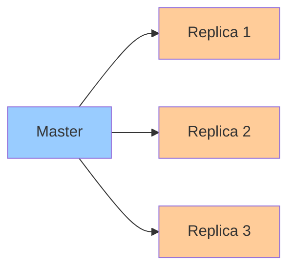

# Replication Strategies

**One-line summary**: Understanding different replication strategies (master-slave, multi-master, quorum) and their tradeoffs.

**Prerequisites**: [Consensus & Leases](consensus-leases.md), understanding of consistency models.

---

## Mental Model

### Replication Goals

**Replication**: Maintaining copies of data on multiple nodes.

**Goals**:
- **Availability**: System available even if some nodes fail
- **Durability**: Data survives node failures
- **Performance**: Distribute load across nodes
- **Geographic distribution**: Reduce latency for global users

**Key insight**: Different replication strategies trade off consistency, availability, and performance.

---

## Internals & Architecture

### Master-Slave Replication

**Master-slave**: Single master handles writes, replicas handle reads.

**How it works**:
1. **Write**: Write to master
2. **Replicate**: Master replicates to slaves
3. **Read**: Read from master or slaves

**Properties**:
- **Consistency**: Strong consistency (reads from master)
- **Availability**: Master is single point of failure
- **Performance**: Read scaling, write bottleneck

**Use case**: When strong consistency is required.

### Multi-Master Replication

**Multi-master**: Multiple masters handle writes.

**How it works**:
1. **Write**: Write to any master
2. **Replicate**: Masters replicate to each other
3. **Conflict resolution**: Resolve conflicts

**Properties**:
- **Consistency**: Eventual consistency (conflicts possible)
- **Availability**: High availability (no single point of failure)
- **Performance**: Write scaling

**Use case**: When availability and write scaling are priorities.

### Quorum Replication

**Quorum**: Require majority of replicas to agree.

**How it works**:
1. **Write**: Write to majority of replicas
2. **Read**: Read from majority of replicas
3. **Quorum**: Majority ensures consistency

**Properties**:
- **Consistency**: Strong consistency (with quorum)
- **Availability**: Available if majority available
- **Performance**: Moderate (quorum overhead)

**Use case**: Balance consistency and availability.

---

## Failure Modes & Blast Radius

### Replication Failures

#### Scenario 1: Master Failure
- **Impact**: Writes unavailable, reads may continue
- **Blast radius**: All writes
- **Detection**: Master health checks fail
- **Recovery**: Promote slave to master
- **Mitigation**: Automatic failover, multiple masters

#### Scenario 2: Replica Lag
- **Impact**: Stale reads, inconsistency
- **Blast radius**: Read operations
- **Detection**: Replication lag monitoring
- **Recovery**: Wait for replication, read from master
- **Mitigation**: Monitor lag, read from master for consistency

---

## Observability Contract

### Metrics

- **Replication lag**: Delay between master and replicas
- **Replica health**: Health of replicas
- **Conflict rate**: Rate of conflicts (multi-master)
- **Failover time**: Time to failover

### Alerts

- High replication lag
- Replica failures
- Master failures
- Conflict rate spikes

---

## Change Safety

### Replication Configuration Changes

- **Process**: Update replication configuration, verify replication
- **Risk**: High (may affect consistency)
- **Rollback**: Revert configuration

---

## Tradeoffs

### Consistency vs Availability

**Strong consistency**:
- **Pros**: Always see latest data
- **Cons**: Lower availability, higher latency

**Eventual consistency**:
- **Pros**: Higher availability, lower latency
- **Cons**: May see stale data

---

## Operational Considerations

### Best Practices

1. **Choose right strategy**: Match replication to requirements
2. **Monitor replication**: Track lag and health
3. **Handle failures**: Fast failover and recovery
4. **Balance tradeoffs**: Consistency vs availability

---

## What Staff Engineers Ask in Reviews

- "What replication strategy is used?"
- "How is consistency guaranteed?"
- "What happens if master fails?"
- "How is replication lag handled?"

---

## Further Reading

**Comprehensive Guide**: [Further Reading: Replication Strategies](../further-reading/replication.md)

**Quick Links**:
- "Replication" (Gray & Reuter, 1993)
- [Sharding & Partitioning](sharding-partitioning.md)
- [Spanner: Consistency & Performance](../03-gcp-core-building-blocks/spanner.md)
- [Back to Distributed Systems](README.md)

---

## Exercises

1. **Choose replication**: When do you use master-slave vs multi-master? What are the tradeoffs?

2. **Handle master failure**: Your master-slave system loses its master. How does it recover?

3. **Design quorum**: Design a quorum replication system. How many replicas? What's the quorum?

**Answer Key**: [View Answers](../exercises/answers/replication-answers.md)

