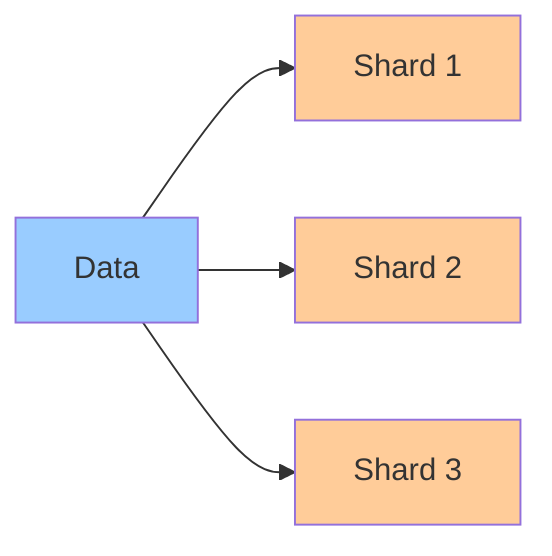

# Sharding & Partitioning

**One-line summary**: Understanding how to partition data across multiple nodes, sharding strategies, and handling hot spots.

**Prerequisites**: [Replication Strategies](replication.md), understanding of data distribution.

---

## Mental Model

### Partitioning Problem

**Partitioning**: Dividing data across multiple nodes.

**Goals**:
- **Scale**: Handle more data than single node
- **Performance**: Distribute load across nodes
- **Isolation**: Isolate failures

**Key insight**: Partitioning enables horizontal scaling but introduces complexity.

### Sharding Strategies

**Range partitioning**: Partition by key ranges.
- **Pros**: Simple, supports range queries
- **Cons**: Hot spots, uneven distribution

**Hash partitioning**: Partition by hash of key.
- **Pros**: Even distribution, no hot spots
- **Cons**: No range queries, rebalancing needed

**Directory partitioning**: Use directory to map keys to shards.
- **Pros**: Flexible, easy rebalancing
- **Cons**: Directory is bottleneck, single point of failure

---

## Internals & Architecture

### Range Partitioning

**How it works**:
- **Partition key**: Choose partition key (e.g., user_id)
- **Ranges**: Assign ranges to shards (e.g., 0-1000, 1001-2000)
- **Routing**: Route queries to appropriate shard

**Use case**: When range queries are needed.

### Hash Partitioning

**How it works**:
- **Hash function**: Hash partition key
- **Shard assignment**: Assign hash ranges to shards
- **Routing**: Route queries based on hash

**Use case**: When even distribution is priority.

### Consistent Hashing

**Consistent hashing**: Hash ring for shard assignment.

**Properties**:
- **Minimal rebalancing**: Only rebalance affected shards
- **Even distribution**: Hash ring ensures distribution
- **Fault tolerance**: Handles node failures

**Use case**: Dynamic sharding with minimal rebalancing.

---

## Failure Modes & Blast Radius

### Partitioning Failures

#### Scenario 1: Hot Spots
- **Impact**: Single shard overloaded, increased latency
- **Blast radius**: Affected shard
- **Detection**: High load on shard, uneven distribution
- **Recovery**: Rebalance data, split hot shard
- **Mitigation**: Design keys for even distribution, monitor hot spots

#### Scenario 2: Shard Failure
- **Impact**: Data on shard unavailable
- **Blast radius**: Affected shard
- **Detection**: Shard health checks fail
- **Recovery**: Replicate shard, restore from backup
- **Mitigation**: Replicate shards, automatic failover

---

## Observability Contract

### Metrics

- **Shard load**: Load per shard
- **Hot spots**: Shards with high load
- **Rebalancing events**: Shard rebalancing frequency
- **Shard health**: Health of shards

### Alerts

- Hot spots detected
- Shard failures
- Uneven distribution
- High rebalancing rate

---

## Change Safety

### Partitioning Changes

- **Process**: Update partitioning, rebalance data
- **Risk**: High (may affect availability)
- **Rollback**: Revert partitioning

---

## Tradeoffs

### Range vs Hash Partitioning

**Range partitioning**:
- **Pros**: Supports range queries, simple
- **Cons**: Hot spots, uneven distribution

**Hash partitioning**:
- **Pros**: Even distribution, no hot spots
- **Cons**: No range queries, rebalancing needed

---

## Operational Considerations

### Best Practices

1. **Choose right strategy**: Match partitioning to access patterns
2. **Design keys**: Design partition keys for even distribution
3. **Monitor hot spots**: Track and handle hot spots
4. **Plan rebalancing**: Plan for data growth and rebalancing

---

## What Staff Engineers Ask in Reviews

- "What partitioning strategy is used?"
- "How are hot spots avoided?"
- "What happens if a shard fails?"
- "How is rebalancing handled?"

---

## Further Reading

**Comprehensive Guide**: [Further Reading: Sharding & Partitioning](../further-reading/sharding-partitioning.md)

**Quick Links**:
- "Scalable Web Architecture and Distributed Systems" (Barroso & Hölzle)
- [Bigtable: Design & Tradeoffs](../03-gcp-core-building-blocks/bigtable.md)
- [BigQuery Architecture](../03-gcp-core-building-blocks/bigquery.md)
- [Back to Distributed Systems](README.md)

---

## Exercises

1. **Design partitioning**: Design a partitioning strategy for a user database. What partition key? What strategy?

2. **Handle hot spots**: Your partitioned system has hot spots. How do you fix them?

3. **Rebalance data**: How do you rebalance data when adding new shards?

**Answer Key**: [View Answers](../exercises/answers/sharding-partitioning-answers.md)

