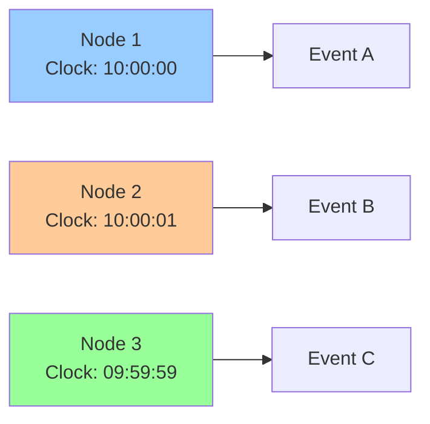

# Time, Ordering, and Causality

**One-line summary**: Understanding how time works in distributed systems, ordering events, and establishing causality without global clocks.

**Prerequisites**: [Foundations](../01-foundations/README.md), basic understanding of distributed systems.

---

## Mental Model

### The Time Problem

In distributed systems, there is no global clock. Different nodes have different clocks, and clocks drift.

**Challenges**:
- **Clock skew**: Clocks on different nodes differ
- **Clock drift**: Clocks run at different rates
- **No global ordering**: Can't order events across nodes using time alone

**Key insight**: We need logical clocks and causality to order events without relying on physical time.

### Causality

**Causality**: If event A causes event B, then A must happen before B.

**Happens-before relation** (`→`):
- **Same process**: If A happens before B in same process, then A → B
- **Message send**: If A sends message and B receives it, then A → B
- **Transitivity**: If A → B and B → C, then A → C

**Concurrent events**: If neither A → B nor B → A, then A and B are concurrent.

---

## Internals & Architecture

### Logical Clocks

#### Lamport Clocks

**Lamport clock**: Logical clock that captures causality.

**Algorithm**:
1. Each process maintains a counter (initially 0)
2. On local event: Increment counter
3. On send: Increment counter, attach to message
4. On receive: Set counter to max(local counter, received counter) + 1

**Properties**:
- If A → B, then L(A) < L(B)
- Converse not true: L(A) < L(B) doesn't imply A → B

**Limitation**: Can't detect concurrent events.

#### Vector Clocks

**Vector clock**: Clock that captures causality precisely.

**Algorithm**:
1. Each process maintains vector of counters (one per process)
2. On local event: Increment own counter
3. On send: Increment own counter, attach vector to message
4. On receive: Element-wise max of local and received vectors, increment own counter

**Properties**:
- If A → B, then V(A) < V(B) (element-wise)
- If V(A) < V(B), then A → B
- Can detect concurrent events

**Tradeoff**: More storage overhead than Lamport clocks.

### Ordering Guarantees

#### Total Order

**Total order**: All events have a global ordering.

**Achieving total order**:
- **Single leader**: Single process orders all events
- **Consensus**: Use consensus algorithm (e.g., Paxos, Raft)
- **Logical timestamps**: Use logical clocks with tie-breaking

**Use case**: When strict ordering is required (e.g., state machine replication).

#### Partial Order

**Partial order**: Only causally related events are ordered.

**Achieving partial order**:
- **Vector clocks**: Use vector clocks to establish causality
- **No coordination**: No need for consensus

**Use case**: When causality is sufficient (e.g., distributed logging).

### TrueTime (Spanner)

**TrueTime**: Google's distributed clock with bounded uncertainty.

**Components**:
- **GPS clocks**: Atomic clocks synchronized via GPS
- **Atomic clocks**: High-precision clocks
- **Time uncertainty**: Bounded clock uncertainty (ε < 7ms)

**Time representation**: `TTinterval = [earliest, latest]`

**Use case**: Enables external consistency in Spanner without blocking.

---

## Failure Modes & Blast Radius

### Clock Failures

#### Scenario 1: Clock Skew
- **Impact**: Events ordered incorrectly, causality violated
- **Blast radius**: All events using clock
- **Detection**: Clock synchronization errors, ordering violations
- **Recovery**: Synchronize clocks, use logical clocks
- **Mitigation**: Use logical clocks, bounded clock uncertainty

#### Scenario 2: Clock Drift
- **Impact**: Clocks diverge over time, ordering errors accumulate
- **Blast radius**: Long-running systems
- **Detection**: Clock drift monitoring
- **Recovery**: Periodic clock synchronization
- **Mitigation**: Regular clock synchronization, logical clocks

### Ordering Failures

#### Scenario 1: Lost Messages
- **Impact**: Causality not established, ordering violated
- **Blast radius**: Affected events
- **Detection**: Missing sequence numbers, ordering violations
- **Recovery**: Retransmit messages, reorder events
- **Mitigation**: Reliable message delivery, sequence numbers

---

## Observability Contract

### Metrics to Track

- **Clock skew**: Difference between clocks on different nodes
- **Clock drift**: Rate of clock divergence
- **Ordering violations**: Events ordered incorrectly
- **Causality violations**: Causality not preserved

### Logs

- Clock synchronization events
- Ordering decisions
- Causality violations

### Alerts

- High clock skew
- Clock drift exceeding threshold
- Ordering violations detected

---

## Change Safety

### Clock Synchronization Changes

- **Process**: Update clock synchronization, verify ordering
- **Risk**: Medium (may affect ordering)
- **Rollback**: Revert clock synchronization

---

## Security Boundaries

- **Clock manipulation**: Protect against clock manipulation attacks
- **Message ordering**: Ensure message integrity for ordering

---

## Tradeoffs

### Logical Clocks vs Physical Clocks

**Logical clocks**:
- **Pros**: No clock synchronization needed, captures causality
- **Cons**: No absolute time, can't measure duration

**Physical clocks**:
- **Pros**: Absolute time, can measure duration
- **Cons**: Clock synchronization needed, clock skew issues

---

## Operational Considerations

### Best Practices

1. **Use logical clocks**: For causality and ordering
2. **Synchronize clocks**: Regular clock synchronization
3. **Monitor clock skew**: Track clock differences
4. **Handle clock failures**: Graceful degradation

---

## What Staff Engineers Ask in Reviews

- "How is event ordering handled?"
- "What happens if clocks drift?"
- "How is causality established?"
- "What's the ordering guarantee?"

---

## Further Reading

**Comprehensive Guide**: [Further Reading: Time, Ordering, Causality](../further-reading/time-ordering-causality.md)

**Quick Links**:
- "Time, Clocks, and the Ordering of Events in a Distributed System" (Lamport, 1978)
- "Virtual Time and Global States of Distributed Systems" (Mattern, 1989)
- [Consensus & Leases](consensus-leases.md)
- [Back to Distributed Systems](README.md)

---

## Exercises

1. **Design ordering**: Design an event ordering system for a distributed application. What clocks do you use?

2. **Handle clock skew**: Your system has clock skew. How do you handle it? What's the strategy?

3. **Establish causality**: How do you establish causality between events in a distributed system?

**Answer Key**: [View Answers](../exercises/answers/time-ordering-causality-answers.md)

