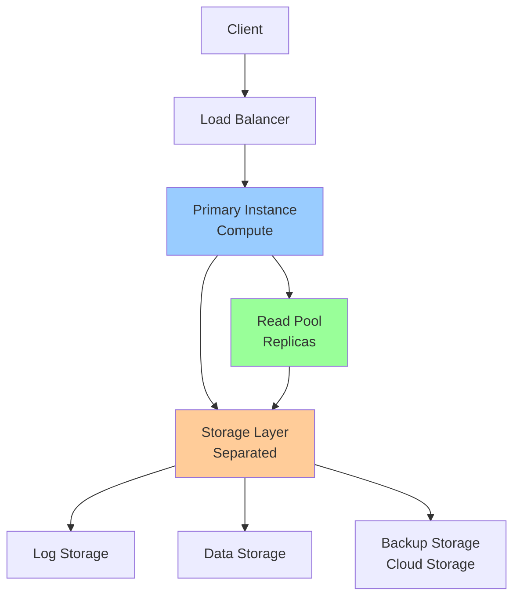

# AlloyDB: PostgreSQL-Compatible Database

**One-line summary**: Deep dive into AlloyDB's architecture, compute-storage separation, PostgreSQL compatibility, and performance optimizations.

**Prerequisites**: [Spanner: Consistency & Performance](spanner.md), Basic PostgreSQL concepts (ACID, transactions, replication).

---

## Mental Model

### AlloyDB Architecture

**Key insight**: AlloyDB separates compute (PostgreSQL instances) from storage (distributed storage layer). This architecture enables independent scaling, better performance, and high availability.

### Compute-Storage Separation

**Compute Layer**: PostgreSQL instances (primary + read replicas).
- **Primary**: Handles writes, coordinates replication
- **Read Replicas**: Handle reads, scale independently
- **Scaling**: Scale compute independently from storage

**Storage Layer**: Distributed storage (shared by all instances).
- **Log Storage**: Write-ahead log (WAL) storage
- **Data Storage**: Table data storage
- **Scaling**: Scale storage independently from compute

**Benefits**:
- **Independent scaling**: Scale compute and storage separately
- **Better performance**: Optimized storage layer
- **High availability**: Storage redundancy, automatic failover

---

## Internals & Architecture

### Storage Layer

#### Log Storage

**Write-Ahead Log (WAL)**: Transaction log for durability.

**Architecture**:
- **Distributed**: WAL replicated across storage nodes
- **Durability**: Strong durability guarantees
- **Performance**: Low-latency writes

**How it works**:
1. **Write**: Primary writes to WAL
2. **Replication**: WAL replicated to storage nodes
3. **Durability**: Write confirmed after replication
4. **Replay**: Read replicas replay WAL for consistency

#### Data Storage

**Data Storage**: Table data storage.

**Architecture**:
- **Columnar cache**: Columnar cache for analytics
- **Row storage**: Row storage for OLTP
- **Optimization**: Optimized for both OLTP and OLAP

**Features**:
- **Vectorized execution**: Vectorized query execution
- **Columnar storage**: Columnar storage for analytics
- **Compression**: Advanced compression algorithms

### Compute Layer

#### Primary Instance

**Primary**: Handles writes and coordinates replication.

**Functions**:
- **Write handling**: Processes write transactions
- **Replication**: Coordinates WAL replication to read replicas
- **Consistency**: Ensures consistency across replicas

**Scaling**:
- **Vertical**: Scale CPU/memory
- **Horizontal**: Not directly (use read replicas for reads)

#### Read Replicas

**Read Replicas**: Handle reads, scale independently.

**Functions**:
- **Read handling**: Processes read queries
- **Replication**: Receives WAL from primary
- **Consistency**: Reads from consistent snapshot

**Scaling**:
- **Horizontal**: Add read replicas for read scaling
- **Vertical**: Scale CPU/memory per replica

**Replication**:
- **Streaming**: WAL streamed to replicas
- **Lag**: Low replication lag (< 100ms)
- **Consistency**: Read replicas see consistent snapshots

### PostgreSQL Compatibility

#### SQL Compatibility

**PostgreSQL**: Full PostgreSQL SQL compatibility.

**Features**:
- **SQL**: Standard PostgreSQL SQL
- **Extensions**: PostgreSQL extensions supported
- **Functions**: PostgreSQL functions supported

**Migration**:
- **Easy migration**: Migrate from PostgreSQL with minimal changes
- **Compatibility**: High compatibility with PostgreSQL applications

#### Performance Optimizations

**Vectorized Execution**: Vectorized query execution for better performance.

**Columnar Cache**: Columnar cache for analytics workloads.

**Query Optimization**: Advanced query optimizer.

**Benefits**:
- **Better performance**: Up to 4× faster than standard PostgreSQL
- **Analytics**: Better performance for analytics workloads
- **OLTP**: Maintains OLTP performance

### High Availability

#### Automatic Failover

**Failover**: Automatic failover from primary to replica.

**Process**:
1. **Detection**: Primary failure detected
2. **Election**: Read replica promoted to primary
3. **Switchover**: Traffic switched to new primary
4. **Recovery**: Old primary recovered as replica

**Recovery Time**:
- **RTO**: Recovery Time Objective (< 60 seconds)
- **RPO**: Recovery Point Objective (< 1 second)

#### Multi-Zone Deployment

**Zones**: Deploy across multiple zones.

**Benefits**:
- **Availability**: Higher availability (99.99%)
- **Disaster recovery**: Zone-level disaster recovery
- **Performance**: Low-latency access from multiple zones

---

## Failure Modes & Blast Radius

### AlloyDB Failures

#### Scenario 1: Primary Failure
- **Impact**: Writes unavailable, automatic failover to replica
- **Blast radius**: Write operations (reads continue)
- **Detection**: Primary health checks fail
- **Recovery**: 
  - Automatic failover (< 60 seconds)
  - Read replica promoted to primary
  - Writes resume after failover
- **Mitigation**: 
  - Multi-zone deployment
  - Automatic failover enabled
  - Sufficient read replicas

#### Scenario 2: Storage Layer Failure
- **Impact**: Database unavailable, data inaccessible
- **Blast radius**: Entire database
- **Detection**: Storage health checks fail
- **Recovery**: 
  - Storage layer has redundancy
  - Automatic recovery from replicas
  - Data restored from backups if needed
- **Mitigation**: 
  - Storage layer redundancy
  - Regular backups
  - Multi-zone storage

#### Scenario 3: Read Replica Failure
- **Impact**: Read capacity reduced, reads may be slower
- **Blast radius**: Read operations (writes continue)
- **Detection**: Replica health checks fail
- **Recovery**: 
  - Automatic recovery
  - Replica restored from storage layer
- **Mitigation**: 
  - Multiple read replicas
  - Automatic recovery

### Performance Failures

#### Scenario 1: Storage I/O Bottleneck
- **Impact**: Slow reads/writes, increased latency
- **Blast radius**: All operations
- **Detection**: High storage I/O latency
- **Recovery**: 
  - Scale storage layer
  - Optimize queries
  - Add read replicas
- **Mitigation**: 
  - Monitor storage I/O
  - Scale storage proactively
  - Optimize queries

#### Scenario 2: Compute Exhaustion
- **Impact**: Slow queries, increased latency
- **Blast radius**: Affected instance
- **Detection**: High CPU/memory utilization
- **Recovery**: 
  - Scale compute (vertical scaling)
  - Add read replicas (horizontal scaling)
  - Optimize queries
- **Mitigation**: 
  - Monitor compute resources
  - Scale proactively
  - Optimize queries

### Overload Scenarios

#### 10× Normal Load
- **Latency**: May increase, especially for writes
- **Throughput**: Handles load, may need to scale
- **Storage**: Storage layer handles load well

#### 100× Normal Load
- **Latency**: Significantly increased, need scaling
- **Throughput**: May need significant scaling
- **Storage**: Storage layer may need scaling

---

## Observability Contract

### Metrics to Track

#### Database Metrics
- **QPS**: Queries per second (read/write)
- **Latency**: P50/P95/P99 latency (read/write)
- **Error rate**: Error rate (4xx/5xx)
- **Connection count**: Active connections

#### Compute Metrics
- **CPU**: CPU utilization per instance
- **Memory**: Memory utilization per instance
- **Replication lag**: Replication lag to read replicas

#### Storage Metrics
- **Storage I/O**: Storage I/O operations per second
- **Storage latency**: Storage I/O latency
- **Storage size**: Total storage size

### Logs

**AlloyDB logs**:
- Query logs (if enabled)
- Error logs
- Admin activity logs
- Replication logs

### Alerts

**Critical alerts**:
- Database unavailable
- High error rate (> 1%)
- High latency (> threshold)
- Primary failure

**Warning alerts**:
- High replication lag
- High storage I/O
- Compute resource exhaustion
- Connection pool exhaustion

---

## Change Safety

### Instance Changes

#### Scaling Compute
- **Process**: Scale CPU/memory, verify performance
- **Risk**: Medium (may cause brief downtime)
- **Rollback**: Revert compute size

#### Adding Read Replicas
- **Process**: Create read replica, verify replication
- **Risk**: Low (additive change)
- **Rollback**: Delete read replica

#### Changing Storage Size
- **Process**: Increase storage size, verify performance
- **Risk**: Low (additive change)
- **Rollback**: Cannot decrease storage size

### Configuration Changes

#### Changing Backup Schedule
- **Process**: Update backup schedule, verify backups
- **Risk**: Low (configuration change)
- **Rollback**: Revert backup schedule

#### Enabling High Availability
- **Process**: Enable HA, verify failover
- **Risk**: Medium (affects availability configuration)
- **Rollback**: Disable HA (may cause downtime)

---

## Security Boundaries

### Access Control

- **IAM**: Instance-level IAM policies
- **Database users**: PostgreSQL users and roles
- **Network**: VPC firewall rules, private IP

### Encryption

**At rest**:
- **Google-managed keys**: Default encryption
- **Customer-managed keys**: Cloud KMS keys

**In transit**:
- **TLS**: All connections use TLS
- **Encryption**: Data encrypted in transit

### Data Protection

- **Backups**: Automatic backups (point-in-time recovery)
- **Audit logs**: Audit all database access
- **Data retention**: Configurable data retention

---

## Tradeoffs

### Compute-Storage Separation: Benefits vs Complexity

**Benefits**:
- **Independent scaling**: Scale compute and storage separately
- **Better performance**: Optimized storage layer
- **High availability**: Storage redundancy

**Complexity**:
- **More components**: More components to manage
- **Coordination**: Need to coordinate compute and storage

### Replication: Synchronous vs Asynchronous

**Synchronous**:
- **Pros**: Strong consistency, no data loss
- **Cons**: Higher latency, lower throughput

**Asynchronous**:
- **Pros**: Lower latency, higher throughput
- **Cons**: Possible data loss, eventual consistency

### Compatibility: PostgreSQL vs Optimizations

**PostgreSQL compatibility**:
- **Pros**: Easy migration, familiar SQL
- **Cons**: May not use all optimizations

**Optimizations**:
- **Pros**: Better performance, advanced features
- **Cons**: May require application changes

---

## Operational Considerations

### Capacity Planning

**Storage**:
- **Growth**: Plan for storage growth
- **Backups**: Plan for backup storage
- **Scaling**: Plan for storage scaling

**Compute**:
- **Instances**: Plan for instance capacity
- **QPS**: Plan for query throughput
- **Scaling**: Plan for compute scaling

### Monitoring & Debugging

**Monitor**:
- Query performance
- Instance health
- Storage health
- Replication lag

**Debug issues**:
1. Check query performance (slow queries)
2. Check instance health
3. Check storage health
4. Check replication lag
5. Review logs

### Incident Response

**Common incidents**:
- High latency
- Primary failure
- Storage I/O bottleneck
- Replication lag

**Response**:
1. Check database health
2. Check query performance
3. Check instance health
4. Check storage health
5. Scale if needed
6. Contact support if persistent

---

## What Staff Engineers Ask in Reviews

### Design Questions
- "What's the architecture?"
- "How is compute-storage separation used?"
- "What's the replication configuration?"
- "How is high availability configured?"

### Scale Questions
- "What happens at 10× load?"
- "How does AlloyDB scale?"
- "What are the scaling limits?"
- "How do you handle read scaling?"

### Performance Questions
- "What's the read/write latency?"
- "How is storage optimized?"
- "What's the replication lag?"
- "How are queries optimized?"

### Operational Questions
- "How do you monitor AlloyDB?"
- "What alerts do you have?"
- "How do you debug performance issues?"
- "What's the backup strategy?"

---

## Further Reading

**Comprehensive Guide**: [Further Reading: AlloyDB](../further-reading/alloydb.md)

**Quick Links**:
- [AlloyDB Documentation](https://cloud.google.com/alloydb/docs)
- [PostgreSQL Compatibility](https://cloud.google.com/alloydb/docs/postgresql/compatibility)
- [Performance Best Practices](https://cloud.google.com/alloydb/docs/performance)
- [High Availability](https://cloud.google.com/alloydb/docs/high-availability)
- [Back to GCP Core Building Blocks](README.md)

---

## Exercises

1. **Design architecture**: Design an AlloyDB architecture for a high-traffic application. How many read replicas? What's the failover strategy?

2. **Handle scaling**: Your application needs to scale reads. How do you scale with AlloyDB? What's the strategy?

3. **Optimize performance**: Your queries are slow. How do you optimize them? What AlloyDB features do you use?

**Answer Key**: [View Answers](../exercises/answers/alloydb-answers.md)

