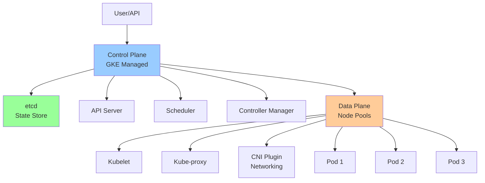
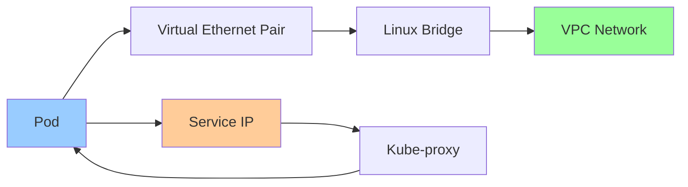

# GKE Control Plane & Data Plane

**One-line summary**: Deep dive into GKE's control plane architecture, node management, pod networking, and how Kubernetes components work together.

**Prerequisites**: [VPC, Load Balancing & DNS](vpc-lb-dns.md), Basic Kubernetes concepts (pods, nodes, services).

---

## Mental Model

### GKE Architecture



**Key insight**: GKE separates control plane (managed by Google) from data plane (your nodes). Understanding both is critical for troubleshooting and optimization.

### Control Plane vs Data Plane

**Control Plane**: Manages cluster state, schedules pods, handles API requests.
- **Managed by Google**: High availability, automatic updates
- **Components**: API server, etcd, scheduler, controller manager

**Data Plane**: Runs your workloads (pods).
- **Managed by you**: Node pools, scaling, updates
- **Components**: Kubelet, kube-proxy, CNI plugin

---

## Internals & Architecture

### Control Plane Deep Dive

#### API Server

**API Server**: Central component that validates and processes all API requests.

**Functions**:
- **Authentication**: Verify identity (service accounts, OAuth)
- **Authorization**: Check permissions (RBAC, ABAC)
- **Admission control**: Validate and mutate requests (validating/mutating webhooks)
- **State management**: Read/write to etcd

**Request Flow**:
```
Client → API Server → Authentication → Authorization → Admission Control → etcd
```

**Performance**:
- **QPS**: Handles thousands of requests per second
- **Latency**: P95 < 10ms for most operations
- **Scaling**: Automatically scales with cluster size

#### etcd

**etcd**: Distributed key-value store for cluster state.

**Data stored**:
- **Pods**: Pod specifications and status
- **Services**: Service definitions
- **ConfigMaps**: Configuration data
- **Secrets**: Encrypted secrets
- **Nodes**: Node information

**Consistency**: Strong consistency (linearizable reads)

**Backup**: Automatic backups every 6 hours (GKE managed)

**Performance**:
- **Write latency**: P95 < 50ms
- **Read latency**: P95 < 10ms
- **Throughput**: Thousands of operations per second

#### Scheduler

**Scheduler**: Assigns pods to nodes based on constraints and resources.

**Scheduling process**:
1. **Filter**: Filter nodes that meet pod requirements (resources, node selectors, taints/tolerations)
2. **Score**: Score filtered nodes (resource availability, affinity, anti-affinity)
3. **Bind**: Assign pod to highest-scoring node

**Scheduling policies**:
- **Resource requests**: CPU, memory requirements
- **Node selectors**: Prefer specific node types
- **Affinity/anti-affinity**: Co-locate or separate pods
- **Taints/tolerations**: Restrict pod placement

**Performance**:
- **Scheduling latency**: P95 < 100ms
- **Throughput**: Hundreds of pods per second

#### Controller Manager

**Controller Manager**: Runs controllers that maintain desired state.

**Controllers**:
- **Replication Controller**: Maintains pod replicas
- **Deployment Controller**: Manages deployments
- **StatefulSet Controller**: Manages stateful applications
- **Node Controller**: Monitors node health
- **Service Controller**: Manages load balancers

**Reconciliation loop**: Continuously checks desired vs actual state, makes changes.

### Data Plane Deep Dive

#### Node Pools

**Node Pool**: Group of nodes with same configuration.

**Configuration**:
- **Machine type**: CPU, memory, disk
- **OS image**: Container-Optimized OS, Ubuntu
- **Scaling**: Auto-scaling, manual scaling
- **Upgrades**: Automatic or manual node upgrades

**Node Pool Types**:
- **Standard**: General-purpose workloads
- **Spot/Preemptible**: Cost-effective, can be preempted
- **GPU**: GPU-enabled nodes
- **High-memory**: Memory-optimized nodes

#### Kubelet

**Kubelet**: Agent running on each node, manages pods.

**Functions**:
- **Pod lifecycle**: Create, start, stop, delete pods
- **Health checks**: Liveness, readiness probes
- **Volume mounting**: Mount volumes to pods
- **Container runtime**: Interface with container runtime (containerd)

**Communication**:
- **API Server**: Reports node status, receives pod assignments
- **Container runtime**: Manages containers
- **CNI**: Configures pod networking

#### Kube-proxy

**Kube-proxy**: Network proxy for service routing.

**Modes**:
- **iptables**: Uses iptables rules (default, high performance)
- **IPVS**: Uses IPVS (better for large clusters)
- **Userspace**: Userspace proxy (legacy)

**Functions**:
- **Service routing**: Routes service traffic to pods
- **Load balancing**: Distributes traffic across pod endpoints
- **Session affinity**: Maintains client-pod affinity

**How it works**:
1. Service created → kube-proxy watches API server
2. Endpoints discovered → kube-proxy creates iptables rules
3. Traffic arrives → iptables routes to pod IP

#### CNI (Container Network Interface)

**CNI**: Plugin that configures pod networking.

**GKE CNI**: Google's VPC-native networking.

**Features**:
- **VPC-native**: Pods get IPs from VPC subnet
- **Network policies**: Firewall rules for pod-to-pod communication
- **Service mesh**: Integration with Istio/Anthos Service Mesh

**Networking model**:
- **Pod IP**: Each pod gets IP from VPC subnet
- **Service IP**: Virtual IP for service (cluster IP)
- **Load balancer**: External IP for external access

### Pod Networking

#### Pod Network Architecture



**Pod networking flow**:
1. **Pod creation**: CNI assigns IP from VPC subnet
2. **Intra-pod**: Pods on same node communicate via bridge
3. **Inter-pod**: Pods on different nodes communicate via VPC routing
4. **Service access**: Traffic goes through kube-proxy to pod IP

#### Service Types

**ClusterIP**: Internal service (default).
- **Use case**: Internal communication
- **Access**: Only within cluster

**NodePort**: Exposes service on node IP.
- **Use case**: External access via node IP
- **Port**: 30000-32767

**LoadBalancer**: External load balancer.
- **Use case**: External access via load balancer IP
- **GCP**: Creates GCP load balancer

**ExternalName**: Maps to external DNS name.
- **Use case**: External services
- **Access**: Via DNS name

### Workload Identity

**Workload Identity**: Allows pods to use GCP service accounts.

**Architecture**:
```
Kubernetes Service Account (KSA) → Workload Identity → Google Service Account (GSA)
```

**Process**:
1. **Annotation**: Pod annotated with KSA
2. **Mapping**: Workload Identity maps KSA to GSA
3. **Token**: Pod receives GCP access token
4. **Access**: Pod accesses GCP resources as GSA

**Benefits**:
- **No keys**: No need to store service account keys
- **Security**: Automatic key rotation
- **Audit**: Better audit trail

---

## Failure Modes & Blast Radius

### Control Plane Failures

#### Scenario 1: API Server Failure
- **Impact**: Cannot create/update/delete resources, cluster API unavailable
- **Blast radius**: Entire cluster (API operations)
- **Detection**: API server health checks fail, API requests timeout
- **Recovery**: GKE automatically fails over (multi-region control plane)
- **Mitigation**: GKE managed control plane has automatic failover

#### Scenario 2: etcd Failure
- **Impact**: Cluster state lost, cannot read cluster state
- **Blast radius**: Entire cluster (state operations)
- **Detection**: etcd health checks fail, API server errors
- **Recovery**: GKE automatically restores from backup
- **Mitigation**: Automatic backups every 6 hours

#### Scenario 3: Scheduler Failure
- **Impact**: Cannot schedule new pods, existing pods continue running
- **Blast radius**: New pod scheduling
- **Detection**: Pods stuck in Pending state
- **Recovery**: Scheduler automatically restarts
- **Mitigation**: Scheduler runs in high-availability mode

### Data Plane Failures

#### Scenario 1: Node Failure
- **Impact**: Pods on node become unavailable
- **Blast radius**: Pods on failed node
- **Detection**: Node health checks fail, pods marked as NotReady
- **Recovery**: 
  - Pods rescheduled to healthy nodes (if managed by Deployment/StatefulSet)
  - Node pool auto-scaling replaces failed node
- **Mitigation**: 
  - Multiple nodes per zone
  - Pod disruption budgets
  - Health checks (liveness, readiness)

#### Scenario 2: Kubelet Failure
- **Impact**: Cannot manage pods on node, pods may become unavailable
- **Blast radius**: Pods on affected node
- **Detection**: Kubelet health checks fail, node marked as NotReady
- **Recovery**: Kubelet restarts automatically
- **Mitigation**: Health checks, automatic restarts

#### Scenario 3: Network Partition
- **Impact**: Pods cannot communicate, services unavailable
- **Blast radius**: Affected pods/services
- **Detection**: Network connectivity errors, service failures
- **Recovery**: Network partition resolves, connectivity restored
- **Mitigation**: 
  - VPC-native networking (reduces partition risk)
  - Network policies (isolate failures)
  - Health checks (detect failures quickly)

### Pod Failures

#### Scenario 1: Pod Crash Loop
- **Impact**: Pod continuously crashes, service unavailable
- **Blast radius**: Affected service
- **Detection**: Pod restart count increases, liveness probe failures
- **Recovery**: 
  - Fix application bug
  - Adjust resource limits
  - Fix configuration errors
- **Mitigation**: 
  - Liveness probes (detect crashes)
  - Resource limits (prevent OOM)
  - Health checks (catch issues early)

#### Scenario 2: Resource Exhaustion
- **Impact**: Pods cannot get resources, scheduling fails
- **Blast radius**: New pods, resource-constrained pods
- **Detection**: Pods stuck in Pending, resource quota exceeded
- **Recovery**: 
  - Scale up node pool
  - Adjust resource requests
  - Add more nodes
- **Mitigation**: 
  - Resource quotas (prevent over-allocation)
  - Auto-scaling (add nodes when needed)
  - Resource requests (reserve resources)

### Overload Scenarios

#### 10× Normal Load
- **Control Plane**: API server handles load, may see increased latency
- **Data Plane**: Nodes may need scaling, pods may need more resources
- **Networking**: VPC handles load, may see increased latency

#### 100× Normal Load
- **Control Plane**: API server may be overwhelmed, rate limiting kicks in
- **Data Plane**: Nodes overwhelmed, need significant scaling
- **Networking**: VPC may be overwhelmed, packet loss possible

---

## Observability Contract

### Metrics to Track

#### Control Plane Metrics
- **API server QPS**: Requests per second
- **API server latency**: P50/P95/P99 latency
- **etcd latency**: Read/write latency
- **Scheduler latency**: Pod scheduling latency
- **Controller manager latency**: Reconciliation latency

#### Data Plane Metrics
- **Node CPU**: CPU utilization per node
- **Node memory**: Memory utilization per node
- **Pod count**: Pods per node
- **Kubelet errors**: Kubelet error rate
- **Kube-proxy errors**: Kube-proxy error rate

#### Pod Metrics
- **Pod CPU**: CPU usage per pod
- **Pod memory**: Memory usage per pod
- **Pod restarts**: Restart count per pod
- **Pod status**: Running, Pending, Failed, Succeeded

#### Service Metrics
- **Service latency**: Request latency per service
- **Service QPS**: Requests per second per service
- **Service errors**: Error rate per service
- **Endpoint count**: Healthy vs unhealthy endpoints

### Logs

**Control Plane Logs**:
- API server audit logs
- etcd logs
- Scheduler logs
- Controller manager logs

**Data Plane Logs**:
- Kubelet logs
- Kube-proxy logs
- Container logs (application logs)

**Cluster Logs**:
- Node events
- Pod events
- Service events

### Traces

**Distributed Tracing**:
- End-to-end request traces
- Pod-to-pod communication
- Service mesh traces (if using Istio)

### Alerts

**Critical alerts**:
- Control plane unavailable
- Node failure
- Pod crash loop
- Service unavailable

**Warning alerts**:
- High API server latency
- Node resource exhaustion
- Pod resource exhaustion
- Service latency increase

---

## Change Safety

### Control Plane Changes

**GKE Managed**: Control plane updates are managed by Google.
- **Process**: Automatic updates during maintenance windows
- **Risk**: Low (Google manages updates)
- **Rollback**: Automatic rollback on failure

### Node Pool Changes

#### Adding Nodes
- **Process**: Scale up node pool, verify nodes join cluster
- **Risk**: Low (additive change)
- **Rollback**: Scale down node pool

#### Updating Nodes
- **Process**: Rolling update (drain, update, replace)
- **Risk**: Medium (may disrupt pods)
- **Rollback**: Rollback node image

#### Changing Machine Types
- **Process**: Create new node pool, migrate pods, delete old pool
- **Risk**: High (requires pod migration)
- **Rollback**: Keep old node pool until migration complete

### Pod Changes

#### Deploying New Version
- **Process**: Rolling update (deployment strategy)
- **Risk**: Medium (may cause service disruption)
- **Rollback**: Rollback deployment

#### Changing Resource Limits
- **Process**: Update pod spec, rolling update
- **Risk**: Medium (may cause pod eviction)
- **Rollback**: Revert resource limits

### Network Changes

#### Changing Service Type
- **Process**: Update service spec, verify connectivity
- **Risk**: Medium (may break connectivity)
- **Rollback**: Revert service type

#### Updating Network Policies
- **Process**: Update network policy, verify pod communication
- **Risk**: High (may block legitimate traffic)
- **Rollback**: Revert network policy

---

## Security Boundaries

### Cluster Security

- **RBAC**: Role-based access control for API access
- **Network policies**: Firewall rules for pod-to-pod communication
- **Pod security**: Pod security policies (deprecated, use Pod Security Standards)
- **Secrets**: Encrypted secrets storage

### Node Security

- **OS hardening**: Container-Optimized OS (hardened)
- **Image scanning**: Container image vulnerability scanning
- **Workload Identity**: No service account keys on nodes
- **Network isolation**: VPC-native networking

### Pod Security

- **Service accounts**: Least privilege service accounts
- **Secrets**: Use Secret Manager, not hardcoded secrets
- **Network policies**: Restrict pod-to-pod communication
- **Resource limits**: Prevent resource exhaustion attacks

---

## Tradeoffs

### Control Plane: Managed vs Self-Managed

**GKE Managed**:
- **Pros**: High availability, automatic updates, no maintenance
- **Cons**: Less control, Google-managed

**Self-Managed**:
- **Pros**: Full control, customizable
- **Cons**: Maintenance overhead, need to manage HA

### Node Pool: Standard vs Spot

**Standard Nodes**:
- **Pros**: Reliable, not preempted
- **Cons**: Higher cost

**Spot/Preemptible Nodes**:
- **Pros**: Lower cost (up to 80% discount)
- **Cons**: Can be preempted, less reliable

### Networking: VPC-Native vs Routes-Based

**VPC-Native**:
- **Pros**: Better performance, simpler networking
- **Cons**: Requires VPC subnet IPs

**Routes-Based**:
- **Pros**: Works with existing networking
- **Cons**: More complex, performance overhead

---

## Operational Considerations

### Capacity Planning

**Control Plane**:
- **Limits**: 
  - 5,000 nodes per cluster
  - 150,000 pods per cluster
  - 5,000 services per cluster

**Data Plane**:
- **Node sizing**: Right-size nodes for workloads
- **Pod density**: Balance pod density vs resource availability
- **Scaling**: Plan for auto-scaling headroom

### Monitoring & Debugging

**Monitor**:
- Control plane health
- Node health and resources
- Pod health and resources
- Service availability and latency

**Debug issues**:
1. Check control plane: API server, etcd health
2. Check nodes: Node status, resources
3. Check pods: Pod status, logs, events
4. Check services: Service endpoints, connectivity
5. Check networking: Network policies, VPC routes

### Incident Response

**Common incidents**:
- Pod failures
- Node failures
- Service unavailable
- Network connectivity issues

**Response**:
1. Check cluster health
2. Check node health
3. Check pod status and logs
4. Check service endpoints
5. Check network connectivity
6. Scale if needed
7. Rollback if deployment issue

---

## What Staff Engineers Ask in Reviews

### Design Questions
- "What's the node pool configuration?"
- "How are pods scheduled?"
- "What's the networking model?"
- "How is workload identity configured?"

### Scale Questions
- "What happens at 10× load?"
- "How does the cluster scale?"
- "What are the control plane limits?"
- "How do you handle node failures?"

### Security Questions
- "How are service accounts managed?"
- "What network policies are in place?"
- "How are secrets managed?"
- "What's the RBAC configuration?"

### Operational Questions
- "How do you monitor the cluster?"
- "What alerts do you have?"
- "How do you debug pod failures?"
- "What's the upgrade strategy?"

---

## Further Reading

**Comprehensive Guide**: [Further Reading: GKE Internals](../further-reading/gke-internals.md)

**Quick Links**:
- [GKE Documentation](https://cloud.google.com/kubernetes-engine/docs)
- [Kubernetes Documentation](https://kubernetes.io/docs)
- "Kubernetes: Up and Running" (Hightower et al.)
- [Workload Identity](https://cloud.google.com/kubernetes-engine/docs/how-to/workload-identity)
- [VPC-Native Networking](https://cloud.google.com/kubernetes-engine/docs/concepts/alias-ips)
- [Back to GCP Core Building Blocks](README.md)

---

## Exercises

1. **Design node pools**: Design node pools for a multi-tier application (web, app, database). What machine types? How many nodes?

2. **Pod scheduling**: You have pods that need to run on specific nodes. How do you ensure they're scheduled correctly?

3. **Debug pod failure**: A pod is crashing. How do you debug this? What logs do you check?

**Answer Key**: [View Answers](../exercises/answers/gke-internals-answers.md)

