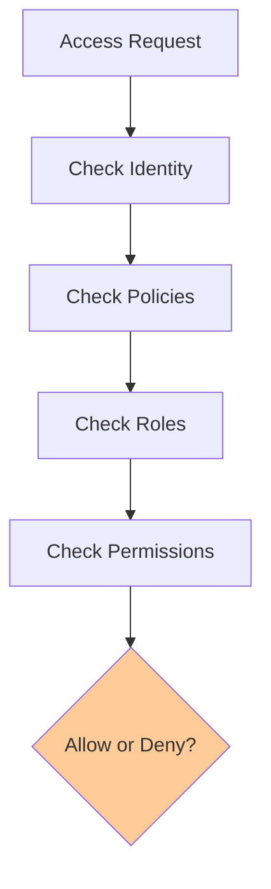
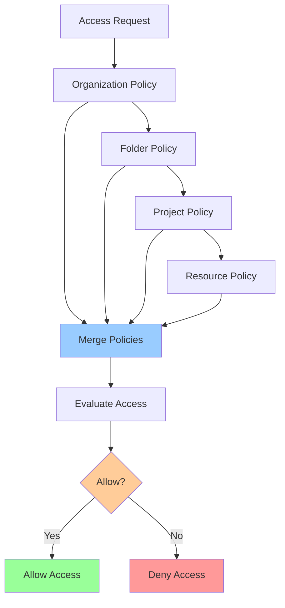

# IAM Evaluation Model

**One-line summary**: How GCP IAM policies are evaluated, common footguns, and how to design secure access controls.

**Prerequisites**: Basic understanding of authentication and authorization.

---

## Mental Model

### IAM Components

**IAM (Identity and Access Management)** controls who can do what on which resources.

**Components**:
- **Identity**: Who (users, service accounts, groups)
- **Resource**: What resource (projects, instances, buckets)
- **Permission**: What action (read, write, delete)
- **Role**: Collection of permissions
- **Policy**: Binding of identity to role on resource

### Policy Evaluation



**Key principle**: **Deny by default**. Access is denied unless explicitly allowed.

### Policy Hierarchy Evaluation



---

## Internals & Architecture

### Policy Hierarchy

**Resource hierarchy**: Organization → Folder → Project → Resource

**Policy inheritance**: Policies are inherited from parent to child.

**Example**:
- Organization policy: All users can read
- Project policy: Specific users can write
- **Result**: Users inherit read from org, get write from project

### Policy Evaluation Process

1. **Collect policies**: Gather all policies from resource hierarchy
2. **Merge policies**: Combine policies (union of allows)
3. **Check identity**: Verify identity is authenticated
4. **Check bindings**: Check if identity has role binding
5. **Check permissions**: Check if role has required permission
6. **Decision**: Allow if any policy allows, deny otherwise

### Policy Types

#### 1. IAM Policy Bindings

**Structure**: `identity → role → resource`

**Example**:
```
user:alice@example.com → roles/storage.objectViewer → bucket:my-bucket
```

**Evaluation**: Check if identity has role on resource.

#### 2. Organization Policies

**Structure**: Constraints on resources.

**Example**: `constraints/compute.requireOsLogin`

**Evaluation**: Check if resource violates constraint.

#### 3. VPC Firewall Rules

**Structure**: Network-level access control.

**Example**: Allow traffic from specific IP ranges.

**Evaluation**: Check if traffic matches rule.

### Roles

#### Predefined Roles

**Types**:
- **Viewer**: Read-only access
- **Editor**: Read and write access
- **Owner**: Full access including IAM management
- **Service-specific**: Roles for specific services (e.g., `roles/storage.objectViewer`)

#### Custom Roles

**Definition**: User-defined roles with specific permissions.

**Use case**: Principle of least privilege.

**Example**: Custom role with only `storage.objects.get` permission.

### Service Accounts

**Service accounts**: Identities for applications, not users.

**Types**:
- **User-managed**: Created by users
- **Google-managed**: Created by Google (e.g., Compute Engine default)

**Best practices**:
- Use service accounts for applications
- Use workload identity for GKE
- Rotate service account keys regularly

### Workload Identity

**Workload Identity**: Allows GKE pods to use GCP service accounts.

**Process**:
1. Pod uses Kubernetes service account
2. Workload Identity maps KSA to GSA
3. Pod authenticates as GSA
4. Pod accesses GCP resources

**Benefits**: No need to store service account keys in pods.

---

## Failure Modes & Blast Radius

### IAM Failures

#### Scenario 1: Overly Permissive Policies
- **Impact**: Users have more access than needed
- **Blast radius**: All resources with policy
- **Detection**: IAM audit logs, access reviews
- **Recovery**: Tighten policies, remove unnecessary roles

#### Scenario 2: Missing Policies
- **Impact**: Legitimate access denied, services fail
- **Blast radius**: Affected services
- **Detection**: Access denied errors, service failures
- **Recovery**: Add missing policies, verify access

#### Scenario 3: Service Account Key Leakage
- **Impact**: Attackers can impersonate service account
- **Blast radius**: All resources accessible by service account
- **Detection**: Unusual access patterns, key usage alerts
- **Recovery**: Rotate keys, revoke compromised keys

#### Scenario 4: Policy Inheritance Issues
- **Impact**: Unexpected access granted or denied
- **Blast radius**: Resources in hierarchy
- **Detection**: Access reviews, policy audits
- **Recovery**: Fix policy hierarchy, verify inheritance

### Common Footguns

#### 1. Using Owner Role

**Problem**: Owner role has too many permissions (can modify IAM).

**Solution**: Use Editor role or custom roles with specific permissions.

#### 2. Service Account Keys in Code

**Problem**: Keys stored in code can be leaked.

**Solution**: Use workload identity, secret manager, or environment variables.

#### 3. Public Access on Resources

**Problem**: Resources accessible to all users (including external).

**Solution**: Use private resources, limit access with IAM.

#### 4. Overly Broad Policies

**Problem**: Policies grant access to too many resources.

**Solution**: Use resource-specific policies, principle of least privilege.

#### 5. Missing Audit Logs

**Problem**: Can't track who accessed what.

**Solution**: Enable audit logs, monitor access.

---

## Observability Contract

### Metrics to Track

#### IAM Metrics
- **Policy changes**: Number of policy changes
- **Access denials**: Number of access denied errors
- **Service account usage**: Service account key usage

#### Audit Logs
- **Admin activity**: IAM policy changes
- **Data access**: Resource access (if enabled)
- **System events**: System-level events

### Logs

Log events:
- IAM policy changes
- Access denied errors
- Service account key usage
- Unusual access patterns

### Alerts

**Critical alerts**:
- IAM policy changes (especially Owner role)
- Service account key creation
- Unusual access patterns
- Public access granted

**Warning alerts**:
- Access denial spikes
- Service account key usage spikes

---

## Change Safety

### Policy Changes

#### Adding Policies
- **Process**: Add policy binding, verify access
- **Risk**: Low (additive change)
- **Rollback**: Remove policy binding

#### Removing Policies
- **Process**: Remove policy binding, verify services still work
- **Risk**: High (may break access)
- **Rollback**: Re-add policy binding

#### Changing Roles
- **Process**: Update role bindings, verify access
- **Risk**: Medium (may grant or revoke access)
- **Rollback**: Revert role bindings

### Testing Strategy

1. **Access testing**: Verify users have correct access
2. **Denial testing**: Verify users don't have excessive access
3. **Service account testing**: Verify service accounts work correctly
4. **Policy inheritance testing**: Verify inheritance works correctly

---

## Security Boundaries

### Identity Security

- **Authentication**: Verify identity (MFA, service account keys)
- **Authorization**: Verify permissions (IAM policies)
- **Audit**: Track access (audit logs)

### Resource Security

- **Private resources**: Use private IPs, VPCs
- **Public resources**: Limit public access with IAM
- **Encryption**: Encrypt data at rest and in transit

### Policy Security

- **Least privilege**: Grant minimum necessary permissions
- **Regular reviews**: Review policies regularly
- **Automation**: Use policy as code (Terraform, etc.)

---

## Tradeoffs

### Policy Granularity

**Fine-grained policies**:
- **Pros**: Better security, least privilege
- **Cons**: More complex, harder to manage

**Coarse-grained policies**:
- **Pros**: Simpler, easier to manage
- **Cons**: Less secure, more permissions than needed

### Service Account Keys vs Workload Identity

**Service account keys**:
- **Pros**: Works everywhere, simple
- **Cons**: Key management, security risk

**Workload identity**:
- **Pros**: No keys, more secure
- **Cons**: GKE only, more complex

---

## Operational Considerations

### Capacity Planning

**IAM policies**: 
- Limit: 1,500 bindings per policy
- Limit: 100 custom roles per organization

**Service accounts**:
- Limit: 100 service accounts per project (can request increase)

### Monitoring & Debugging

**Monitor**:
- Policy changes
- Access denials
- Service account usage
- Unusual access patterns

**Debug access issues**:
1. Check identity: Is user/service account authenticated?
2. Check policies: Does identity have role binding?
3. Check permissions: Does role have required permission?
4. Check inheritance: Are policies inherited correctly?
5. Check constraints: Are organization policies blocking access?

### Incident Response

**Common incidents**:
- Access denied errors
- Service account failures
- Policy misconfigurations

**Response**:
1. Check IAM policies
2. Check service account permissions
3. Check audit logs
4. Verify access
5. Fix policies if needed

---

## What Staff Engineers Ask in Reviews

### Design Questions
- "What's the IAM policy structure?"
- "Who has Owner role?"
- "How are service accounts used?"
- "What's the principle of least privilege?"

### Security Questions
- "Are service account keys stored securely?"
- "Is public access enabled?"
- "Are audit logs enabled?"
- "How are policies reviewed?"

### Operational Questions
- "How do we monitor IAM?"
- "What alerts do we have?"
- "How do we debug access issues?"

---

## Further Reading

**Comprehensive Guide**: [Further Reading: IAM Evaluation Model](../further-reading/iam-evaluation.md)

**Quick Links**:
- [GCP IAM Documentation](https://cloud.google.com/iam/docs)
- [IAM Best Practices](https://cloud.google.com/iam/docs/using-iam-securely)
- "BeyondCorp: A New Approach to Enterprise Security" (Google Research)
- [Workload Identity](https://cloud.google.com/kubernetes-engine/docs/how-to/workload-identity)
- [Back to GCP Core Building Blocks](README.md)

---

## Exercises

1. **Design IAM policies**: Design IAM policies for a multi-tier application. Who can access what? What roles do you use?

2. **Service account strategy**: You're deploying a GKE application that needs to access Cloud Storage. Do you use service account keys or workload identity? Why?

3. **Debug access issue**: A service is getting "permission denied" errors accessing a bucket. How do you debug this?

**Answer Key**: [View Answers](../../exercises/answers/iam-evaluation-answers.md)

