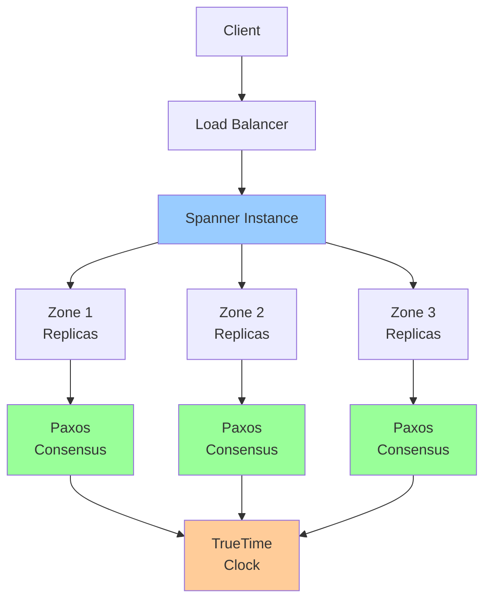

# Spanner: Consistency & Performance

**One-line summary**: Deep dive into Spanner's TrueTime, distributed transactions, external consistency guarantees, and how to design schemas for scale.

**Prerequisites**: [Consensus & Leases](../02-distributed-systems/consensus-leases.md), [Replication Strategies](../02-distributed-systems/replication.md), Basic database concepts (ACID, transactions).

---

## Mental Model

### Spanner Architecture



**Key insight**: Spanner provides external consistency (stronger than serializability) using TrueTime and Paxos. Understanding TrueTime is critical for understanding Spanner's guarantees.

### Consistency Model

**External Consistency**: Strongest consistency guarantee.
- **Definition**: All transactions appear to execute in a global order
- **Guarantee**: If transaction T1 commits before T2 starts, T2 sees T1's writes
- **Use case**: Financial transactions, inventory management

**Serializability**: Standard database consistency.
- **Definition**: Transactions appear to execute serially
- **Guarantee**: No anomalies (dirty reads, lost updates)
- **Use case**: General-purpose applications

---

## Internals & Architecture

### TrueTime

**TrueTime**: Spanner's distributed clock.

**Components**:
- **GPS clocks**: Atomic clocks synchronized via GPS
- **Atomic clocks**: High-precision clocks
- **Time uncertainty**: Bounded clock uncertainty (ε)

**Time representation**: `TTinterval = [earliest, latest]`
- **earliest**: Earliest possible time
- **latest**: Latest possible time
- **ε**: Clock uncertainty (typically < 7ms)

**Why TrueTime?**
- **External consistency**: Enables external consistency without blocking
- **Global ordering**: Provides global transaction ordering
- **Low latency**: Avoids expensive coordination

### Paxos Consensus

**Paxos**: Consensus algorithm for replication.

**How it works**:
1. **Leader election**: Elect leader for each Paxos group
2. **Proposal**: Leader proposes writes
3. **Voting**: Replicas vote on proposals
4. **Commit**: Commit when majority agrees

**Replication**:
- **Multi-region**: Replicas across regions
- **Quorum**: Majority of replicas must agree
- **Durability**: Data durable once committed

### Distributed Transactions

#### Two-Phase Commit (2PC)

**Process**:
1. **Prepare phase**: Coordinator asks participants to prepare
2. **Commit phase**: Coordinator commits if all prepared, aborts otherwise

**Spanner's 2PC**:
- **Paxos per shard**: Each shard uses Paxos
- **Coordinator**: Coordinates across shards
- **TrueTime**: Uses TrueTime for commit timestamps

#### Read-Write Transactions

**Process**:
1. **Read**: Read from consistent snapshot
2. **Write**: Buffer writes locally
3. **Commit**: Two-phase commit with TrueTime timestamp
4. **External consistency**: Commit timestamp ensures external consistency

**Example**:
```
T1: Write X=1, commit at t1
T2: Starts at t2 > t1, reads X, sees X=1
```

#### Read-Only Transactions

**Process**:
1. **Snapshot**: Read from consistent snapshot
2. **No locks**: No locks needed (read-only)
3. **Low latency**: Can read from nearby replica

**Use case**: Analytics, reporting, read-heavy workloads

### Schema Design

#### Tables

**Tables**: Collections of rows.

**Schema**:
```sql
CREATE TABLE Users (
  UserId INT64 NOT NULL,
  Name STRING(MAX),
  Email STRING(MAX),
  CreatedAt TIMESTAMP,
) PRIMARY KEY (UserId);
```

**Primary key**: Required, determines data distribution.

#### Interleaving

**Interleaved tables**: Co-locate related data.

**Example**:
```sql
CREATE TABLE Orders (
  OrderId INT64 NOT NULL,
  UserId INT64 NOT NULL,
  Total FLOAT64,
) PRIMARY KEY (UserId, OrderId),
  INTERLEAVE IN PARENT Users ON DELETE CASCADE;
```

**Benefits**:
- **Co-location**: Related data on same server
- **Performance**: Faster joins, better locality
- **Transactions**: Can update parent and child in same transaction

#### Secondary Indexes

**Indexes**: Improve query performance.

**Types**:
- **Storing indexes**: Store additional columns (covering indexes)
- **Null-filtered indexes**: Filter NULL values
- **Array indexes**: Index array elements

**Tradeoffs**:
- **Write cost**: Indexes increase write cost
- **Storage cost**: Indexes consume storage
- **Query performance**: Indexes improve query performance

### Performance Characteristics

#### Latency

**Read latency**:
- **Single region**: P95 < 10ms
- **Multi-region**: P95 < 50ms (depends on distance)

**Write latency**:
- **Single region**: P95 < 10ms
- **Multi-region**: P95 < 100ms (2PC overhead)

#### Throughput

**Read throughput**:
- **Scales linearly**: With number of nodes
- **Bottleneck**: Usually network bandwidth

**Write throughput**:
- **Scales linearly**: With number of nodes
- **Bottleneck**: Usually 2PC coordination overhead

#### Scalability

**Limits**:
- **Database size**: Petabytes
- **Nodes**: Thousands of nodes
- **QPS**: Millions of queries per second
- **Regions**: Global distribution

---

## Failure Modes & Blast Radius

### Spanner Failures

#### Scenario 1: Regional Outage
- **Impact**: Replicas in affected region unavailable
- **Blast radius**: Affected region (other regions continue)
- **Detection**: Replica health checks fail, increased latency
- **Recovery**: 
  - Automatic failover to other regions
  - Replicas restored when region recovers
- **Mitigation**: 
  - Multi-region configuration
  - Sufficient replicas per region

#### Scenario 2: Leader Failure
- **Impact**: Paxos group loses leader, temporary unavailability
- **Blast radius**: Affected Paxos group
- **Detection**: Leader health checks fail
- **Recovery**: 
  - Automatic leader election (< 10 seconds)
  - Service resumes after leader election
- **Mitigation**: 
  - Multiple replicas per Paxos group
  - Automatic leader election

#### Scenario 3: TrueTime Failure
- **Impact**: Cannot assign commit timestamps, transactions fail
- **Blast radius**: All transactions
- **Detection**: TrueTime API errors, transaction failures
- **Recovery**: TrueTime has redundancy, automatic failover
- **Mitigation**: TrueTime has multiple atomic clocks (redundancy)

### Consistency Failures

#### Scenario 1: Clock Skew
- **Impact**: External consistency may be violated
- **Blast radius**: Transactions during clock skew
- **Detection**: TrueTime uncertainty increases
- **Recovery**: TrueTime waits for uncertainty to decrease
- **Mitigation**: TrueTime has bounded uncertainty (< 7ms)

#### Scenario 2: Network Partition
- **Impact**: Cannot reach majority, writes fail
- **Blast radius**: Affected Paxos groups
- **Detection**: Cannot reach quorum, write failures
- **Recovery**: 
  - Partition resolves, quorum restored
  - Writes resume after partition resolves
- **Mitigation**: 
  - Multi-region configuration (reduces partition risk)
  - Sufficient replicas per region

### Performance Failures

#### Scenario 1: Hot Spots
- **Impact**: Single node overloaded, increased latency
- **Blast radius**: Affected shard
- **Detection**: High latency on specific keys, node CPU high
- **Recovery**: 
  - Redesign schema (better key distribution)
  - Add more nodes (may not help if hot spot persists)
- **Mitigation**: 
  - Design keys for even distribution
  - Monitor hot spots
  - Use interleaving to co-locate related data

#### Scenario 2: Transaction Conflicts
- **Impact**: Transactions abort, retries needed
- **Blast radius**: Conflicting transactions
- **Detection**: High abort rate, transaction retries
- **Recovery**: 
  - Implement exponential backoff
  - Redesign transactions (reduce conflict probability)
- **Mitigation**: 
  - Design transactions to minimize conflicts
  - Use read-only transactions when possible
  - Batch operations when possible

### Overload Scenarios

#### 10× Normal Load
- **Latency**: May increase, especially for writes (2PC overhead)
- **Throughput**: Handles load, may need to scale nodes
- **Consistency**: Maintains consistency, may see increased latency

#### 100× Normal Load
- **Latency**: Significantly increased, may need scaling
- **Throughput**: May need significant scaling
- **Consistency**: Maintains consistency, but latency may be high

---

## Observability Contract

### Metrics to Track

#### Database Metrics
- **QPS**: Queries per second (read/write)
- **Latency**: P50/P95/P99 latency (read/write)
- **Error rate**: Error rate (4xx/5xx)
- **Transaction rate**: Transactions per second
- **Abort rate**: Transaction abort rate

#### Node Metrics
- **CPU**: CPU utilization per node
- **Memory**: Memory utilization per node
- **Disk**: Disk I/O per node
- **Network**: Network bandwidth per node

#### Replication Metrics
- **Replica lag**: Replication lag between replicas
- **Leader elections**: Leader election count
- **Paxos latency**: Paxos consensus latency

### Logs

**Spanner logs**:
- Query logs (if enabled)
- Transaction logs
- Error logs
- Admin activity logs

### Alerts

**Critical alerts**:
- Database unavailable
- High error rate (> 1%)
- High latency (> threshold)
- Replica failures

**Warning alerts**:
- High abort rate
- Hot spots detected
- Replica lag increasing
- Node resource exhaustion

---

## Change Safety

### Schema Changes

#### Adding Tables
- **Process**: Create table, verify schema
- **Risk**: Low (additive change)
- **Rollback**: Drop table (if empty)

#### Adding Columns
- **Process**: Add column, verify application compatibility
- **Risk**: Low (additive change, nullable columns)
- **Rollback**: Drop column (if not used)

#### Changing Primary Key
- **Process**: Cannot change primary key (requires table recreation)
- **Risk**: High (requires data migration)
- **Rollback**: Recreate table with old primary key

### Index Changes

#### Adding Indexes
- **Process**: Create index, verify query performance
- **Risk**: Medium (increases write cost)
- **Rollback**: Drop index

#### Removing Indexes
- **Process**: Drop index, verify query performance
- **Risk**: Medium (may slow queries)
- **Rollback**: Recreate index

### Configuration Changes

#### Changing Replication
- **Process**: Update replication configuration, verify availability
- **Risk**: High (affects availability, requires downtime)
- **Rollback**: Revert replication configuration

#### Scaling Nodes
- **Process**: Add/remove nodes, verify performance
- **Risk**: Medium (may affect performance temporarily)
- **Rollback**: Revert node count

---

## Security Boundaries

### Access Control

- **IAM**: Database and table-level IAM policies
- **Row-level security**: Filter rows based on identity (if configured)
- **Encryption**: Encryption at rest and in transit

### Encryption

**At rest**:
- **Google-managed keys**: Default encryption
- **Customer-managed keys**: Cloud KMS keys

**In transit**:
- **TLS**: All connections use TLS
- **Encryption**: Data encrypted in transit

### Data Protection

- **Backups**: Automatic backups (point-in-time recovery)
- **Audit logs**: Audit all database access
- **Data retention**: Configurable data retention

---

## Tradeoffs

### Consistency: External vs Serializability

**External consistency**:
- **Pros**: Strongest guarantee, no anomalies
- **Cons**: Higher latency (TrueTime wait), higher cost

**Serializability**:
- **Pros**: Standard guarantee, lower latency
- **Cons**: Weaker than external consistency

### Replication: Multi-Region vs Regional

**Multi-region**:
- **Pros**: Highest availability, disaster recovery
- **Cons**: Higher latency, higher cost

**Regional**:
- **Pros**: Lower latency, lower cost
- **Cons**: Single region failure affects availability

### Schema: Normalized vs Denormalized

**Normalized**:
- **Pros**: Less storage, easier updates
- **Cons**: More joins, potentially slower queries

**Denormalized**:
- **Pros**: Faster queries, fewer joins
- **Cons**: More storage, harder updates

---

## Operational Considerations

### Capacity Planning

**Storage**:
- **Growth**: Plan for storage growth
- **Backups**: Plan for backup storage
- **Indexes**: Plan for index storage

**Compute**:
- **Nodes**: Plan for node capacity
- **QPS**: Plan for query throughput
- **Scaling**: Plan for auto-scaling

### Monitoring & Debugging

**Monitor**:
- Query performance
- Transaction performance
- Node health
- Replication health

**Debug issues**:
1. Check query performance (slow queries)
2. Check transaction conflicts
3. Check hot spots
4. Check node health
5. Check replication lag
6. Review logs

### Incident Response

**Common incidents**:
- High latency
- Transaction conflicts
- Hot spots
- Replica failures

**Response**:
1. Check database health
2. Check query performance
3. Check transaction conflicts
4. Check hot spots
5. Scale if needed
6. Contact support if persistent

---

## What Staff Engineers Ask in Reviews

### Design Questions
- "What's the schema design?"
- "How are transactions used?"
- "What's the replication configuration?"
- "How is consistency guaranteed?"

### Scale Questions
- "What happens at 10× load?"
- "How does Spanner scale?"
- "What are the hot spots?"
- "How do you handle transaction conflicts?"

### Consistency Questions
- "What consistency guarantees are needed?"
- "How is external consistency achieved?"
- "What's the TrueTime uncertainty?"
- "How are conflicts handled?"

### Operational Questions
- "How do you monitor Spanner?"
- "What alerts do you have?"
- "How do you debug performance issues?"
- "What's the backup strategy?"

---

## Further Reading

**Comprehensive Guide**: [Further Reading: Spanner](../further-reading/spanner.md)

**Quick Links**:
- [Spanner Documentation](https://cloud.google.com/spanner/docs)
- "Spanner: Google's Globally-Distributed Database" (Corbett et al., 2012)
- "Spanner, TrueTime and The CAP Theorem" (Google Research)
- [Schema Design](https://cloud.google.com/spanner/docs/schema-design)
- [Back to GCP Core Building Blocks](README.md)

---

## Exercises

1. **Design schema**: Design a schema for an e-commerce application. What tables? What indexes? How do you handle interleaving?

2. **Handle consistency**: Your application needs external consistency. How do you ensure this with Spanner?

3. **Optimize performance**: Your queries are slow. How do you optimize them? What indexes do you add?

**Answer Key**: [View Answers](../exercises/answers/spanner-answers.md)

