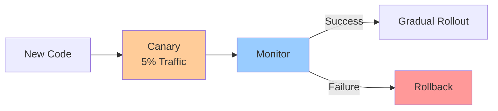

# Canary Deployments & Rollouts

**One-line summary**: How to deploy changes safely using canary deployments and gradual rollouts to minimize risk.

**Prerequisites**: [Testing for Failure](testing-for-failure.md), understanding of deployment strategies.

---

## Mental Model

### Deployment Risk

**Deployment risk**: New code may introduce bugs, performance issues, or outages.

**Mitigation**: Gradual rollout reduces risk by limiting blast radius.

**Key insight**: Canary deployments and gradual rollouts minimize risk by testing changes on small subset before full rollout.

---

## Internals & Architecture

### Canary Deployment

**Canary process**:
1. **Deploy**: Deploy new version to canary (small percentage)
2. **Monitor**: Monitor metrics (error rate, latency, SLOs)
3. **Decision**: Proceed or rollback based on metrics
4. **Rollout**: Gradually increase traffic if successful

**Canary size**: Typically 5-10% of traffic.

**Monitoring**: Monitor for 15-30 minutes before proceeding.

### Gradual Rollout

**Rollout phases**:
1. **Canary**: 5% traffic
2. **Phase 1**: 25% traffic
3. **Phase 2**: 50% traffic
4. **Phase 3**: 100% traffic

**Time between phases**: 15-30 minutes for monitoring.

**Rollback**: Rollback at any phase if issues detected.

### Blue-Green Deployment

**Blue-Green process**:
1. **Deploy**: Deploy new version to green environment
2. **Test**: Test green environment
3. **Switch**: Switch traffic from blue to green
4. **Rollback**: Switch back to blue if issues

**Use case**: When instant switchover is needed.

---

## Failure Modes & Blast Radius

### Deployment Failures

#### Scenario 1: Canary Failure
- **Impact**: 5% of users affected, issues detected early
- **Blast radius**: Canary users only
- **Detection**: Metrics show issues in canary
- **Recovery**: Rollback canary immediately
- **Mitigation**: Canary deployment, fast rollback

#### Scenario 2: Gradual Rollout Failure
- **Impact**: Increasing percentage of users affected
- **Blast radius**: Users in rollout percentage
- **Detection**: Metrics show issues at higher percentage
- **Recovery**: Rollback to previous phase
- **Mitigation**: Gradual rollout, monitoring at each phase

---

## Observability Contract

### Metrics

- **Error rate**: Error rate per deployment phase
- **Latency**: Latency per deployment phase
- **SLO compliance**: SLO compliance per phase
- **Rollback rate**: Frequency of rollbacks

### Alerts

- Error rate spike in canary
- Latency increase in canary
- SLO violation in canary
- Rollback triggered

---

## Change Safety

### Deployment Process

- **Process**: Follow canary → gradual rollout process
- **Risk**: Low (limited blast radius)
- **Rollback**: Fast rollback at any phase

---

## Tradeoffs

### Canary vs Blue-Green

**Canary**:
- **Pros**: Lower risk, gradual rollout
- **Cons**: More complex, longer process

**Blue-Green**:
- **Pros**: Simpler, instant switchover
- **Cons**: Higher risk, all-or-nothing

---

## Operational Considerations

### Best Practices

1. **Start small**: Begin with small canary
2. **Monitor closely**: Monitor metrics at each phase
3. **Rollback quickly**: Fast rollback if issues
4. **Document process**: Document deployment process

---

## What Staff Engineers Ask in Reviews

- "What's the deployment strategy?"
- "How is the canary configured?"
- "What metrics are monitored?"
- "What's the rollback process?"

---

## Further Reading

**Comprehensive Guide**: [Further Reading: Canary Rollouts](../further-reading/canary-rollouts.md)

**Quick Links**:
- [Testing for Failure](testing-for-failure.md)
- [SLIs, SLOs & Error Budgets](sli-slo-error-budget.md)
- [Multi-Region API](../06-case-studies/multi-region-api.md)
- [Back to Reliability & SRE](README.md)

---

## Exercises

1. **Design canary**: Design a canary deployment process. What percentage? How long?

2. **Handle canary failure**: Your canary shows issues. How do you respond?

3. **Plan rollout**: Plan a gradual rollout. What are the phases?

**Answer Key**: [View Answers](../exercises/answers/canary-rollouts-answers.md)

