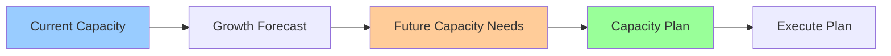

# Capacity Planning & Forecasting

**One-line summary**: How to plan capacity, forecast growth, and ensure systems can handle future load.

**Prerequisites**: [Capacity Math](../01-foundations/capacity-math.md), [SLIs, SLOs & Error Budgets](sli-slo-error-budget.md).

---

## Mental Model

### Capacity Planning Process

**Key insight**: Capacity planning balances current needs, growth forecasts, and cost constraints.

### Capacity Components

**Compute**: CPU, memory, processing capacity.
**Storage**: Disk space, data growth.
**Network**: Bandwidth, connection capacity.
**Database**: Query capacity, connection pools.

---

## Internals & Architecture

### Capacity Measurement

#### Current Capacity

**Measure**:
- **Peak load**: Maximum load handled
- **Utilization**: Current utilization percentage
- **Headroom**: Available capacity above current load

**Metrics**:
- **QPS**: Queries per second
- **Throughput**: Data processed per second
- **Latency**: Response latency
- **Error rate**: Error rate under load

#### Growth Forecasting

**Forecasting methods**:
- **Historical growth**: Extrapolate from historical data
- **Business projections**: Use business growth projections
- **Seasonal patterns**: Account for seasonal variations
- **Event-driven**: Plan for known events

**Time horizons**:
- **Short-term**: 1-3 months
- **Medium-term**: 3-12 months
- **Long-term**: 1+ years

### Capacity Planning

#### Planning Process

1. **Measure current**: Measure current capacity and utilization
2. **Forecast growth**: Forecast future growth
3. **Calculate needs**: Calculate future capacity needs
4. **Plan capacity**: Plan capacity additions
5. **Execute plan**: Execute capacity plan

#### Capacity Models

**Linear growth**: Capacity needs grow linearly.
**Exponential growth**: Capacity needs grow exponentially.
**Step function**: Capacity needs increase in steps.

---

## Failure Modes & Blast Radius

### Capacity Failures

#### Scenario 1: Under-provisioning
- **Impact**: System overloaded, service degradation
- **Blast radius**: All users
- **Detection**: High utilization, increased latency
- **Recovery**: Scale up capacity immediately
- **Mitigation**: Better forecasting, proactive scaling

#### Scenario 2: Over-provisioning
- **Impact**: High costs, wasted resources
- **Blast radius**: Budget
- **Detection**: Low utilization, high costs
- **Recovery**: Scale down capacity
- **Mitigation**: Right-size capacity, optimize costs

---

## Observability Contract

### Metrics

- **Current capacity**: Current capacity utilization
- **Growth rate**: Rate of capacity growth
- **Forecast accuracy**: Accuracy of forecasts
- **Capacity headroom**: Available capacity

### Alerts

- Capacity approaching limits
- Forecast exceeded
- High utilization
- Capacity shortage

---

## Change Safety

### Capacity Changes

- **Process**: Add capacity, verify performance
- **Risk**: Low (additive change)
- **Rollback**: Remove capacity if needed

---

## Tradeoffs

### Over-provisioning vs Under-provisioning

**Over-provisioning**:
- **Pros**: Always have capacity, no outages
- **Cons**: Higher costs, wasted resources

**Under-provisioning**:
- **Pros**: Lower costs, efficient resource use
- **Cons**: Risk of outages, service degradation

---

## Operational Considerations

### Best Practices

1. **Measure continuously**: Track capacity and utilization
2. **Forecast accurately**: Use multiple forecasting methods
3. **Plan proactively**: Plan capacity before needed
4. **Monitor closely**: Monitor capacity and adjust

---

## What Staff Engineers Ask in Reviews

- "What's the current capacity?"
- "How is growth forecasted?"
- "What's the capacity plan?"
- "How is capacity monitored?"

---

## Further Reading

**Comprehensive Guide**: [Further Reading: Capacity Planning](../further-reading/capacity-planning.md)

**Quick Links**:
- [Capacity Math](../01-foundations/capacity-math.md)
- [SLIs, SLOs & Error Budgets](sli-slo-error-budget.md)
- [Back to Reliability & SRE](README.md)

---

## Exercises

1. **Forecast capacity**: Forecast capacity needs for next 6 months. What's the method?

2. **Plan capacity**: Plan capacity additions for 2× growth. What's the strategy?

3. **Handle capacity shortage**: Your system is running out of capacity. How do you handle it?

**Answer Key**: [View Answers](../exercises/answers/capacity-planning-answers.md)

