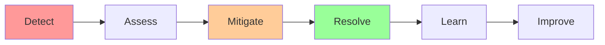

# Incident Response & Postmortems

**One-line summary**: How to respond to incidents effectively, write postmortems, and learn from failures.

**Prerequisites**: [SLIs, SLOs & Error Budgets](sli-slo-error-budget.md), understanding of monitoring and alerting.

---

## Mental Model

### Incident Response Lifecycle

**Key insight**: Effective incident response requires preparation, clear processes, and learning from incidents.

### Incident Severity

**P0 (Critical)**: Complete outage, data loss, security breach.
**P1 (High)**: Partial outage, degraded performance.
**P2 (Medium)**: Minor issues, non-critical errors.
**P3 (Low)**: Cosmetic issues, minor bugs.

---

## Internals & Architecture

### Incident Response Process

#### 1. Detection

**Detection methods**:
- **Monitoring alerts**: Automated alerts from monitoring
- **User reports**: Users reporting issues
- **Health checks**: Health check failures
- **Error rates**: Spike in error rates

**Detection time**: Minimize time to detection (MTTD).

#### 2. Assessment

**Assessment steps**:
1. **Acknowledge**: Acknowledge incident, create ticket
2. **Triage**: Assess severity and impact
3. **Escalate**: Escalate if needed
4. **Communicate**: Communicate to stakeholders

**Assessment questions**:
- What is affected?
- How many users affected?
- What's the severity?
- What's the root cause?

#### 3. Mitigation

**Mitigation strategies**:
- **Rollback**: Rollback recent changes
- **Scale**: Scale up resources
- **Circuit breakers**: Enable circuit breakers
- **Load shedding**: Shed non-critical load

**Mitigation goal**: Restore service quickly.

#### 4. Resolution

**Resolution steps**:
1. **Fix root cause**: Fix underlying issue
2. **Verify fix**: Verify service restored
3. **Monitor**: Monitor for recurrence
4. **Communicate**: Communicate resolution

#### 5. Postmortem

**Postmortem process**:
1. **Timeline**: Document incident timeline
2. **Root cause**: Identify root cause
3. **Impact**: Assess impact
4. **Actions**: Define action items
5. **Share**: Share learnings

---

## Failure Modes & Blast Radius

### Incident Response Failures

#### Scenario 1: Slow Detection
- **Impact**: Extended outage, more users affected
- **Blast radius**: All users during detection delay
- **Detection**: High MTTD
- **Recovery**: Improve monitoring, reduce alert thresholds
- **Mitigation**: Better monitoring, faster alerts

#### Scenario 2: Poor Communication
- **Impact**: Confusion, delayed resolution
- **Blast radius**: Incident response team
- **Detection**: Communication gaps
- **Recovery**: Improve communication processes
- **Mitigation**: Clear communication channels, runbooks

---

## Observability Contract

### Metrics

- **MTTD**: Mean time to detection
- **MTTR**: Mean time to resolution
- **Incident frequency**: Incidents per time period
- **Postmortem completion**: Postmortems written per incident

### Alerts

- Incident detected
- High MTTD
- High MTTR
- Missing postmortems

---

## Change Safety

### Incident Response Process Changes

- **Process**: Update processes, train team
- **Risk**: Low (process improvement)
- **Rollback**: Revert process changes

---

## Security Boundaries

- **Incident data**: Protect sensitive incident data
- **Access control**: Limit access to incident systems
- **Audit**: Audit incident response actions

---

## Tradeoffs

### Speed vs Accuracy

**Fast response**:
- **Pros**: Faster resolution, less impact
- **Cons**: May miss root cause

**Thorough response**:
- **Pros**: Better understanding, fewer recurrences
- **Cons**: Slower resolution, more impact

---

## Operational Considerations

### Best Practices

1. **Prepare**: Runbooks, playbooks, training
2. **Practice**: Regular incident drills
3. **Learn**: Postmortems, action items
4. **Improve**: Continuous improvement

---

## What Staff Engineers Ask in Reviews

- "What's the incident response process?"
- "How are incidents detected?"
- "What's the escalation process?"
- "How are postmortems conducted?"

---

## Further Reading

**Comprehensive Guide**: [Further Reading: Incident Response](../further-reading/incident-response.md)

**Quick Links**:
- "Site Reliability Engineering" (Google SRE Book) - Chapter on Incident Response
- [PRR Checklist](prr-checklist.md)
- [SLIs, SLOs & Error Budgets](sli-slo-error-budget.md)
- [Back to Reliability & SRE](README.md)

---

## Exercises

1. **Design incident response**: Design an incident response process. What are the steps?

2. **Write postmortem**: Write a postmortem for a hypothetical incident. What's included?

3. **Handle incident**: Your service is down. How do you respond? What's the process?

**Answer Key**: [View Answers](../exercises/answers/incident-response-answers.md)

