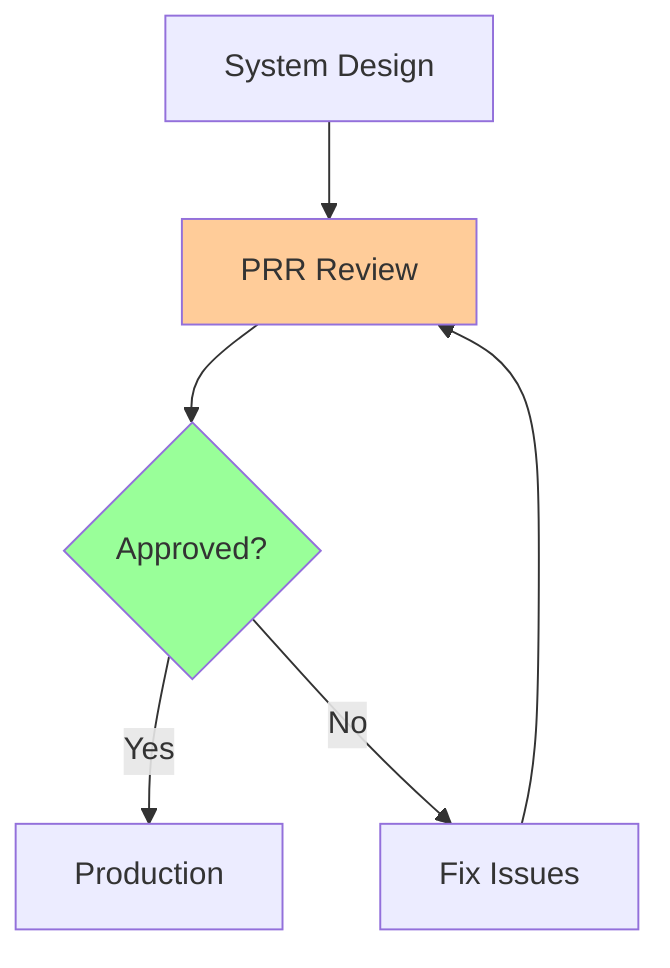
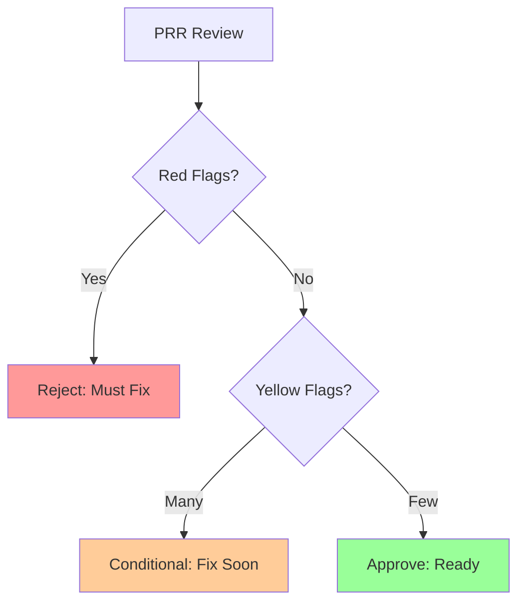

# Production Readiness Review (PRR) Checklist

**One-line summary**: What staff engineers and SREs actually look for in production readiness reviews.

**Prerequisites**: [SLIs/SLOs](sli-slo-error-budget.md), understanding of production systems.

---

## Mental Model

### PRR Purpose

**Key insight**: PRR ensures systems are ready for production. It's not about perfection—it's about identifying and mitigating risks.

### PRR Scope

**What PRR covers**:
- Reliability (SLIs/SLOs, error budgets)
- Observability (monitoring, logging, tracing)
- Security (authentication, authorization, encryption)
- Operations (runbooks, on-call, incidents)
- Capacity (scaling, load testing)

**What PRR doesn't cover**:
- Feature completeness (that's product review)
- Code quality (that's code review)
- Performance optimization (that's performance review)

---

## Staff-Level PRR Checklist

### 1. SLIs, SLOs & Error Budgets

#### SLIs Defined
- [ ] **User-facing SLIs**: SLIs measure what users experience
- [ ] **Measurable**: SLIs can be measured accurately
- [ ] **Actionable**: SLIs change when system behavior changes
- [ ] **Documented**: SLIs are documented and understood

**Common failures**:
- Using internal metrics (CPU, memory) as SLIs
- SLIs that don't reflect user experience
- SLIs that can't be measured reliably

#### SLOs Set
- [ ] **Realistic targets**: SLOs are achievable based on baseline
- [ ] **Appropriate for criticality**: P0 services have tighter SLOs
- [ ] **Documented**: SLOs are documented and communicated
- [ ] **Monitored**: SLO compliance is tracked

**Common failures**:
- SLOs set without baseline measurement
- SLOs too aggressive (constant violations)
- SLOs too lax (poor user experience)

#### Error Budgets
- [ ] **Calculated**: Error budgets are calculated from SLOs
- [ ] **Policy defined**: Error budget policy is defined
- [ ] **Tracked**: Error budget consumption is tracked
- [ ] **Alerts configured**: Alerts for budget thresholds

**Common failures**:
- No error budget policy
- Error budget not tracked
- No alerts for budget exhaustion

### 2. Observability

#### Metrics
- [ ] **Latency metrics**: P50, P95, P99 tracked
- [ ] **Throughput metrics**: QPS, requests/sec tracked
- [ ] **Error metrics**: Error rates, error types tracked
- [ ] **Resource metrics**: CPU, memory, I/O tracked
- [ ] **Business metrics**: User-facing metrics tracked
- [ ] **Exported correctly**: Metrics exported to monitoring system
- [ ] **Retention configured**: Metric retention is appropriate

**Common failures**:
- Missing critical metrics (latency, errors)
- Metrics not exported correctly
- No business metrics

#### Logging
- [ ] **Critical events logged**: Important events are logged
- [ ] **Appropriate levels**: INFO, WARN, ERROR used correctly
- [ ] **Structured logs**: Logs are structured (JSON)
- [ ] **Request IDs**: Logs include request IDs for correlation
- [ ] **Retention configured**: Log retention is appropriate
- [ ] **Searchable**: Logs are searchable and queryable

**Common failures**:
- Too much logging (noise)
- Too little logging (can't debug)
- Unstructured logs (hard to query)
- No request IDs (can't correlate)

#### Tracing
- [ ] **Critical paths traced**: Important operations are traced
- [ ] **Spans well-defined**: Spans have clear boundaries
- [ ] **Sampling configured**: Trace sampling is appropriate
- [ ] **Cross-service correlation**: Traces work across services
- [ ] **Queryable**: Traces are queryable

**Common failures**:
- No tracing
- Tracing too expensive (100% sampling)
- Can't correlate across services

#### Dashboards
- [ ] **Service dashboard**: Shows key metrics, health status
- [ ] **SLO dashboard**: Shows SLO compliance, error budgets
- [ ] **Capacity dashboard**: Shows resource usage, scaling
- [ ] **Business dashboard**: Shows user-facing metrics
- [ ] **Accessible**: Dashboards accessible to on-call
- [ ] **Fast loading**: Dashboards load quickly

**Common failures**:
- No dashboards
- Dashboards too complex (hard to understand)
- Dashboards don't load (too many metrics)

#### Alerting
- [ ] **Critical alerts**: P0 incidents page on-call
- [ ] **Warning alerts**: P1 incidents notify, don't page
- [ ] **Info alerts**: P2 incidents log only
- [ ] **Actionable**: Alerts are actionable (clear what to do)
- [ ] **Not too many**: Alert fatigue avoided
- [ ] **Thresholds tuned**: Alerts not too sensitive/insensitive
- [ ] **Runbooks exist**: Alert runbooks exist
- [ ] **Escalation paths**: Escalation paths defined

**Common failures**:
- Too many alerts (alert fatigue)
- Alerts not actionable (don't know what to do)
- No runbooks (don't know how to respond)
- Alerts too sensitive (false positives)

### 3. Incident Response

#### On-Call
- [ ] **Rotation established**: On-call rotation exists
- [ ] **Engineers trained**: On-call engineers are trained
- [ ] **Procedures documented**: On-call procedures documented
- [ ] **Tools available**: On-call tools are available
- [ ] **Escalation paths**: Escalation paths are clear

**Common failures**:
- No on-call rotation
- On-call engineers not trained
- No escalation paths

#### Runbooks
- [ ] **Common incidents**: Runbooks for common issues
- [ ] **Critical failures**: Runbooks for critical failures
- [ ] **Recovery procedures**: Runbooks include recovery steps
- [ ] **Rollback procedures**: Runbooks include rollback steps
- [ ] **Tested**: Runbooks are tested
- [ ] **Accessible**: Runbooks accessible during incidents

**Common failures**:
- No runbooks
- Runbooks outdated (don't match reality)
- Runbooks not tested (don't work)

#### Incident Management
- [ ] **Process defined**: Incident response process defined
- [ ] **Communication channels**: Communication channels established
- [ ] **Postmortem process**: Postmortem process defined
- [ ] **Tracking system**: Incident tracking system used

**Common failures**:
- No incident process
- No communication channels
- No postmortems

### 4. Capacity & Scaling

#### Capacity Planning
- [ ] **Current capacity known**: Current load and capacity known
- [ ] **Target capacity**: Capacity for launch is provisioned
- [ ] **Growth forecast**: Capacity for growth is planned
- [ ] **Scaling limits**: Maximum scale is understood
- [ ] **Capacity alerts**: Alerts for capacity thresholds

**Common failures**:
- Don't know current capacity
- No growth forecast
- No capacity alerts

#### Auto-Scaling
- [ ] **Configured**: Auto-scaling is configured (if applicable)
- [ ] **Policies tuned**: Scaling policies are tuned
- [ ] **Limits set**: Scaling limits are set (min/max)
- [ ] **Metrics appropriate**: Scaling metrics are appropriate
- [ ] **Behavior tested**: Scaling behavior is tested

**Common failures**:
- Auto-scaling not configured
- Scaling policies not tuned (too aggressive/conservative)
- Scaling limits not set (unbounded scaling)

#### Load Testing
- [ ] **Tests run**: Load tests have been run
- [ ] **Expected load**: System handles expected load
- [ ] **2× load**: System handles 2× expected load
- [ ] **Graceful degradation**: System degrades gracefully under overload
- [ ] **Bottlenecks identified**: Bottlenecks are identified and addressed

**Common failures**:
- No load testing
- Load testing doesn't match production
- System doesn't degrade gracefully

### 5. Security

#### Authentication
- [ ] **Required**: Authentication is required for all access
- [ ] **Appropriate mechanism**: Authentication mechanism is appropriate
- [ ] **Tested**: Authentication is tested
- [ ] **Failures logged**: Authentication failures are logged

**Common failures**:
- No authentication
- Weak authentication
- Authentication not tested

#### Authorization
- [ ] **Checked**: Authorization is checked for all operations
- [ ] **Least privilege**: Principle of least privilege is followed
- [ ] **Documented**: Permissions are documented
- [ ] **Audited**: Access is audited
- [ ] **Failures logged**: Authorization failures are logged

**Common failures**:
- No authorization checks
- Overly permissive permissions
- No audit logs

#### Data Protection
- [ ] **Encryption at rest**: Data is encrypted at rest
- [ ] **Encryption in transit**: Data is encrypted in transit (TLS)
- [ ] **Key management**: Keys are managed securely
- [ ] **Data classification**: Data is classified appropriately
- [ ] **Retention policies**: Data retention policies are defined
- [ ] **Deletion procedures**: Data deletion procedures exist

**Common failures**:
- No encryption
- Keys stored in code
- No data retention policies

### 6. Change Management

#### Deployment
- [ ] **Process documented**: Deployment process is documented
- [ ] **Automated**: Deployments are automated
- [ ] **Rollback tested**: Rollback procedure is tested
- [ ] **Windows defined**: Deployment windows are defined
- [ ] **Approvals defined**: Approval process is defined

**Common failures**:
- Manual deployments
- No rollback procedure
- No deployment windows

#### Feature Flags
- [ ] **Used for risky changes**: Feature flags used for risky changes
- [ ] **Kill switches**: Kill switches are implemented
- [ ] **Management documented**: Flag management is documented
- [ ] **Tested**: Flags are tested

**Common failures**:
- No feature flags
- No kill switches
- Flags not tested

#### Testing
- [ ] **Unit tests**: Unit test coverage is adequate
- [ ] **Integration tests**: Integration tests exist
- [ ] **Load tests**: Load tests are run regularly
- [ ] **Chaos tests**: Chaos tests are considered
- [ ] **Smoke tests**: Smoke tests run after deployment

**Common failures**:
- No tests
- Tests don't catch production issues
- No load testing

---

## What Staff Engineers Actually Look For

### Red Flags (Must Fix)
1. **No SLIs/SLOs**: Can't measure reliability
2. **No monitoring**: Can't detect problems
3. **No on-call**: Can't respond to incidents
4. **No rollback**: Can't recover from bad deployments
5. **No security**: Vulnerable to attacks

### Yellow Flags (Should Fix)
1. **Weak SLIs**: SLIs don't reflect user experience
2. **Alert fatigue**: Too many alerts
3. **No runbooks**: Don't know how to respond
4. **No load testing**: Don't know capacity
5. **Weak security**: Security gaps

### Green Flags (Good Practices)
1. **Clear SLIs/SLOs**: Well-defined and measured
2. **Comprehensive monitoring**: Metrics, logs, traces
3. **Tested runbooks**: Know how to respond
4. **Load tested**: Know capacity limits
5. **Secure**: Authentication, authorization, encryption

---

## PRR Decision Matrix

---

## Further Reading

**Comprehensive Guide**: [Further Reading: PRR Checklist](../further-reading/prr-checklist.md)

**Quick Links**:
- "Site Reliability Engineering" (SRE Book) - Production readiness
- "The Site Reliability Workbook" - Practical PRR implementation
- [PRR Template](../00-meta/prr_template.md)
- [SLIs/SLOs](sli-slo-error-budget.md)
- [Back to Reliability & SRE](README.md)

---

## Exercises

1. **Run a PRR**: Review a system design using this checklist. What issues do you find?

2. **Fix PRR issues**: A system fails PRR. What are the top 3 issues to fix?

3. **Design for PRR**: Design a system that passes PRR. What do you include?

**Answer Key**: [View Answers](../../exercises/answers/prr-checklist-answers.md)

