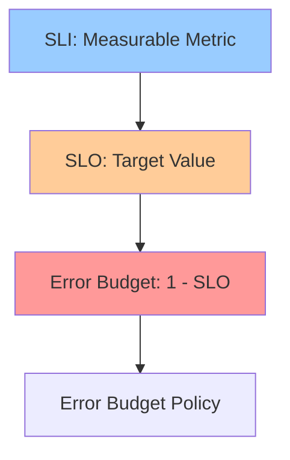

# SLIs, SLOs & Error Budgets

**One-line summary**: How to define meaningful SLIs, set appropriate SLOs, and use error budgets to balance reliability and feature velocity.

**Prerequisites**: [Foundations](../01-foundations/README.md), understanding of metrics and monitoring.

---

## Mental Model

### The SLO Hierarchy

**Key insight**: SLIs measure what users care about. SLOs set targets. Error budgets balance reliability and velocity.

### The Error Budget Concept

**Error budget**: The amount of unreliability a service can tolerate.

**Formula**: `Error Budget = 1 - SLO`

**Example**: 
- SLO: 99.9% availability
- Error Budget: 0.1% = 43.2 minutes/month

**Use case**: When error budget is exhausted, stop feature work and focus on reliability.

### Error Budget Consumption

```mermaid
gantt
    title Error Budget Consumption Over Month
    dateFormat X
    axisFormat %s
    
    section Budget
    Available Budget    :0, 2592000
    Consumed by Incidents :0, 1800
    Remaining Budget    :1800, 2590200
```

**Visualization**: Error budget starts at 100%, decreases with incidents, resets monthly.

---

## Internals & Architecture

### SLI (Service Level Indicator)

**Definition**: A quantitative measure of service quality.

#### Good SLIs

**Characteristics**:
- **User-facing**: Measures what users experience
- **Measurable**: Can be measured accurately
- **Actionable**: Changes when system behavior changes

**Examples**:
- **Availability**: Fraction of successful requests
- **Latency**: Request latency (P50, P95, P99)
- **Error rate**: Fraction of requests that error
- **Throughput**: Requests processed per second

#### Bad SLIs

**Anti-patterns**:
- **Internal metrics**: CPU utilization (users don't care)
- **Unmeasurable**: "User satisfaction" (too vague)
- **Non-actionable**: "Uptime" (doesn't change with improvements)

### SLO (Service Level Objective)

**Definition**: A target value for an SLI.

#### Setting SLOs

**Process**:
1. **Measure baseline**: What's current performance?
2. **Set target**: What's acceptable?
3. **Consider users**: What do users need?
4. **Consider cost**: What can we afford?

**Example**:
- **SLI**: P95 latency
- **Current**: 200ms
- **Target**: 100ms
- **SLO**: P95 latency < 100ms

#### SLO Tiers

**Tiers**:
- **P0 (Critical)**: 99.99% availability, < 50ms P95 latency
- **P1 (Important)**: 99.9% availability, < 100ms P95 latency
- **P2 (Standard)**: 99% availability, < 200ms P95 latency

**Use case**: Different SLOs for different service tiers.

### Error Budget

**Definition**: The amount of unreliability a service can tolerate.

#### Calculating Error Budget

**Formula**: `Error Budget = 1 - SLO`

**Example**:
- SLO: 99.9% availability
- Error Budget: 0.1% = 43.2 minutes/month

**Time-based**:
- **Monthly**: Error budget per month
- **Weekly**: Error budget per week
- **Daily**: Error budget per day

#### Error Budget Policy

**Policy**: What to do when error budget is exhausted.

**Options**:
1. **Stop feature work**: Focus on reliability
2. **Reduce SLO**: Accept lower reliability
3. **Increase capacity**: Add more resources

**Example**:
- **< 50% budget remaining**: Warning, reduce risky changes
- **< 25% budget remaining**: Stop feature work, focus on reliability
- **Budget exhausted**: Emergency reliability work only

---

## Failure Modes & Blast Radius

### SLO Violations

#### Scenario 1: SLO Too Aggressive
- **Impact**: Constant violations, exhausted error budget
- **Blast radius**: Team velocity, morale
- **Detection**: SLO compliance < 100%
- **Recovery**: Adjust SLO to realistic target

#### Scenario 2: SLO Too Lax
- **Impact**: Poor user experience, but SLO met
- **Blast radius**: User satisfaction
- **Detection**: User complaints, but SLO compliance high
- **Recovery**: Tighten SLO to match user expectations

#### Scenario 3: SLI Misconfigured
- **Impact**: SLO compliance doesn't reflect reality
- **Blast radius**: False sense of security
- **Detection**: User complaints despite SLO compliance
- **Recovery**: Fix SLI definition, remeasure

### Error Budget Exhaustion

#### Scenario 1: Budget Exhausted Early
- **Impact**: Can't ship features, must focus on reliability
- **Blast radius**: Product velocity
- **Detection**: Error budget < 0%
- **Recovery**: Fix reliability issues, rebuild budget

#### Scenario 2: Budget Never Used
- **Impact**: Over-investment in reliability, slow feature velocity
- **Blast radius**: Product competitiveness
- **Detection**: Error budget consistently high
- **Recovery**: Tighten SLO or increase risk tolerance

---

## Observability Contract

### Metrics to Track

#### SLI Metrics
- **Availability**: Fraction of successful requests
- **Latency**: P50, P95, P99 latency
- **Error rate**: Fraction of requests that error
- **Throughput**: Requests per second

#### SLO Compliance
- **SLO compliance**: Percentage of time SLO is met
- **Error budget remaining**: Remaining error budget
- **Error budget burn rate**: Rate of error budget consumption

#### Alerting
- **SLO violation**: Alert when SLO violated
- **Error budget warning**: Alert when budget < 50%
- **Error budget critical**: Alert when budget < 25%

### Dashboards

**SLO Dashboard**:
- Current SLI values
- SLO targets
- SLO compliance over time
- Error budget remaining

**Error Budget Dashboard**:
- Error budget consumption over time
- Burn rate
- Projected exhaustion date
- Policy status

### Logs

Log events:
- SLO violations
- Error budget policy triggers
- SLI measurement issues

---

## Change Safety

### Implementing SLIs/SLOs

#### 1. Define SLIs
- Choose user-facing metrics
- Ensure metrics are measurable
- Verify metrics are actionable

#### 2. Set SLOs
- Measure baseline performance
- Set realistic targets
- Consider user needs and cost

#### 3. Implement Error Budgets
- Calculate error budgets
- Define error budget policy
- Set up monitoring and alerts

#### 4. Review and Adjust
- Review SLO compliance regularly
- Adjust SLOs based on data
- Update error budget policy as needed

### Testing Strategy

1. **SLI validation**: Verify SLIs measure what they claim
2. **SLO testing**: Test SLO compliance under various conditions
3. **Error budget testing**: Test error budget calculations
4. **Policy testing**: Test error budget policy triggers

---

## Security Boundaries

SLIs/SLOs aren't security issues, but:
- **SLI data**: May contain sensitive information (protect access)
- **SLO targets**: May reveal system capabilities (keep internal)
- **Error budget**: May reveal reliability issues (keep internal)

---

## Tradeoffs

### What We Gain with SLIs/SLOs
- Clear reliability targets
- Data-driven decisions
- Balance between reliability and velocity
- Better user experience

### What We Lose
- More complex monitoring
- Requires discipline to follow
- May slow feature velocity (when budget exhausted)

### When to Use SLIs/SLOs
- **Always**: For production services
- **Critical**: For user-facing services
- **Important**: For services with dependencies

### Alternatives

If SLIs/SLOs are too complex:
- **SLA**: Service Level Agreement (contractual, not internal)
- **Uptime targets**: Simple availability targets
- **No targets**: Accept whatever reliability you get (not recommended)

---

## Operational Considerations

### Capacity Planning

**Error budget planning**:
- Plan for error budget consumption
- Reserve budget for incidents
- Plan for budget exhaustion scenarios

### Monitoring & Debugging

**Monitor**:
- SLI values over time
- SLO compliance over time
- Error budget consumption over time
- Error budget burn rate

**Debug SLO violations**:
1. Check SLI values: Are they accurate?
2. Check SLO targets: Are they realistic?
3. Check error budget: Is budget being consumed?
4. Check incidents: What's causing violations?

### Incident Response

**Common incidents**:
- SLO violations
- Error budget exhaustion
- SLI measurement failures

**Response**:
1. Investigate root cause
2. Fix reliability issues
3. Rebuild error budget
4. Review and adjust SLOs if needed

---

## What Staff Engineers Ask in Reviews

### Design Questions
- "What are the SLIs?"
- "What are the SLOs?"
- "What's the error budget policy?"
- "How do we measure SLIs?"

### Scale Questions
- "What happens when SLO is violated?"
- "What's the error budget burn rate?"
- "How do we recover from budget exhaustion?"

### Operational Questions
- "How do we monitor SLO compliance?"
- "What alerts do we have?"
- "How do we debug SLO violations?"

---

## Further Reading

**Comprehensive Guide**: [Further Reading: SLIs, SLOs & Error Budgets](../further-reading/sli-slo-error-budget.md)

**Quick Links**:
- "Site Reliability Engineering" (SRE Book) - Chapters on SLIs/SLOs
- "The Site Reliability Workbook" - Practical SLO implementation
- [PRR Checklist](prr-checklist.md)
- [Back to Reliability & SRE](README.md)

---

## Exercises

1. **Define SLIs/SLOs**: Define SLIs and SLOs for an API service. What metrics do you use? What targets?

2. **Error budget policy**: Design an error budget policy. What happens at 50%? 25%? 0%?

3. **Debug SLO violation**: An SLO is being violated. How do you debug? What do you check?

**Answer Key**: [View Answers](../../exercises/answers/sli-slo-error-budget-answers.md)

