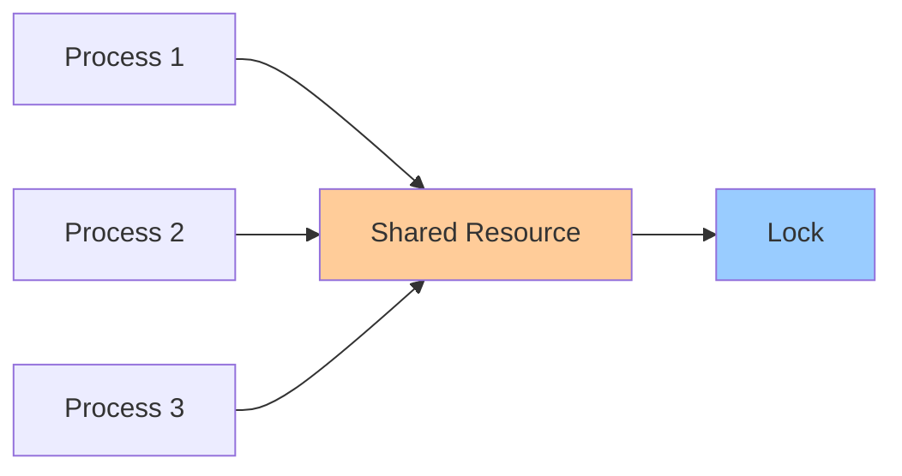

# Concurrency Primitives

**One-line summary**: Understanding concurrency primitives (locks, semaphores, channels) and how to use them correctly.

**Prerequisites**: [Foundations](../01-foundations/README.md), understanding of concurrent programming.

---

## Mental Model

### Concurrency Challenges

**Concurrency**: Multiple operations executing simultaneously.

**Challenges**:
- **Race conditions**: Unpredictable behavior from concurrent access
- **Deadlocks**: Processes waiting for each other
- **Livelocks**: Processes continuously changing state
- **Starvation**: Processes never get resources

**Key insight**: Concurrency primitives coordinate access to shared resources and prevent race conditions.

---

## Internals & Architecture

### Locks

**Lock**: Exclusive access to resource.

**Types**:
- **Mutex**: Mutual exclusion lock
- **Read-write lock**: Multiple readers, single writer
- **Spinlock**: Busy-wait lock

**Properties**:
- **Exclusive**: Only one holder at a time
- **Blocking**: Waits if lock unavailable
- **Deadlock risk**: Can cause deadlocks

### Semaphores

**Semaphore**: Counter controlling access to resource.

**Types**:
- **Binary semaphore**: 0 or 1 (like mutex)
- **Counting semaphore**: 0 to N

**Properties**:
- **Counting**: Tracks available resources
- **Blocking**: Waits if no resources available
- **Flexible**: Can allow multiple holders

### Channels

**Channel**: Communication mechanism between goroutines/threads.

**Types**:
- **Buffered**: Fixed-size buffer
- **Unbuffered**: No buffer (synchronous)

**Properties**:
- **Communication**: Enables communication
- **Synchronization**: Synchronizes goroutines/threads
- **Safe**: Thread-safe communication

---

## Failure Modes & Blast Radius

### Concurrency Failures

#### Scenario 1: Deadlock
- **Impact**: Processes blocked, system hangs
- **Blast radius**: Affected processes
- **Detection**: Processes waiting indefinitely
- **Recovery**: Kill processes, restart
- **Mitigation**: Avoid circular dependencies, timeout locks

#### Scenario 2: Race Condition
- **Impact**: Incorrect behavior, data corruption
- **Blast radius**: Shared resources
- **Detection**: Intermittent bugs, test failures
- **Recovery**: Fix race condition, add synchronization
- **Mitigation**: Proper locking, atomic operations

---

## Observability Contract

### Metrics

- **Lock contention**: Lock wait time
- **Deadlock rate**: Frequency of deadlocks
- **Race condition rate**: Frequency of race conditions
- **Concurrency level**: Number of concurrent operations

### Alerts

- Deadlocks detected
- High lock contention
- Race conditions detected
- High concurrency

---

## Change Safety

### Concurrency Changes

- **Process**: Update concurrency code, test thoroughly
- **Risk**: High (may cause deadlocks, race conditions)
- **Rollback**: Revert changes

---

## Tradeoffs

### Locking vs Lock-Free

**Locking**:
- **Pros**: Simple, safe
- **Cons**: Performance overhead, deadlock risk

**Lock-free**:
- **Pros**: Better performance, no deadlocks
- **Cons**: Complex, harder to reason about

---

## Operational Considerations

### Best Practices

1. **Minimize locking**: Reduce lock contention
2. **Avoid deadlocks**: Order locks consistently
3. **Use atomic operations**: For simple operations
4. **Test thoroughly**: Test concurrent code extensively

---

## What Staff Engineers Ask in Reviews

- "How is concurrency handled?"
- "What locks are used?"
- "How are deadlocks prevented?"
- "What's the concurrency model?"

---

## Further Reading

**Comprehensive Guide**: [Further Reading: Concurrency Primitives](../further-reading/concurrency.md)

**Quick Links**:
- "The Art of Multiprocessor Programming" (Herlihy & Shavit)
- [Back to LLD Patterns](README.md)

---

## Exercises

1. **Design concurrency**: Design concurrent access to shared resource. What primitives?

2. **Prevent deadlock**: How do you prevent deadlocks in your system?

3. **Handle race condition**: Your system has a race condition. How do you fix it?

**Answer Key**: [View Answers](../exercises/answers/concurrency-answers.md)

