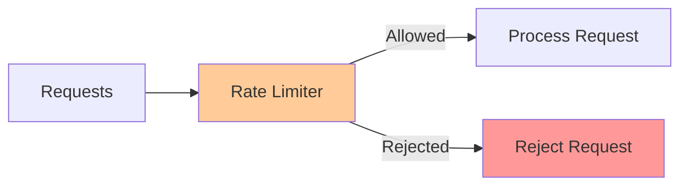
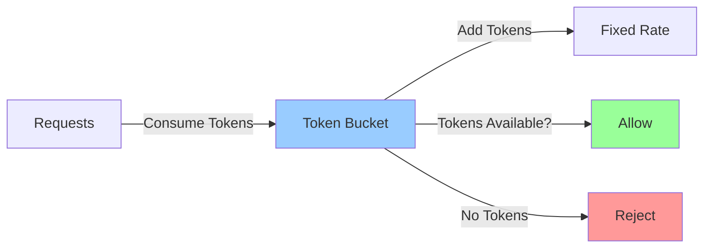
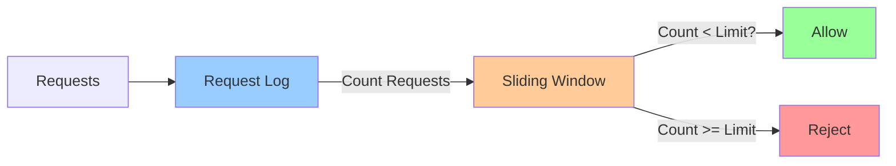
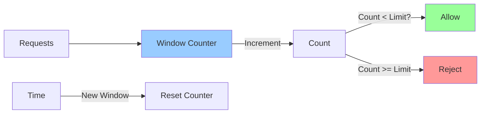
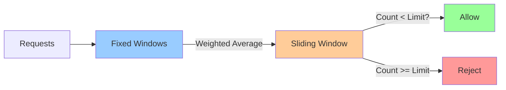

# Rate Limiter Implementations

**One-line summary**: How to implement rate limiters correctly, with different algorithms and their tradeoffs.

**Prerequisites**: [Queueing Theory](../01-foundations/queueing-tail-latency.md), understanding of algorithms and data structures.

---

## Mental Model

### Rate Limiting Purpose



**Key insight**: Rate limiting prevents overload by controlling request rate. Different algorithms have different tradeoffs.

### Rate Limiting Goals

1. **Prevent overload**: Don't allow more requests than capacity
2. **Fairness**: Distribute capacity fairly among clients
3. **Accuracy**: Enforce limits accurately
4. **Performance**: Low overhead, fast decisions
5. **Distributed**: Work across multiple servers

---

## Internals & Architecture

### Algorithm 1: Token Bucket

#### Concept

**Token bucket**: Tokens are added at a fixed rate. Requests consume tokens. Requests are allowed if tokens available.



#### Implementation

**Parameters**:
- **Capacity**: Maximum tokens (burst size)
- **Rate**: Tokens added per second (sustained rate)

**Algorithm**:
```
1. Add tokens: tokens = min(capacity, tokens + rate × time_elapsed)
2. Check request: if tokens >= 1:
     tokens -= 1
     allow request
   else:
     reject request
```

#### Properties

**Pros**:
- **Burst handling**: Allows bursts up to capacity
- **Simple**: Easy to implement
- **Memory efficient**: O(1) space

**Cons**:
- **Not perfectly accurate**: Tokens added continuously, not discretely
- **Bursty**: May allow bursts that exceed rate

**Use case**: APIs that need to handle bursts but limit sustained rate.

### Algorithm 2: Sliding Window Log

#### Concept

**Sliding window log**: Track timestamps of requests in a time window. Allow request if count < limit.



#### Implementation

**Parameters**:
- **Window size**: Time window (e.g., 1 minute)
- **Limit**: Maximum requests per window

**Algorithm**:
```
1. Get current time: now = current_time()
2. Remove old entries: log = log.filter(timestamp > now - window_size)
3. Check limit: if len(log) < limit:
     log.append(now)
     allow request
   else:
     reject request
```

#### Properties

**Pros**:
- **Accurate**: Precise limit enforcement
- **Fair**: Distributes capacity evenly

**Cons**:
- **Memory intensive**: O(n) space, where n = requests in window
- **CPU intensive**: O(n) time to clean old entries
- **Not distributed**: Hard to implement across servers

**Use case**: When accuracy is critical and memory is available.

### Algorithm 3: Fixed Window Counter

#### Concept

**Fixed window counter**: Count requests in fixed time windows. Allow request if count < limit.



#### Implementation

**Parameters**:
- **Window size**: Time window (e.g., 1 minute)
- **Limit**: Maximum requests per window

**Algorithm**:
```
1. Get current window: window = floor(now / window_size)
2. Check window: if window != current_window:
     current_window = window
     count = 0
3. Check limit: if count < limit:
     count += 1
     allow request
   else:
     reject request
```

#### Properties

**Pros**:
- **Simple**: Very easy to implement
- **Memory efficient**: O(1) space
- **Fast**: O(1) time

**Cons**:
- **Bursty**: Allows 2× limit at window boundaries
- **Not accurate**: May exceed limit at boundaries

**Use case**: When simplicity is more important than accuracy.

### Algorithm 4: Sliding Window Counter

#### Concept

**Sliding window counter**: Combine fixed windows with weighted average for smoother limit.



#### Implementation

**Parameters**:
- **Window size**: Time window (e.g., 1 minute)
- **Limit**: Maximum requests per window
- **Sub-windows**: Number of sub-windows (e.g., 10)

**Algorithm**:
```
1. Get current sub-window: sub_window = floor(now / (window_size / sub_windows))
2. Update sub-windows: sub_windows[sub_window] = count
3. Calculate weighted average: count = weighted_average(sub_windows)
4. Check limit: if count < limit:
     count += 1
     allow request
   else:
     reject request
```

#### Properties

**Pros**:
- **Smooth**: No bursts at boundaries
- **Memory efficient**: O(k) space, where k = sub-windows
- **Accurate**: More accurate than fixed window

**Cons**:
- **More complex**: Harder to implement
- **Still approximate**: Not perfectly accurate

**Use case**: When you need accuracy but can't store full log.

### Distributed Rate Limiting

#### Challenge

**Problem**: Rate limiting across multiple servers.

**Solutions**:

1. **Centralized store** (Redis):
   - Store counters in Redis
   - All servers check Redis
   - **Pros**: Accurate, consistent
   - **Cons**: Redis is single point of failure, network latency

2. **Distributed counters**:
   - Each server maintains counter
   - Periodically sync counters
   - **Pros**: No single point of failure
   - **Cons**: Less accurate, eventual consistency

3. **Client-side enforcement**:
   - Client enforces rate limit
   - Server validates
   - **Pros**: Reduces server load
   - **Cons**: Not secure (client can bypass)

---

## Failure Modes & Blast Radius

### Rate Limiter Failures

#### Scenario 1: Rate Limiter Down
- **Impact**: No rate limiting, system overloaded
- **Blast radius**: Entire system
- **Detection**: Rate limiter health checks fail
- **Recovery**: Fail open (allow all) or fail closed (reject all)

**Fail open vs fail closed**:
- **Fail open**: Allow requests when limiter fails (better UX, risk overload)
- **Fail closed**: Reject requests when limiter fails (safer, worse UX)

#### Scenario 2: Incorrect Limits
- **Impact**: Too restrictive (reject legitimate requests) or too permissive (allow overload)
- **Blast radius**: All clients
- **Detection**: High rejection rate or system overload
- **Recovery**: Adjust limits, verify behavior

#### Scenario 3: Distributed Limiter Inconsistency
- **Impact**: Different limits on different servers
- **Blast radius**: Clients hitting different servers
- **Detection**: Inconsistent behavior across servers
- **Recovery**: Fix synchronization, use centralized store

### Overload Scenarios

#### 10× Normal Load
- **Impact**: Rate limiter may become bottleneck
- **Mitigation**: Use efficient algorithm, cache decisions

#### 100× Normal Load (DDoS)
- **Impact**: Rate limiter overwhelmed
- **Mitigation**: Fail closed, use DDoS protection

---

## Observability Contract

### Metrics to Track

#### Rate Limiter Metrics
- **Request rate**: Requests per second
- **Allowed rate**: Requests allowed per second
- **Rejected rate**: Requests rejected per second
- **Rejection rate**: Percentage of requests rejected

#### Algorithm Metrics
- **Token bucket**: Tokens available, tokens consumed
- **Sliding window**: Requests in window, window size
- **Counter**: Current count, limit

#### Performance Metrics
- **Decision latency**: Time to make allow/reject decision
- **Storage size**: Memory used for rate limiting
- **Cache hit rate**: Cache effectiveness (if caching)

### Logs

Log events:
- Rate limit violations (who, what, when)
- Rate limiter failures
- Limit changes

### Alerts

**Critical alerts**:
- Rate limiter down
- Rejection rate > threshold (may indicate attack)
- Rate limiter performance degradation

**Warning alerts**:
- Rejection rate trending up
- Rate limiter storage growing

---

## Change Safety

### Implementing Rate Limiters

#### 1. Choose Algorithm
- **Token bucket**: For burst handling
- **Sliding window log**: For accuracy
- **Fixed window**: For simplicity
- **Sliding window counter**: For balance

#### 2. Set Limits
- **Measure baseline**: What's normal request rate?
- **Set limits**: What's acceptable?
- **Add margin**: Leave headroom for spikes

#### 3. Implement Distributed Limiting
- **Choose approach**: Centralized vs distributed
- **Handle failures**: Fail open vs fail closed
- **Monitor consistency**: Verify limits consistent

#### 4. Test
- **Unit tests**: Test algorithm correctness
- **Load tests**: Test under load
- **Failure tests**: Test limiter failures

---

## Security Boundaries

Rate limiting is a security control:
- **DDoS protection**: Prevents overload attacks
- **Abuse prevention**: Prevents abuse of APIs
- **Fairness**: Ensures fair resource usage

**Bypass attacks**:
- **IP rotation**: Attackers rotate IPs
- **Mitigation**: Use client IDs, not just IPs
- **Distributed attacks**: Attackers use multiple IPs
- **Mitigation**: Global rate limits, not just per-IP

---

## Tradeoffs

### Algorithm Tradeoffs

| Algorithm | Accuracy | Memory | CPU | Burst Handling |
|-----------|----------|--------|-----|----------------|
| Token Bucket | Medium | O(1) | O(1) | Yes |
| Sliding Window Log | High | O(n) | O(n) | No |
| Fixed Window | Low | O(1) | O(1) | Yes (at boundaries) |
| Sliding Window Counter | Medium | O(k) | O(k) | No |

### Distributed Tradeoffs

**Centralized (Redis)**:
- **Pros**: Accurate, consistent
- **Cons**: Single point of failure, network latency

**Distributed**:
- **Pros**: No single point of failure
- **Cons**: Less accurate, eventual consistency

---

## Operational Considerations

### Capacity Planning

**Rate limiter capacity**:
- **Decision rate**: How many decisions per second?
- **Storage**: How much memory for counters/logs?
- **Network**: How much bandwidth for distributed limiting?

### Monitoring & Debugging

**Monitor**:
- Request rates
- Rejection rates
- Rate limiter performance
- Storage usage

**Debug rate limiting issues**:
1. Check limits: Are limits correct?
2. Check algorithm: Is algorithm working correctly?
3. Check distribution: Are limits consistent across servers?
4. Check performance: Is limiter a bottleneck?

### Incident Response

**Common incidents**:
- Rate limiter failures
- Incorrect limits
- DDoS attacks

**Response**:
1. Check rate limiter health
2. Check limits configuration
3. Adjust limits if needed
4. Scale rate limiter if needed

---

## What Staff Engineers Ask in Reviews

### Design Questions
- "What rate limiting algorithm?"
- "What are the limits?"
- "How is it distributed?"
- "What happens when limiter fails?"

### Scale Questions
- "What's the decision rate?"
- "How does it scale?"
- "What's the storage overhead?"

### Operational Questions
- "How do we monitor rate limiting?"
- "What alerts do we have?"
- "How do we debug rate limiting issues?"

---

## Further Reading

**Comprehensive Guide**: [Further Reading: Rate Limiting](../further-reading/rate-limiting.md)

**Quick Links**:
- Token Bucket Algorithm (Wikipedia)
- Redis Rate Limiting documentation
- Kong API Gateway rate limiting guide
- [Overload & Backpressure](../02-distributed-systems/overload-backpressure.md)
- [Back to LLD Patterns](README.md)

---

## Exercises

1. **Implement token bucket**: Implement a token bucket rate limiter. What are the edge cases?

2. **Compare algorithms**: Compare token bucket vs sliding window log. When would you use each?

3. **Distributed rate limiting**: Design a distributed rate limiter. How do you ensure consistency?

**Answer Key**: [View Answers](../../exercises/answers/rate-limiting-answers.md)

