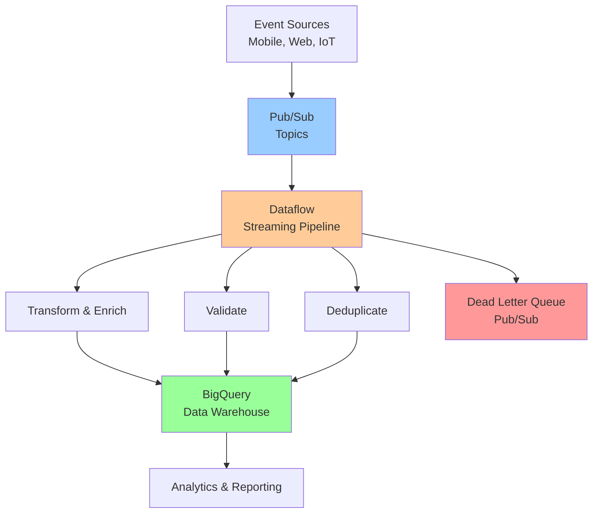
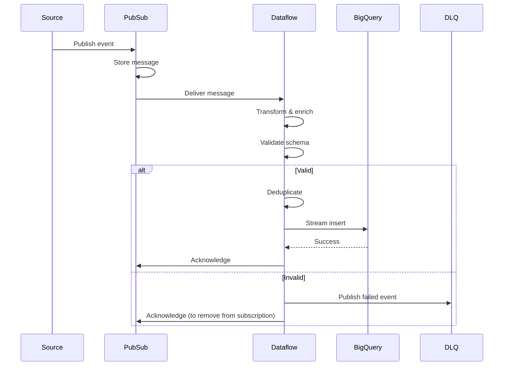
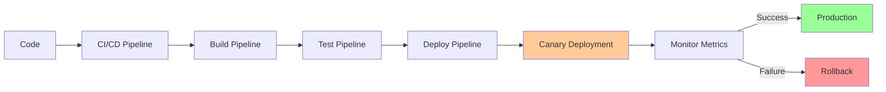

# High-Throughput Data Pipeline

**One-line summary**: End-to-end design of a high-throughput data pipeline on GCP using Pub/Sub, Dataflow, and BigQuery with SLOs, backpressure handling, and failure recovery.

**Prerequisites**: [Pub/Sub: Delivery Guarantees](../03-gcp-core-building-blocks/pubsub.md), [BigQuery Architecture](../03-gcp-core-building-blocks/bigquery.md), [Overload & Backpressure](../02-distributed-systems/overload-backpressure.md), [Reliability & SRE](../04-reliability-sre/README.md).

---

## System Overview

### Requirements

**Functional Requirements**:
- Ingest events from multiple sources (mobile apps, web, IoT devices)
- Process events in real-time (transform, enrich, validate)
- Store processed events in data warehouse (BigQuery)
- Support 1M+ events per second peak load
- Support multiple event types (user events, transactions, telemetry)

**Non-Functional Requirements**:
- **Latency**: P95 < 5 seconds (event ingestion to queryable)
- **Throughput**: Handle 1M+ events/second peak
- **Availability**: 99.9% (SLO)
- **Durability**: 99.999999% (11 nines)
- **Consistency**: At-least-once delivery

**Constraints**:
- Must use GCP services
- Cost-effective at scale
- Support schema evolution

---

## Architecture

### High-Level Architecture

### Component Details

#### 1. Event Sources
- **Types**: Mobile apps, web applications, IoT devices
- **Protocol**: HTTP POST to Pub/Sub push endpoint
- **Format**: JSON events
- **Rate**: Variable (100K-1M events/second)

#### 2. Pub/Sub Topics
- **Topics**: Separate topics per event type
  - `user-events`
  - `transactions`
  - `telemetry`
- **Configuration**:
  - Message retention: 7 days
  - Ordering: Per user/device ID
  - Dead letter queue: Enabled

#### 3. Dataflow Pipeline
- **Type**: Streaming pipeline (Apache Beam)
- **Stages**:
  1. **Read**: Read from Pub/Sub subscriptions
  2. **Transform**: Transform events (enrich, normalize)
  3. **Validate**: Validate event schema
  4. **Deduplicate**: Remove duplicates (idempotency)
  5. **Write**: Write to BigQuery
- **Auto-scaling**: Automatic scaling based on backlog
- **Regions**: Multi-region deployment

#### 4. BigQuery
- **Tables**: Partitioned by event date
- **Clustering**: By event type, user ID
- **Schema**: JSON schema with schema evolution support
- **Load**: Streaming inserts

#### 5. Dead Letter Queue
- **Topic**: `data-pipeline-dlq`
- **Use case**: Failed events, invalid events
- **Processing**: Manual review and reprocessing

---

## Data Flow

### Event Ingestion Flow

### Processing Stages

#### Stage 1: Read from Pub/Sub
- **Input**: Pub/Sub subscriptions
- **Processing**: Read messages, parse JSON
- **Backpressure**: Automatic backpressure handling

#### Stage 2: Transform & Enrich
- **Transformations**:
  - Normalize event format
  - Enrich with reference data (user profiles, product catalog)
  - Add metadata (timestamp, source, version)
- **Performance**: Parallel processing, caching

#### Stage 3: Validate
- **Validation**:
  - Schema validation
  - Required fields check
  - Data type validation
  - Business rule validation
- **Failure handling**: Send invalid events to DLQ

#### Stage 4: Deduplicate
- **Deduplication**: Track processed event IDs
- **Storage**: Cloud Firestore for deduplication state
- **TTL**: 7 days (event retention period)

#### Stage 5: Write to BigQuery
- **Method**: Streaming inserts
- **Batching**: Batch inserts for efficiency
- **Error handling**: Retry failed inserts, send to DLQ

---

## SLIs, SLOs & Error Budgets

### SLIs (Service Level Indicators)

#### 1. Ingestion Latency SLI
- **Definition**: Time from event published to queryable in BigQuery
- **Measurement**: P95 latency
- **Current**: P95 = 3 seconds
- **Target**: P95 < 5 seconds (SLO)

#### 2. Throughput SLI
- **Definition**: Events processed per second
- **Measurement**: Events/second
- **Current**: 800K events/second average
- **Target**: Handle 1M events/second peak (SLO)

#### 3. Error Rate SLI
- **Definition**: Fraction of events that fail processing
- **Measurement**: Failed events / total events
- **Current**: 0.1%
- **Target**: < 0.5% (SLO)

#### 4. Availability SLI
- **Definition**: Fraction of time pipeline is processing events
- **Measurement**: Uptime / total time
- **Current**: 99.95%
- **Target**: 99.9% (SLO)

### SLOs (Service Level Objectives)

| SLI | SLO | Error Budget |
|-----|-----|--------------|
| Ingestion Latency | P95 < 5 seconds | > 5 seconds for > 0.1% events |
| Throughput | Handle 1M events/second | < 1M events/second for > 0.1% time |
| Error Rate | < 0.5% | > 0.5% for > 0.1% events |
| Availability | 99.9% | < 99.9% for > 0.1% time |

### Error Budget Policy

**Policy**:
- **> 50% remaining**: Normal operations, can ship features
- **25-50% remaining**: Warning, reduce risky changes
- **< 25% remaining**: Critical, stop feature work, focus on reliability
- **0% remaining**: Emergency, only reliability work

---

## Capacity Planning

### Current Capacity

**Pub/Sub**:
- **Topics**: 3 topics (user-events, transactions, telemetry)
- **Throughput**: 1M messages/second per topic
- **Subscriptions**: 1 subscription per topic

**Dataflow**:
- **Workers**: Auto-scaling (10-100 workers)
- **Throughput**: 100K events/second per worker
- **Total capacity**: 10M events/second (with scaling)

**BigQuery**:
- **Slots**: On-demand (2000 slots)
- **Throughput**: Millions of rows/second
- **Storage**: Petabytes

### Scaling Strategy

**Auto-scaling**:
- **Pub/Sub**: Automatic (handles load)
- **Dataflow**: Auto-scaling based on backlog
  - Scale up: Backlog > threshold
  - Scale down: Backlog < threshold
- **BigQuery**: Automatic (handles load)

**Manual scaling**:
- **Dataflow**: Adjust min/max workers if needed
- **BigQuery**: Reserve slots for predictable workloads

### Capacity Forecasting

**Growth Projection**:
- **Current**: 800K events/second average, 1M peak
- **Growth**: 30% per quarter
- **6 months**: ~1.3M events/second average, ~1.6M peak
- **12 months**: ~2.2M events/second average, ~2.7M peak

**Capacity Needs**:
- **6 months**: Need to handle ~2M events/second peak
- **12 months**: Need to handle ~3M events/second peak
- **Plan**: Optimize pipeline, add more Pub/Sub topics if needed

---

## Failure Modes & Blast Radius

### Pipeline Failures

#### Scenario 1: Pub/Sub Outage
- **Impact**: Cannot ingest events, events queued
- **Blast radius**: All event sources
- **Detection**: Publish failures, API errors
- **Recovery**: 
  - Pub/Sub automatically recovers
  - Events delivered after recovery
  - May see increased latency
- **Mitigation**: 
  - Pub/Sub high availability
  - Retry logic in clients
  - Monitor Pub/Sub health

#### Scenario 2: Dataflow Failure
- **Impact**: Events not processed, backlog grows
- **Blast radius**: All events in pipeline
- **Detection**: Dataflow job failures, backlog increasing
- **Recovery**: 
  - Restart Dataflow job
  - Process backlog
  - May see increased latency
- **Mitigation**: 
  - Dataflow auto-restart
  - Monitor job health
  - Alert on failures

#### Scenario 3: BigQuery Unavailable
- **Impact**: Cannot write events, events queued in Dataflow
- **Blast radius**: All processed events
- **Detection**: BigQuery write failures, Dataflow backlog
- **Recovery**: 
  - BigQuery automatically recovers
  - Dataflow retries writes
  - May see increased latency
- **Mitigation**: 
  - BigQuery high availability
  - Retry logic in Dataflow
  - Monitor BigQuery health

### Backpressure Scenarios

#### Scenario 1: High Event Rate
- **Impact**: Backlog grows, latency increases
- **Blast radius**: All events
- **Detection**: Pub/Sub backlog, Dataflow backlog
- **Recovery**: 
  - Auto-scale Dataflow workers
  - Reduce event rate if possible
  - May need manual scaling
- **Mitigation**: 
  - Auto-scaling enabled
  - Monitor backpressure
  - Alert on high backlog

#### Scenario 2: Slow Downstream (BigQuery)
- **Impact**: Dataflow backlog grows, latency increases
- **Blast radius**: All events
- **Detection**: BigQuery write latency, Dataflow backlog
- **Recovery**: 
  - Optimize BigQuery writes
  - Scale BigQuery slots
  - May need to reduce event rate
- **Mitigation**: 
  - Optimize BigQuery schema
  - Monitor BigQuery performance
  - Alert on high latency

### Overload Scenarios

#### 10× Normal Load (10M events/second)
- **Impact**: 
  - Pub/Sub: Handles load, may see increased latency
  - Dataflow: Auto-scales, may need more workers
  - BigQuery: Handles load, may see increased latency
- **Mitigation**: 
  - Auto-scaling handles load
  - Monitor performance
  - Scale if needed

#### 100× Normal Load (100M events/second)
- **Impact**: 
  - Pub/Sub: May be overwhelmed, need scaling
  - Dataflow: Significant scaling needed
  - BigQuery: May be overwhelmed, need scaling
- **Mitigation**: 
  - Significant scaling required
  - May need to add more topics
  - May need to optimize pipeline

---

## Observability

### Metrics

#### Pipeline Metrics
- **Ingestion rate**: Events ingested per second
- **Processing rate**: Events processed per second
- **Latency**: P50/P95/P99 latency (ingestion to queryable)
- **Error rate**: Failed events / total events
- **Backlog**: Unprocessed events in Pub/Sub/Dataflow

#### Component Metrics
- **Pub/Sub**: Publish rate, subscription delivery rate, backlog
- **Dataflow**: Worker count, processing rate, backlog
- **BigQuery**: Insert rate, query rate, slot usage

#### Business Metrics
- **Event types**: Events per type
- **Sources**: Events per source
- **Success rate**: Successful events / total events

### Dashboards

**Pipeline Dashboard**:
- Ingestion rate, processing rate, latency
- Error rate, backlog
- SLO compliance, error budget

**Component Dashboards**:
- Pub/Sub: Publish rate, delivery rate, backlog
- Dataflow: Worker count, processing rate, errors
- BigQuery: Insert rate, query performance

**DLQ Dashboard**:
- Failed events count, failure reasons
- Reprocessing status

### Logs

**Application Logs**:
- Event processing logs (structured JSON)
- Error logs with stack traces
- Performance logs (slow processing)

**Infrastructure Logs**:
- Pub/Sub logs
- Dataflow logs
- BigQuery logs

### Alerts

**Critical Alerts**:
- Pipeline unavailable
- High error rate (> 1%)
- High backlog (> threshold)
- SLO violation

**Warning Alerts**:
- High latency
- Error rate increasing
- Backlog growing
- Component failures

---

## Deployment & Rollout Strategy

### Deployment Process

### Rollout Process

#### Phase 1: Canary (5% traffic)
1. **Deploy**: Deploy new pipeline version (5% traffic)
2. **Monitor**: Monitor for 30 minutes
   - Check error rate, latency, SLO compliance
   - Compare to baseline
3. **Decision**: 
   - **Success**: Proceed to Phase 2
   - **Failure**: Rollback immediately

#### Phase 2: Gradual Rollout (25%, 50%, 100%)
1. **25% traffic**: Monitor for 15 minutes
2. **50% traffic**: Monitor for 15 minutes
3. **100% traffic**: Monitor for 1 hour
4. **Complete**: Mark rollout complete

### Rollback Strategy

**Automatic Rollback**:
- **Trigger**: Error rate > 1% OR latency > threshold OR SLO violation
- **Action**: Automatically rollback to previous version
- **Time**: < 5 minutes

**Manual Rollback**:
- **Trigger**: Manual decision
- **Action**: Rollback via CI/CD pipeline
- **Time**: < 10 minutes

---

## Security

### Authentication & Authorization

**Authentication**:
- **Pub/Sub**: Service accounts for publishers
- **Dataflow**: Service accounts for pipeline
- **BigQuery**: Service accounts for writes

**Authorization**:
- **IAM**: IAM policies for all components
- **Principle**: Least privilege

### Data Protection

**Encryption**:
- **At rest**: All data encrypted (Pub/Sub, BigQuery)
- **In transit**: TLS for all connections
- **Keys**: Managed by Cloud KMS

**Data Privacy**:
- **PII**: PII data handled per policy
- **Retention**: Data retained per policy
- **Deletion**: Secure deletion procedures

---

## Cost Optimization

### Cost Breakdown

**Monthly Costs** (estimated for 1M events/second):
- **Pub/Sub**: $5,000 (message storage, operations)
- **Dataflow**: $10,000 (compute, streaming)
- **BigQuery**: $15,000 (storage, queries)
- **Total**: ~$30,000/month

### Optimization Strategies

1. **Pub/Sub**: Optimize message size, use compression
2. **Dataflow**: Right-size workers, optimize pipeline
3. **BigQuery**: Optimize schema, use partitioning/clustering
4. **Deduplication**: Optimize deduplication logic (reduce Firestore calls)

---

## Incident Response Playbook

### Common Incidents

#### Incident 1: High Backlog
**Symptoms**:
- Backlog growing, latency increasing
- Events not processed

**Response**:
1. **Acknowledge**: Acknowledge incident
2. **Assess**: Check Pub/Sub backlog, Dataflow backlog
3. **Mitigate**: 
   - Scale Dataflow workers
   - Check BigQuery performance
   - Reduce event rate if possible
4. **Investigate**: Root cause analysis
5. **Resolve**: Fix root cause
6. **Postmortem**: Write postmortem

#### Incident 2: High Error Rate
**Symptoms**:
- Error rate > 1%
- Many events in DLQ

**Response**:
1. **Acknowledge**: Acknowledge incident
2. **Assess**: Check error logs, DLQ
3. **Mitigate**: 
   - Fix validation logic if needed
   - Check schema changes
   - Reprocess DLQ if possible
4. **Investigate**: Root cause analysis
5. **Resolve**: Fix root cause
6. **Postmortem**: Write postmortem

---

## Further Reading

**Comprehensive Guide**: [Further Reading: Data Pipeline](../further-reading/data-pipeline.md)

**Quick Links**:
- [Pub/Sub Documentation](https://cloud.google.com/pubsub/docs)
- [Dataflow Documentation](https://cloud.google.com/dataflow/docs)
- [BigQuery Documentation](https://cloud.google.com/bigquery/docs)
- [Overload & Backpressure](../02-distributed-systems/overload-backpressure.md)
- [Back to Case Studies](README.md)

---

## Exercises

1. **Design improvements**: How would you improve this design? What tradeoffs?

2. **Handle schema evolution**: How do you handle schema changes without breaking the pipeline?

3. **Optimize costs**: How would you reduce costs by 30%? What tradeoffs?

**Answer Key**: [View Answers](../exercises/answers/data-pipeline-answers.md)

