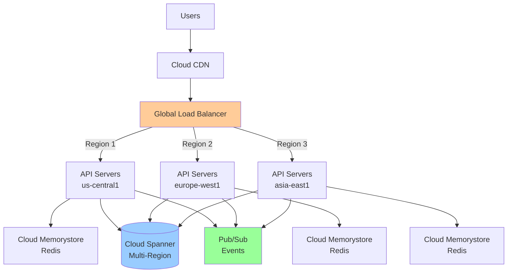
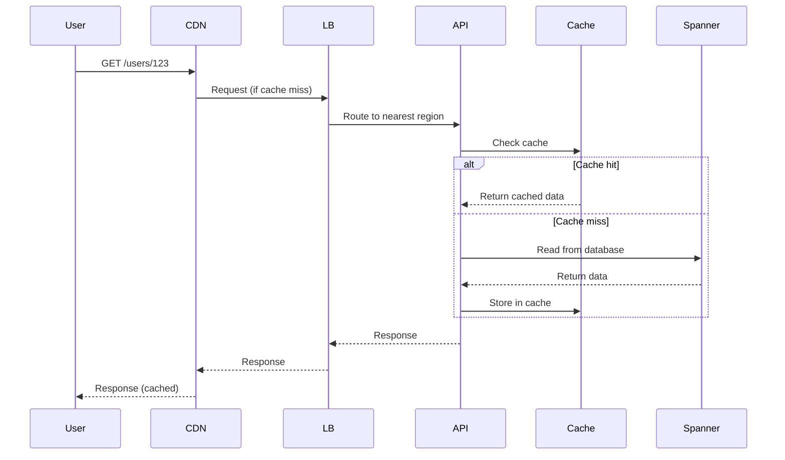
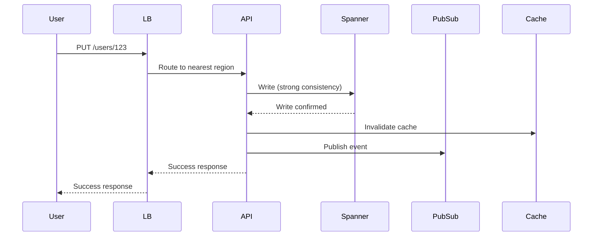
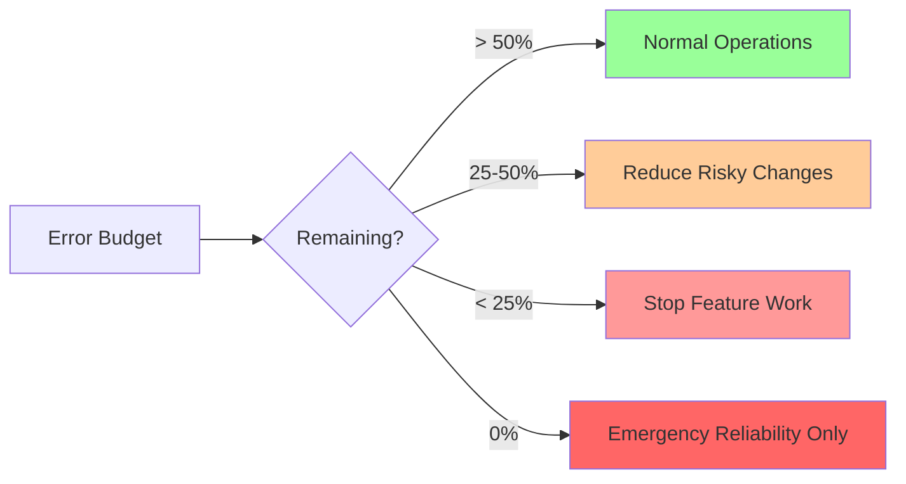
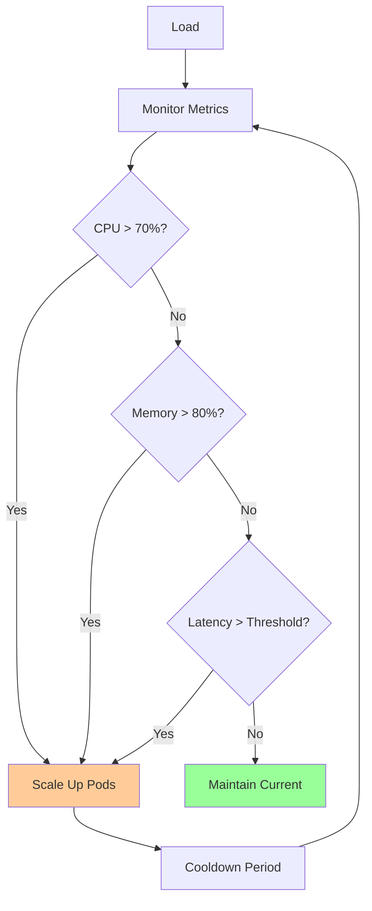
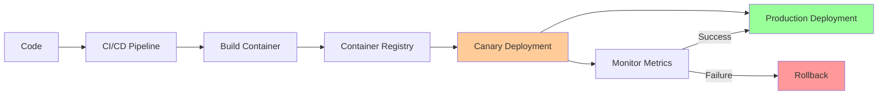

# Multi-Region API on GCP

**One-line summary**: End-to-end design of a globally distributed API on GCP with SLOs, rollout strategy, and incident playbooks.

**Prerequisites**: [GCP Core Building Blocks](../03-gcp-core-building-blocks/README.md), [Reliability & SRE](../04-reliability-sre/README.md), [Distributed Systems](../02-distributed-systems/README.md).

---

## System Overview

### Requirements

**Functional Requirements**:
- REST API for user data management
- Support 100M+ users globally
- Handle 100K+ QPS peak load
- Support read and write operations

**Non-Functional Requirements**:
- **Latency**: P95 < 100ms, P99 < 200ms
- **Availability**: 99.9% (SLO)
- **Consistency**: Strong consistency for writes, eventual for reads
- **Durability**: 99.999999% (11 nines)

**Constraints**:
- Must use GCP services
- Multi-region deployment required
- Budget: Optimize for cost efficiency

---

## Architecture

### High-Level Architecture

### Component Details

#### 1. Global Load Balancer
- **Type**: HTTP(S) Global Load Balancer
- **SSL**: Managed SSL certificates
- **Routing**: Geographic routing (closest region)
- **Health checks**: HTTP health checks every 10s

#### 2. API Servers
- **Platform**: GKE (Google Kubernetes Engine)
- **Regions**: us-central1, europe-west1, asia-east1
- **Auto-scaling**: Horizontal Pod Autoscaler (HPA)
- **Replicas**: 3 per region minimum, scale to 50 per region

#### 3. Database
- **Service**: Cloud Spanner (Multi-Region)
- **Configuration**: Multi-region (us, eu, asia)
- **Replication**: Synchronous replication across regions
- **Consistency**: External consistency (strong)

#### 4. Cache
- **Service**: Cloud Memorystore (Redis)
- **Deployment**: Regional (one per region)
- **TTL**: 5 minutes for reads
- **Eviction**: LRU (Least Recently Used)

#### 5. Event Streaming
- **Service**: Pub/Sub
- **Use case**: Async processing, notifications
- **Topics**: user-events, notifications

---

## Data Flow

### Read Request Flow

### Write Request Flow

---

## SLIs, SLOs & Error Budgets

### SLIs (Service Level Indicators)

#### 1. Availability SLI
- **Definition**: Fraction of successful HTTP requests (2xx, 3xx)
- **Measurement**: Count of successful requests / total requests
- **Current**: 99.95%
- **Target**: 99.9% (SLO)

#### 2. Latency SLI
- **Definition**: P95 and P99 request latency
- **Measurement**: Time from request received to response sent
- **Current**: P95=80ms, P99=150ms
- **Target**: P95 < 100ms, P99 < 200ms (SLO)

#### 3. Error Rate SLI
- **Definition**: Fraction of requests returning 5xx errors
- **Measurement**: Count of 5xx errors / total requests
- **Current**: 0.05%
- **Target**: < 0.1% (SLO)

### SLOs (Service Level Objectives)

| SLI | SLO | Error Budget |
|-----|-----|--------------|
| Availability | 99.9% | 0.1% = 43.2 min/month |
| P95 Latency | < 100ms | > 100ms for > 0.1% requests |
| P99 Latency | < 200ms | > 200ms for > 0.1% requests |
| Error Rate | < 0.1% | > 0.1% for > 0.1% requests |

### Error Budget Policy

**Policy**:
- **> 50% remaining**: Normal operations, can ship features
- **25-50% remaining**: Warning, reduce risky changes
- **< 25% remaining**: Critical, stop feature work, focus on reliability
- **0% remaining**: Emergency, only reliability work, no new features

---

## Capacity Planning

### Current Capacity

**Per Region**:
- **API Servers**: 10 pods (can scale to 50)
- **CPU**: 2 cores per pod = 20 cores (can scale to 100)
- **Memory**: 4GB per pod = 40GB (can scale to 200GB)
- **QPS Capacity**: ~10K QPS per region (can scale to 50K)

**Total (3 Regions)**:
- **QPS Capacity**: ~30K QPS (can scale to 150K)
- **Target Load**: 100K QPS peak
- **Headroom**: 50% headroom at peak

### Scaling Strategy

**Auto-scaling Configuration**:
- **Min replicas**: 3 per region
- **Max replicas**: 50 per region
- **Target CPU**: 70%
- **Target memory**: 80%
- **Scale up**: Add 2 pods at a time
- **Scale down**: Remove 1 pod at a time
- **Cooldown**: 2 minutes

### Capacity Forecasting

**Growth Projection**:
- **Current**: 30K QPS average, 100K QPS peak
- **Growth**: 20% per quarter
- **6 months**: ~43K QPS average, ~144K QPS peak
- **12 months**: ~62K QPS average, ~207K QPS peak

**Capacity Needs**:
- **6 months**: Need to scale to ~150K QPS capacity
- **12 months**: Need to scale to ~220K QPS capacity
- **Plan**: Add 4th region at 6 months, optimize at 12 months

---

## Failure Modes & Blast Radius

### Failure Scenarios

#### Scenario 1: Single Region Failure

**What fails**: One region (e.g., us-central1) goes down

**Impact**:
- **Blast radius**: Users in that region
- **Availability**: ~33% of users affected
- **Traffic**: Rerouted to other regions
- **Latency**: Increased for affected users

**Detection**:
- Health checks fail
- Error rate spikes
- Latency increases

**Recovery**:
1. Load balancer automatically routes away from failed region
2. Scale up other regions to handle increased load
3. Investigate root cause
4. Restore failed region

**Mitigation**:
- Multi-region deployment (already done)
- Health checks (already configured)
- Auto-scaling (already configured)

#### Scenario 2: Database Failure

**What fails**: Spanner becomes unavailable

**Impact**:
- **Blast radius**: All regions, all users
- **Availability**: 0% (complete outage)
- **Reads**: Fail (cache helps for cached data)
- **Writes**: Fail completely

**Detection**:
- Database connection errors
- Error rate spikes to 100%
- All health checks fail

**Recovery**:
1. Spanner has automatic failover (multi-region)
2. Failover takes ~30 seconds
3. During failover: Serve cached data (reads only)
4. After failover: Resume normal operations

**Mitigation**:
- Multi-region Spanner (already configured)
- Read cache (reduces read load on DB)
- Circuit breakers (prevent cascading failures)

#### Scenario 3: Cache Failure

**What fails**: Redis cache becomes unavailable

**Impact**:
- **Blast radius**: Affected region only
- **Availability**: Still available (degraded)
- **Latency**: Increases (no cache hits)
- **Database load**: Increases significantly

**Detection**:
- Cache connection errors
- Latency increases
- Database load increases

**Recovery**:
1. API continues without cache (degraded mode)
2. Scale up API servers to handle increased DB load
3. Restore cache
4. Warm cache with common data

**Mitigation**:
- Cache is not critical path (system works without it)
- Database can handle increased load (scaled appropriately)
- Regional cache (failure isolated to one region)

#### Scenario 4: Load Balancer Failure

**What fails**: Global load balancer becomes unavailable

**Impact**:
- **Blast radius**: All users, all regions
- **Availability**: 0% (complete outage)
- **Traffic**: Cannot reach API servers

**Detection**:
- All health checks fail
- Error rate spikes to 100%
- No traffic reaching API servers

**Recovery**:
1. GCP load balancer has automatic failover
2. Failover takes ~1-2 minutes
3. After failover: Resume normal operations

**Mitigation**:
- GCP managed service (high availability built-in)
- Health checks (detect failures quickly)
- Monitoring (alert on failures)

### Overload Scenarios

#### 10× Normal Load (300K QPS)

**Impact**:
- **API Servers**: Auto-scale to max (50 per region = 150 total)
- **Database**: May see increased latency
- **Cache**: May see cache misses increase
- **Latency**: P95 may increase to 120ms, P99 to 250ms

**Mitigation**:
- Auto-scaling handles increased load
- Cache reduces database load
- Load shedding if needed (drop low-priority requests)

#### 100× Normal Load (3M QPS) - DDoS

**Impact**:
- **API Servers**: Overwhelmed even at max scale
- **Database**: Overwhelmed
- **Availability**: System fails
- **Latency**: Extremely high or timeouts

**Mitigation**:
- **DDoS Protection**: Cloud Armor (WAF) filters malicious traffic
- **Rate Limiting**: Limit requests per IP/client
- **Load Shedding**: Drop requests when overloaded
- **Circuit Breakers**: Stop calling downstream services

---

## Observability

### Metrics

#### Service Metrics
- **Request rate**: QPS per region, per endpoint
- **Latency**: P50, P95, P99 per region, per endpoint
- **Error rate**: 4xx, 5xx errors per region, per endpoint
- **Availability**: Success rate per region

#### Resource Metrics
- **CPU**: CPU utilization per pod, per region
- **Memory**: Memory usage per pod, per region
- **Network**: Bandwidth per region
- **Database**: Spanner CPU, latency, QPS
- **Cache**: Redis memory, hit rate, latency

#### Business Metrics
- **Active users**: Users per region
- **API usage**: Endpoints usage, feature adoption
- **Error types**: Breakdown of errors by type

### Dashboards

**Service Dashboard**:
- Request rate, latency, error rate
- SLO compliance
- Error budget remaining
- Per-region breakdown

**Capacity Dashboard**:
- Pod count, CPU, memory per region
- Scaling events
- Capacity utilization
- Forecast vs actual

**Database Dashboard**:
- Spanner QPS, latency
- Connection pool usage
- Query performance
- Regional breakdown

**Cache Dashboard**:
- Redis hit rate, miss rate
- Memory usage
- Latency
- Per-region breakdown

### Logs

**Application Logs**:
- Request/response logs (structured JSON)
- Error logs with stack traces
- Performance logs (slow requests)
- Request IDs for correlation

**Infrastructure Logs**:
- GKE cluster logs
- Load balancer access logs
- Spanner query logs
- Pub/Sub message logs

### Traces

**Distributed Tracing**:
- End-to-end request traces
- Spans for: Load balancer → API → Cache → Database
- Cross-region traces
- Error traces with context

### Alerts

**Critical Alerts** (Page on-call):
- SLO violation (availability < 99.9%)
- Error rate > 1%
- All regions down
- Database unavailable

**Warning Alerts** (Notify, don't page):
- Error budget < 50%
- Latency > threshold
- Single region down
- Cache failure

**Info Alerts** (Log only):
- Scaling events
- Deployment events
- Capacity warnings

---

## Deployment & Rollout Strategy

### Deployment Architecture

### Rollout Process

#### Phase 1: Canary (5% traffic)
1. **Deploy**: Deploy new version to canary pods (5% of traffic)
2. **Monitor**: Monitor for 30 minutes
   - Check error rate, latency, SLO compliance
   - Compare to baseline
3. **Decision**: 
   - **Success**: Proceed to Phase 2
   - **Failure**: Rollback immediately

#### Phase 2: Gradual Rollout (25%, 50%, 100%)
1. **25% traffic**: Monitor for 15 minutes
2. **50% traffic**: Monitor for 15 minutes
3. **100% traffic**: Monitor for 1 hour
4. **Complete**: Mark rollout complete

### Rollback Strategy

**Automatic Rollback**:
- **Trigger**: Error rate > 1% OR latency > threshold OR SLO violation
- **Action**: Automatically rollback to previous version
- **Time**: < 2 minutes

**Manual Rollback**:
- **Trigger**: Manual decision
- **Action**: Rollback via CI/CD pipeline
- **Time**: < 5 minutes

### Feature Flags

**Use Cases**:
- Risky features
- A/B testing
- Gradual feature rollout
- Kill switches

**Implementation**:
- Feature flags stored in Cloud Firestore
- API checks flags on each request
- Flags can be toggled without deployment

---

## Security

### Authentication & Authorization

**Authentication**:
- **Method**: OAuth 2.0 / JWT tokens
- **Provider**: Google Identity Platform
- **Validation**: Validate tokens on each request

**Authorization**:
- **Method**: IAM policies + application-level checks
- **Principle**: Least privilege
- **Audit**: All access logged

### Data Protection

**Encryption**:
- **At rest**: Spanner encrypts data at rest (automatic)
- **In transit**: TLS 1.3 for all connections
- **Keys**: Managed by Cloud KMS

**Data Classification**:
- **PII**: User data marked as PII
- **Retention**: Data retained per policy
- **Deletion**: Secure deletion procedures

### Network Security

**VPC**:
- **Private IPs**: API servers use private IPs
- **Firewall rules**: Restrict access to necessary ports
- **Peering**: VPC peering for internal communication

**DDoS Protection**:
- **Cloud Armor**: WAF and DDoS protection
- **Rate Limiting**: Per-IP and per-client limits
- **Geographic filtering**: Block known bad regions

---

## Incident Response Playbook

### Incident Severity

**P0 (Critical)**:
- Complete outage
- SLO violation
- Data loss
- Security breach

**P1 (High)**:
- Partial outage
- Degraded performance
- Error rate spike

**P2 (Medium)**:
- Minor issues
- Performance degradation
- Non-critical errors

### Common Incidents

#### Incident 1: High Error Rate

**Symptoms**:
- Error rate > 1%
- 5xx errors increasing
- Users reporting issues

**Response**:
1. **Acknowledge**: Acknowledge incident, create incident ticket
2. **Assess**: Check dashboards, identify affected region/endpoint
3. **Mitigate**: 
   - Scale up if capacity issue
   - Rollback if deployment issue
   - Enable circuit breakers if downstream issue
4. **Investigate**: Root cause analysis
5. **Resolve**: Fix root cause
6. **Postmortem**: Write postmortem, action items

**Runbook**: [Link to detailed runbook]

#### Incident 2: High Latency

**Symptoms**:
- P95 latency > 100ms
- P99 latency > 200ms
- Users reporting slowness

**Response**:
1. **Acknowledge**: Acknowledge incident
2. **Assess**: Check latency metrics, identify slow endpoints
3. **Mitigate**:
   - Scale up API servers
   - Check database performance
   - Check cache hit rate
   - Enable load shedding if needed
4. **Investigate**: Root cause analysis
5. **Resolve**: Fix root cause
6. **Postmortem**: Write postmortem

**Runbook**: [Link to detailed runbook]

#### Incident 3: Database Failure

**Symptoms**:
- Database connection errors
- All writes failing
- Error rate 100%

**Response**:
1. **Acknowledge**: Acknowledge incident (P0)
2. **Assess**: Check Spanner status, check failover status
3. **Mitigate**:
   - Spanner has automatic failover (~30 seconds)
   - Serve cached data for reads (if available)
   - Disable writes until database recovers
4. **Investigate**: Root cause analysis
5. **Resolve**: Database should recover automatically
6. **Postmortem**: Write postmortem

**Runbook**: [Link to detailed runbook]

### On-Call Rotation

**Schedule**: Weekly rotation
**Team**: 3 engineers
**Escalation**: 
- Level 1: On-call engineer
- Level 2: Team lead
- Level 3: Engineering manager

**Tools**:
- PagerDuty for alerts
- Slack for communication
- Runbooks in wiki
- Dashboards in Grafana

---

## Cost Optimization

### Cost Breakdown

**Monthly Costs** (estimated):
- **GKE**: $5,000 (compute, networking)
- **Spanner**: $10,000 (storage, compute)
- **Memorystore**: $2,000 (cache)
- **Load Balancer**: $500 (traffic)
- **Pub/Sub**: $500 (messaging)
- **Total**: ~$18,000/month

### Optimization Strategies

1. **Right-sizing**: Use appropriate instance sizes
2. **Reserved instances**: Use committed use discounts
3. **Cache optimization**: Increase cache hit rate
4. **Database optimization**: Optimize queries, use indexes
5. **Auto-scaling**: Scale down during low traffic

---

## Further Reading

**Comprehensive Guide**: [Further Reading: Multi-Region API](../further-reading/multi-region-api.md)

**Quick Links**:
- "Spanner: Google's Globally-Distributed Database" (Corbett et al., 2012)
- "The Datacenter as a Computer" (Barroso & Hölzle, 2018)
- [Google Cloud Architecture Center](https://cloud.google.com/architecture)
- [VPC, LB & DNS](../03-gcp-core-building-blocks/vpc-lb-dns.md)
- [SLIs/SLOs](../04-reliability-sre/sli-slo-error-budget.md)
- [PRR Checklist](../04-reliability-sre/prr-checklist.md)
- [Overload & Backpressure](../02-distributed-systems/overload-backpressure.md)
- [Back to Case Studies](README.md)

---

## Exercises

1. **Design improvements**: How would you improve this design? What tradeoffs?

2. **Handle new requirement**: Add support for real-time notifications. How does this change the architecture?

3. **Cost optimization**: How would you reduce costs by 30%? What tradeoffs?

4. **Disaster recovery**: Design a disaster recovery plan. What's the RTO? RPO?

**Answer Key**: [View Answers](../exercises/answers/multi-region-api-answers.md)

