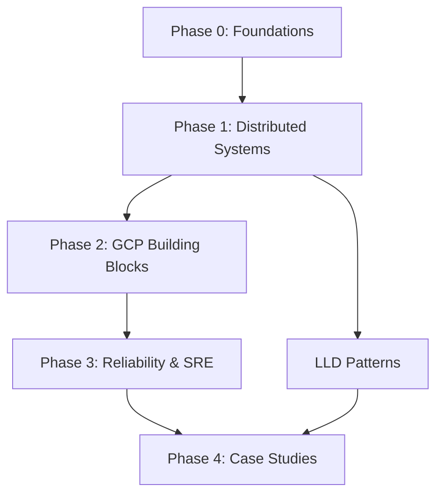

# Learning Index: Staff-Level GCP System Design & SRE

## Navigation

- [Learning Path](#learning-path-curriculum) - Follow this for structured learning
- [Reference Map](#reference-map) - Jump to specific topics
- [Progress Tracker](PROGRESS.md) - Track your completion

---

## Learning Path (Curriculum)

Follow these phases in order. Each phase builds on the previous one.

### Phase 0: Foundations & Quantitative Reasoning
**Goal**: Build mental models for capacity, latency, and system behavior.

**Topics**:
- [Queueing Theory & Tail Latency](01-foundations/queueing-tail-latency.md)
- [Capacity Math Cheat Sheet](01-foundations/capacity-math.md)
- [Observability Basics](01-foundations/observability-basics.md)

**Milestone**: You can reason about P50/P95/P99 latency, calculate capacity needs, and understand what metrics matter.

**Suggested pacing**: 1-2 weeks

---

### Phase 1: Distributed Systems Building Blocks
**Goal**: Understand the primitives that make distributed systems work.

**Topics**:
- [Time, Ordering, and Causality](02-distributed-systems/time-ordering-causality.md)
- [Consensus & Leases](02-distributed-systems/consensus-leases.md)
- [Replication Strategies](02-distributed-systems/replication.md)
- [Sharding & Partitioning](02-distributed-systems/sharding-partitioning.md)
- [Overload & Backpressure](02-distributed-systems/overload-backpressure.md)
- [Idempotency & Retry Semantics](02-distributed-systems/idempotency-retries.md)
- [Queues & Streams](02-distributed-systems/queues-streams.md)

**Milestone**: You understand when to use consensus vs leases, how to handle overload gracefully, and the tradeoffs in replication strategies.

**Suggested pacing**: 3-4 weeks

---

### Phase 2: GCP Core Building Blocks
**Goal**: Deep understanding of GCP primitives: how they work, fail, and scale.

**Topics**:
- [VPC, Load Balancing & DNS](03-gcp-core-building-blocks/vpc-lb-dns.md)
- [GKE Control Plane & Data Plane](03-gcp-core-building-blocks/gke-internals.md)
- [IAM Evaluation Model](03-gcp-core-building-blocks/iam-evaluation.md)
- [Cloud Storage Deep Dive](03-gcp-core-building-blocks/cloud-storage.md)
- [Spanner: Consistency & Performance](03-gcp-core-building-blocks/spanner.md)
- [Bigtable: Design & Tradeoffs](03-gcp-core-building-blocks/bigtable.md)
- [BigQuery Architecture](03-gcp-core-building-blocks/bigquery.md)
- [Pub/Sub: Delivery Guarantees](03-gcp-core-building-blocks/pubsub.md)
- [Cloud KMS & Secret Management](03-gcp-core-building-blocks/kms-secrets.md)

**Milestone**: You can design systems using GCP primitives, understand their failure modes, and make informed tradeoffs.

**Suggested pacing**: 4-6 weeks

---

### Phase 3: Reliability Engineering & SRE
**Goal**: Build and operate reliable systems at scale.

**Topics**:
- [SLIs, SLOs & Error Budgets](04-reliability-sre/sli-slo-error-budget.md)
- [Production Readiness Reviews (PRR)](04-reliability-sre/prr-checklist.md)
- [Incident Response & Postmortems](04-reliability-sre/incident-response.md)
- [Capacity Planning & Forecasting](04-reliability-sre/capacity-planning.md)
- [Load Shedding & Circuit Breakers](04-reliability-sre/load-shedding.md)
- [Canary Deployments & Rollouts](04-reliability-sre/canary-rollouts.md)
- [Testing for Failure](04-reliability-sre/testing-for-failure.md)

**Milestone**: You can define SLIs/SLOs, run PRRs, respond to incidents, and plan capacity.

**Suggested pacing**: 3-4 weeks

---

### Phase 4: Case Studies & End-to-End Design
**Goal**: Apply everything to real-world scenarios.

**Topics**:
- [Multi-Region API on GCP](06-case-studies/multi-region-api.md)
- [High-Throughput Data Pipeline](06-case-studies/data-pipeline.md) (coming soon)
- [Global Content Delivery System](06-case-studies/cdn-system.md) (coming soon)

**Milestone**: You can design, implement, and operate production systems with clear SLOs and operational playbooks.

**Suggested pacing**: 2-3 weeks per case study

---

## Reference Map

Browse by topic area. Each entry links to deep dives and notes prerequisites.

### Distributed Systems

| Topic | Deep Dive | Prerequisites |
|-------|-----------|---------------|
| **Time & Ordering** | [Time, Ordering, Causality](02-distributed-systems/time-ordering-causality.md) | Phase 0 |
| **Consensus** | [Consensus & Leases](02-distributed-systems/consensus-leases.md) | Time & Ordering |
| **Replication** | [Replication Strategies](02-distributed-systems/replication.md) | Consensus |
| **Sharding** | [Sharding & Partitioning](02-distributed-systems/sharding-partitioning.md) | Replication |
| **Overload** | [Overload & Backpressure](02-distributed-systems/overload-backpressure.md) | Queueing Theory |
| **Idempotency** | [Idempotency & Retries](02-distributed-systems/idempotency-retries.md) | Time & Ordering |
| **Queues** | [Queues & Streams](02-distributed-systems/queues-streams.md) | Overload |

### GCP Infrastructure

| Topic | Deep Dive | Prerequisites |
|-------|-----------|---------------|
| **Networking** | [VPC, LB & DNS](03-gcp-core-building-blocks/vpc-lb-dns.md) | Phase 0 |
| **Kubernetes** | [GKE Internals](03-gcp-core-building-blocks/gke-internals.md) | Networking |
| **Identity** | [IAM Evaluation](03-gcp-core-building-blocks/iam-evaluation.md) | Phase 0 |
| **Storage** | [Cloud Storage](03-gcp-core-building-blocks/cloud-storage.md) | Networking |
| **Spanner** | [Spanner Deep Dive](03-gcp-core-building-blocks/spanner.md) | Consensus, Replication |
| **Bigtable** | [Bigtable Design](03-gcp-core-building-blocks/bigtable.md) | Sharding |
| **BigQuery** | [BigQuery Architecture](03-gcp-core-building-blocks/bigquery.md) | Storage, Sharding |
| **Pub/Sub** | [Pub/Sub Guarantees](03-gcp-core-building-blocks/pubsub.md) | Queues, Idempotency |
| **Secrets** | [KMS & Secrets](03-gcp-core-building-blocks/kms-secrets.md) | IAM |

### Reliability & SRE

| Topic | Deep Dive | Prerequisites |
|-------|-----------|---------------|
| **SLIs/SLOs** | [SLIs, SLOs & Error Budgets](04-reliability-sre/sli-slo-error-budget.md) | Phase 0 |
| **PRR** | [PRR Checklist](04-reliability-sre/prr-checklist.md) | SLIs/SLOs |
| **Incidents** | [Incident Response](04-reliability-sre/incident-response.md) | SLIs/SLOs |
| **Capacity** | [Capacity Planning](04-reliability-sre/capacity-planning.md) | Capacity Math |
| **Load Shedding** | [Load Shedding](04-reliability-sre/load-shedding.md) | Overload |
| **Rollouts** | [Canary & Rollouts](04-reliability-sre/canary-rollouts.md) | Testing for Failure |
| **Testing** | [Testing for Failure](04-reliability-sre/testing-for-failure.md) | Phase 1 |

### Low-Level Design Patterns

| Topic | Deep Dive | Prerequisites |
|-------|-----------|---------------|
| **Rate Limiting** | [Rate Limiter Implementations](05-llD-patterns/rate-limiting.md) | Queueing Theory |
| **Circuit Breakers** | [Circuit Breaker Pattern](05-llD-patterns/circuit-breakers.md) | Load Shedding |
| **Concurrency** | [Concurrency Primitives](05-llD-patterns/concurrency.md) | Phase 1 |
| **Idempotency** | [Idempotency Patterns](05-llD-patterns/idempotency-patterns.md) | Idempotency & Retries |

---

## Cross-Cutting Concerns

These topics appear across multiple chapters:

- **Failure Domains**: How to isolate failures and limit blast radius
- **Overload Behavior**: What happens at 10×, 100× normal load
- **Observability Contract**: What metrics/logs/traces are needed
- **Change Safety**: Rollout strategies, canaries, reversibility
- **Security Boundaries**: Identity, authorization, data exfiltration controls

---

## Learning Dependencies

---

## Next Steps

1. **Start with Phase 0** if you're new to quantitative reasoning
2. **Jump to a topic** in the Reference Map if you have specific questions
3. **Track progress** in [PROGRESS.md](PROGRESS.md)
4. **Use templates** in `00-meta/` for your own deep dives

