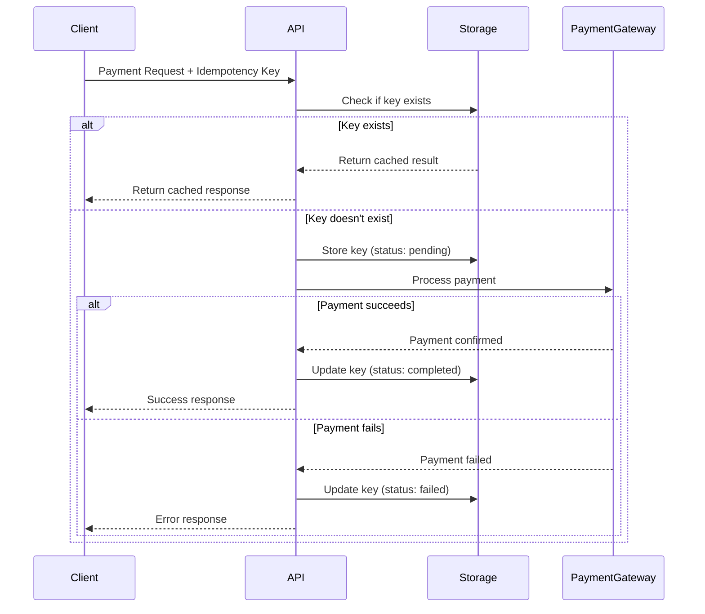
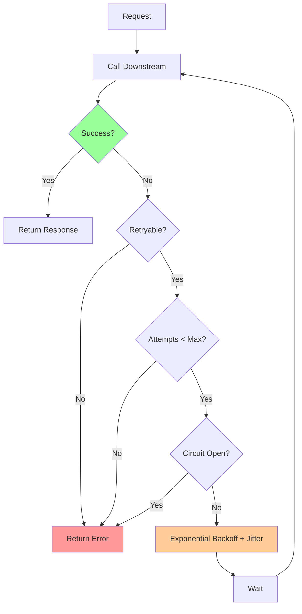

# Answer Key: Idempotency & Retry Semantics

[Back to Exercises](../../02-distributed-systems/idempotency-retries.md#exercises)

---

## Exercise 1: Design Idempotent Payment API

**Question**: Design an idempotent payment API. How do you ensure payments aren't charged twice?

### Answer

**Goal**: Ensure that retrying a payment request doesn't charge the user twice.

### Design Components

**1. Idempotency Key**

**Client generates unique key**:
- **Format**: UUID v4 (random, unpredictable)
- **Included in**: Request header `Idempotency-Key: <uuid>`
- **Scope**: Per payment, unique per payment attempt

**Why UUID**:
- Globally unique
- Unpredictable (can't be guessed)
- Standard format

**2. Server-Side Idempotency Check**

**Storage**: Store idempotency keys in database or distributed cache (Redis)

**Process**:
1. **Receive request**: Extract idempotency key from header
2. **Check if key exists**: Query storage for key
3. **If exists**: Return cached response (same payment ID, same status)
4. **If not exists**: Process payment, store result with key

**Storage schema**:
```
idempotency_keys:
  - key: UUID (primary key)
  - payment_id: UUID
  - status: string (pending, completed, failed)
  - amount: decimal
  - created_at: timestamp
  - expires_at: timestamp (TTL: 24 hours)
```

**3. Payment Processing**

**Idempotent flow**:


**4. Handling Race Conditions**

**Problem**: Two requests with same key arrive simultaneously.

**Solution**: Use database transaction or distributed lock:
- **Transaction**: Check and insert atomically
- **Distributed lock**: Lock on idempotency key
- **Optimistic locking**: Use version numbers

**5. TTL and Cleanup**

**TTL**: 24 hours (or based on business requirements)

**Why**:
- Prevents storage from growing indefinitely
- Allows retries within reasonable time window
- Cleans up old keys automatically

**Cleanup**:
- **Automatic**: Use Redis TTL or database expiration
- **Manual**: Periodic cleanup job for old keys

**6. Response Consistency**

**Important**: Same idempotency key must return same response:
- Same payment ID
- Same status
- Same amount
- Same timestamp

**Why**: Client may retry and expect same result.

### Complete API Design

**Endpoint**: `POST /payments`

**Request**:
```json
{
  "amount": 100.00,
  "currency": "USD",
  "payment_method": "card_123",
  "idempotency_key": "550e8400-e29b-41d4-a716-446655440000"
}
```

**Headers**:
```
Idempotency-Key: 550e8400-e29b-41d4-a716-446655440000
```

**Response** (first request):
```json
{
  "payment_id": "pay_123",
  "status": "completed",
  "amount": 100.00,
  "created_at": "2024-01-01T12:00:00Z"
}
```

**Response** (retry with same key):
```json
{
  "payment_id": "pay_123",  // Same payment ID
  "status": "completed",     // Same status
  "amount": 100.00,          // Same amount
  "created_at": "2024-01-01T12:00:00Z"  // Same timestamp
}
```

### Answer

**Idempotent payment API design**:

1. **Idempotency key**: Client generates UUID, includes in request header
2. **Server-side check**: Check if key exists in storage (Redis/database)
3. **If key exists**: Return cached response (same payment ID, status)
4. **If key doesn't exist**: Process payment, store result with key
5. **Race condition handling**: Use transactions or distributed locks
6. **TTL**: 24 hours (cleanup old keys)
7. **Response consistency**: Same key returns same response

**Key principles**:
- **Client generates key**: Unpredictable UUID
- **Server validates**: Check before processing
- **Store results**: Cache response for retries
- **Handle races**: Use transactions/locks
- **Consistent responses**: Same key = same response

**Why this works**:
- First request processes payment, stores result
- Retries return cached result (no duplicate charge)
- Race conditions handled with transactions
- TTL prevents storage growth

---

## Exercise 2: Retry Strategy

**Question**: Design a retry strategy for an API that calls a downstream service. What backoff do you use? What limits?

### Answer

**Goal**: Retry failed requests intelligently without overwhelming downstream service.

### Retry Strategy Components

**1. Retryable Errors**

**Retry on**:
- **5xx errors**: Server errors (500, 502, 503, 504)
- **Timeouts**: Connection timeout, request timeout
- **Network errors**: Connection refused, DNS errors

**Don't retry on**:
- **4xx errors**: Client errors (400, 401, 403, 404)
- **429 errors**: Rate limited (may retry with longer backoff)
- **Idempotency errors**: Already processed

**2. Exponential Backoff**

**Formula**: `wait_time = base_delay × 2^attempt + jitter`

**Configuration**:
- **Base delay**: 100ms
- **Max delay**: 10 seconds
- **Jitter**: Random 0-100ms

**Backoff schedule**:
- Attempt 1: 100ms + jitter (0-100ms) = 100-200ms
- Attempt 2: 200ms + jitter (0-100ms) = 200-300ms
- Attempt 3: 400ms + jitter (0-100ms) = 400-500ms
- Attempt 4: 800ms + jitter (0-100ms) = 800-900ms
- Attempt 5: 1600ms + jitter (0-100ms) = 1600-1700ms (capped at 10s)

**Why exponential**:
- Gives downstream service time to recover
- Reduces load on failing service
- Prevents thundering herd

**Why jitter**:
- Spreads out retries from multiple clients
- Prevents synchronized retries
- Reduces thundering herd

**3. Retry Limits**

**Max retries**: 3 (total 4 attempts: initial + 3 retries)

**Why limit retries**:
- Prevents infinite retries
- Fails fast after reasonable attempts
- Reduces load on failing service

**Total time**: ~3-4 seconds (with backoff)

**4. Circuit Breaker Integration**

**When circuit breaker opens**:
- Don't retry (fail fast)
- Return error immediately
- Wait for circuit breaker to close

**Why**: Prevents retrying when service is known to be down.

**5. Idempotency**

**Requirement**: All operations must be idempotent.

**Why**: Retries may execute operations multiple times.

**Implementation**: Use idempotency keys (see Exercise 1).

### Complete Retry Strategy



**Configuration**:
- **Max retries**: 3
- **Base delay**: 100ms
- **Max delay**: 10 seconds
- **Jitter**: 0-100ms random
- **Retry on**: 5xx, timeouts, network errors
- **Don't retry on**: 4xx (except 429), circuit breaker open

**Example**:
```
Attempt 1: Call downstream → 503 error
Wait: 100ms + 50ms jitter = 150ms
Attempt 2: Call downstream → 503 error
Wait: 200ms + 75ms jitter = 275ms
Attempt 3: Call downstream → 503 error
Wait: 400ms + 25ms jitter = 425ms
Attempt 4: Call downstream → 503 error
Return error (max retries exceeded)
```

### Answer

**Retry strategy**:

1. **Retryable errors**: Retry on 5xx, timeouts, network errors
2. **Exponential backoff**: Base 100ms, max 10s, with jitter
3. **Retry limits**: Max 3 retries (4 total attempts)
4. **Circuit breaker**: Don't retry when circuit open
5. **Idempotency**: All operations must be idempotent

**Backoff schedule**:
- Attempt 1: 100-200ms
- Attempt 2: 200-300ms
- Attempt 3: 400-500ms
- Attempt 4: 800-900ms (if retrying 429)

**Total time**: ~3-4 seconds maximum

**Key principles**:
- **Exponential backoff**: Gives service time to recover
- **Jitter**: Prevents thundering herd
- **Retry limits**: Fails fast after reasonable attempts
- **Circuit breaker**: Prevents retrying when service down
- **Idempotency**: Safe to retry

---

## Exercise 3: Handle Duplicates

**Question**: A non-idempotent operation is retried and creates duplicates. How do you detect and handle duplicates?

### Answer

**Problem**: Non-idempotent operation was retried, creating duplicate records.

### Detection Strategies

**1. Unique Constraints**

**Database-level**:
- Add unique constraint on identifying fields
- Database rejects duplicates automatically
- **Example**: Unique constraint on `(user_id, order_id)`

**Pros**: Simple, database enforces
**Cons**: Requires schema changes, may not catch all duplicates

**2. Deduplication Window**

**Process**:
1. Hash request content + client identifier
2. Check if hash seen in time window (e.g., 24 hours)
3. If seen: Return previous result
4. If not seen: Process request, store hash

**Storage**: Redis or database with TTL

**Hash components**:
- Request content (body, parameters)
- Client identifier (user ID, API key)
- Operation type

**3. Timestamp-Based Detection**

**Process**:
1. Include timestamp in request
2. Check for similar requests within time window
3. If found: Likely duplicate
4. If not found: Process request

**Time window**: 5-10 minutes (typical retry window)

**4. Request ID Tracking**

**Process**:
1. Client generates request ID
2. Server tracks processed request IDs
3. If ID seen: Return previous result
4. If ID not seen: Process request, store ID

**Storage**: Redis with TTL (24 hours)

### Handling Duplicates

**1. Reject Duplicates**

**Response**: Return error indicating duplicate

**Example**:
```json
{
  "error": "duplicate_request",
  "message": "This request was already processed",
  "original_request_id": "req_123",
  "original_timestamp": "2024-01-01T12:00:00Z"
}
```

**When to use**: When duplicates are not acceptable (e.g., payments)

**2. Return Previous Result**

**Response**: Return result from original request

**Example**:
```json
{
  "request_id": "req_123",
  "status": "completed",
  "result": { ... },
  "message": "Duplicate request, returning previous result"
}
```

**When to use**: When operation is idempotent (e.g., creating user)

**3. Merge Duplicates**

**Process**: Merge duplicate data intelligently

**Example**: Two user creation requests → merge user data

**When to use**: When duplicates can be merged (e.g., user profiles)

**4. Flag and Review**

**Process**: Flag duplicates for manual review

**When to use**: When automatic handling is risky (e.g., financial transactions)

### Complete Solution

**Detection**:
1. **Unique constraints**: Database-level enforcement
2. **Deduplication window**: Hash-based detection (24 hours)
3. **Request ID tracking**: Track processed request IDs
4. **Timestamp checking**: Check for similar requests in time window

**Handling**:
1. **Reject**: Return error for duplicates
2. **Return previous**: Return cached result
3. **Merge**: Intelligently merge duplicate data
4. **Flag**: Flag for manual review

**Implementation**:

```python
def handle_request(request):
    # Generate deduplication key
    dedup_key = hash_request(request)
    
    # Check if seen before
    if redis.exists(dedup_key):
        previous_result = redis.get(dedup_key)
        return {
            "status": "duplicate",
            "result": previous_result,
            "message": "Duplicate request, returning previous result"
        }
    
    # Process request
    try:
        result = process_request(request)
        
        # Store result
        redis.setex(dedup_key, 86400, result)  # 24 hour TTL
        
        return result
    except DuplicateError:
        # Database unique constraint violation
        return {
            "error": "duplicate_request",
            "message": "This request was already processed"
        }
```

### Answer

**Detect duplicates**:

1. **Unique constraints**: Database-level enforcement on identifying fields
2. **Deduplication window**: Hash request content + client ID, check in 24-hour window
3. **Request ID tracking**: Track processed request IDs in Redis
4. **Timestamp checking**: Check for similar requests within 5-10 minute window

**Handle duplicates**:

1. **Reject**: Return error for non-idempotent operations (e.g., payments)
2. **Return previous**: Return cached result for idempotent operations
3. **Merge**: Intelligently merge duplicate data when possible
4. **Flag**: Flag for manual review when automatic handling is risky

**Implementation**:
- **Storage**: Redis with 24-hour TTL
- **Hash**: Request content + client ID + operation type
- **Response**: Return previous result or error based on operation type

**Key principles**:
- **Detect early**: Check before processing
- **Store results**: Cache results for duplicate detection
- **Handle appropriately**: Different strategies for different operations
- **TTL**: Cleanup old deduplication keys

**Prevention**:
- **Make operations idempotent**: Best solution (see Exercise 1)
- **Use idempotency keys**: Prevent duplicates at source
- **Client-side deduplication**: Don't retry if already succeeded

