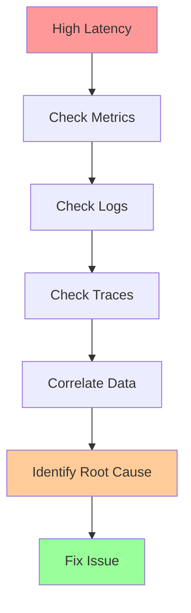

# Answer Key: Observability Basics

[Back to Exercises](../../01-foundations/observability-basics.md#exercises)

---

## Exercise 1: Define Observability Contract

**Question**: Define metrics, logs, and traces for an API service. What do you measure?

### Answer

**Service**: REST API for user data management

### Metrics

**1. Service Metrics**

**Latency Metrics**:
- `http_request_duration_seconds{method, endpoint, status}`: Request latency (histogram)
  - P50, P95, P99 percentiles
  - Labels: method (GET, POST, etc.), endpoint, status code

**Throughput Metrics**:
- `http_requests_total{method, endpoint, status}`: Request count (counter)
  - Labels: method, endpoint, status code

**Error Metrics**:
- `http_errors_total{method, endpoint, error_type}`: Error count (counter)
  - Labels: method, endpoint, error_type (4xx, 5xx, timeout)

**Availability Metrics**:
- `http_request_success_rate{method, endpoint}`: Success rate (gauge)
  - Calculated: successful_requests / total_requests

**2. Resource Metrics**

**CPU**: `cpu_usage_percent`: CPU utilization
**Memory**: `memory_usage_bytes`: Memory usage
**Disk**: `disk_usage_bytes`, `disk_io_operations_total`: Disk usage and I/O
**Network**: `network_bytes_total`: Network traffic

**3. Business Metrics**

**User Metrics**:
- `active_users_total`: Active users
- `api_calls_per_user`: API calls per user

**Feature Metrics**:
- `feature_usage_total{feature}`: Feature usage
- `feature_adoption_rate{feature}`: Feature adoption rate

### Logs

**1. Request Logs**

**Format**: Structured JSON

**Fields**:
- `timestamp`: Request timestamp
- `request_id`: Unique request ID
- `method`: HTTP method
- `path`: Request path
- `status`: Response status code
- `latency_ms`: Request latency
- `user_id`: User ID (if authenticated)
- `ip_address`: Client IP address

**Example**:
```json
{
  "timestamp": "2024-01-01T12:00:00Z",
  "level": "INFO",
  "request_id": "req_123",
  "method": "GET",
  "path": "/users/123",
  "status": 200,
  "latency_ms": 45,
  "user_id": "user_456"
}
```

**2. Error Logs**

**Format**: Structured JSON

**Fields**:
- `timestamp`: Error timestamp
- `request_id`: Request ID
- `level`: ERROR
- `error`: Error message
- `stack_trace`: Stack trace (if applicable)
- `context`: Additional context

**Example**:
```json
{
  "timestamp": "2024-01-01T12:00:00Z",
  "level": "ERROR",
  "request_id": "req_123",
  "error": "Database connection failed",
  "stack_trace": "...",
  "context": {
    "database": "users_db",
    "operation": "read"
  }
}
```

**3. Audit Logs**

**Format**: Structured JSON

**Fields**:
- `timestamp`: Event timestamp
- `user_id`: User ID
- `action`: Action performed
- `resource`: Resource accessed
- `result`: Success or failure

### Traces

**1. Trace Structure**

**Trace**: Entire request flow

**Spans**:
- **Load balancer span**: Request received, routing decision
- **API server span**: Request processing
- **Database span**: Database query
- **Cache span**: Cache lookup
- **External API span**: External API call

**2. Span Attributes**

**Common attributes**:
- `http.method`: HTTP method
- `http.status_code`: Response status code
- `http.url`: Request URL
- `db.query`: Database query (if applicable)
- `cache.hit`: Cache hit or miss

**3. Sampling Strategy**

**Sampling rate**: 1% (or 100% for errors)

**Why**: Traces are expensive, sample most requests but trace all errors

### Complete Observability Contract

**Metrics**:
- Latency: `http_request_duration_seconds` (P50, P95, P99)
- Throughput: `http_requests_total`
- Errors: `http_errors_total`
- Availability: `http_request_success_rate`
- Resources: CPU, memory, disk, network

**Logs**:
- Request logs: All requests (structured JSON)
- Error logs: All errors (with stack traces)
- Audit logs: Security-relevant events

**Traces**:
- Trace all HTTP requests (1% sampling, 100% for errors)
- Spans for: load balancer, API server, database, cache, external APIs

**Answer**: **Complete observability contract**:

**Metrics**:
- **Latency**: `http_request_duration_seconds` with P50/P95/P99
- **Throughput**: `http_requests_total` by method/endpoint/status
- **Errors**: `http_errors_total` by error type
- **Availability**: `http_request_success_rate`
- **Resources**: CPU, memory, disk, network

**Logs**:
- **Request logs**: All requests with request_id, method, path, status, latency
- **Error logs**: All errors with stack traces and context
- **Audit logs**: Security-relevant events

**Traces**:
- **Trace all requests**: 1% sampling (100% for errors)
- **Spans**: Load balancer, API server, database, cache, external APIs

**Key principles**:
- **User-facing**: Metrics measure what users experience
- **Structured**: Logs are structured JSON
- **Correlation**: Request IDs link metrics, logs, traces
- **Sampling**: Trace sampling balances cost and coverage

---

## Exercise 2: Debug with Observability

**Question**: A service has high latency. How do you use metrics, logs, and traces to debug?

### Answer

**Problem**: Service has high latency (P95 > 100ms, target < 100ms)

### Debugging Process

**1. Check Metrics**

**Latency metrics**:
- Which endpoints are slow?
- Which methods are slow?
- Which regions are slow?
- When did latency increase?

**Resource metrics**:
- CPU utilization: Is CPU saturated?
- Memory usage: Is memory high?
- Disk I/O: Is disk I/O high?
- Network: Is network bandwidth saturated?

**Error metrics**:
- Are errors increasing?
- What types of errors?
- Are errors correlated with latency?

**2. Check Logs**

**Request logs**:
- Filter by slow requests (latency > threshold)
- Look for patterns: specific endpoints, users, times
- Check for errors in slow requests

**Error logs**:
- Are there errors in slow requests?
- What types of errors?
- Are errors causing retries (increasing latency)?

**3. Check Traces**

**Slow traces**:
- Find traces with high latency
- Identify slow spans: Which operations are slow?
- Check span attributes: What's happening in slow spans?

**Span analysis**:
- **Database spans**: Are database queries slow?
- **Cache spans**: Are cache lookups slow?
- **External API spans**: Are external APIs slow?
- **Processing spans**: Is application logic slow?

**4. Correlate Data**

**Correlation**:
- Use request_id to correlate metrics, logs, traces
- Identify patterns: slow requests have common characteristics
- Root cause: What's causing slowness?

### Debugging Workflow



### Common Root Causes

**1. Database Slow Queries**

**Symptoms**:
- Database spans are slow in traces
- High database latency in metrics
- Database CPU/memory high

**Fix**: Optimize queries, add indexes, scale database

**2. Cache Misses**

**Symptoms**:
- Cache hit rate low in metrics
- Cache spans show misses in traces
- Database queries increasing

**Fix**: Improve cache hit rate, increase cache size

**3. Downstream Service Latency**

**Symptoms**:
- External API spans slow in traces
- Downstream service latency high
- Errors from downstream services

**Fix**: Optimize downstream calls, add caching, use circuit breakers

**4. Resource Contention**

**Symptoms**:
- CPU/memory/disk utilization high
- All requests slow (not just specific endpoints)
- Resource metrics correlate with latency

**Fix**: Scale up resources, optimize resource usage

**5. Code Issues**

**Symptoms**:
- Processing spans slow in traces
- No obvious resource or dependency issues
- Specific endpoints slow

**Fix**: Profile code, optimize algorithms, fix bugs

### Answer

**Debugging workflow**:

1. **Check metrics**: Which endpoints/methods/regions are slow? Resource utilization?
2. **Check logs**: Filter slow requests, look for patterns, check for errors
3. **Check traces**: Find slow traces, identify slow spans, check span attributes
4. **Correlate**: Use request_id to correlate metrics, logs, traces
5. **Root cause**: Identify what's causing slowness

**Key checks**:
- **Metrics**: Latency by endpoint/method, resource utilization, errors
- **Logs**: Slow requests, error patterns, request characteristics
- **Traces**: Slow spans, database queries, cache hits, external APIs

**Common causes**:
- Database slow queries
- Cache misses
- Downstream service latency
- Resource contention
- Code issues

**Tools**:
- **Metrics**: Prometheus, Cloud Monitoring
- **Logs**: Cloud Logging, ELK stack
- **Traces**: Cloud Trace, Jaeger, Zipkin

---

## Exercise 3: Reduce Cardinality

**Question**: You have a metric with user_id as a label (high cardinality). How do you fix it?

### Answer

**Problem**: Metric with `user_id` label has high cardinality (millions of unique values)

**Impact**: 
- Explodes metric storage
- Slows down queries
- Increases costs

### Solutions

**1. Remove user_id Label**

**Change**:
- **Before**: `api_requests_total{user_id="123", endpoint="/users"}`
- **After**: `api_requests_total{endpoint="/users"}`

**When to use**: When user-level metrics aren't needed

**Tradeoff**: Lose user-level visibility

**2. Use Logs Instead**

**Change**:
- **Metrics**: `api_requests_total{endpoint="/users"}` (no user_id)
- **Logs**: Include user_id in log entries

**When to use**: When user-level data is needed for debugging

**Tradeoff**: Need to query logs instead of metrics

**3. Aggregate user_id**

**Change**:
- **Before**: `api_requests_total{user_id="123"}`
- **After**: `api_requests_total{user_tier="premium"}` or `api_requests_total{user_segment="enterprise"}`

**When to use**: When user segmentation is sufficient

**Tradeoff**: Lose individual user visibility

**4. Use Sampling**

**Change**:
- Sample user_ids (e.g., track 1% of users)
- Use hash of user_id to determine if sampled

**When to use**: When need some user-level visibility

**Tradeoff**: Lose visibility for most users

**5. Use Histogram Instead**

**Change**:
- **Before**: `api_requests_total{user_id="123"}`
- **After**: `api_request_duration_seconds{endpoint="/users"}` (histogram)

**When to use**: When measuring distribution, not individual users

**Tradeoff**: Different metric type

### Recommended Solution

**Best practice**: **Remove user_id from metrics, use logs instead**

**Metrics** (low cardinality):
```
api_requests_total{method, endpoint, status}
api_request_duration_seconds{method, endpoint}
```

**Logs** (high cardinality):
```json
{
  "request_id": "req_123",
  "user_id": "user_456",
  "endpoint": "/users",
  "status": 200,
  "latency_ms": 45
}
```

**Why**:
- Metrics: Fast queries, low storage, aggregate data
- Logs: Detailed data, can query by user_id when needed

### Answer

**Solutions**:

1. **Remove user_id label**: If user-level metrics aren't needed
2. **Use logs instead**: Include user_id in logs, not metrics
3. **Aggregate user_id**: Use user_tier or user_segment instead
4. **Use sampling**: Sample 1% of users
5. **Use histogram**: Measure distribution, not individual users

**Recommended**: **Remove user_id from metrics, use logs instead**

**Metrics** (low cardinality):
- `api_requests_total{method, endpoint, status}`
- `api_request_duration_seconds{method, endpoint}`

**Logs** (high cardinality):
- Include user_id in log entries
- Query logs when user-level data needed

**Key principles**:
- **Metrics**: Low cardinality, aggregate data
- **Logs**: High cardinality, detailed data
- **Traces**: Can include user_id in span attributes (sampled)

**Why this works**:
- Metrics stay fast and cheap
- Logs provide detailed user-level data when needed
- Best of both worlds

