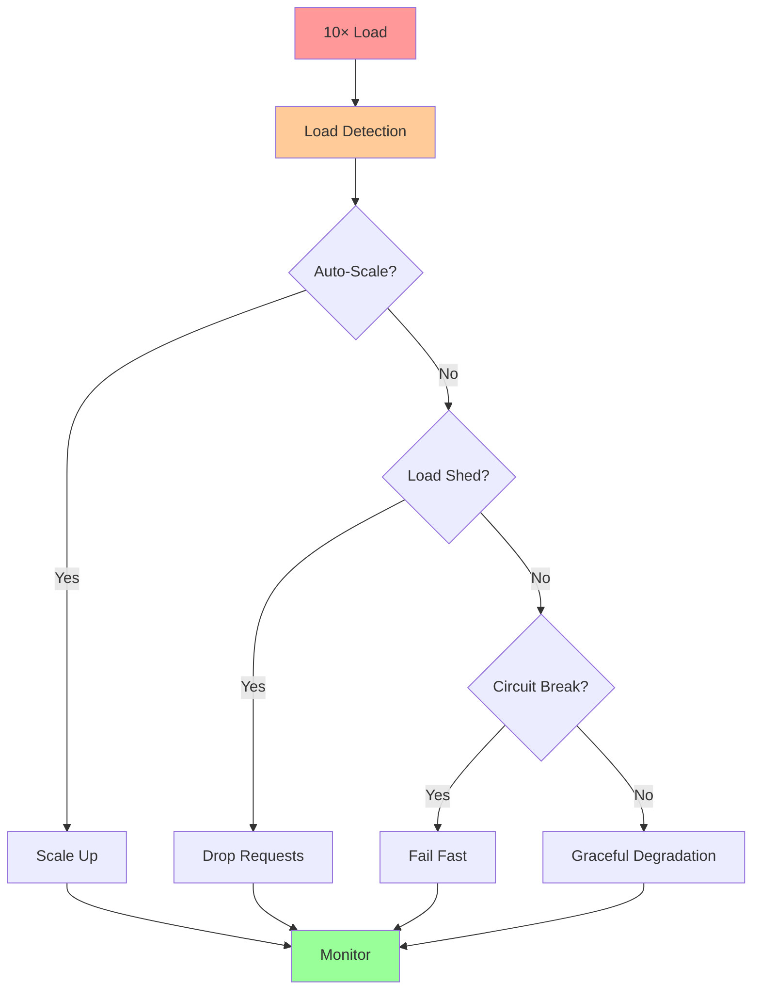
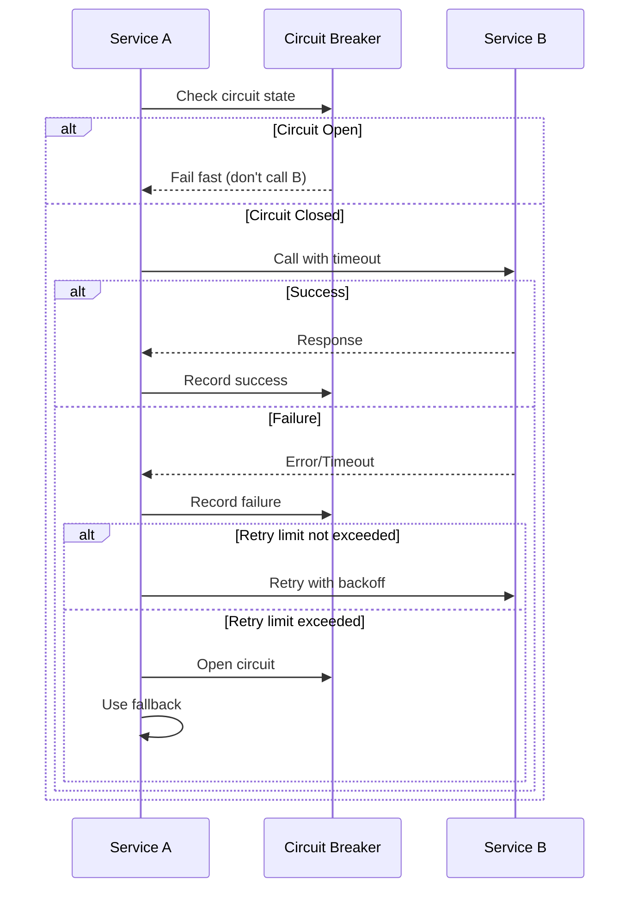

# Answer Key: Overload & Backpressure

[Back to Exercises](../../02-distributed-systems/overload-backpressure.md#exercises)

---

## Exercise 1: Design Backpressure

**Question**: Design a system that handles 10× load gracefully. What mechanisms do you use?

### Answer

**Goal**: Handle 10× normal load without complete failure.

### Design Components

**1. Load Detection**

**Metrics to monitor**:
- Queue depth (alert when > 2× normal)
- Latency (alert when P95 > 2× normal)
- Error rate (alert when > 2× normal)
- Resource utilization (alert when > 80%)

**Detection thresholds**:
- **Normal load**: Baseline metrics
- **2× load**: Warning threshold
- **5× load**: Critical threshold
- **10× load**: Emergency threshold

**2. Auto-Scaling**

**Horizontal scaling**:
- **Min replicas**: 3 (for redundancy)
- **Max replicas**: 30 (10× normal capacity)
- **Scale up**: Add 2 pods when CPU > 70% or queue depth > threshold
- **Scale down**: Remove 1 pod when CPU < 50% and queue depth < threshold
- **Cooldown**: 2 minutes between scaling events

**Scaling strategy**:
- Scale aggressively (add capacity quickly)
- Scale conservatively (remove capacity slowly)
- Pre-scale for known traffic patterns

**3. Load Shedding**

**When to shed load**:
- Queue depth > threshold (e.g., > 1000 requests)
- Latency > threshold (e.g., P95 > 500ms)
- Resource utilization > 90%

**Load shedding strategies**:
- **Random drop**: Drop random requests (simple but unfair)
- **Priority-based**: Drop low-priority requests first (better UX)
- **Client-based**: Drop requests from specific clients (protect important clients)
- **Request type**: Drop read requests before write requests (preserve data integrity)

**Implementation**:
- Drop requests at load balancer or API gateway
- Return HTTP 429 (Too Many Requests)
- Include Retry-After header

**4. Circuit Breakers**

**Purpose**: Stop calling downstream services when they're failing.

**Configuration**:
- **Failure threshold**: 50% failure rate
- **Timeout**: 5 seconds
- **Half-open interval**: 30 seconds
- **Success threshold**: 3 successful requests

**Behavior**:
- **Closed**: Normal operation, calls downstream
- **Open**: Fails fast, doesn't call downstream
- **Half-open**: Test if downstream recovered

**5. Rate Limiting**

**Per-client rate limits**:
- Normal clients: 100 requests/second
- Premium clients: 1000 requests/second
- Anonymous clients: 10 requests/second

**Global rate limits**:
- Total system capacity: 10,000 QPS
- When exceeded: Return 429, queue requests

**6. Graceful Degradation**

**Feature flags**:
- Disable non-critical features under load
- Reduce functionality to core features only
- Return cached data instead of fresh data

**Response strategies**:
- **Fast path**: Serve cached data, skip expensive operations
- **Reduced functionality**: Disable optional features
- **Timeout reduction**: Reduce timeouts to fail fast

**7. Monitoring & Alerting**

**Metrics**:
- Request rate, queue depth, latency, error rate
- Resource utilization (CPU, memory, I/O)
- Scaling events, load shedding events

**Alerts**:
- **Warning**: 2× load detected
- **Critical**: 5× load detected
- **Emergency**: 10× load detected

### Complete Design



**Answer**: **Multi-layered approach**:

1. **Auto-scaling**: Scale to 10× capacity (30 replicas)
2. **Load shedding**: Drop low-priority requests when queue depth > threshold
3. **Circuit breakers**: Stop calling failing downstream services
4. **Rate limiting**: Limit per-client and global rates
5. **Graceful degradation**: Disable non-critical features
6. **Monitoring**: Track metrics and alert on thresholds

**Key principles**:
- **Fail gracefully**: Better to serve some requests than none
- **Protect core**: Preserve critical functionality
- **Fail fast**: Don't wait indefinitely
- **Monitor everything**: Know what's happening

---

## Exercise 2: Prevent Cascades

**Question**: Service A calls Service B. How do you prevent B's failure from cascading to A?

### Answer

**Problem**: When Service B fails, Service A may also fail, creating a cascade.

### Prevention Mechanisms

**1. Circuit Breaker**

**Purpose**: Stop calling Service B when it's failing.

**Configuration**:
- **Failure threshold**: 50% failure rate over 10 requests
- **Timeout**: 2 seconds (fail fast)
- **Half-open interval**: 30 seconds
- **Success threshold**: 3 successful requests to close circuit

**Behavior**:
- **Closed**: Normal operation, calls Service B
- **Open**: Fails fast, returns error immediately (doesn't call Service B)
- **Half-open**: Test if Service B recovered

**Implementation**:
```python
if circuit_breaker.is_open():
    return error("Service B unavailable")
else:
    try:
        result = call_service_b()
        circuit_breaker.record_success()
        return result
    except Exception as e:
        circuit_breaker.record_failure()
        raise
```

**2. Timeouts**

**Purpose**: Don't wait indefinitely for Service B.

**Configuration**:
- **Connection timeout**: 1 second
- **Request timeout**: 2 seconds
- **Total timeout**: 3 seconds

**Why important**:
- Prevents Service A from hanging
- Fails fast instead of waiting
- Reduces resource usage

**3. Retry Limits**

**Purpose**: Limit retries to prevent amplifying load on Service B.

**Configuration**:
- **Max retries**: 2 (total 3 attempts)
- **Exponential backoff**: 100ms, 200ms, 400ms
- **Retry only on**: Transient errors (5xx, timeouts)
- **Don't retry on**: Client errors (4xx)

**Why important**:
- Prevents retry storms
- Reduces load on failing service
- Fails fast after retries exhausted

**4. Bulkhead Pattern**

**Purpose**: Isolate failures to prevent resource exhaustion.

**Implementation**:
- **Separate thread pools**: One for Service B calls, one for other operations
- **Resource limits**: Limit resources used for Service B calls
- **Isolation**: Failure in Service B doesn't affect other operations

**5. Fallback Mechanisms**

**Purpose**: Provide alternative behavior when Service B fails.

**Options**:
- **Cached data**: Return cached response from Service B
- **Default values**: Return sensible defaults
- **Degraded mode**: Reduce functionality but continue operating
- **Error response**: Return error but don't crash

**6. Load Shedding**

**Purpose**: Reduce load on Service A to prevent cascade.

**When**: Service B is failing, reduce load on Service A:
- Drop low-priority requests
- Reduce request rate
- Return errors for non-critical requests

**7. Monitoring & Alerting**

**Purpose**: Detect failures early.

**Metrics**:
- Service B error rate
- Service B latency
- Circuit breaker state
- Retry rate

**Alerts**:
- Service B error rate > threshold
- Circuit breaker opened
- High retry rate

### Complete Solution



**Answer**: **Multi-layered defense**:

1. **Circuit breaker**: Stop calling Service B when it's failing
2. **Timeouts**: Don't wait indefinitely (fail fast)
3. **Retry limits**: Limit retries (max 2 retries)
4. **Exponential backoff**: Space out retries
5. **Bulkhead**: Isolate Service B calls (separate thread pool)
6. **Fallback**: Use cached data or defaults when Service B fails
7. **Load shedding**: Reduce load on Service A if Service B failing
8. **Monitoring**: Alert on Service B failures

**Key principles**:
- **Fail fast**: Don't wait for failing service
- **Isolate failures**: Prevent resource exhaustion
- **Provide fallbacks**: Continue operating when possible
- **Monitor everything**: Detect failures early

---

## Exercise 3: Load Shedding Strategy

**Question**: Design a load shedding strategy for an API that handles both read and write requests. Which requests do you drop first?

### Answer

**Goal**: Drop requests when overloaded, prioritizing important requests.

### Request Classification

**1. Request Types**:
- **Read requests**: GET requests, data retrieval
- **Write requests**: POST, PUT, DELETE requests, data modification

**2. Request Priority**:
- **Critical writes**: Must succeed (payments, orders)
- **Normal writes**: Should succeed (updates, creates)
- **Critical reads**: Must succeed (auth checks, critical data)
- **Normal reads**: Can be dropped (cached data, non-critical)

**3. Client Classification**:
- **Premium clients**: High priority
- **Normal clients**: Normal priority
- **Anonymous clients**: Low priority

### Load Shedding Strategy

**Priority Order** (drop in this order):

**1. Anonymous read requests** (lowest priority)
- **Why**: Anonymous users, can retry
- **Impact**: Low (users can retry)
- **When**: Drop when queue depth > 500

**2. Normal read requests from normal clients**
- **Why**: Can be cached, less critical
- **Impact**: Medium (users may see stale data)
- **When**: Drop when queue depth > 1000

**3. Normal write requests from normal clients**
- **Why**: Less critical than reads, can retry
- **Impact**: Medium (users may need to retry)
- **When**: Drop when queue depth > 1500

**4. Critical read requests from normal clients**
- **Why**: Important but can retry
- **Impact**: High (users may be affected)
- **When**: Drop when queue depth > 2000

**5. Normal write requests from premium clients**
- **Why**: Premium clients but non-critical writes
- **Impact**: High (premium users affected)
- **When**: Drop when queue depth > 2500

**6. Critical write requests from normal clients**
- **Why**: Critical but from normal clients
- **Impact**: Very high (critical operations affected)
- **When**: Drop when queue depth > 3000

**7. Critical read requests from premium clients**
- **Why**: Critical and premium
- **Impact**: Very high
- **When**: Drop when queue depth > 3500

**8. Critical write requests from premium clients** (never drop)
- **Why**: Most critical, never drop
- **Impact**: Critical (payments, orders)
- **When**: Never drop (serve even if overloaded)

### Implementation

**Load shedding algorithm**:

```python
def should_drop_request(request):
    queue_depth = get_queue_depth()
    
    # Never drop critical writes from premium clients
    if request.is_critical_write() and request.is_premium():
        return False
    
    # Drop based on priority and queue depth
    priority = request.get_priority()
    threshold = get_threshold_for_priority(priority)
    
    return queue_depth > threshold
```

**Thresholds**:
- Anonymous reads: 500
- Normal reads: 1000
- Normal writes: 1500
- Critical reads: 2000
- Premium normal writes: 2500
- Critical writes: 3000
- Premium critical reads: 3500
- Premium critical writes: Never

### Response Strategy

**When dropping requests**:
- Return HTTP 429 (Too Many Requests)
- Include Retry-After header (e.g., 5 seconds)
- Include error message explaining why
- Log dropped requests for analysis

**Monitoring**:
- Track dropped requests by type
- Monitor queue depth
- Alert on high drop rate
- Analyze drop patterns

### Answer

**Load shedding priority** (drop in order):

1. **Anonymous read requests** (drop at queue depth > 500)
2. **Normal read requests** (drop at queue depth > 1000)
3. **Normal write requests** (drop at queue depth > 1500)
4. **Critical read requests** (drop at queue depth > 2000)
5. **Premium normal write requests** (drop at queue depth > 2500)
6. **Critical write requests** (drop at queue depth > 3000)
7. **Premium critical read requests** (drop at queue depth > 3500)
8. **Premium critical write requests** (**never drop**)

**Key principles**:
- **Preserve data integrity**: Never drop critical writes
- **Prioritize premium clients**: Drop normal clients first
- **Reads before writes**: Drop reads before writes (writes are harder to retry)
- **Gradual degradation**: Drop less important requests first
- **Monitor and adjust**: Track drops and adjust thresholds

**Rationale**:
- **Writes are harder to retry**: Users may have already acted
- **Reads can be cached**: Stale data is better than no data
- **Premium clients pay more**: Should get better service
- **Critical operations**: Must succeed (payments, orders)

