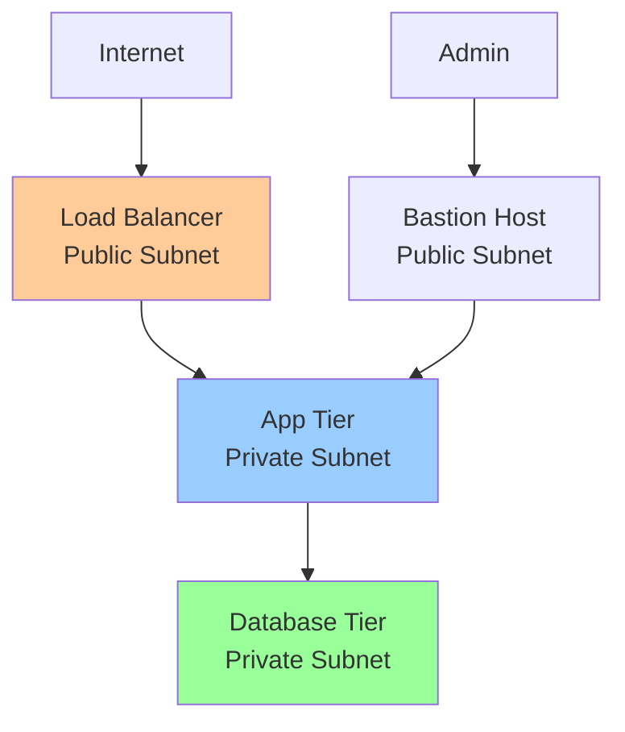

# Answer Key: VPC, Load Balancing & DNS

[Back to Exercises](../../03-gcp-core-building-blocks/vpc-lb-dns.md#exercises)

---

## Exercise 1: Design VPC

**Question**: Design a VPC for a multi-tier application (web, app, database). What subnets do you need? What firewall rules?

### Answer

**Goal**: Design secure, scalable VPC for multi-tier application.

### VPC Architecture

**VPC**: Single VPC with multiple subnets for different tiers.

**Regions**: Single region (us-central1) or multi-region for HA.

### Subnet Design

**1. Public Subnet (Web Tier)**

**Purpose**: Host load balancers, bastion hosts

**CIDR**: `10.0.1.0/24` (256 IPs)

**Resources**:
- Load balancers (external IPs)
- Bastion hosts (SSH access)
- NAT gateways (for private subnets)

**2. Private Subnet - App Tier**

**Purpose**: Host application servers

**CIDR**: `10.0.2.0/24` (256 IPs)

**Resources**:
- GKE nodes (application pods)
- Application servers
- Internal load balancers

**3. Private Subnet - Database Tier**

**Purpose**: Host databases

**CIDR**: `10.0.3.0/24` (256 IPs)

**Resources**:
- Cloud SQL instances
- Spanner instances
- Other databases

**4. Management Subnet (Optional)**

**Purpose**: Management and monitoring

**CIDR**: `10.0.4.0/24` (256 IPs)

**Resources**:
- Monitoring servers
- Logging servers
- Management tools

### Firewall Rules

**1. Ingress Rules**

**Allow HTTP/HTTPS from internet to web tier**:
- **Direction**: Ingress
- **Source**: `0.0.0.0/0` (internet)
- **Destination**: Web tier subnet (`10.0.1.0/24`)
- **Protocol**: TCP
- **Ports**: 80, 443
- **Action**: Allow

**Allow SSH to bastion hosts**:
- **Direction**: Ingress
- **Source**: Admin IP ranges (e.g., office IPs)
- **Destination**: Web tier subnet (`10.0.1.0/24`)
- **Protocol**: TCP
- **Port**: 22
- **Action**: Allow

**Allow app tier to receive traffic from web tier**:
- **Direction**: Ingress
- **Source**: Web tier subnet (`10.0.1.0/24`)
- **Destination**: App tier subnet (`10.0.2.0/24`)
- **Protocol**: TCP
- **Ports**: 8080, 8443 (application ports)
- **Action**: Allow

**Allow database tier to receive traffic from app tier**:
- **Direction**: Ingress
- **Source**: App tier subnet (`10.0.2.0/24`)
- **Destination**: Database tier subnet (`10.0.3.0/24`)
- **Protocol**: TCP
- **Ports**: 3306 (MySQL), 5432 (PostgreSQL), 1433 (SQL Server)
- **Action**: Allow

**2. Egress Rules**

**Default allow egress**: Already configured by GCP (all outbound traffic allowed)

**Optional: Restrict egress**:
- Allow app tier to access internet (for external APIs)
- Allow database tier to access specific services only

### Network Design

### Security Best Practices

**1. Least Privilege**:
- Only allow necessary traffic
- Restrict source IPs where possible
- Use service accounts for authentication

**2. Network Segmentation**:
- Separate tiers into different subnets
- Use firewall rules to control traffic
- Isolate database tier (no direct internet access)

**3. Private IPs**:
- Use private IPs for internal resources
- Only public IPs for load balancers and bastion hosts
- Use Cloud NAT for outbound internet access

**4. Monitoring**:
- Enable VPC Flow Logs
- Monitor firewall rule hits
- Alert on suspicious traffic

### Answer

**VPC Design**:

**Subnets**:
1. **Public subnet** (`10.0.1.0/24`): Load balancers, bastion hosts
2. **App tier subnet** (`10.0.2.0/24`): Application servers
3. **Database tier subnet** (`10.0.3.0/24`): Databases
4. **Management subnet** (`10.0.4.0/24`): Optional, for management

**Firewall Rules**:

**Ingress**:
- HTTP/HTTPS (80, 443) from internet to web tier
- SSH (22) from admin IPs to bastion hosts
- App ports (8080, 8443) from web tier to app tier
- Database ports (3306, 5432) from app tier to database tier

**Egress**:
- Default allow (GCP default)
- Optional: Restrict app tier egress

**Key principles**:
- **Network segmentation**: Separate tiers
- **Least privilege**: Only necessary traffic
- **Private IPs**: Use private IPs for internal resources
- **Security**: No direct database internet access

---

## Exercise 2: Load Balancer Selection

**Question**: You have an API that needs low latency and high throughput. Do you use HTTP(S) or Network Load Balancer? Why?

### Answer

**Requirements**:
- Low latency
- High throughput
- API (HTTP/HTTPS traffic)

### Comparison

**HTTP(S) Load Balancer**:
- **Latency**: Higher (more processing, SSL termination)
- **Throughput**: Lower (more processing overhead)
- **Features**: SSL termination, content-based routing, CDN integration
- **Use case**: HTTP/HTTPS traffic, need advanced features

**Network Load Balancer**:
- **Latency**: Lower (pass-through, less processing)
- **Throughput**: Higher (less processing overhead)
- **Features**: Fewer (basic load balancing)
- **Use case**: Non-HTTP traffic, need high performance

### Analysis

**For API with low latency and high throughput requirements**:

**Network Load Balancer is better** because:
1. **Lower latency**: Pass-through design, less processing
2. **Higher throughput**: Less overhead, can handle more requests
3. **Preserves client IP**: Better for rate limiting and logging
4. **TCP-level**: Works at TCP level, more efficient

**However**, consider:
- **SSL termination**: Network LB doesn't do SSL termination (need to handle in backend)
- **Features**: Fewer features (no content-based routing, CDN)
- **HTTP-specific**: If you need HTTP-specific features, HTTP(S) LB may be better

### Recommendation

**Use Network Load Balancer** if:
- Low latency is critical
- High throughput is critical
- Can handle SSL termination in backend
- Don't need HTTP-specific features

**Use HTTP(S) Load Balancer** if:
- Need SSL termination
- Need content-based routing
- Need CDN integration
- Latency/throughput requirements are moderate

### Answer

**Use Network Load Balancer** for this API.

**Reasons**:
1. **Lower latency**: Pass-through design, minimal processing overhead
2. **Higher throughput**: Less processing, can handle more requests per second
3. **Preserves client IP**: Better for rate limiting, logging, and debugging
4. **TCP-level efficiency**: Works at TCP level, more efficient than HTTP-level

**Tradeoffs**:
- **SSL termination**: Must handle in backend (adds complexity)
- **Fewer features**: No content-based routing, CDN integration
- **HTTP awareness**: Less HTTP-specific features

**If you need SSL termination**: Use HTTP(S) Load Balancer with SSL termination, but accept higher latency.

**Best practice**: Use Network Load Balancer for high-performance APIs, handle SSL in backend or use HTTP(S) Load Balancer if SSL termination is required.

---

## Exercise 3: DNS Strategy

**Question**: You're deploying a new service. What DNS TTL do you use? How do you handle DNS updates during deployments?

### Answer

**Goal**: Balance DNS update speed with query load.

### DNS TTL Selection

**TTL Options**:

**Short TTL (60 seconds)**:
- **Pros**: Fast DNS updates, quick failover
- **Cons**: More DNS queries, higher DNS server load
- **Use case**: Production services, need fast updates

**Medium TTL (300 seconds = 5 minutes)**:
- **Pros**: Balance between update speed and query load
- **Cons**: Moderate DNS queries
- **Use case**: Most production services

**Long TTL (3600 seconds = 1 hour)**:
- **Pros**: Fewer DNS queries, lower DNS server load
- **Cons**: Slow DNS updates, slow failover
- **Use case**: Static resources, CDN

### Recommendation

**For new service**: **60 seconds (short TTL)**

**Why**:
- Fast DNS updates during deployments
- Quick failover if issues occur
- Better for canary deployments
- Acceptable DNS query load for most services

### DNS Update Strategy During Deployments

**1. Pre-Deployment**

**Prepare DNS records**:
- Create new DNS records pointing to new infrastructure
- Use different hostnames (e.g., `api-v2.example.com`)
- Verify DNS propagation

**2. Canary Deployment**

**Gradual DNS update**:
- **Phase 1**: Update 5% of traffic to new hostname
- **Phase 2**: Update 25% of traffic
- **Phase 3**: Update 50% of traffic
- **Phase 4**: Update 100% of traffic

**How**: Use weighted routing or geographic routing in DNS

**3. Blue-Green Deployment**

**DNS cutover**:
- **Blue**: Old infrastructure (`api-blue.example.com`)
- **Green**: New infrastructure (`api-green.example.com`)
- **Cutover**: Update DNS to point to green
- **Rollback**: Update DNS back to blue if issues

**4. Zero-Downtime Deployment**

**Strategy**:
1. **Deploy new version**: Deploy to new infrastructure
2. **Health checks**: Verify new version is healthy
3. **DNS update**: Update DNS to point to new infrastructure
4. **Monitor**: Monitor for issues
5. **Rollback**: Update DNS back if issues

**Timeline**:
- DNS propagation: 60 seconds (with short TTL)
- Health check: 30 seconds
- Total: ~90 seconds for DNS cutover

**5. Rollback Strategy**

**If deployment fails**:
1. **Detect issue**: Monitor metrics, alerts
2. **DNS rollback**: Update DNS to point to old infrastructure
3. **DNS propagation**: Wait for DNS propagation (60 seconds)
4. **Verify**: Verify traffic routed to old infrastructure

### Best Practices

**1. Use Short TTL**:
- 60 seconds for production
- Allows fast updates and rollbacks

**2. Health Checks**:
- Verify new infrastructure is healthy before DNS update
- Don't update DNS if health checks fail

**3. Gradual Rollout**:
- Use canary deployments with gradual DNS updates
- Monitor at each stage

**4. Monitoring**:
- Monitor DNS query rates
- Monitor DNS resolution times
- Alert on DNS failures

**5. Documentation**:
- Document DNS update procedures
- Document rollback procedures
- Test DNS updates in staging

### Answer

**DNS TTL**: **60 seconds (short TTL)**

**Why**:
- Fast DNS updates during deployments
- Quick failover if issues occur
- Better for canary deployments
- Acceptable DNS query load

**DNS Update Strategy**:

**1. Pre-deployment**:
- Create new DNS records
- Verify DNS propagation
- Health check new infrastructure

**2. Deployment**:
- **Canary**: Gradual DNS update (5% → 25% → 50% → 100%)
- **Blue-Green**: DNS cutover to new infrastructure
- **Monitor**: Monitor metrics and alerts

**3. Rollback**:
- Update DNS back to old infrastructure
- Wait for DNS propagation (60 seconds)
- Verify traffic routed correctly

**Key principles**:
- **Short TTL**: 60 seconds for fast updates
- **Health checks**: Verify before DNS update
- **Gradual rollout**: Canary deployments
- **Monitoring**: Monitor DNS and service health
- **Rollback plan**: Quick DNS rollback if issues

**Timeline**:
- DNS propagation: 60 seconds
- Health check: 30 seconds
- Total cutover time: ~90 seconds

